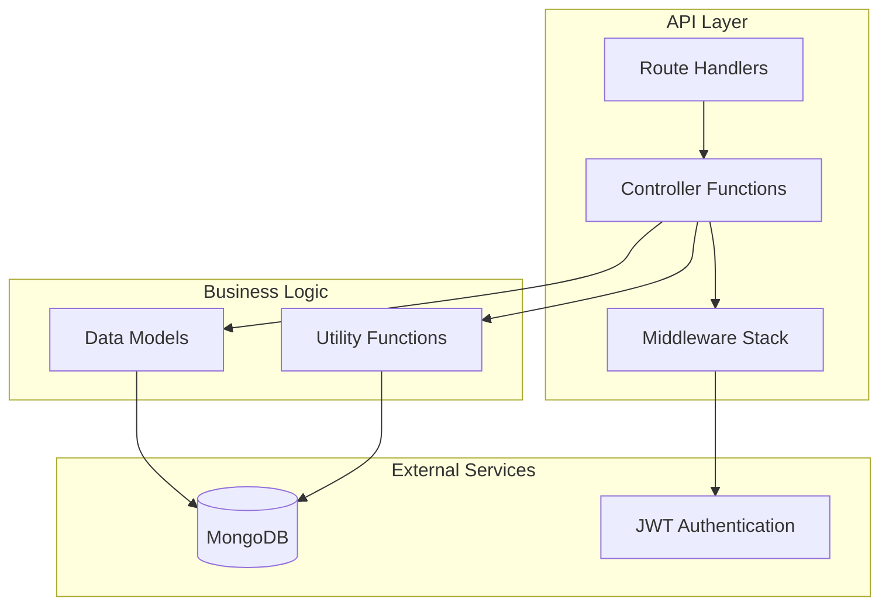
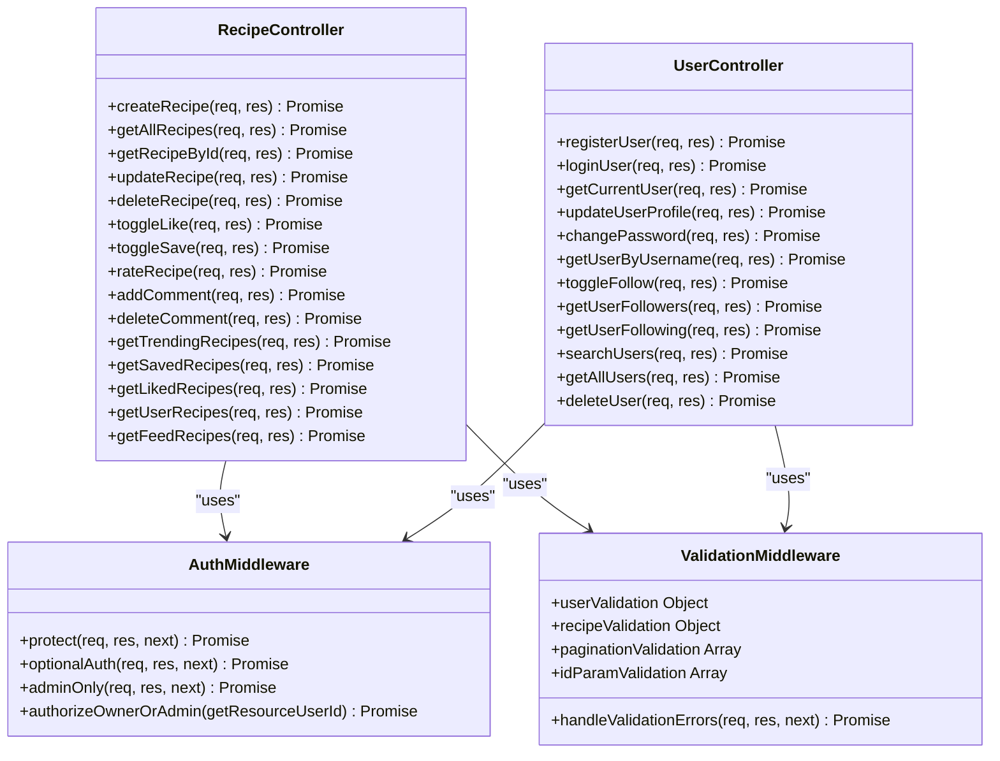
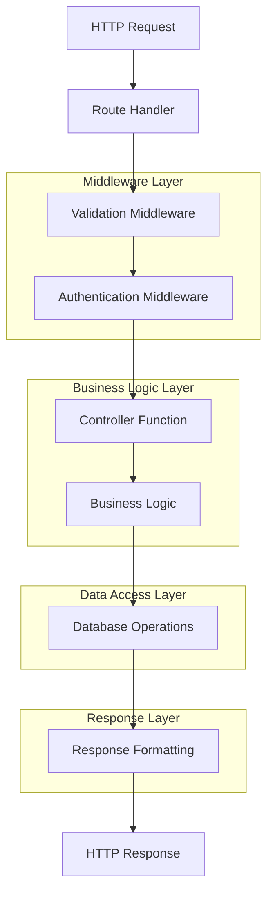
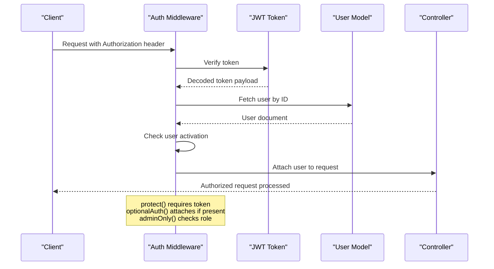
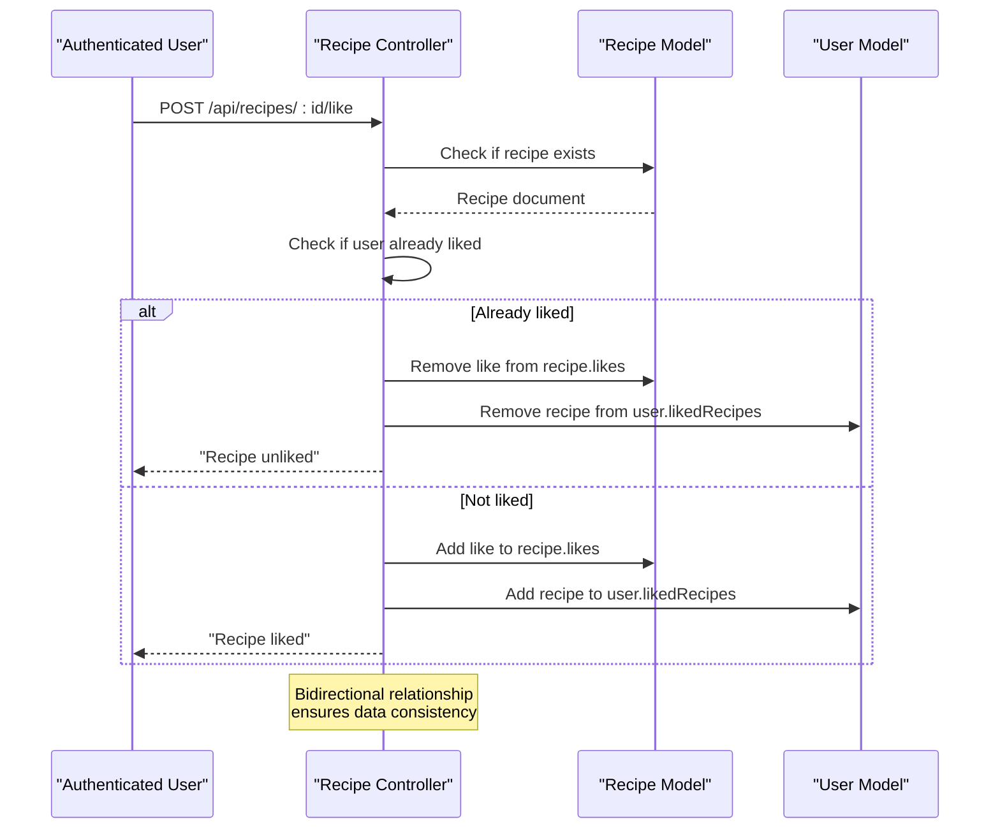
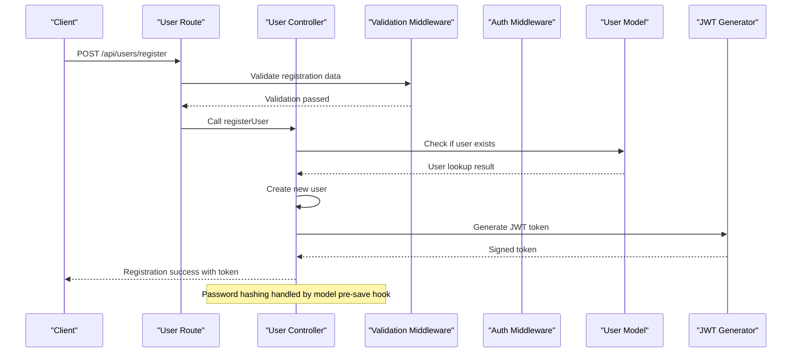
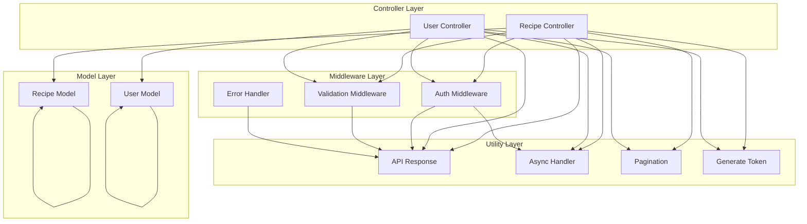
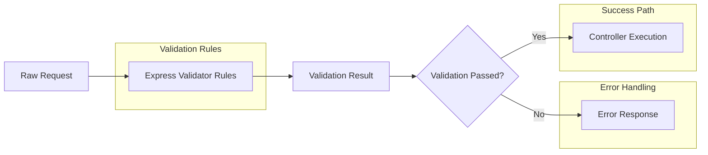
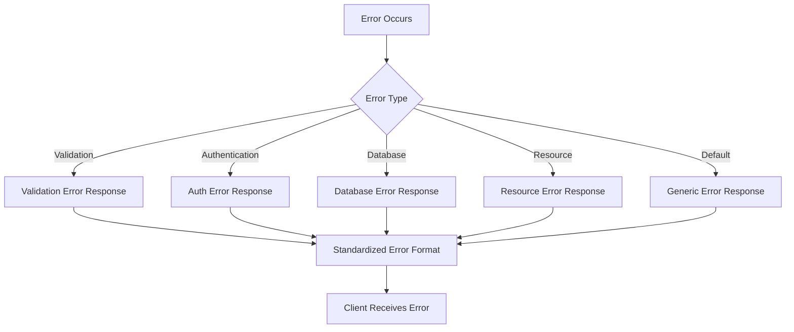

# API Controller Layer

<cite>
**Referenced Files in This Document**
- [server/index.js](file://server/index.js)
- [server/controllers/recipeController.js](file://server/controllers/recipeController.js)
- [server/controllers/userController.js](file://server/controllers/userController.js)
- [server/routes/recipeRoutes.js](file://server/routes/recipeRoutes.js)
- [server/routes/userRoutes.js](file://server/routes/userRoutes.js)
- [server/middleware/auth.js](file://server/middleware/auth.js)
- [server/middleware/validator.js](file://server/middleware/validator.js)
- [server/middleware/errorHandler.js](file://server/middleware/errorHandler.js)
- [server/utils/apiResponse.js](file://server/utils/apiResponse.js)
- [server/utils/asyncHandler.js](file://server/utils/asyncHandler.js)
- [server/utils/pagination.js](file://server/utils/pagination.js)
- [server/models/Recipe.js](file://server/models/Recipe.js)
- [server/models/User.js](file://server/models/User.js)
</cite>

## Table of Contents
1. [Introduction](#introduction)
2. [Project Structure](#project-structure)
3. [Core Components](#core-components)
4. [Architecture Overview](#architecture-overview)
5. [Detailed Component Analysis](#detailed-component-analysis)
6. [Dependency Analysis](#dependency-analysis)
7. [Performance Considerations](#performance-considerations)
8. [Troubleshooting Guide](#troubleshooting-guide)
9. [Conclusion](#conclusion)

## Introduction
This document provides a comprehensive analysis of the API Controller Layer for the Flavora project. The controller layer serves as the primary interface between client requests and the underlying data models, implementing business logic for recipe and user management. The architecture follows a clean separation of concerns with dedicated controllers, routes, middleware, and utility modules.

## Project Structure
The API controller layer is organized into several key components that work together to provide a robust RESTful API:



**Diagram sources**
- [server/index.js:1-82](file://server/index.js#L1-L82)
- [server/controllers/recipeController.js:1-533](file://server/controllers/recipeController.js#L1-L533)
- [server/controllers/userController.js:1-359](file://server/controllers/userController.js#L1-L359)

**Section sources**
- [server/index.js:1-82](file://server/index.js#L1-L82)
- [server/controllers/recipeController.js:1-533](file://server/controllers/recipeController.js#L1-L533)
- [server/controllers/userController.js:1-359](file://server/controllers/userController.js#L1-L359)

## Core Components

### Controller Architecture Pattern
The controller layer implements a standardized pattern with consistent structure across all controller functions:



**Diagram sources**
- [server/controllers/recipeController.js:12-533](file://server/controllers/recipeController.js#L12-L533)
- [server/controllers/userController.js:13-359](file://server/controllers/userController.js#L13-L359)
- [server/middleware/auth.js:9-105](file://server/middleware/auth.js#L9-L105)
- [server/middleware/validator.js:25-211](file://server/middleware/validator.js#L25-L211)

### Response Standardization
All controller responses follow a consistent format using standardized response helpers:

```mermaid
sequenceDiagram
participant Client as "Client Request"
participant Route as "Route Handler"
participant Controller as "Controller Function"
participant Model as "Database Model"
participant Response as "Response Helper"
Client->>Route : HTTP Request
Route->>Controller : Call controller function
Controller->>Model : Database operation
Model-->>Controller : Operation result
Controller->>Response : Format response
Response-->>Client : Standardized JSON response
Note over Response : {
success : boolean,
message : string,
data? : any,
errors? : any,
pagination? : object
}
```

**Diagram sources**
- [server/utils/apiResponse.js:12-68](file://server/utils/apiResponse.js#L12-L68)
- [server/controllers/recipeController.js:45-50](file://server/controllers/recipeController.js#L45-L50)

**Section sources**
- [server/utils/apiResponse.js:1-71](file://server/utils/apiResponse.js#L1-L71)
- [server/utils/asyncHandler.js:1-14](file://server/utils/asyncHandler.js#L1-L14)
- [server/utils/pagination.js:1-37](file://server/utils/pagination.js#L1-L37)

## Architecture Overview

### Request Flow Architecture
The API follows a layered architecture with clear separation between presentation, business logic, and data access layers:



**Diagram sources**
- [server/routes/recipeRoutes.js:28-56](file://server/routes/recipeRoutes.js#L28-L56)
- [server/routes/userRoutes.js:21-40](file://server/routes/userRoutes.js#L21-L40)
- [server/middleware/validator.js:7-21](file://server/middleware/validator.js#L7-L21)

### Authentication and Authorization Flow
The authentication system implements a multi-tier security approach:



**Diagram sources**
- [server/middleware/auth.js:9-84](file://server/middleware/auth.js#L9-L84)

**Section sources**
- [server/middleware/auth.js:1-105](file://server/middleware/auth.js#L1-L105)
- [server/middleware/validator.js:1-211](file://server/middleware/validator.js#L1-L211)

## Detailed Component Analysis

### Recipe Controller Analysis

#### Core Recipe Operations
The recipe controller handles comprehensive recipe management functionality:

```mermaid
classDiagram
class RecipeController {
+createRecipe(req, res) Promise
+getAllRecipes(req, res) Promise
+getRecipeById(req, res) Promise
+updateRecipe(req, res) Promise
+deleteRecipe(req, res) Promise
+toggleLike(req, res) Promise
+toggleSave(req, res) Promise
+rateRecipe(req, res) Promise
+addComment(req, res) Promise
+deleteComment(req, res) Promise
+getTrendingRecipes(req, res) Promise
+getSavedRecipes(req, res) Promise
+getLikedRecipes(req, res) Promise
+getUserRecipes(req, res) Promise
+getFeedRecipes(req, res) Promise
}
class RecipeModel {
+user ObjectId
+title String
+description String
+image String
+cuisine String
+prepTime Number
+servings Number
+ingredients Array
+instructions Array
+alternativeIngredients Array
+likes Array
+comments Array
+saves Array
+ratings Array
+tags Array
+difficulty String
+isPublished Boolean
+createdAt Date
+updatedAt Date
}
RecipeController --> RecipeModel : "manipulates"
note for RecipeController : "Handles CRUD operations<br/>Social interactions<br/>Search functionality<br/>Trending calculations"
```

**Diagram sources**
- [server/controllers/recipeController.js:12-533](file://server/controllers/recipeController.js#L12-L533)
- [server/models/Recipe.js:71-243](file://server/models/Recipe.js#L71-L243)

#### Recipe Interaction Workflows
The controller implements sophisticated social interaction patterns:



**Diagram sources**
- [server/controllers/recipeController.js:196-225](file://server/controllers/recipeController.js#L196-L225)

**Section sources**
- [server/controllers/recipeController.js:1-533](file://server/controllers/recipeController.js#L1-L533)
- [server/models/Recipe.js:1-243](file://server/models/Recipe.js#L1-L243)

### User Controller Analysis

#### User Management Operations
The user controller provides comprehensive user lifecycle management:

```mermaid
classDiagram
class UserController {
+registerUser(req, res) Promise
+loginUser(req, res) Promise
+getCurrentUser(req, res) Promise
+updateUserProfile(req, res) Promise
+changePassword(req, res) Promise
+getUserByUsername(req, res) Promise
+toggleFollow(req, res) Promise
+getUserFollowers(req, res) Promise
+getUserFollowing(req, res) Promise
+searchUsers(req, res) Promise
+getAllUsers(req, res) Promise
+deleteUser(req, res) Promise
}
class UserModel {
+name String
+username String
+email String
+password String
+avatar String
+bio String
+followers Array
+following Array
+savedRecipes Array
+likedRecipes Array
+isActive Boolean
+role String
+createdAt Date
+updatedAt Date
}
UserController --> UserModel : "manipulates"
note for UserController : "Authentication<br/>Profile management<br/>Social connections<br/>Admin operations"
```

**Diagram sources**
- [server/controllers/userController.js:13-359](file://server/controllers/userController.js#L13-L359)
- [server/models/User.js:4-142](file://server/models/User.js#L4-L142)

#### User Authentication Flow
The authentication system implements secure user registration and login:



**Diagram sources**
- [server/controllers/userController.js:13-53](file://server/controllers/userController.js#L13-L53)
- [server/middleware/validator.js:25-87](file://server/middleware/validator.js#L25-L87)

**Section sources**
- [server/controllers/userController.js:1-359](file://server/controllers/userController.js#L1-L359)
- [server/models/User.js:1-142](file://server/models/User.js#L1-L142)

### Route Organization and Security

#### Route Security Matrix
The routing system implements granular security controls:

```mermaid
graph TB
subgraph "Public Routes"
R1[/api/users/register]
R2[/api/users/login]
R3[/api/users/search]
R4[/api/users/:username]
R5[/api/recipes]
R6[/api/recipes/trending]
R7[/api/recipes/user/:userId]
R8[/api/recipes/:id]
end
subgraph "Protected Routes"
P1[/api/users/me]
P2[/api/users/me/password]
P3[/api/users/me]
P4[/api/recipes]
P5[/api/recipes/:id]
P6[/api/recipes/:id/like]
P7[/api/recipes/:id/save]
P8[/api/recipes/:id/rate]
P9[/api/recipes/:id/comments]
P10[/api/recipes/saved/list]
P11[/api/recipes/liked/list]
P12[/api/recipes/feed/list]
end
subgraph "Admin Routes"
A1[/api/users]
end
R1 -.-> P1
R2 -.-> P1
R3 -.-> P1
R4 -.-> P1
R5 -.-> P1
R6 -.-> P1
R7 -.-> P1
R8 -.-> P1
P1 --> A1
P2 --> A1
P3 --> A1
P4 --> A1
P5 --> A1
P6 --> A1
P7 --> A1
P8 --> A1
P9 --> A1
P10 --> A1
P11 --> A1
P12 --> A1
```

**Diagram sources**
- [server/routes/recipeRoutes.js:28-56](file://server/routes/recipeRoutes.js#L28-L56)
- [server/routes/userRoutes.js:21-40](file://server/routes/userRoutes.js#L21-L40)

**Section sources**
- [server/routes/recipeRoutes.js:1-56](file://server/routes/recipeRoutes.js#L1-L56)
- [server/routes/userRoutes.js:1-40](file://server/routes/userRoutes.js#L1-L40)

## Dependency Analysis

### Component Dependencies
The controller layer exhibits excellent modularity with clear dependency relationships:



**Diagram sources**
- [server/controllers/recipeController.js:1-6](file://server/controllers/recipeController.js#L1-L6)
- [server/controllers/userController.js:1-7](file://server/controllers/userController.js#L1-L7)
- [server/middleware/auth.js:1-5](file://server/middleware/auth.js#L1-L5)
- [server/middleware/validator.js:1-3](file://server/middleware/validator.js#L1-L3)

### Validation Pipeline
The validation system implements a comprehensive data validation pipeline:



**Diagram sources**
- [server/middleware/validator.js:7-21](file://server/middleware/validator.js#L7-L21)

**Section sources**
- [server/controllers/recipeController.js:1-6](file://server/controllers/recipeController.js#L1-L6)
- [server/controllers/userController.js:1-7](file://server/controllers/userController.js#L1-L7)
- [server/middleware/validator.js:1-211](file://server/middleware/validator.js#L1-L211)

## Performance Considerations

### Query Optimization Strategies
The controller layer implements several performance optimization techniques:

1. **Population Strategy**: Selective population of related documents to minimize database queries
2. **Pagination Implementation**: Efficient pagination with configurable limits and skip calculations
3. **Index Usage**: Strategic indexing on frequently queried fields
4. **Lean Queries**: Using lean() for read-only operations to reduce memory overhead

### Memory Management
The architecture minimizes memory usage through:
- **Selective Population**: Only populating necessary fields
- **Virtual Fields**: Computed properties calculated on demand
- **Pagination**: Limiting result sets to manageable sizes

## Troubleshooting Guide

### Common Error Scenarios
The error handling system provides comprehensive error management:



**Diagram sources**
- [server/middleware/errorHandler.js:6-46](file://server/middleware/errorHandler.js#L6-L46)

### Debugging and Logging
The system provides comprehensive debugging capabilities:
- **Development Logging**: Request logging in development environment
- **Error Tracking**: Centralized error handling with detailed logging
- **Validation Feedback**: Specific validation error messages
- **Response Standardization**: Consistent error response format

**Section sources**
- [server/middleware/errorHandler.js:1-49](file://server/middleware/errorHandler.js#L1-L49)
- [server/index.js:28-34](file://server/index.js#L28-L34)

## Conclusion
The API Controller Layer demonstrates excellent architectural design with clear separation of concerns, comprehensive error handling, and robust security measures. The modular structure enables easy maintenance and extension while maintaining performance and reliability. The standardized response format and validation pipeline ensure consistent behavior across all API endpoints, making the system both developer-friendly and production-ready.

The controller layer successfully implements modern API design principles including RESTful routing, comprehensive validation, secure authentication, and efficient data access patterns. The architecture provides a solid foundation for future feature additions and scaling requirements.