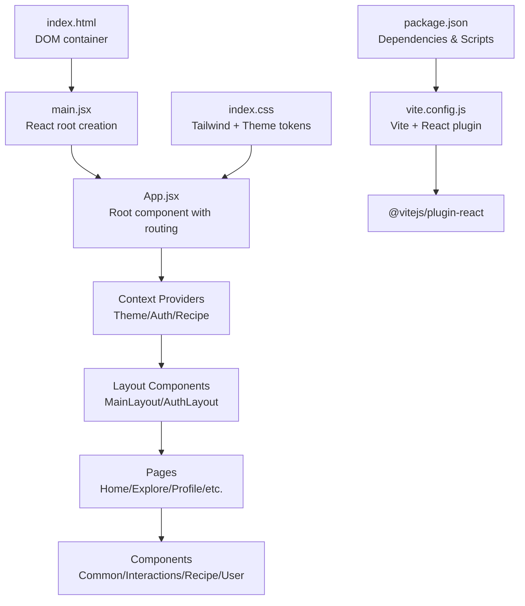
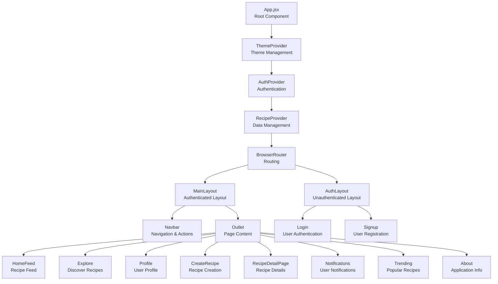

# Application Architecture

<cite>
**Referenced Files in This Document**
- [main.jsx](file://client/src/main.jsx)
- [App.jsx](file://client/src/App.jsx)
- [index.html](file://client/index.html)
- [vite.config.js](file://client/vite.config.js)
- [package.json](file://client/package.json)
- [App.css](file://client/src/App.css)
- [index.css](file://client/src/index.css)
- [ThemeContext.jsx](file://client/src/context/ThemeContext.jsx)
- [AuthContext.jsx](file://client/src/context/AuthContext.jsx)
- [RecipeContext.jsx](file://client/src/context/RecipeContext.jsx)
- [ProtectedRoute.jsx](file://client/src/components/common/ProtectedRoute.jsx)
- [Navbar.jsx](file://client/src/components/common/Navbar.jsx)
- [Footer.jsx](file://client/src/components/common/Footer.jsx)
- [HomeFeed.jsx](file://client/src/pages/HomeFeed.jsx)
- [Explore.jsx](file://client/src/pages/Explore.jsx)
- [Login.jsx](file://client/src/pages/Login.jsx)
- [Signup.jsx](file://client/src/pages/Signup.jsx)
- [mockData.js](file://client/src/data/mockData.js)
- [README.md](file://client/README.md)
- [eslint.config.js](file://client/eslint.config.js)
</cite>

## Update Summary
**Changes Made**
- Updated architecture overview to reflect modern React 19 application with comprehensive routing system using React Router DOM v7
- Added detailed context provider documentation covering Theme, Auth, and Recipe contexts with localStorage persistence
- Enhanced component hierarchy analysis with layout components (MainLayout, AuthLayout) and protected routes
- Expanded state management documentation with custom hooks and data persistence patterns
- Updated build system architecture with modern Vite configuration and React Fast Refresh
- Added comprehensive styling architecture with Tailwind CSS integration and custom theme tokens
- Documented complete page component structure including HomeFeed, Explore, Login, Signup, and recipe management pages

## Table of Contents
1. [Introduction](#introduction)
2. [Project Structure](#project-structure)
3. [Core Components](#core-components)
4. [Architecture Overview](#architecture-overview)
5. [Context Provider System](#context-provider-system)
6. [Routing and Navigation](#routing-and-navigation)
7. [Component Hierarchy and Data Flow](#component-hierarchy-and-data-flow)
8. [State Management Patterns](#state-management-patterns)
9. [Styling and Theming Architecture](#styling-and-theming-architecture)
10. [Build System and Development Workflow](#build-system-and-development-workflow)
11. [Performance Considerations](#performance-considerations)
12. [Troubleshooting Guide](#troubleshooting-guide)
13. [Conclusion](#conclusion)
14. [Appendices](#appendices)

## Introduction
This document describes the architectural design of the Flavora application, a modern React 19-powered frontend featuring a comprehensive component-based architecture with advanced routing, context providers, and contemporary design patterns. The application implements a sophisticated single-file component approach in App.jsx with nested routing, layout components, and protected routes. The architecture emphasizes scalability, maintainability, and rapid development through modern React patterns and tooling integration.

## Project Structure
The client-side application follows a well-organized structure that promotes scalability and maintainability:
- Entry point: main.jsx initializes the React root with strict mode and renders the root App component
- Root component: App.jsx implements complex routing with layout components and context providers
- Context layer: Three-tier context system (Theme, Auth, Recipe) managing global state
- Component hierarchy: Modular component structure with specialized folders for different UI concerns
- Pages: Dedicated page components for each application route
- Data layer: Mock data system with localStorage persistence
- Styling: Tailwind CSS integration with custom theme tokens



**Diagram sources**
- [index.html:1-14](file://client/index.html#L1-L14)
- [main.jsx:1-11](file://client/src/main.jsx#L1-L11)
- [App.jsx:1-94](file://client/src/App.jsx#L1-L94)
- [vite.config.js:1-8](file://client/vite.config.js#L1-L8)
- [package.json:1-35](file://client/package.json#L1-L35)
- [index.css:1-66](file://client/src/index.css#L1-L66)

**Section sources**
- [index.html:1-14](file://client/index.html#L1-L14)
- [main.jsx:1-11](file://client/src/main.jsx#L1-L11)
- [App.jsx:1-94](file://client/src/App.jsx#L1-L94)
- [vite.config.js:1-8](file://client/vite.config.js#L1-L8)
- [package.json:1-35](file://client/package.json#L1-L35)
- [index.css:1-66](file://client/src/index.css#L1-L66)

## Core Components

### Application Bootstrap (`main.jsx`)
The application bootstrap process creates a strict React 19 environment with proper error boundaries and global styling initialization.

**Section sources**
- [main.jsx:1-11](file://client/src/main.jsx#L1-L11)

### Root Component with Routing (`App.jsx`)
The root component implements a sophisticated routing system with:
- Nested routing using React Router DOM v7
- Layout components for authenticated and unauthenticated flows
- Animation transitions with Framer Motion
- Context provider nesting for state management
- Protected route handling

**Section sources**
- [App.jsx:1-94](file://client/src/App.jsx#L1-L94)

### Context Provider System
Three interconnected context providers manage global application state:
- ThemeContext: Handles light/dark mode with localStorage persistence
- AuthContext: Manages user authentication state and lifecycle
- RecipeContext: Centralizes recipe, user, and notification data management

**Section sources**
- [ThemeContext.jsx:1-43](file://client/src/context/ThemeContext.jsx#L1-L43)
- [AuthContext.jsx:1-72](file://client/src/context/AuthContext.jsx#L1-L72)
- [RecipeContext.jsx:1-194](file://client/src/context/RecipeContext.jsx#L1-L194)

## Architecture Overview
The application follows a modern React 19 architecture with comprehensive state management and routing:

```mermaid
graph TB
subgraph "Runtime Environment"
R["React 19 Runtime"]
DOM["DOM Container (#root)"]
TAILWIND["Tailwind CSS"]
FRAMER["Framer Motion"]
LUCIDE["Lucide React Icons"]
END
subgraph "Application Layer"
MAIN["main.jsx<br/>Bootstrap"]
APP["App.jsx<br/>Root Component"]
LAYOUTS["Layout Components<br/>MainLayout/AuthLayout"]
PROTECTED["ProtectedRoute<br/>Authentication Guard"]
END
subgraph "State Management"
THEME_CTX["ThemeContext<br/>Light/Dark Mode"]
AUTH_CTX["AuthContext<br/>User Authentication"]
RECIPE_CTX["RecipeContext<br/>Data Management"]
END
subgraph "Component Hierarchy"
NAVBAR["Navbar<br/>Navigation & Actions"]
HOME_FEED["HomeFeed<br/>Recipe Feed"]
EXPLORE["Explore<br/>Recipe Discovery"]
LOGIN["Login<br/>Authentication"]
SIGNUP["Signup<br/>Registration"]
PAGES["Page Components<br/>Login/Signup/Profile"]
COMPONENTS["Reusable Components<br/>Cards, Buttons, Forms"]
END
subgraph "Data Layer"
MOCK_DATA["mockData.js<br/>Static Data"]
LOCAL_STORAGE["localStorage<br/>Persistence Layer"]
END
MAIN --> APP
APP --> LAYOUTS
APP --> PROTECTED
APP --> THEME_CTX
APP --> AUTH_CTX
APP --> RECIPE_CTX
LAYOUTS --> NAVBAR
LAYOUTS --> HOME_FEED
LAYOUTS --> EXPLORE
PROTECTED --> LOGIN
PROTECTED --> SIGNUP
THEME_CTX --> TAILWIND
AUTH_CTX --> LOCAL_STORAGE
RECIPE_CTX --> MOCK_DATA
```

**Diagram sources**
- [main.jsx:1-11](file://client/src/main.jsx#L1-L11)
- [App.jsx:1-94](file://client/src/App.jsx#L1-L94)
- [ThemeContext.jsx:1-43](file://client/src/context/ThemeContext.jsx#L1-L43)
- [AuthContext.jsx:1-72](file://client/src/context/AuthContext.jsx#L1-L72)
- [RecipeContext.jsx:1-194](file://client/src/context/RecipeContext.jsx#L1-L194)
- [Navbar.jsx:1-206](file://client/src/components/common/Navbar.jsx#L1-L206)
- [HomeFeed.jsx:1-96](file://client/src/pages/HomeFeed.jsx#L1-L96)
- [Explore.jsx:1-133](file://client/src/pages/Explore.jsx#L1-L133)
- [Login.jsx:1-218](file://client/src/pages/Login.jsx#L1-L218)
- [Signup.jsx:1-316](file://client/src/pages/Signup.jsx#L1-L316)
- [mockData.js:1-587](file://client/src/data/mockData.js#L1-L587)

## Context Provider System

### Theme Context Architecture
Manages application-wide theming with automatic system preference detection and localStorage persistence.

**Key Features:**
- Automatic theme detection based on system preferences
- Manual theme switching capability
- CSS class management for dark mode activation
- Persistent theme selection across browser sessions

**Section sources**
- [ThemeContext.jsx:1-43](file://client/src/context/ThemeContext.jsx#L1-L43)

### Authentication Context
Handles user authentication lifecycle with secure storage and state synchronization.

**Key Features:**
- User session management with localStorage persistence
- Authentication state tracking and loading indicators
- User registration and login workflows
- Secure user data updates and logout functionality

**Section sources**
- [AuthContext.jsx:1-72](file://client/src/context/AuthContext.jsx#L1-L72)

### Recipe Context
Centralized data management for recipes, users, and notifications with comprehensive CRUD operations.

**Key Features:**
- Complete recipe lifecycle management (CRUD operations)
- User following/follower relationship tracking
- Interactive features: likes, saves, ratings, comments
- Notification system with read/unread status
- LocalStorage synchronization for data persistence

**Section sources**
- [RecipeContext.jsx:1-194](file://client/src/context/RecipeContext.jsx#L1-L194)

## Routing and Navigation

### Routing Architecture
Implements a sophisticated routing system with:
- Nested routing using React Router DOM v7
- Layout-based routing with MainLayout and AuthLayout
- Protected routes for authenticated-only access
- Dynamic route parameters for recipe and profile pages
- Smooth page transitions with animation library

**Section sources**
- [App.jsx:1-94](file://client/src/App.jsx#L1-L94)
- [ProtectedRoute.jsx:1-21](file://client/src/components/common/ProtectedRoute.jsx#L1-L21)

### Navigation Components
The navigation system provides:
- Responsive mobile/desktop navigation
- Conditional menu items based on authentication state
- Real-time notification badges
- Theme toggle integration
- Animated mobile menu transitions

**Section sources**
- [Navbar.jsx:1-206](file://client/src/components/common/Navbar.jsx#L1-L206)
- [Footer.jsx:1-33](file://client/src/components/common/Footer.jsx#L1-L33)

## Component Hierarchy and Data Flow

### Component Tree Structure
The application implements a hierarchical component structure:



**Diagram sources**
- [App.jsx:1-94](file://client/src/App.jsx#L1-L94)
- [Navbar.jsx:1-206](file://client/src/components/common/Navbar.jsx#L1-L206)
- [HomeFeed.jsx:1-96](file://client/src/pages/HomeFeed.jsx#L1-L96)
- [Explore.jsx:1-133](file://client/src/pages/Explore.jsx#L1-L133)
- [Login.jsx:1-218](file://client/src/pages/Login.jsx#L1-L218)
- [Signup.jsx:1-316](file://client/src/pages/Signup.jsx#L1-L316)

### Data Flow Patterns
The application implements several data flow patterns:
- **Top-down props passing**: Context providers pass state down to components
- **Event-driven updates**: Component events trigger context updates
- **Local state management**: Component-local state for UI interactions
- **Global state management**: Context-managed state for application-wide data
- **Persistent storage**: localStorage for data persistence across sessions

**Section sources**
- [App.jsx:1-94](file://client/src/App.jsx#L1-L94)
- [HomeFeed.jsx:1-96](file://client/src/pages/HomeFeed.jsx#L1-L96)
- [Explore.jsx:1-133](file://client/src/pages/Explore.jsx#L1-L133)

## State Management Patterns

### Context-Based State Management
The application uses React's Context API for global state management:
- **Theme state**: Managed in ThemeContext with automatic system preference detection
- **Auth state**: Managed in AuthContext with localStorage persistence
- **Recipe state**: Managed in RecipeContext with comprehensive CRUD operations

### Custom Hook Implementation
Each context provides custom hooks for easy consumption:
- `useTheme()`: Access theme state and toggle function
- `useAuth()`: Access authentication state and methods
- `useRecipes()`: Access recipe data and manipulation functions

### Data Persistence Strategy
State persistence is implemented through:
- **localStorage integration**: Automatic serialization/deserialization
- **Initial state loading**: Hydration from localStorage on app startup
- **Real-time synchronization**: State updates immediately reflected in storage

**Section sources**
- [ThemeContext.jsx:1-43](file://client/src/context/ThemeContext.jsx#L1-L43)
- [AuthContext.jsx:1-72](file://client/src/context/AuthContext.jsx#L1-L72)
- [RecipeContext.jsx:1-194](file://client/src/context/RecipeContext.jsx#L1-L194)

## Styling and Theming Architecture

### Tailwind CSS Integration
The application leverages Tailwind CSS for utility-first styling:
- **Custom theme tokens**: Defined in index.css using CSS custom properties
- **Dark mode support**: Automatic dark mode class management
- **Responsive design**: Mobile-first approach with responsive utilities
- **Custom scrollbar styling**: Enhanced user experience with custom scrollbars

### Theme Token System
Custom theme tokens provide consistent design language:
- **Primary color palette**: Orange gradient from light to dark shades
- **Stone color family**: Neutral grays from 50 to 950 for backgrounds and borders
- **Typography system**: Inter font with system fallbacks
- **Border radius**: Consistent rounded corners throughout the interface

### Component Styling Approach
- **Container queries**: Responsive design based on container dimensions
- **Backdrop blur effects**: Modern UI elements with frosted glass effects
- **Gradient accents**: Strategic use of orange gradients for visual interest
- **Transition animations**: Smooth state changes and hover effects

**Section sources**
- [index.css:1-66](file://client/src/index.css#L1-L66)

## Build System and Development Workflow

### Vite Configuration
Modern Vite setup with React Fast Refresh:
- **React plugin**: Optimized React transform and development experience
- **Fast refresh**: Instant feedback during development
- **Optimized builds**: Production-ready optimizations
- **Plugin ecosystem**: Tailwind CSS, PostCSS, and ESLint integration

### Development Scripts
Comprehensive development workflow:
- **Development server**: Hot module replacement for instant updates
- **Production builds**: Optimized assets with tree-shaking and minification
- **Preview builds**: Local production testing
- **Code linting**: ESLint integration with React hooks and refresh rules

### Modern Tooling Stack
- **React 19**: Latest React features and improvements
- **TypeScript support**: Type definitions for better developer experience
- **ESLint**: Code quality and consistency enforcement
- **PostCSS**: Advanced CSS processing and optimization

**Section sources**
- [vite.config.js:1-8](file://client/vite.config.js#L1-L8)
- [package.json:1-35](file://client/package.json#L1-L35)

## Performance Considerations

### React 19 Optimizations
- **Automatic batching**: Improved rendering performance
- **Suspense integration**: Better handling of async operations
- **Compiler optimizations**: Potential future enhancements

### Bundle Optimization
- **Tree shaking**: Unused code elimination
- **Code splitting**: Route-based lazy loading
- **Asset optimization**: Image and font optimization

### State Management Performance
- **Selective re-renders**: Context consumers only re-render when relevant state changes
- **Local caching**: Frequently accessed data cached in memory
- **Efficient updates**: Batched state updates prevent unnecessary re-renders

## Troubleshooting Guide

### Common Issues and Solutions
- **Context provider errors**: Ensure all components are wrapped in appropriate providers
- **Routing issues**: Verify route paths match component exports and layout configurations
- **Theme switching problems**: Check localStorage availability and CSS class management
- **Authentication state issues**: Verify localStorage keys and context provider order
- **Build errors**: Ensure all dependencies are properly installed and Vite configuration is correct

### Development Workflow Tips
- **Hot reload**: Changes to components trigger immediate UI updates
- **Error boundaries**: Strict mode helps catch rendering errors early
- **Console debugging**: Use React Developer Tools for component inspection
- **Network monitoring**: Monitor API calls and data fetching operations

**Section sources**
- [App.jsx:1-94](file://client/src/App.jsx#L1-L94)
- [ThemeContext.jsx:1-43](file://client/src/context/ThemeContext.jsx#L1-L43)
- [AuthContext.jsx:1-72](file://client/src/context/AuthContext.jsx#L1-L72)
- [RecipeContext.jsx:1-194](file://client/src/context/RecipeContext.jsx#L1-L194)

## Conclusion
Flavora represents a modern React 19 application architecture that balances complexity with maintainability. The comprehensive context provider system, sophisticated routing architecture, and component-based design patterns create a scalable foundation for growth. The integration of Tailwind CSS, Framer Motion, and modern build tooling ensures both developer productivity and user experience excellence. This architecture supports rapid feature development while maintaining clean code organization and optimal performance characteristics.

## Appendices

### Component Categories and Responsibilities

#### Layout Components
- **MainLayout**: Provides authenticated navigation with navbar and footer
- **AuthLayout**: Minimal layout for login/signup pages without navigation

#### Page Components
- **HomeFeed**: Personalized recipe feed based on user following
- **Explore**: Public recipe discovery interface with search and filters
- **Profile**: User profile management and recipe collections
- **CreateRecipe**: Recipe creation and editing interface
- **RecipeDetailPage**: Individual recipe viewing and interaction
- **Notifications**: User activity and engagement notifications
- **Trending**: Popular recipes ranking
- **About**: Application information and guidelines
- **Login**: User authentication interface
- **Signup**: User registration interface

#### Common Components
- **Navbar**: Primary navigation with authentication-aware menu items
- **Footer**: Secondary navigation and legal information
- **ThemeToggle**: Light/dark mode switching control
- **ProtectedRoute**: Authentication guard for private routes

#### Interaction Components
- **LikeButton**: Recipe liking functionality
- **SaveButton**: Recipe saving for later viewing
- **RatingStars**: Recipe rating system
- **CommentSection**: Recipe discussion and interaction

#### Search and Filter Components
- **SearchBar**: Recipe discovery through search queries
- **CategoryFilter**: Cuisine type filtering for recipe discovery

#### User Interface Components
- **ProfileHeader**: User profile header with avatar and stats
- **UserAvatar**: User avatar display with fallbacks
- **FollowButton**: User following/unfollowing functionality

### Data Model Architecture

#### Recipe Data Structure
Recipes contain comprehensive metadata including:
- Basic information: title, description, image, cuisine type
- Preparation details: prep time, servings, ingredients
- Interactive elements: likes, comments, saves, ratings
- Metadata: timestamps, author information, alternative ingredients

#### User Data Structure
User profiles include:
- Personal information: name, username, email, avatar
- Professional information: bio, social connections
- Activity tracking: follower/following relationships
- Metadata: account creation timestamp

#### Notification System
Structured notifications for user engagement:
- Type-based categorization (likes, comments, follows)
- Read/unread status tracking
- Timestamped activity logs
- Related entity references for navigation

**Section sources**
- [mockData.js:1-587](file://client/src/data/mockData.js#L1-L587)
- [RecipeContext.jsx:1-194](file://client/src/context/RecipeContext.jsx#L1-L194)

### Build and Deployment Configuration

#### Development Environment
- **Port**: Default Vite port with hot module replacement
- **Proxy**: API proxy configuration for development backend
- **Environment variables**: Process environment variable management
- **Source maps**: Development-friendly debugging support

#### Production Optimization
- **Bundle analysis**: Build size optimization and dependency analysis
- **Asset optimization**: Image compression and font optimization
- **Code splitting**: Route-based lazy loading for improved performance
- **Service worker**: Optional offline capabilities and caching strategies

**Section sources**
- [vite.config.js:1-8](file://client/vite.config.js#L1-L8)
- [package.json:1-35](file://client/package.json#L1-L35)