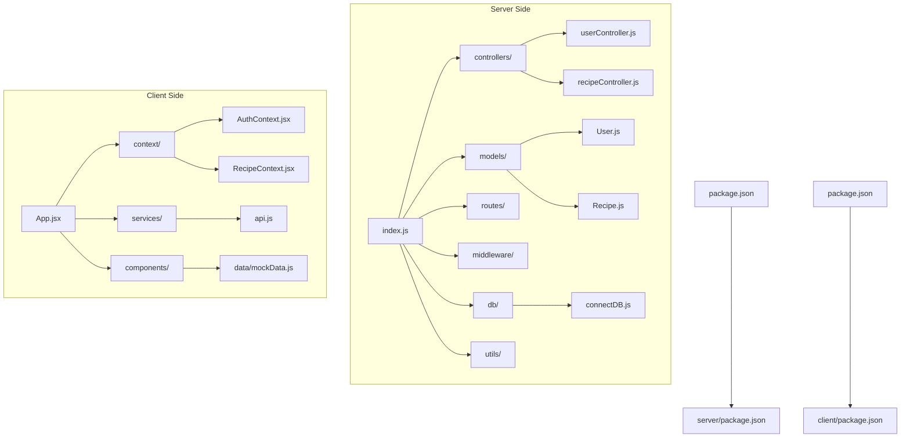
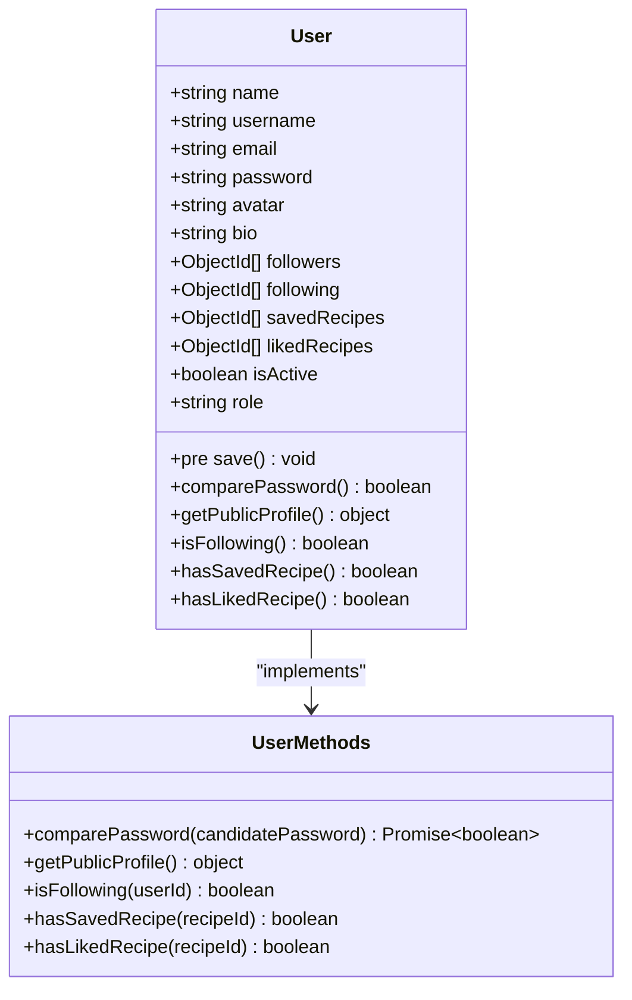
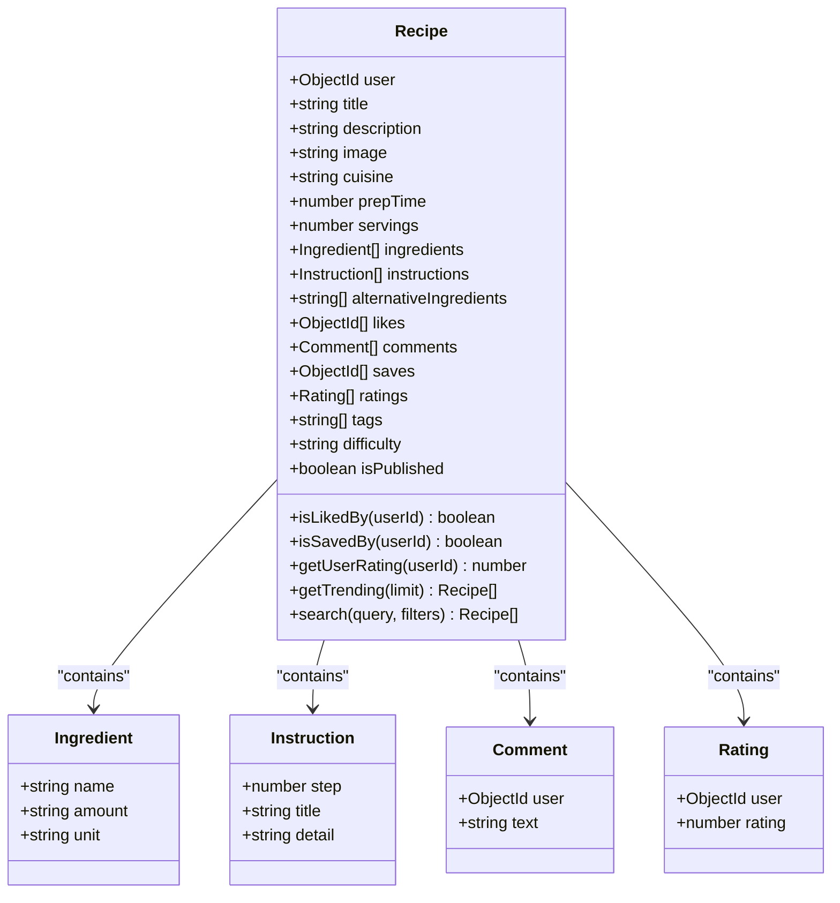
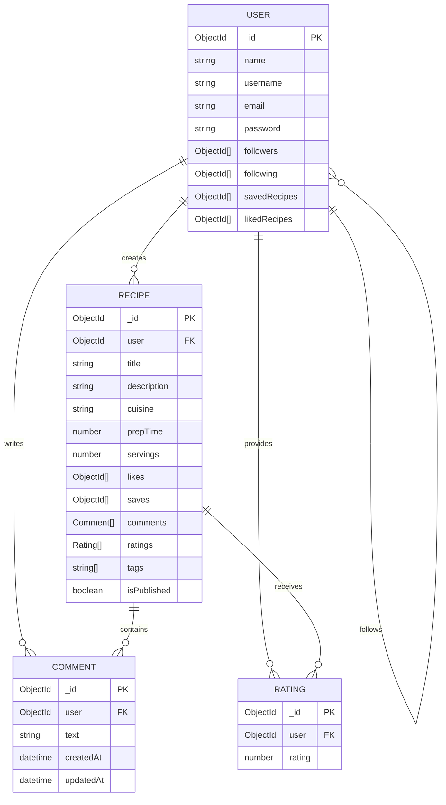
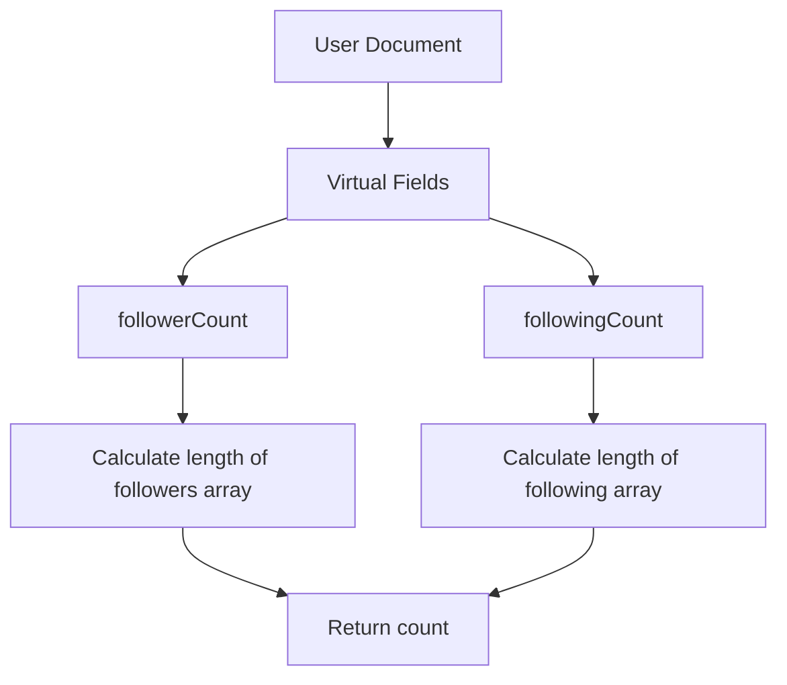
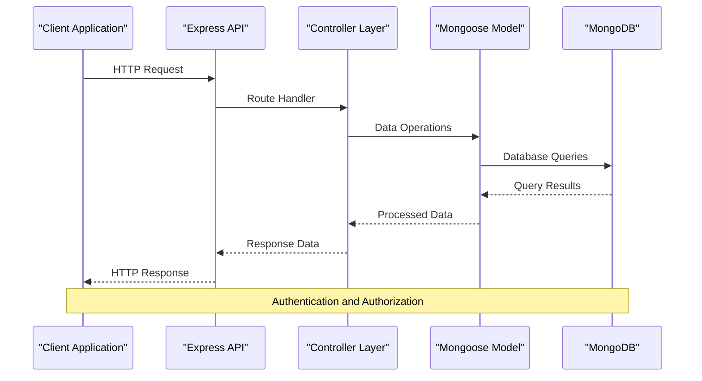
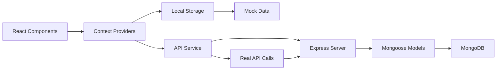
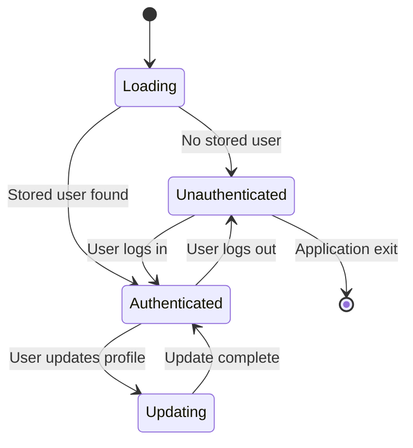

# Data Models Architecture

<cite>
**Referenced Files in This Document**
- [User.js](file://server/models/User.js)
- [Recipe.js](file://server/models/Recipe.js)
- [connectDB.js](file://server/db/connectDB.js)
- [userController.js](file://server/controllers/userController.js)
- [recipeController.js](file://server/controllers/recipeController.js)
- [index.js](file://server/index.js)
- [mockData.js](file://client/src/data/mockData.js)
- [AuthContext.jsx](file://client/src/context/AuthContext.jsx)
- [RecipeContext.jsx](file://client/src/context/RecipeContext.jsx)
- [api.js](file://client/src/services/api.js)
- [package.json](file://server/package.json)
- [package.json](file://client/package.json)
</cite>

## Table of Contents
1. [Introduction](#introduction)
2. [Project Structure](#project-structure)
3. [Core Data Models](#core-data-models)
4. [Database Schema Design](#database-schema-design)
5. [Model Relationships](#model-relationships)
6. [Data Validation and Constraints](#data-validation-and-constraints)
7. [Virtual Fields and Computed Properties](#virtual-fields-and-computed-properties)
8. [Indexing Strategy](#indexing-strategy)
9. [Data Flow Architecture](#data-flow-architecture)
10. [Client-Side Data Management](#client-side-data-management)
11. [Security Considerations](#security-considerations)
12. [Performance Optimizations](#performance-optimizations)
13. [Conclusion](#conclusion)

## Introduction

The Flavora application implements a comprehensive social recipe sharing platform with robust data models designed to support user interactions, recipe management, and community features. This document provides an in-depth analysis of the data models architecture, focusing on the MongoDB/Mongoose implementation, model relationships, validation strategies, and the overall data flow between the backend and frontend systems.

The application follows a modern full-stack architecture with separate concerns for data modeling, business logic, and presentation layers. The backend utilizes Express.js with Mongoose ODM for MongoDB operations, while the frontend employs React with custom context providers for state management.

## Project Structure

The project follows a clear separation of concerns with distinct directories for server-side and client-side code:

**Diagram sources**
- [index.js:1-82](file://server/index.js#L1-L82)
- [User.js:1-142](file://server/models/User.js#L1-L142)
- [Recipe.js:1-243](file://server/models/Recipe.js#L1-L243)

**Section sources**
- [index.js:1-82](file://server/index.js#L1-L82)
- [package.json:1-35](file://server/package.json#L1-L35)
- [package.json:1-35](file://client/package.json#L1-L35)

## Core Data Models

The application implements two primary data models: User and Recipe, each designed with specific business requirements and constraints.

### User Model Architecture

The User model serves as the foundation for user authentication, profile management, and social interactions within the platform.

**Diagram sources**
- [User.js:4-142](file://server/models/User.js#L4-L142)

### Recipe Model Architecture

The Recipe model encapsulates comprehensive recipe information, ingredients, instructions, and interactive features.

**Diagram sources**
- [Recipe.js:3-243](file://server/models/Recipe.js#L3-L243)

**Section sources**
- [User.js:1-142](file://server/models/User.js#L1-L142)
- [Recipe.js:1-243](file://server/models/Recipe.js#L1-L243)

## Database Schema Design

The MongoDB schema design leverages embedded documents for structured data while maintaining referential integrity through ObjectId relationships.

### Schema Structure Analysis

The schema design incorporates several key architectural decisions:

**Embedded vs Referenced Data:**
- Ingredients and instructions are embedded arrays within the Recipe model
- Comments and ratings contain user references for social interactions
- Followers/following relationships use ObjectId references

**Validation Strategy:**
- Comprehensive field validation with custom error messages
- Regex patterns for email and username validation
- Length constraints and data type enforcement
- Enum validation for cuisine types and difficulty levels

**Timestamp Management:**
- Automatic createdAt and updatedAt fields
- Manual timestamps for comments via timestamps: true option

**Section sources**
- [User.js:4-73](file://server/models/User.js#L4-L73)
- [Recipe.js:71-162](file://server/models/Recipe.js#L71-L162)

## Model Relationships

The data models establish sophisticated relationships that enable complex social networking features and recipe management capabilities.

### User-Recipe Relationship

**Diagram sources**
- [User.js:44-60](file://server/models/User.js#L44-L60)
- [Recipe.js:72-143](file://server/models/Recipe.js#L72-L143)

### Social Network Features

The model supports advanced social networking capabilities:

**Follow System:**
- Bidirectional following relationships
- Follower/following counts via virtual fields
- Efficient querying using ObjectId arrays

**Recipe Interaction System:**
- Like/unlike functionality with bidirectional updates
- Save/unsave mechanism for recipe collections
- Rating system with individual user ratings

**Section sources**
- [User.js:124-137](file://server/models/User.js#L124-L137)
- [Recipe.js:194-208](file://server/models/Recipe.js#L194-L208)

## Data Validation and Constraints

The models implement comprehensive validation mechanisms to ensure data integrity and user experience consistency.

### Field-Level Validation

**User Model Validation:**
- Name: Required, trimmed, max 50 characters
- Username: Unique, lowercase, alphanumeric with underscores, 3-30 characters
- Email: Unique, formatted validation, lowercase
- Password: Required, minimum 6 characters, hidden from queries
- Bio: Max 500 characters
- Role: Enum with 'user' and 'admin' values

**Recipe Model Validation:**
- Title: Required, max 100 characters
- Description: Required, max 1000 characters
- Cuisine: Enum with predefined international cuisines
- Prep time: Required, minimum 1 minute
- Servings: Required, minimum 1
- Difficulty: Enum with 'Easy', 'Medium', 'Hard'

### Embedded Document Validation

**Ingredient Schema:**
- Name: Required, trimmed
- Amount: Required, trimmed
- Unit: Required, trimmed

**Instruction Schema:**
- Step: Required, minimum 1
- Title: Required, max 100 characters
- Detail: Required, max 2000 characters

**Comment Schema:**
- User: Required ObjectId reference
- Text: Required, max 1000 characters

**Rating Schema:**
- User: Required ObjectId reference
- Rating: Required, 1-5 scale

**Section sources**
- [User.js:5-68](file://server/models/User.js#L5-L68)
- [Recipe.js:3-69](file://server/models/Recipe.js#L3-L69)

## Virtual Fields and Computed Properties

The models utilize Mongoose virtual fields to provide computed properties without storing redundant data in the database.

### User Virtual Fields

**Diagram sources**
- [User.js:79-87](file://server/models/User.js#L79-L87)

### Recipe Virtual Fields

**Recipe Count Virtual Fields:**
- likeCount: Length of likes array
- saveCount: Length of saves array
- commentCount: Length of comments array
- averageRating: Calculated average of ratings

**Calculation Logic:**
- Average rating rounded to 0.1 precision
- Zero ratings handled gracefully
- Null safety for empty arrays

**Section sources**
- [User.js:79-87](file://server/models/User.js#L79-L87)
- [Recipe.js:172-192](file://server/models/Recipe.js#L172-L192)

## Indexing Strategy

The models implement strategic indexing to optimize query performance across common access patterns.

### User Model Indexes
- Followers array index for efficient querying
- Following array index for social graph operations
- Built-in unique indexes on username and email

### Recipe Model Indexes
- User field index for author queries
- Cuisine field index for category filtering
- CreatedAt descending index for chronological sorting
- Likes array index for popularity queries
- Tags array index for tag-based searches
- Text index on title and description for full-text search

**Performance Impact:**
- Composite indexes for complex queries
- Text search capabilities for recipe discovery
- Efficient pagination support through proper indexing

**Section sources**
- [User.js:75-78](file://server/models/User.js#L75-L78)
- [Recipe.js:164-170](file://server/models/Recipe.js#L164-L170)

## Data Flow Architecture

The application implements a clear data flow architecture that separates concerns between data persistence, business logic, and presentation.

### Backend Data Flow

**Diagram sources**
- [index.js:47-48](file://server/index.js#L47-L48)
- [userController.js:13-53](file://server/controllers/userController.js#L13-L53)
- [recipeController.js:12-51](file://server/controllers/recipeController.js#L12-L51)

### Frontend Data Flow

The frontend implements a dual-layer approach with mock data for development and real API calls for production.

**Diagram sources**
- [RecipeContext.jsx:1-194](file://client/src/context/RecipeContext.jsx#L1-L194)
- [api.js:1-172](file://client/src/services/api.js#L1-L172)

**Section sources**
- [index.js:1-82](file://server/index.js#L1-L82)
- [RecipeContext.jsx:1-194](file://client/src/context/RecipeContext.jsx#L1-L194)
- [api.js:1-172](file://client/src/services/api.js#L1-L172)

## Client-Side Data Management

The frontend implements sophisticated state management through React Context providers that handle both local development and production scenarios.

### Authentication Context

The AuthContext manages user authentication state with localStorage persistence for seamless user experience.

**Diagram sources**
- [AuthContext.jsx:1-72](file://client/src/context/AuthContext.jsx#L1-L72)

### Recipe Context Architecture

The RecipeContext provides comprehensive recipe management with mock data fallback for development.

**Key Features:**
- Local storage persistence for offline functionality
- Real-time state updates across components
- Mock data integration for development environment
- Comprehensive CRUD operations for recipe management

**Data Synchronization:**
- Automatic localStorage synchronization
- Real-time updates from API responses
- Mock data fallback when API is unavailable
- Consistent data structure across contexts

**Section sources**
- [AuthContext.jsx:1-72](file://client/src/context/AuthContext.jsx#L1-L72)
- [RecipeContext.jsx:1-194](file://client/src/context/RecipeContext.jsx#L1-L194)
- [mockData.js:1-587](file://client/src/data/mockData.js#L1-L587)

## Security Considerations

The application implements multiple layers of security to protect user data and maintain system integrity.

### Password Security

**Hashing Implementation:**
- bcryptjs library for secure password hashing
- Salt generation with configurable cost factor
- Pre-save middleware for automatic password encryption
- Selective field hiding from query results

**Authentication Flow:**
- JWT token generation for session management
- Password verification through bcrypt comparison
- Secure token storage and transmission
- Role-based access control for administrative features

### Data Protection Measures

**Field-Level Security:**
- Password field marked as select: false for all queries
- Sensitive user data excluded from public profiles
- Controlled access to user collections via middleware
- Input sanitization and validation throughout the stack

**API Security:**
- CORS configuration for cross-origin resource sharing
- Request size limits to prevent abuse
- Error handling without sensitive information disclosure
- Rate limiting considerations through proper middleware

**Section sources**
- [User.js:89-105](file://server/models/User.js#L89-L105)
- [userController.js:60-87](file://server/controllers/userController.js#L60-L87)
- [connectDB.js:1-35](file://server/db/connectDB.js#L1-L35)

## Performance Optimizations

The application implements several performance optimization strategies across the data layer.

### Database Optimization

**Query Optimization:**
- Strategic indexing for frequently accessed fields
- Population strategies to minimize N+1 query problems
- Projection optimization to reduce data transfer
- Aggregation pipeline usage for complex queries

**Connection Management:**
- Environment-based connection configuration
- Proper connection lifecycle management
- Error handling and retry mechanisms
- Disconnection cleanup for graceful shutdowns

### Frontend Performance

**State Management Optimization:**
- Context splitting to minimize re-renders
- Local storage caching for reduced API calls
- Mock data for development performance
- Efficient data structures for large datasets

**API Performance:**
- Request batching for multiple operations
- Pagination implementation for large result sets
- Caching strategies for repeated queries
- Error boundary implementation for graceful degradation

**Section sources**
- [connectDB.js:1-35](file://server/db/connectDB.js#L1-L35)
- [RecipeContext.jsx:22-32](file://client/src/context/RecipeContext.jsx#L22-L32)
- [api.js:25-49](file://client/src/services/api.js#L25-L49)

## Conclusion

The Flavora application demonstrates a well-architected data models system that effectively balances flexibility, performance, and maintainability. The implementation showcases modern full-stack development practices with clear separation of concerns, comprehensive validation, and thoughtful security measures.

**Key Architectural Strengths:**

1. **Robust Data Modeling**: Well-designed Mongoose schemas with appropriate validation and indexing strategies
2. **Flexible Relationships**: Sophisticated user-recipe relationships supporting complex social features
3. **Performance Optimization**: Strategic indexing and query optimization for scalable operations
4. **Security Implementation**: Comprehensive security measures including password hashing and access control
5. **Development Flexibility**: Dual-mode operation supporting both mock data and real API integration
6. **State Management**: Effective frontend state management with context providers

The architecture provides a solid foundation for future feature expansion while maintaining excellent performance characteristics and developer experience. The modular design ensures maintainability and scalability as the application grows.