# Express Backend Server

<cite>
**Referenced Files in This Document**
- [index.js](file://server/index.js)
- [package.json](file://server/package.json)
- [connectDB.js](file://server/db/connectDB.js)
- [User.js](file://server/models/User.js)
- [Recipe.js](file://server/models/Recipe.js)
- [userController.js](file://server/controllers/userController.js)
- [recipeController.js](file://server/controllers/recipeController.js)
- [userRoutes.js](file://server/routes/userRoutes.js)
- [recipeRoutes.js](file://server/routes/recipeRoutes.js)
- [auth.js](file://server/middleware/auth.js)
- [errorHandler.js](file://server/middleware/errorHandler.js)
- [validator.js](file://server/middleware/validator.js)
- [apiResponse.js](file://server/utils/apiResponse.js)
- [asyncHandler.js](file://server/utils/asyncHandler.js)
- [generateToken.js](file://server/utils/generateToken.js)
</cite>

## Table of Contents
1. [Introduction](#introduction)
2. [Project Structure](#project-structure)
3. [Core Components](#core-components)
4. [Architecture Overview](#architecture-overview)
5. [Detailed Component Analysis](#detailed-component-analysis)
6. [Dependency Analysis](#dependency-analysis)
7. [Performance Considerations](#performance-considerations)
8. [Troubleshooting Guide](#troubleshooting-guide)
9. [Conclusion](#conclusion)

## Introduction
This document provides comprehensive documentation for the Flavora Express backend server, a social recipe sharing platform. The backend is built with Node.js, Express, and MongoDB using Mongoose for data modeling. It implements modern development practices including modular architecture, comprehensive validation, authentication middleware, and standardized API responses.

The server supports core social features including user registration and authentication, recipe creation and management, social interactions (likes, saves, follows), and content discovery through search and trending functionality.

## Project Structure
The backend follows a clean, modular architecture organized by concerns:

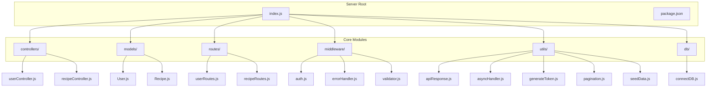

**Diagram sources**
- [index.js:1-82](file://server/index.js#L1-L82)
- [package.json:1-35](file://server/package.json#L1-L35)

**Section sources**
- [index.js:1-82](file://server/index.js#L1-L82)
- [package.json:1-35](file://server/package.json#L1-L35)

## Core Components

### Database Connection Management
The application uses a centralized database connection module that handles MongoDB Atlas connectivity with robust error handling and disconnection capabilities.

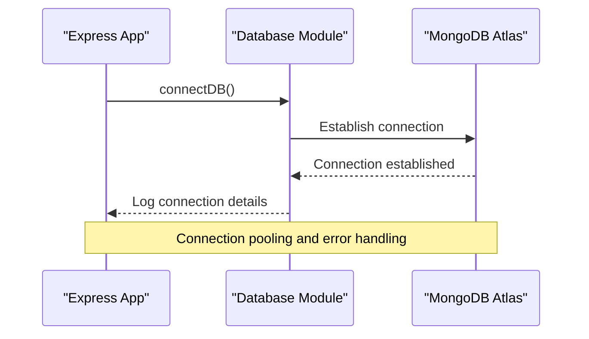

**Diagram sources**
- [connectDB.js:7-19](file://server/db/connectDB.js#L7-L19)

### Authentication System
The authentication middleware implements JWT-based security with three protection levels: public routes, protected routes requiring authentication, and admin-only routes.

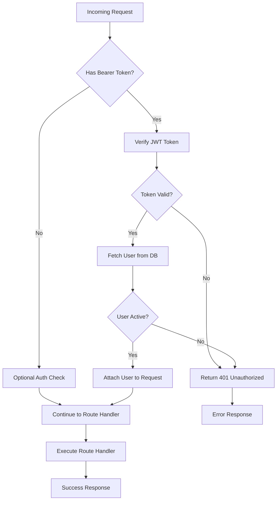

**Diagram sources**
- [auth.js:9-49](file://server/middleware/auth.js#L9-L49)

**Section sources**
- [connectDB.js:1-35](file://server/db/connectDB.js#L1-L35)
- [auth.js:1-105](file://server/middleware/auth.js#L1-L105)

## Architecture Overview

The backend implements a layered architecture pattern with clear separation of concerns:

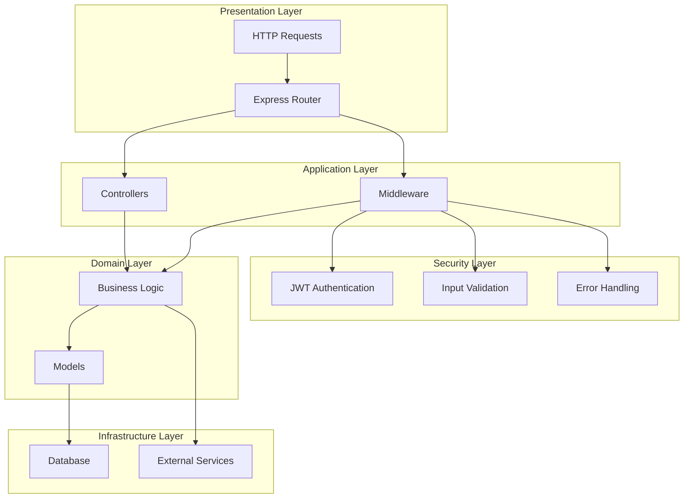

**Diagram sources**
- [index.js:18-59](file://server/index.js#L18-L59)
- [userController.js:13-53](file://server/controllers/userController.js#L13-L53)
- [recipeController.js:12-51](file://server/controllers/recipeController.js#L12-L51)

### API Endpoint Structure
The RESTful API follows consistent patterns with clear resource organization:

```mermaid
graph LR
subgraph "User Resources"
A[/api/users/register]
B[/api/users/login]
C[/api/users/me]
D[/api/users/:id/follow]
E[/api/users/:id/followers]
F[/api/users/:id/following]
G[/api/users/search]
end
subgraph "Recipe Resources"
H[/api/recipes]
I[/api/recipes/:id]
J[/api/recipes/:id/like]
K[/api/recipes/:id/save]
L[/api/recipes/:id/rate]
M[/api/recipes/:id/comments]
N[/api/recipes/trending]
O[/api/recipes/feed]
end
```

**Diagram sources**
- [userRoutes.js:21-37](file://server/routes/userRoutes.js#L21-L37)
- [recipeRoutes.js:28-53](file://server/routes/recipeRoutes.js#L28-L53)

**Section sources**
- [index.js:47-59](file://server/index.js#L47-L59)
- [userRoutes.js:1-40](file://server/routes/userRoutes.js#L1-L40)
- [recipeRoutes.js:1-56](file://server/routes/recipeRoutes.js#L1-L56)

## Detailed Component Analysis

### User Model and Business Logic
The User model implements comprehensive user management with social features and data validation.

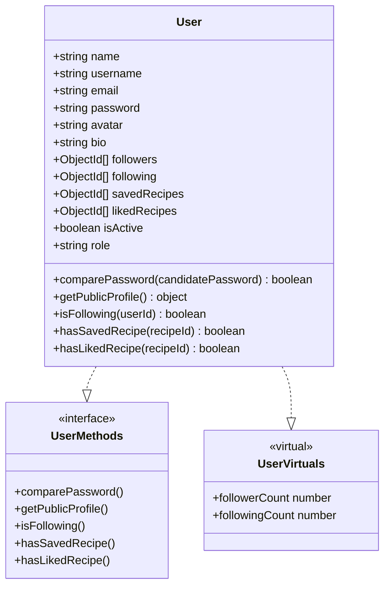

**Diagram sources**
- [User.js:4-142](file://server/models/User.js#L4-L142)

#### User Registration Flow
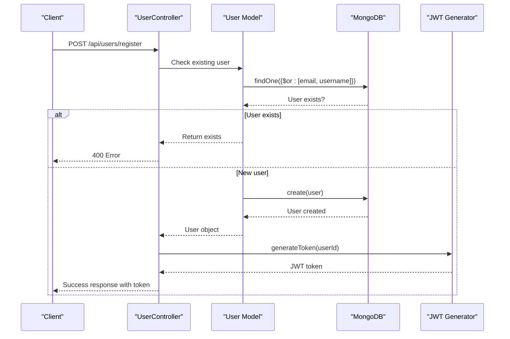

**Diagram sources**
- [userController.js:13-53](file://server/controllers/userController.js#L13-L53)
- [generateToken.js:8-14](file://server/utils/generateToken.js#L8-L14)

**Section sources**
- [User.js:1-142](file://server/models/User.js#L1-L142)
- [userController.js:1-359](file://server/controllers/userController.js#L1-L359)

### Recipe Model and Advanced Features
The Recipe model implements complex recipe management with nested documents and advanced aggregation capabilities.

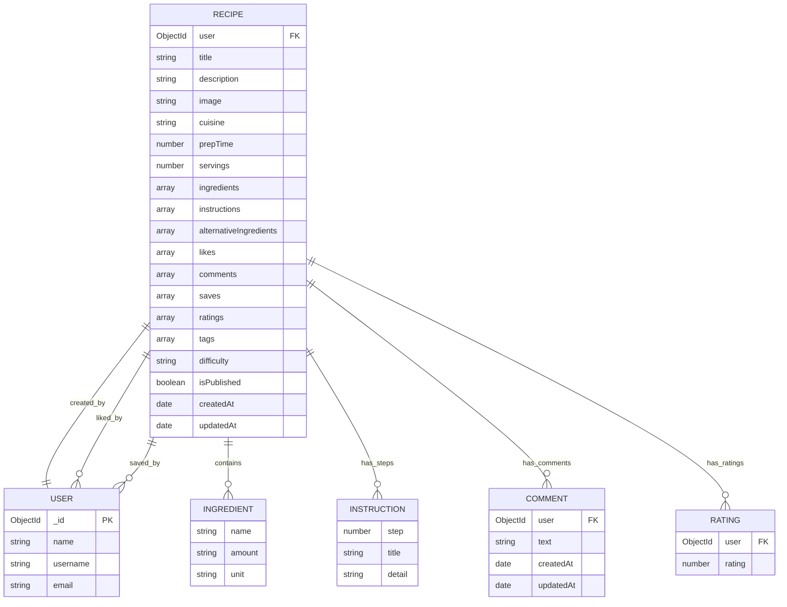

**Diagram sources**
- [Recipe.js:3-243](file://server/models/Recipe.js#L3-L243)

#### Recipe Search and Filtering
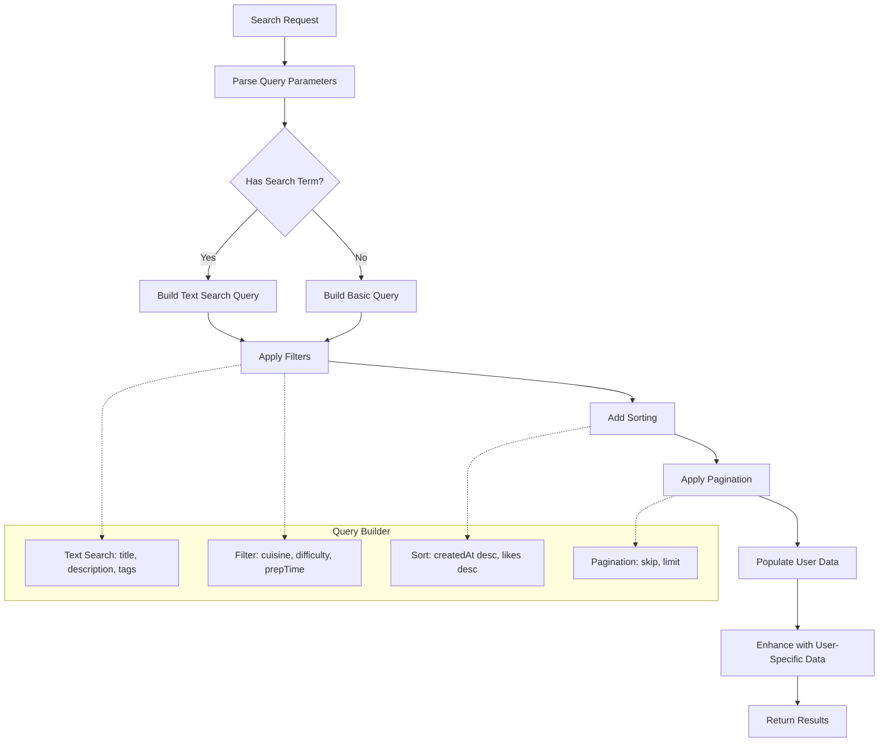

**Diagram sources**
- [recipeController.js:58-96](file://server/controllers/recipeController.js#L58-L96)
- [Recipe.js:219-238](file://server/models/Recipe.js#L219-L238)

**Section sources**
- [Recipe.js:1-243](file://server/models/Recipe.js#L1-L243)
- [recipeController.js:1-533](file://server/controllers/recipeController.js#L1-L533)

### Authentication and Authorization Middleware
The authentication system provides multiple layers of security:

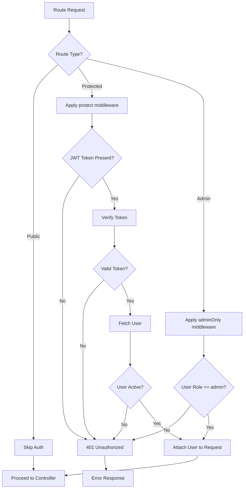

**Diagram sources**
- [auth.js:9-84](file://server/middleware/auth.js#L9-L84)

**Section sources**
- [auth.js:1-105](file://server/middleware/auth.js#L1-L105)

### Input Validation System
The validation middleware ensures data integrity through comprehensive field validation:

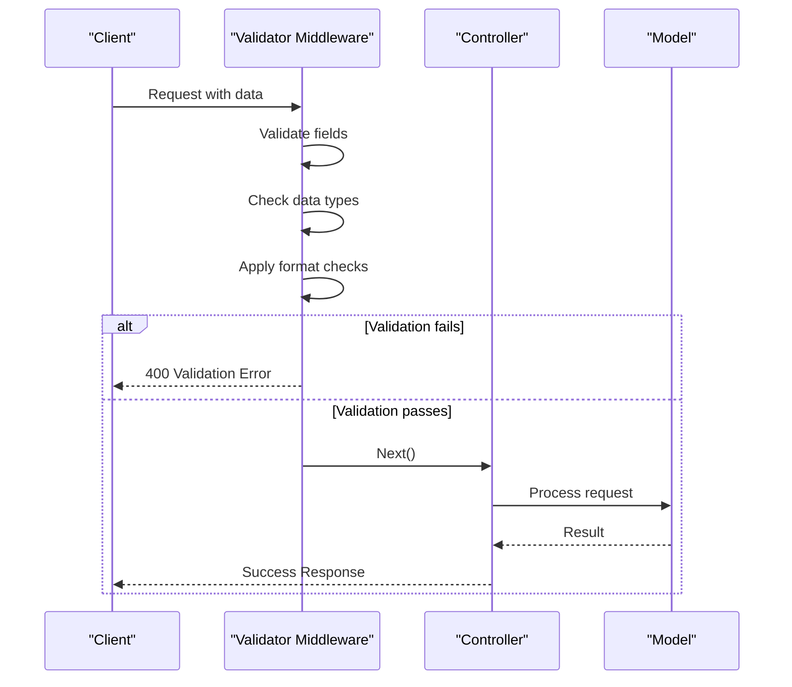

**Diagram sources**
- [validator.js:7-20](file://server/middleware/validator.js#L7-L20)

**Section sources**
- [validator.js:1-211](file://server/middleware/validator.js#L1-L211)

## Dependency Analysis

The backend maintains clean dependency relationships with minimal coupling:

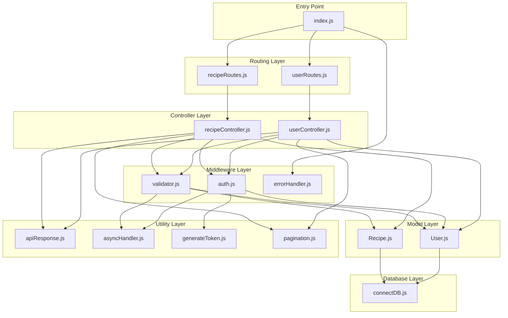

**Diagram sources**
- [index.js:8-9](file://server/index.js#L8-L9)
- [userRoutes.js:16-24](file://server/routes/userRoutes.js#L16-L24)
- [recipeRoutes.js:19-24](file://server/routes/recipeRoutes.js#L19-L24)

### External Dependencies
The project leverages modern JavaScript development tools and libraries:

| Category | Package | Version | Purpose |
|----------|---------|---------|---------|
| Core Framework | express | ^4.18.2 | Web framework |
| Database | mongoose | ^8.0.3 | MongoDB ODM |
| Authentication | jsonwebtoken | ^9.0.2 | JWT tokens |
| Security | bcryptjs | ^2.4.3 | Password hashing |
| Validation | express-validator | ^7.0.1 | Input validation |
| Environment | dotenv | ^16.3.1 | Environment variables |
| CORS | cors | ^2.8.5 | Cross-origin support |

**Section sources**
- [package.json:22-30](file://server/package.json#L22-L30)

## Performance Considerations

### Database Optimization
The application implements several performance optimization strategies:

1. **Indexing Strategy**: Strategic indexes on frequently queried fields
   - User: username, email (unique), followers, following
   - Recipe: user, cuisine, createdAt, likes, tags, text search index

2. **Population Optimization**: Selective field population to minimize data transfer
3. **Pagination**: Built-in pagination for large datasets
4. **Lean Queries**: Memory-efficient queries for read-only operations

### Caching Strategy
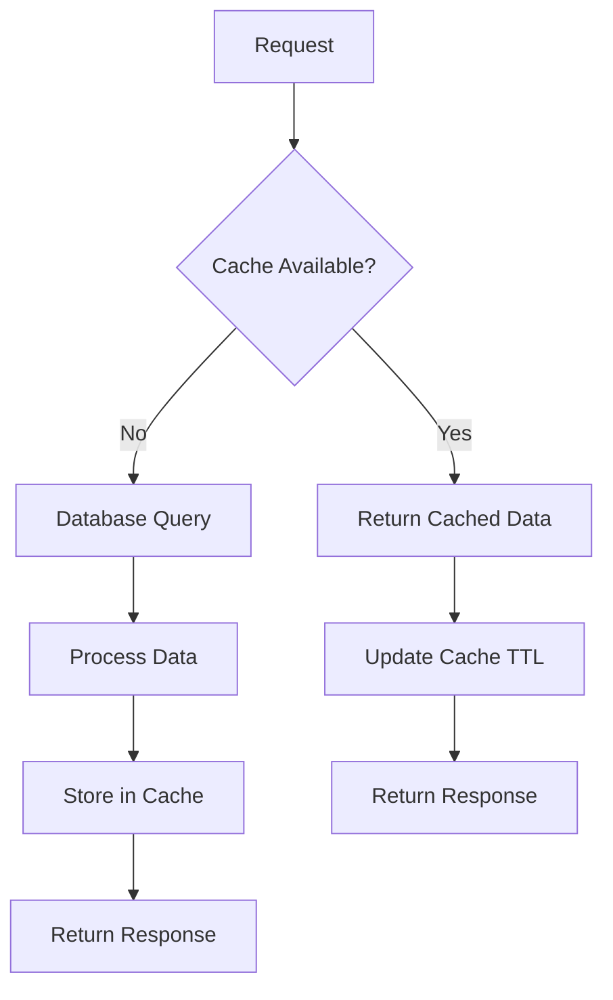

### Error Handling and Resilience
The system implements comprehensive error handling:
- Centralized error middleware for consistent error responses
- Graceful handling of database connection failures
- Proper cleanup of resources on unhandled exceptions
- Detailed logging for debugging and monitoring

## Troubleshooting Guide

### Common Issues and Solutions

#### Database Connection Problems
**Symptoms**: Application fails to start with database errors
**Causes**: 
- Invalid MongoDB URI configuration
- Network connectivity issues
- Authentication failures

**Solutions**:
1. Verify MONGODB_URI environment variable
2. Check database credentials and permissions
3. Ensure database server is accessible
4. Review connection logs for specific error details

#### Authentication Failures
**Symptoms**: 401 Unauthorized errors on protected routes
**Causes**:
- Missing or invalid JWT tokens
- Expired authentication tokens
- User account deactivation

**Solutions**:
1. Ensure proper token inclusion in Authorization headers
2. Implement token refresh mechanisms
3. Verify user account status
4. Check JWT_SECRET environment variable

#### Validation Errors
**Symptoms**: 400 Bad Request with validation messages
**Causes**:
- Invalid input data formats
- Missing required fields
- Data exceeding length limits

**Solutions**:
1. Review validation error messages for specific field issues
2. Ensure data matches expected formats
3. Check minimum and maximum length requirements
4. Validate array structures for nested objects

#### Performance Issues
**Symptoms**: Slow response times or timeouts
**Causes**:
- Missing database indexes
- Inefficient queries
- Large data transfers

**Solutions**:
1. Implement appropriate database indexes
2. Optimize query structures
3. Use pagination for large datasets
4. Consider implementing caching layers

**Section sources**
- [errorHandler.js:6-46](file://server/middleware/errorHandler.js#L6-L46)
- [connectDB.js:15-18](file://server/db/connectDB.js#L15-L18)

## Conclusion

The Flavora Express backend server demonstrates modern backend development practices with a well-structured, maintainable codebase. The implementation successfully balances functionality with performance through strategic design decisions including:

- **Clean Architecture**: Clear separation of concerns with modular organization
- **Comprehensive Security**: Multi-layered authentication and authorization system
- **Data Integrity**: Robust validation and error handling mechanisms
- **Scalability**: Optimized database queries and indexing strategies
- **Developer Experience**: Consistent API patterns and comprehensive documentation

The backend provides a solid foundation for the social recipe sharing platform, supporting core features like user management, recipe creation, social interactions, and content discovery. The modular architecture ensures maintainability and extensibility for future feature additions.

Key strengths include the comprehensive validation system, flexible authentication middleware, and efficient database modeling with proper indexing strategies. The standardized API response format and error handling contribute to a consistent developer experience and reliable client-server communication.