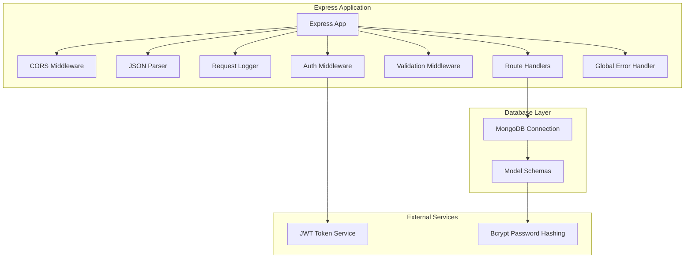
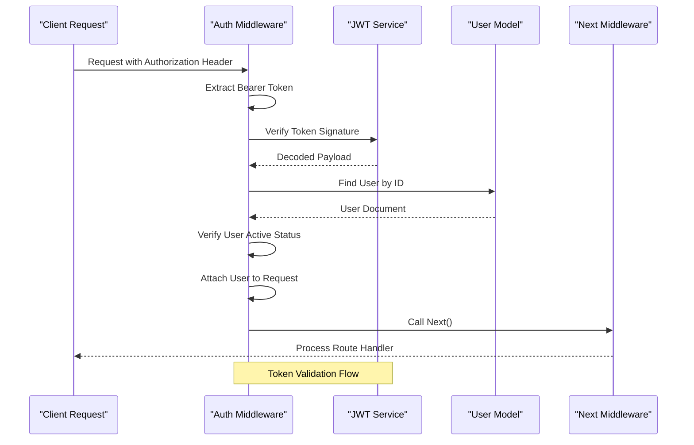
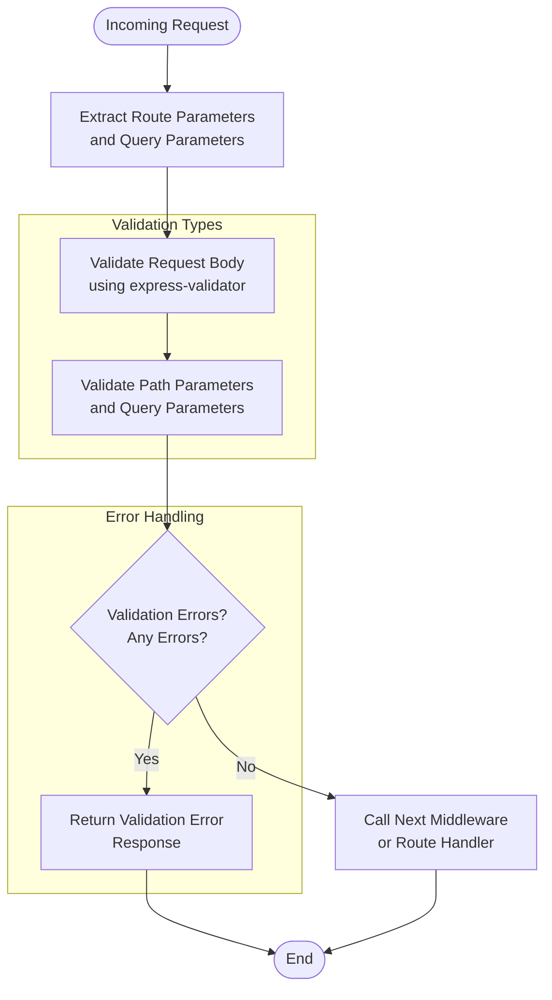
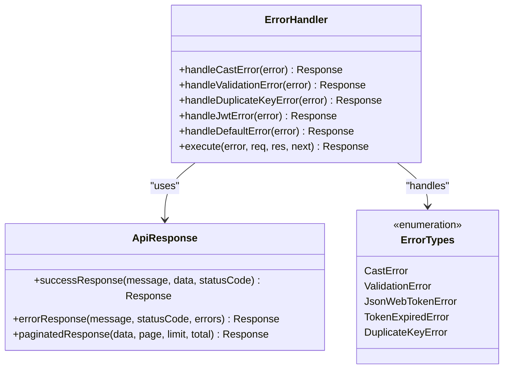
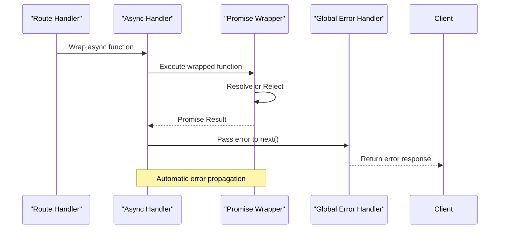
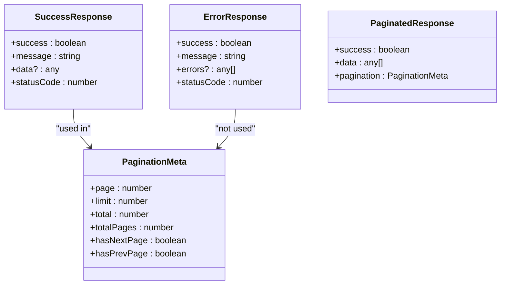
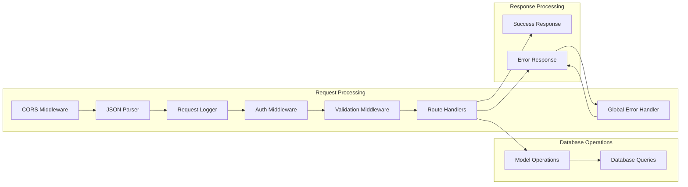

# Middleware and Error Handling

<cite>
**Referenced Files in This Document**
- [index.js](file://server/index.js)
- [auth.js](file://server/middleware/auth.js)
- [errorHandler.js](file://server/middleware/errorHandler.js)
- [validator.js](file://server/middleware/validator.js)
- [asyncHandler.js](file://server/utils/asyncHandler.js)
- [apiResponse.js](file://server/utils/apiResponse.js)
- [userRoutes.js](file://server/routes/userRoutes.js)
- [recipeRoutes.js](file://server/routes/recipeRoutes.js)
- [userController.js](file://server/controllers/userController.js)
- [recipeController.js](file://server/controllers/recipeController.js)
- [connectDB.js](file://server/db/connectDB.js)
- [User.js](file://server/models/User.js)
- [Recipe.js](file://server/models/Recipe.js)
</cite>

## Table of Contents
1. [Introduction](#introduction)
2. [Middleware Architecture Overview](#middleware-architecture-overview)
3. [Authentication Middleware](#authentication-middleware)
4. [Validation Middleware](#validation-middleware)
5. [Error Handling System](#error-handling-system)
6. [Async Handler Pattern](#async-handler-pattern)
7. [API Response Utilities](#api-response-utilities)
8. [Integration Patterns](#integration-patterns)
9. [Security Considerations](#security-considerations)
10. [Best Practices](#best-practices)
11. [Troubleshooting Guide](#troubleshooting-guide)

## Introduction

The Flavora application implements a comprehensive middleware and error handling system built on Express.js and Node.js. This system ensures secure, reliable, and consistent operation across all API endpoints while maintaining clean separation of concerns between authentication, validation, error handling, and business logic.

The middleware architecture follows modern Express.js patterns with specialized middleware modules handling different aspects of request processing, validation, and error management. The system emphasizes security through JWT-based authentication, comprehensive input validation, and robust error handling mechanisms.

## Middleware Architecture Overview

The middleware system is structured around four primary categories: authentication, validation, error handling, and utility functions. Each category serves distinct purposes while maintaining seamless integration through Express.js middleware pipeline.

**Diagram sources**
- [index.js:20-59](file://server/index.js#L20-L59)
- [auth.js:1-105](file://server/middleware/auth.js#L1-L105)
- [validator.js:1-211](file://server/middleware/validator.js#L1-L211)

**Section sources**
- [index.js:1-82](file://server/index.js#L1-L82)
- [auth.js:1-105](file://server/middleware/auth.js#L1-L105)

## Authentication Middleware

The authentication middleware provides comprehensive security through JWT-based token verification and role-based access control. It consists of four primary functions: `protect`, `optionalAuth`, `adminOnly`, and `authorizeOwnerOrAdmin`.

### Core Authentication Functions

**Diagram sources**
- [auth.js:9-49](file://server/middleware/auth.js#L9-L49)
- [auth.js:54-74](file://server/middleware/auth.js#L54-L74)

### Authentication Flow Analysis

The authentication system implements a layered approach to security:

1. **Token Extraction**: Validates presence of Bearer token in Authorization header
2. **Token Verification**: Uses JWT service to verify token signature and expiration
3. **User Resolution**: Retrieves user from database and verifies active status
4. **Request Enhancement**: Attaches user object to request for downstream handlers

### Role-Based Access Control

The system supports hierarchical access control through role-based middleware:

- **Standard Users**: Access to basic profile and recipe interaction endpoints
- **Administrators**: Full access to user management and system-level operations
- **Optional Authentication**: Allows access without requiring authentication tokens

**Section sources**
- [auth.js:1-105](file://server/middleware/auth.js#L1-L105)
- [userRoutes.js:16-37](file://server/routes/userRoutes.js#L16-L37)
- [recipeRoutes.js:19-53](file://server/routes/recipeRoutes.js#L19-L53)

## Validation Middleware

The validation middleware system provides comprehensive input sanitization and validation using express-validator. It encompasses user validation, recipe validation, pagination validation, and ID parameter validation.

### Validation Pipeline Architecture

**Diagram sources**
- [validator.js:7-20](file://server/middleware/validator.js#L7-L20)
- [validator.js:25-87](file://server/middleware/validator.js#L25-L87)

### Validation Categories

The validation system is organized into specialized categories:

#### User Validation Rules
- **Registration**: Comprehensive validation for user registration including name, username, email, and password requirements
- **Login**: Minimal validation focused on email and password presence
- **Profile Updates**: Selective validation for profile modification fields
- **Password Changes**: Specific validation for password change operations

#### Recipe Validation Rules
- **Creation**: Complete validation for recipe creation including title, description, ingredients, and instructions
- **Updates**: Selective validation for recipe modifications
- **Comments**: Validation for comment text length and requirements
- **Ratings**: Validation for rating values within acceptable ranges

#### Parameter Validation
- **ID Validation**: Ensures MongoDB ObjectId format compliance
- **Pagination**: Validates page and limit parameters for API responses

**Section sources**
- [validator.js:1-211](file://server/middleware/validator.js#L1-L211)
- [userRoutes.js:22-37](file://server/routes/userRoutes.js#L22-L37)
- [recipeRoutes.js:28-53](file://server/routes/recipeRoutes.js#L28-L53)

## Error Handling System

The error handling system implements a comprehensive global error handler that manages various types of errors including validation errors, authentication failures, database errors, and unexpected exceptions.

### Error Classification and Response

**Diagram sources**
- [errorHandler.js:6-46](file://server/middleware/errorHandler.js#L6-L46)
- [apiResponse.js:32-43](file://server/utils/apiResponse.js#L32-L43)

### Error Handling Categories

The system categorizes errors into specific types with appropriate responses:

#### Database-Related Errors
- **Cast Errors**: Invalid ObjectId format errors mapped to 404 Not Found
- **Duplicate Key Errors**: Unique constraint violations with field-specific messages
- **Validation Errors**: Mongoose validation failures with detailed error arrays

#### Authentication-Related Errors
- **JWT Errors**: Invalid token and expired token scenarios
- **Authorization Failures**: Insufficient permissions and role-based access denials

#### Application Errors
- **Default Errors**: Unhandled exceptions with standardized error responses
- **Custom Errors**: Application-specific error conditions

**Section sources**
- [errorHandler.js:1-49](file://server/middleware/errorHandler.js#L1-L49)
- [apiResponse.js:1-71](file://server/utils/apiResponse.js#L1-L71)

## Async Handler Pattern

The async handler middleware eliminates the need for repetitive try-catch blocks in route handlers by wrapping asynchronous functions and automatically passing errors to the global error handler.

### Async Handler Implementation

**Diagram sources**
- [asyncHandler.js:7-11](file://server/utils/asyncHandler.js#L7-L11)

### Benefits of Async Handler Pattern

The async handler middleware provides several advantages:

- **Error Consistency**: All async route handlers follow the same error handling pattern
- **Code Cleanliness**: Eliminates repetitive try-catch blocks throughout the application
- **Error Propagation**: Ensures all unhandled promise rejections reach the global error handler
- **Developer Experience**: Reduces boilerplate code and potential for human error

**Section sources**
- [asyncHandler.js:1-14](file://server/utils/asyncHandler.js#L1-L14)
- [userController.js:13-53](file://server/controllers/userController.js#L13-L53)
- [recipeController.js:12-51](file://server/controllers/recipeController.js#L12-L51)

## API Response Utilities

The API response utilities provide standardized response formatting across all endpoints, ensuring consistent API behavior and predictable client interactions.

### Response Structure Standardization

**Diagram sources**
- [apiResponse.js:12-23](file://server/utils/apiResponse.js#L12-L23)
- [apiResponse.js:32-43](file://server/utils/apiResponse.js#L32-L43)
- [apiResponse.js:53-68](file://server/utils/apiResponse.js#L53-L68)

### Response Type Categories

The system provides three primary response types:

#### Success Responses
- **Standard Success**: Simple success messages with optional data payload
- **Created Resources**: 201 responses for newly created resources
- **Updated Resources**: Confirmation of successful updates

#### Error Responses
- **Validation Errors**: Detailed validation failure information
- **Authorization Errors**: Permission-related error responses
- **Resource Errors**: Not found and conflict scenarios

#### Pagination Responses
- **Standard Pagination**: Complete pagination metadata
- **Enhanced Pagination**: Additional query-specific metadata

**Section sources**
- [apiResponse.js:1-71](file://server/utils/apiResponse.js#L1-L71)

## Integration Patterns

The middleware system integrates seamlessly with the routing architecture through strategic placement in the Express.js middleware stack.

### Middleware Stack Integration

**Diagram sources**
- [index.js:20-59](file://server/index.js#L20-L59)
- [userRoutes.js:19-39](file://server/routes/userRoutes.js#L19-L39)
- [recipeRoutes.js:26-56](file://server/routes/recipeRoutes.js#L26-L56)

### Route-Specific Middleware Application

The middleware system applies different combinations of middleware based on route requirements:

#### Public Routes
- No authentication required
- Basic validation for input parameters
- Standard response formatting

#### Protected Routes
- Authentication required
- Input validation for all requests
- Ownership verification for resource-specific operations

#### Admin Routes
- Authentication required
- Administrative role verification
- Enhanced validation for administrative operations

**Section sources**
- [userRoutes.js:21-37](file://server/routes/userRoutes.js#L21-L37)
- [recipeRoutes.js:28-53](file://server/routes/recipeRoutes.js#L28-L53)
- [index.js:46-59](file://server/index.js#L46-L59)

## Security Considerations

The middleware system implements multiple layers of security to protect the application from common vulnerabilities and unauthorized access attempts.

### Authentication Security Measures

- **JWT Token Management**: Secure token verification with expiration handling
- **Password Security**: Bcrypt-based password hashing with salt generation
- **Role-Based Access**: Hierarchical permission system preventing unauthorized operations
- **Request Enhancement**: User context attached securely to authenticated requests

### Input Validation Security

- **Parameter Sanitization**: Comprehensive input cleaning and validation
- **Type Safety**: Strict type checking for all request parameters
- **Range Validation**: Numeric constraints for time, serving sizes, and ratings
- **Format Validation**: Email, URL, and ID format verification

### Error Handling Security

- **Information Disclosure Prevention**: Generic error messages prevent sensitive information leakage
- **Stack Trace Protection**: Error details logged securely without exposing internal implementation
- **Consistent Response Format**: Standardized error responses prevent information extraction

**Section sources**
- [auth.js:22-48](file://server/middleware/auth.js#L22-L48)
- [validator.js:25-87](file://server/middleware/validator.js#L25-L87)
- [errorHandler.js:6-46](file://server/middleware/errorHandler.js#L6-L46)

## Best Practices

The middleware and error handling system follows established best practices for Express.js applications, ensuring maintainability, scalability, and reliability.

### Middleware Organization

- **Single Responsibility**: Each middleware module handles a specific concern
- **Composition**: Middleware functions can be combined for complex request processing
- **Consistency**: Standardized patterns across all middleware implementations
- **Documentation**: Clear function documentation and usage examples

### Error Handling Best Practices

- **Early Detection**: Validation occurs as early as possible in the request lifecycle
- **Graceful Degradation**: System continues operating despite individual request failures
- **Logging**: Comprehensive error logging for debugging and monitoring
- **User-Friendly Messages**: Clear, actionable error messages for end users

### Performance Considerations

- **Efficient Validation**: Validation occurs only when necessary based on route requirements
- **Minimal Processing**: Middleware performs only essential operations
- **Caching**: Appropriate caching strategies for frequently accessed data
- **Resource Management**: Proper cleanup of database connections and external resources

**Section sources**
- [asyncHandler.js:7-11](file://server/utils/asyncHandler.js#L7-L11)
- [apiResponse.js:12-23](file://server/utils/apiResponse.js#L12-L23)
- [connectDB.js:7-19](file://server/db/connectDB.js#L7-L19)

## Troubleshooting Guide

Common issues and their solutions when working with the middleware and error handling system.

### Authentication Issues

**Problem**: Users unable to access protected routes
**Solution**: Verify JWT token format and expiration, check user account activation status

**Problem**: Authentication bypass attempts
**Solution**: Review token verification logic and ensure proper middleware ordering

### Validation Errors

**Problem**: Validation errors not returning expected format
**Solution**: Check validation middleware application order and ensure proper error handling

**Problem**: Validation rules not being applied
**Solution**: Verify route middleware configuration and express-validator setup

### Error Handling Problems

**Problem**: Unexpected 500 errors instead of specific error responses
**Solution**: Review global error handler logic and ensure proper error classification

**Problem**: Error messages not reaching clients
**Solution**: Check error handler middleware registration and response formatting

### Performance Issues

**Problem**: Slow response times with middleware enabled
**Solution**: Review middleware execution order and optimize validation logic

**Problem**: Memory leaks in production
**Solution**: Implement proper cleanup of database connections and external resources

**Section sources**
- [errorHandler.js:6-46](file://server/middleware/errorHandler.js#L6-L46)
- [auth.js:9-49](file://server/middleware/auth.js#L9-L49)
- [validator.js:7-20](file://server/middleware/validator.js#L7-L20)