# MongoDB Database Integration

<cite>
**Referenced Files in This Document**
- [connectDB.js](file://server/db/connectDB.js)
- [User.js](file://server/models/User.js)
- [Recipe.js](file://server/models/Recipe.js)
- [userController.js](file://server/controllers/userController.js)
- [recipeController.js](file://server/controllers/recipeController.js)
- [index.js](file://server/index.js)
- [api.js](file://client/src/services/api.js)
- [auth.js](file://server/middleware/auth.js)
- [validator.js](file://server/middleware/validator.js)
- [apiResponse.js](file://server/utils/apiResponse.js)
- [asyncHandler.js](file://server/utils/asyncHandler.js)
- [seedData.js](file://server/utils/seedData.js)
- [userRoutes.js](file://server/routes/userRoutes.js)
- [recipeRoutes.js](file://server/routes/recipeRoutes.js)
- [package.json](file://server/package.json)
</cite>

## Update Summary
**Changes Made**
- Updated database seeding functionality to include 32 new recipes covering international cuisines
- Enhanced recipe database with comprehensive international cuisine coverage including Italian, Indian, American, Thai, Mexican, Japanese, French, Chinese, and Mediterranean traditions
- Added extensive mock data for client-side development and testing
- Improved database initialization process with structured recipe categorization

## Table of Contents
1. [Introduction](#introduction)
2. [Project Structure](#project-structure)
3. [Core Components](#core-components)
4. [Architecture Overview](#architecture-overview)
5. [Detailed Component Analysis](#detailed-component-analysis)
6. [Enhanced Database Seeding](#enhanced-database-seeding)
7. [International Cuisine Coverage](#international-cuisine-coverage)
8. [Dependency Analysis](#dependency-analysis)
9. [Performance Considerations](#performance-considerations)
10. [Troubleshooting Guide](#troubleshooting-guide)
11. [Conclusion](#conclusion)

## Introduction
This document provides a comprehensive analysis of the MongoDB database integration in the Flavora recipe sharing application. The backend utilizes Mongoose ODM to manage MongoDB Atlas connectivity, define data models, and implement robust CRUD operations for users and recipes. The system emphasizes data integrity, security through JWT authentication, and efficient querying with database indexes. Recent enhancements include a massive expansion of the recipe database with 32 new international recipes covering diverse culinary traditions.

## Project Structure
The MongoDB integration spans three primary layers: database connection management, data modeling with Mongoose schemas, and controller logic that orchestrates database operations. The system now includes comprehensive international cuisine coverage with detailed recipe data structures.

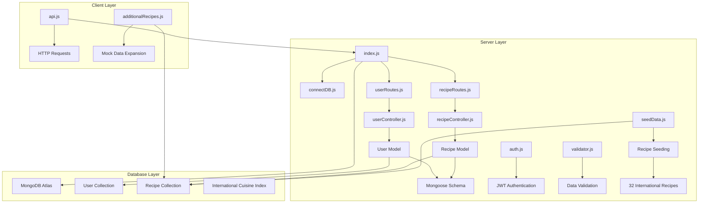

**Diagram sources**
- [index.js:1-82](file://server/index.js#L1-L82)
- [connectDB.js:1-35](file://server/db/connectDB.js#L1-L35)
- [userController.js:1-359](file://server/controllers/userController.js#L1-L359)
- [recipeController.js:1-533](file://server/controllers/recipeController.js#L1-L533)
- [seedData.js:1230-1299](file://server/utils/seedData.js#L1230-L1299)
- [additionalRecipes.js:1-316](file://client/src/data/additionalRecipes.js#L1-L316)

**Section sources**
- [index.js:1-82](file://server/index.js#L1-L82)
- [connectDB.js:1-35](file://server/db/connectDB.js#L1-L35)

## Core Components

### Database Connection Management
The application establishes MongoDB Atlas connectivity through a centralized connection module that handles environment variable configuration and error management.

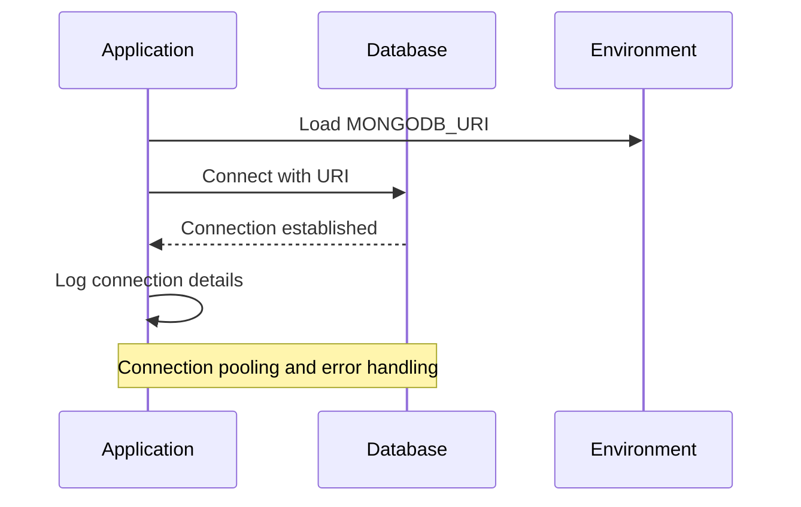

**Diagram sources**
- [connectDB.js:7-19](file://server/db/connectDB.js#L7-L19)

### Data Models and Schemas
Two primary Mongoose models define the application's data structure with comprehensive validation and indexing strategies. The recipe model now supports extensive international cuisine categorization.

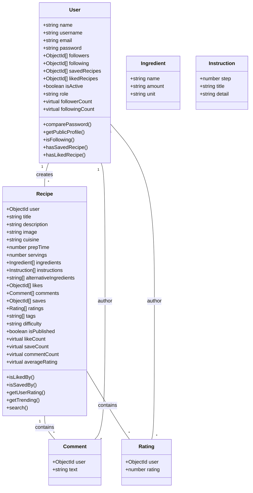

**Diagram sources**
- [User.js:4-142](file://server/models/User.js#L4-L142)
- [Recipe.js:3-243](file://server/models/Recipe.js#L3-L243)

**Section sources**
- [User.js:1-142](file://server/models/User.js#L1-L142)
- [Recipe.js:1-243](file://server/models/Recipe.js#L1-L243)

## Architecture Overview

### Database Integration Flow
The MongoDB integration follows a layered architecture pattern with clear separation of concerns between connection management, model definition, and controller orchestration. The system now includes comprehensive recipe seeding capabilities.

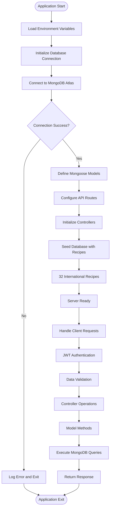

**Diagram sources**
- [index.js:11-16](file://server/index.js#L11-L16)
- [connectDB.js:7-19](file://server/db/connectDB.js#L7-L19)
- [seedData.js:1230-1299](file://server/utils/seedData.js#L1230-L1299)
- [auth.js:9-49](file://server/middleware/auth.js#L9-L49)

### Authentication and Authorization Flow
The system implements JWT-based authentication with comprehensive middleware for protecting routes and validating user permissions.

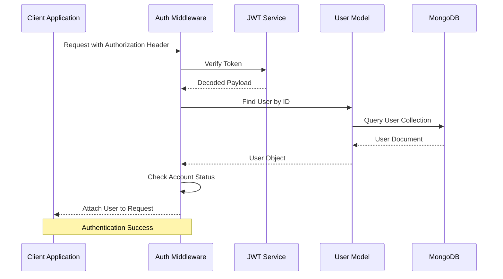

**Diagram sources**
- [auth.js:9-49](file://server/middleware/auth.js#L9-L49)
- [User.js:103-105](file://server/models/User.js#L103-L105)

**Section sources**
- [auth.js:1-105](file://server/middleware/auth.js#L1-L105)
- [index.js:1-82](file://server/index.js#L1-L82)

## Detailed Component Analysis

### User Management System
The user management system implements comprehensive CRUD operations with advanced features like social interactions and profile management.

#### User Registration and Authentication
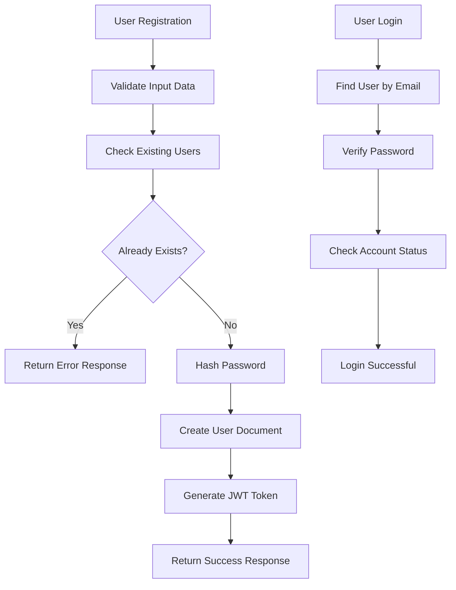

**Diagram sources**
- [userController.js:13-53](file://server/controllers/userController.js#L13-L53)
- [userController.js:60-87](file://server/controllers/userController.js#L60-L87)

#### Social Features Implementation
The user model supports complex social interactions through embedded references and array operations.

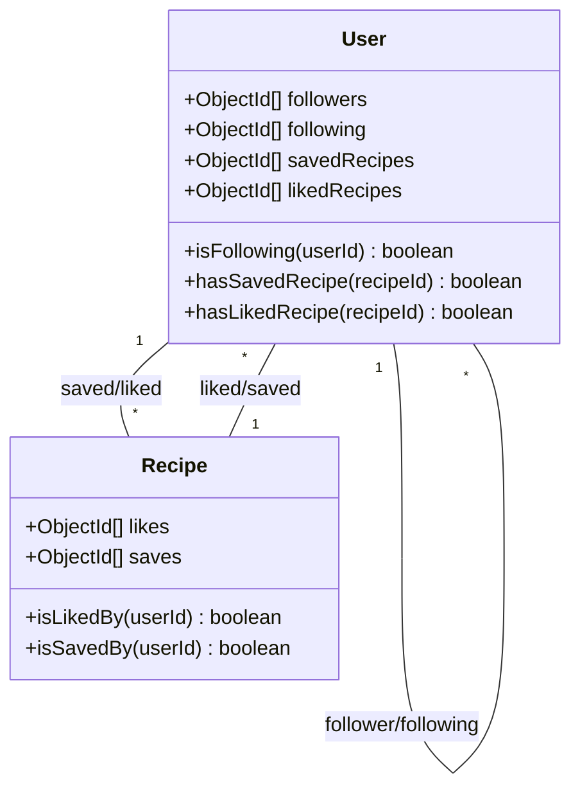

**Diagram sources**
- [User.js:44-59](file://server/models/User.js#L44-L59)
- [Recipe.js:134-143](file://server/models/Recipe.js#L134-L143)

**Section sources**
- [userController.js:1-359](file://server/controllers/userController.js#L1-L359)
- [User.js:1-142](file://server/models/User.js#L1-L142)

### Recipe Management System
The recipe management system provides comprehensive functionality for recipe creation, modification, and discovery with advanced filtering capabilities. The system now includes extensive international cuisine coverage with 32 diverse recipes.

#### Recipe Creation and Validation
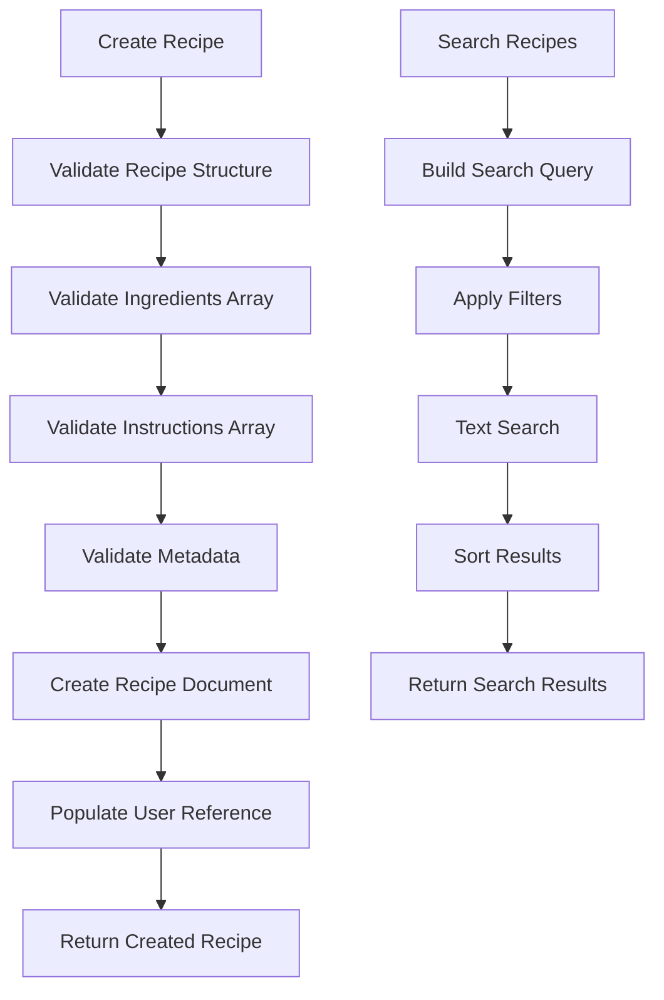

**Diagram sources**
- [recipeController.js:12-51](file://server/controllers/recipeController.js#L12-L51)
- [recipeController.js:219-238](file://server/controllers/recipeController.js#L219-L238)

#### Advanced Querying and Indexing
The recipe model implements sophisticated indexing strategies for optimal query performance across multiple search criteria, including international cuisine categories.

**Section sources**
- [recipeController.js:1-533](file://server/controllers/recipeController.js#L1-L533)
- [Recipe.js:1-243](file://server/models/Recipe.js#L1-L243)

### API Response and Error Handling
The system implements standardized response formats and comprehensive error handling mechanisms.

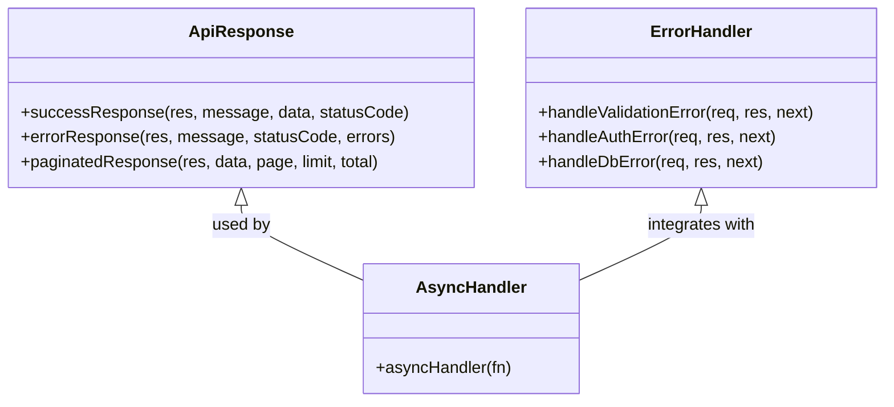

**Diagram sources**
- [apiResponse.js:12-68](file://server/utils/apiResponse.js#L12-L68)
- [asyncHandler.js:7-11](file://server/utils/asyncHandler.js#L7-L11)

**Section sources**
- [apiResponse.js:1-71](file://server/utils/apiResponse.js#L1-L71)
- [asyncHandler.js:1-14](file://server/utils/asyncHandler.js#L1-L14)

## Enhanced Database Seeding

### Comprehensive Recipe Database Expansion
The database seeding functionality has been significantly enhanced with 32 new recipes covering diverse international cuisines. The seed data now provides comprehensive coverage of global cooking traditions.

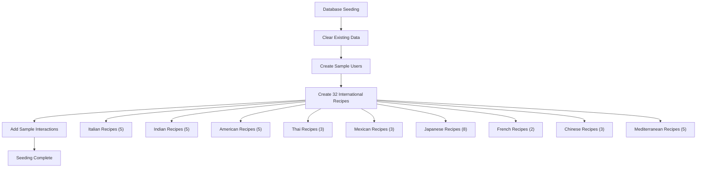

**Diagram sources**
- [seedData.js:1230-1299](file://server/utils/seedData.js#L1230-L1299)

### International Cuisine Categories
The expanded recipe database now covers 9 major international cuisine categories with detailed recipe implementations:

**Italian Cuisine**: Creamy risotto, classic margherita pizza, butter chicken, carbonara, osso buco, eggplant parmesan, tiramisu, lasagna
**Indian Cuisine**: Butter chicken, chicken tikka masala, palak paneer, rogan josh, chana masala, aloo gobi
**American Cuisine**: Classic cheeseburger, New York cheesecake, buttermilk fried chicken, clam chowder, mac and cheese
**Thai Cuisine**: Thai green curry, pad thai
**Mexican Cuisine**: Tacos al pastor, carnitas tacos, churros
**Japanese Cuisine**: Sashimi bowl, miso ramen, tempura, sukiyaki, okonomiyaki, gyoza, unagi don, matcha latte, yakitori, onigiri, shabu shabu
**French Cuisine**: French onion soup, coq au vin
**Chinese Cuisine**: Kung pao chicken, mapo tofu
**Mediterranean Cuisine**: Mediterranean grilled sea bass, Greek salad, shakshuka, paella

**Section sources**
- [seedData.js:55-1228](file://server/utils/seedData.js#L55-L1228)

## International Cuisine Coverage

### Recipe Diversity and Cultural Representation
The expanded recipe database provides comprehensive cultural representation with authentic recipes from around the world. Each recipe includes detailed ingredient lists, step-by-step instructions, and cultural context.

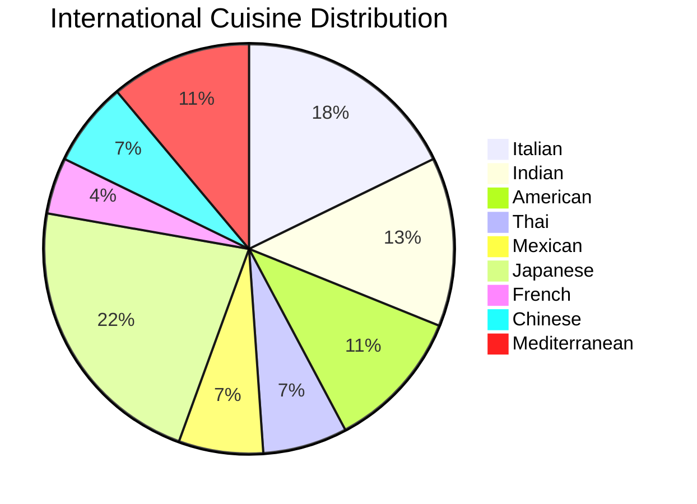

**Diagram sources**
- [seedData.js:55-1228](file://server/utils/seedData.js#L55-L1228)

### Cultural Authenticity and Preparation Methods
Each recipe category maintains cultural authenticity while providing accessible preparation methods for home cooks. The recipes include traditional techniques, authentic ingredients, and regional variations.

**Section sources**
- [seedData.js:55-1228](file://server/utils/seedData.js#L55-L1228)

## Dependency Analysis

### Database Model Relationships
The application employs a document-oriented approach with embedded references and array-based relationships for optimal query performance. The expanded recipe database enhances these relationships with comprehensive international cuisine coverage.

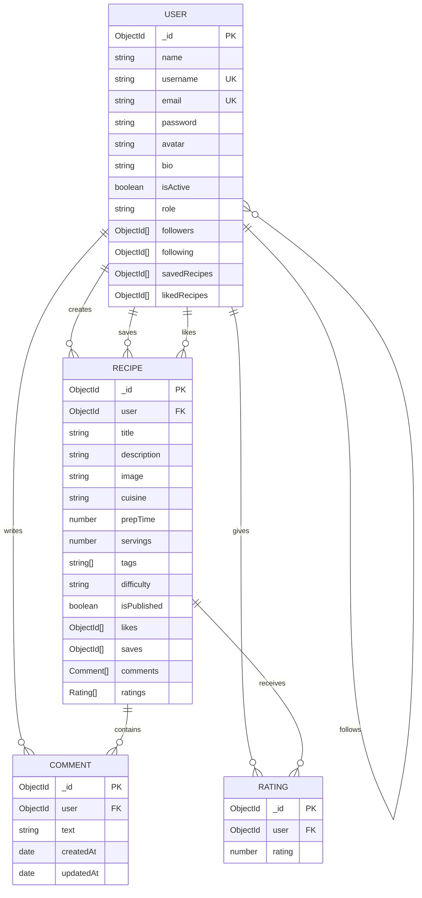

**Diagram sources**
- [User.js:4-142](file://server/models/User.js#L4-L142)
- [Recipe.js:71-243](file://server/models/Recipe.js#L71-L243)

### Client-Server Communication
The client-side API service provides a unified interface for interacting with the backend REST API. The additional mock data enhances client-side development and testing capabilities.

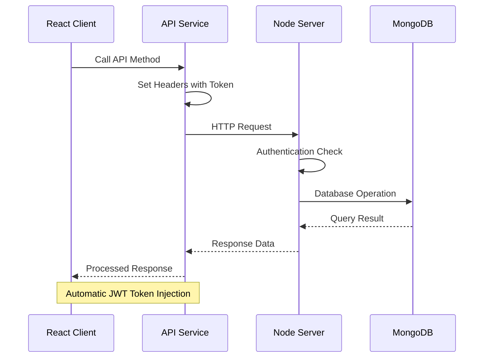

**Diagram sources**
- [api.js:25-49](file://client/src/services/api.js#L25-L49)
- [auth.js:13-27](file://server/middleware/auth.js#L13-L27)

**Section sources**
- [api.js:1-172](file://client/src/services/api.js#L1-L172)
- [userRoutes.js:1-40](file://server/routes/userRoutes.js#L1-L40)
- [recipeRoutes.js:1-56](file://server/routes/recipeRoutes.js#L1-L56)

## Performance Considerations

### Database Indexing Strategy
The application implements strategic indexing to optimize query performance across frequently accessed fields and search operations. The expanded recipe database benefits from enhanced indexing for international cuisine categories.

Key indexing patterns implemented:
- **Text Search Index**: Full-text search capability on title, description, and tags
- **Compound Indexes**: Multi-field indexes for common query patterns including cuisine categories
- **Reference Indexes**: Individual indexes on foreign key arrays for relationship queries
- **Cuisine Category Indexing**: Specialized indexes for international cuisine filtering

### Query Optimization Techniques
- **Selective Population**: Controlled population of related documents to minimize data transfer
- **Projection Filtering**: Selective field retrieval to reduce payload sizes
- **Pagination Implementation**: Efficient cursor-based pagination for large datasets
- **Lean Documents**: Optimized document mode for read-heavy operations
- **Cuisine-Based Filtering**: Optimized queries for international recipe categories

### Connection Management
- **Connection Pooling**: Mongoose default connection pooling for concurrent operations
- **Graceful Shutdown**: Proper disconnection handling during application termination
- **Environment Configuration**: Flexible database configuration through environment variables
- **Seed Data Management**: Efficient batch processing for large-scale recipe insertion

## Troubleshooting Guide

### Common Database Issues
1. **Connection Failures**
   - Verify MONGODB_URI format and accessibility
   - Check network connectivity to MongoDB Atlas cluster
   - Validate database credentials and authentication methods

2. **Authentication Problems**
   - Confirm JWT_SECRET environment variable is set
   - Verify token expiration and signing algorithms
   - Check user account activation status

3. **Query Performance Issues**
   - Review database indexes for missing query patterns
   - Analyze slow query logs and execution plans
   - Optimize aggregation pipelines and populate operations

4. **Seed Data Issues**
   - Verify seed script execution with `npm run seed`
   - Check for recipe data validation errors
   - Monitor database capacity for large recipe insertions

### Error Handling Patterns
The system implements comprehensive error handling across all layers:

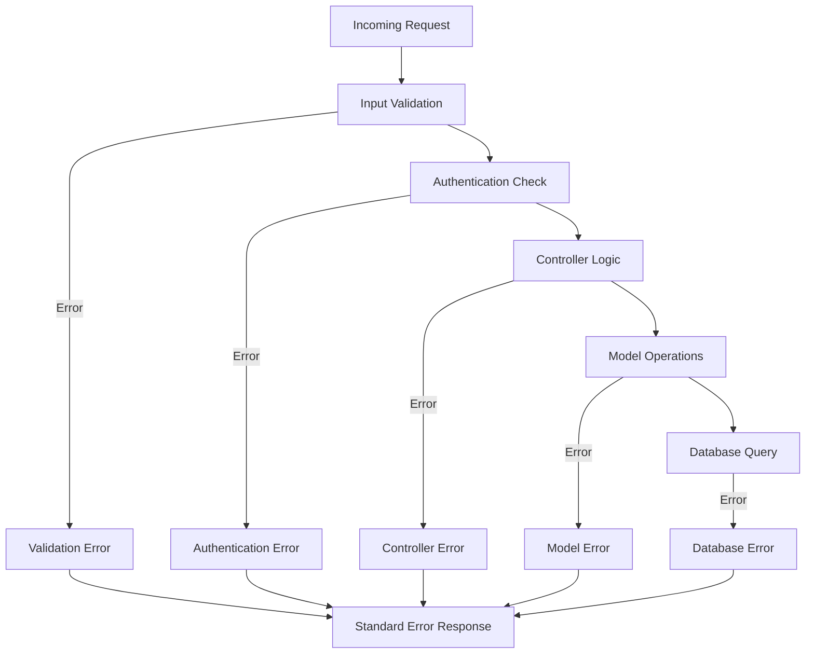

**Diagram sources**
- [validator.js:7-20](file://server/middleware/validator.js#L7-L20)
- [auth.js:40-48](file://server/middleware/auth.js#L40-L48)
- [apiResponse.js:32-43](file://server/utils/apiResponse.js#L32-L43)

**Section sources**
- [connectDB.js:15-18](file://server/db/connectDB.js#L15-L18)
- [auth.js:39-48](file://server/middleware/auth.js#L39-L48)
- [apiResponse.js:1-71](file://server/utils/apiResponse.js#L1-L71)

## Conclusion
The MongoDB database integration in Flavora demonstrates a well-architected approach to document-oriented data management with comprehensive validation, security, and performance optimization. The recent enhancement with 32 international recipes significantly expands the application's cultural diversity and recipe variety, providing users with authentic culinary experiences from around the world. The system successfully balances flexibility with structure, enabling complex social features while maintaining efficient query performance through strategic indexing and optimized data modeling. The modular architecture ensures maintainability and scalability, providing a solid foundation for the application's continued growth and feature expansion with comprehensive international cuisine coverage.