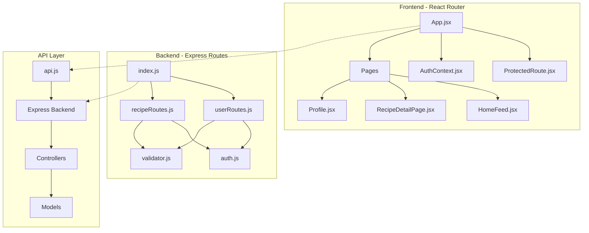
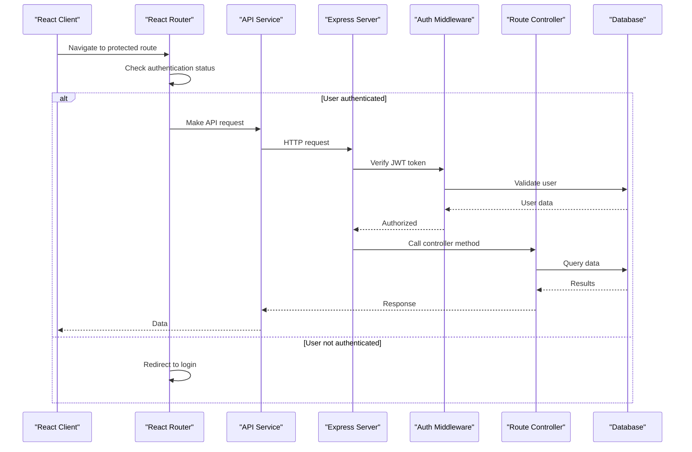
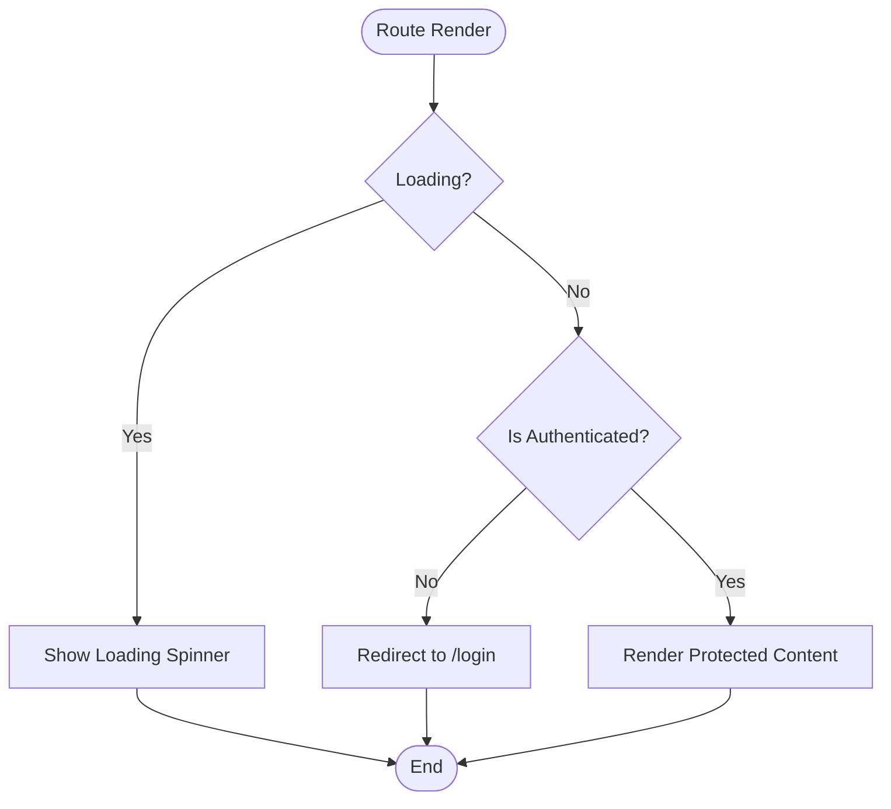
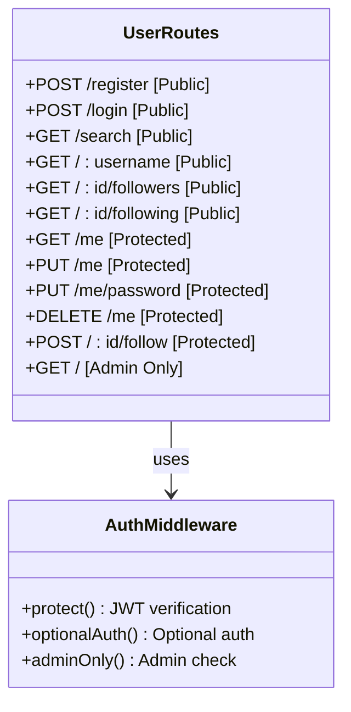
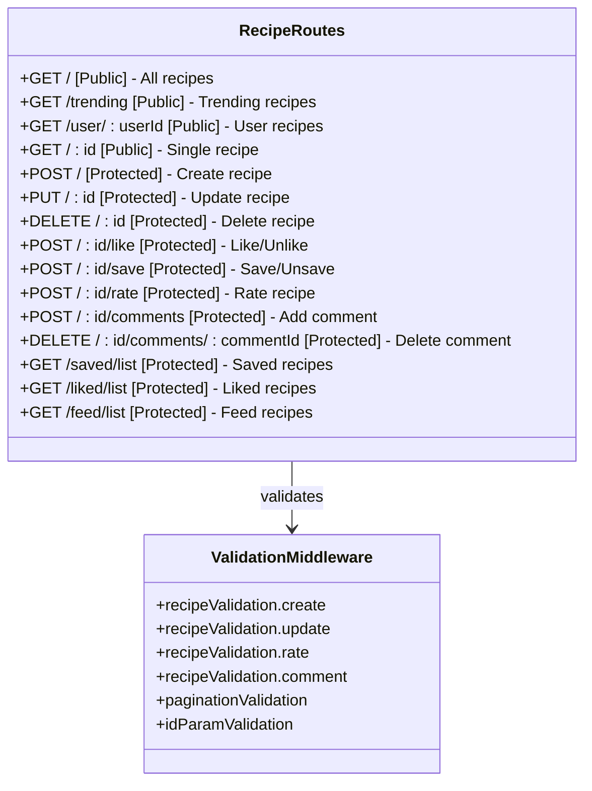
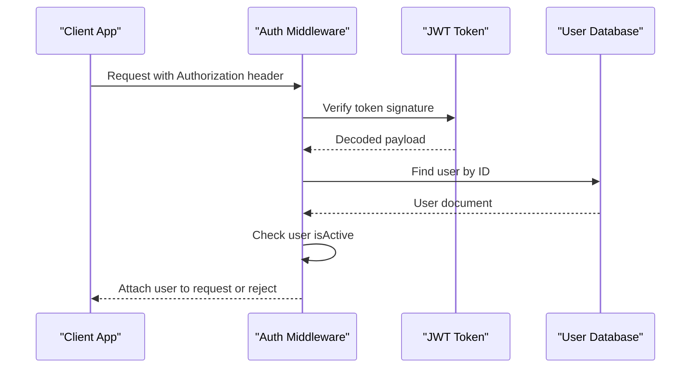
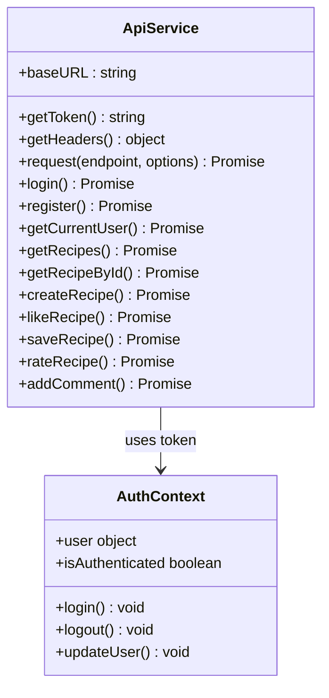
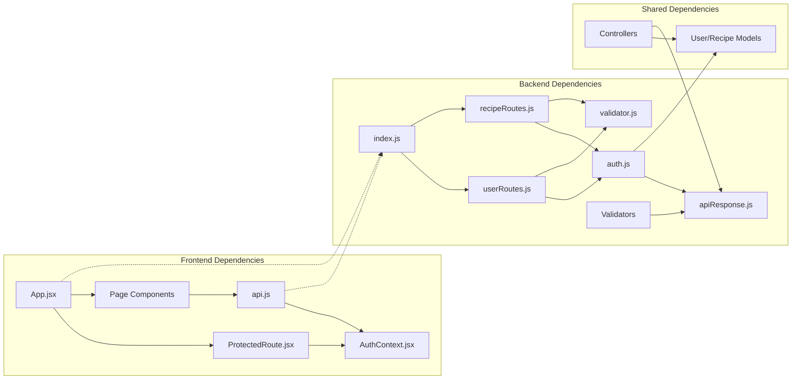

# Routing System

<cite>
**Referenced Files in This Document**
- [server/index.js](file://server/index.js)
- [server/routes/recipeRoutes.js](file://server/routes/recipeRoutes.js)
- [server/routes/userRoutes.js](file://server/routes/userRoutes.js)
- [client/src/App.jsx](file://client/src/App.jsx)
- [client/src/components/common/ProtectedRoute.jsx](file://client/src/components/common/ProtectedRoute.jsx)
- [client/src/services/api.js](file://client/src/services/api.js)
- [server/middleware/auth.js](file://server/middleware/auth.js)
- [server/middleware/validator.js](file://server/middleware/validator.js)
- [server/controllers/recipeController.js](file://server/controllers/recipeController.js)
- [server/controllers/userController.js](file://server/controllers/userController.js)
- [client/src/context/AuthContext.jsx](file://client/src/context/AuthContext.jsx)
- [client/src/pages/HomeFeed.jsx](file://client/src/pages/HomeFeed.jsx)
</cite>

## Table of Contents
1. [Introduction](#introduction)
2. [Project Structure](#project-structure)
3. [Core Components](#core-components)
4. [Architecture Overview](#architecture-overview)
5. [Detailed Component Analysis](#detailed-component-analysis)
6. [Dependency Analysis](#dependency-analysis)
7. [Performance Considerations](#performance-considerations)
8. [Troubleshooting Guide](#troubleshooting-guide)
9. [Conclusion](#conclusion)

## Introduction
This document provides a comprehensive analysis of the routing system in the Flavora application, covering both the frontend React Router configuration and the backend Express route structure. The system implements a clear separation between public and protected routes, with robust authentication middleware and comprehensive validation layers. The routing system supports recipe sharing, user profiles, social interactions, and content discovery features.

## Project Structure
The routing system spans three main areas: frontend React Router configuration, backend Express route definitions, and supporting middleware for authentication and validation.

**Diagram sources**
- [client/src/App.jsx:1-94](file://client/src/App.jsx#L1-L94)
- [server/index.js:1-82](file://server/index.js#L1-L82)
- [client/src/services/api.js:1-172](file://client/src/services/api.js#L1-L172)

**Section sources**
- [client/src/App.jsx:1-94](file://client/src/App.jsx#L1-L94)
- [server/index.js:1-82](file://server/index.js#L1-L82)

## Core Components

### Frontend Routing Architecture
The React application uses React Router DOM v7.13.2 with a hierarchical routing structure featuring nested layouts and protected routes.

Key routing patterns:
- **Auth Layout**: `/login` and `/signup` routes without navigation
- **Main Layout**: Routes with Navbar and Footer integration
- **Protected Routes**: Content requiring authentication
- **Dynamic Routes**: Recipe and user profile routes with parameterized URLs

### Backend Route Organization
The Express server implements modular route organization with separate routers for users and recipes, each containing public, protected, and admin endpoints.

**Section sources**
- [client/src/App.jsx:44-91](file://client/src/App.jsx#L44-L91)
- [server/routes/userRoutes.js:1-40](file://server/routes/userRoutes.js#L1-L40)
- [server/routes/recipeRoutes.js:1-56](file://server/routes/recipeRoutes.js#L1-L56)

## Architecture Overview

**Diagram sources**
- [client/src/App.jsx:67-82](file://client/src/App.jsx#L67-L82)
- [client/src/components/common/ProtectedRoute.jsx:1-21](file://client/src/components/common/ProtectedRoute.jsx#L1-L21)
- [server/middleware/auth.js:1-105](file://server/middleware/auth.js#L1-L105)

## Detailed Component Analysis

### Frontend Routing System

#### Protected Route Implementation
The ProtectedRoute component provides centralized authentication checking with loading states and automatic redirects.

**Diagram sources**
- [client/src/components/common/ProtectedRoute.jsx:4-20](file://client/src/components/common/ProtectedRoute.jsx#L4-L20)

#### Dynamic Route Parameters
The routing system handles dynamic parameters for recipe IDs and user profiles:

- Recipe detail routes: `/recipe/:id`
- User profile routes: `/profile/:id`
- Username-based routes: `/profile/:username`

**Section sources**
- [client/src/App.jsx:58-83](file://client/src/App.jsx#L58-L83)
- [client/src/components/common/ProtectedRoute.jsx:1-21](file://client/src/components/common/ProtectedRoute.jsx#L1-L21)

### Backend Route Architecture

#### User Routes Organization
The user routes are organized into three access levels:

**Diagram sources**
- [server/routes/userRoutes.js:19-39](file://server/routes/userRoutes.js#L19-L39)
- [server/middleware/auth.js:9-84](file://server/middleware/auth.js#L9-L84)

#### Recipe Routes Structure
Recipe routes implement comprehensive CRUD operations with specialized endpoints:

**Diagram sources**
- [server/routes/recipeRoutes.js:26-55](file://server/routes/recipeRoutes.js#L26-L55)
- [server/middleware/validator.js:92-180](file://server/middleware/validator.js#L92-L180)

**Section sources**
- [server/routes/userRoutes.js:1-40](file://server/routes/userRoutes.js#L1-L40)
- [server/routes/recipeRoutes.js:1-56](file://server/routes/recipeRoutes.js#L1-L56)

### Authentication and Authorization Flow

#### JWT Token Management
The authentication system implements a multi-layered approach:

**Diagram sources**
- [server/middleware/auth.js:9-49](file://server/middleware/auth.js#L9-L49)

#### Role-Based Access Control
The system implements three access levels:
- **Public routes**: Accessible without authentication
- **Protected routes**: Require valid JWT token
- **Admin routes**: Require admin role in addition to authentication

**Section sources**
- [server/middleware/auth.js:1-105](file://server/middleware/auth.js#L1-L105)
- [server/controllers/userController.js:308-320](file://server/controllers/userController.js#L308-L320)

### API Service Integration

#### Frontend API Communication
The client-side API service provides a unified interface for all backend operations:

**Diagram sources**
- [client/src/services/api.js:3-171](file://client/src/services/api.js#L3-L171)
- [client/src/context/AuthContext.jsx:5-63](file://client/src/context/AuthContext.jsx#L5-L63)

**Section sources**
- [client/src/services/api.js:1-172](file://client/src/services/api.js#L1-L172)
- [client/src/context/AuthContext.jsx:1-72](file://client/src/context/AuthContext.jsx#L1-L72)

## Dependency Analysis

The routing system exhibits clean separation of concerns with minimal coupling between components:

**Diagram sources**
- [client/src/App.jsx:1-94](file://client/src/App.jsx#L1-L94)
- [server/index.js:1-82](file://server/index.js#L1-L82)

**Section sources**
- [client/src/App.jsx:1-94](file://client/src/App.jsx#L1-L94)
- [server/index.js:1-82](file://server/index.js#L1-L82)

## Performance Considerations

### Route Resolution Performance
- **Static vs Dynamic Routes**: Static routes (`/login`, `/signup`) resolve faster than parameterized routes
- **Route Order**: More specific routes should be defined before general ones to avoid conflicts
- **Middleware Chain**: Authentication middleware adds minimal overhead for protected routes

### Caching Strategies
- **Public Data**: Recipe listings and trending data can benefit from caching layers
- **User Data**: Personalized feeds should not be cached to maintain real-time updates
- **Image Assets**: CDN integration recommended for recipe images

### Scalability Considerations
- **Route Modularization**: Current modular structure scales well with additional route groups
- **Middleware Efficiency**: Validation middleware should be optimized for high-throughput scenarios
- **Database Queries**: Population-heavy routes (recipe details) should implement selective field projection

## Troubleshooting Guide

### Common Routing Issues

#### Authentication Problems
**Symptoms**: Protected routes redirect to login despite valid session
**Causes**: 
- Expired JWT tokens
- User deactivation
- Missing Authorization headers

**Solutions**:
- Implement token refresh mechanism
- Check user account status
- Verify Bearer token format

#### Route Not Found Errors
**Symptoms**: 404 errors for valid routes
**Causes**:
- Incorrect route parameter types
- Missing middleware validation
- Route registration order issues

**Solutions**:
- Verify MongoDB ObjectId format for recipe IDs
- Ensure proper middleware chain ordering
- Check route definition precedence

#### CORS Issues
**Symptoms**: Cross-origin request failures
**Causes**:
- Incorrect client URL configuration
- Missing credentials support
- Development vs production URL mismatch

**Solutions**:
- Configure CLIENT_URL environment variable
- Enable credentials in CORS configuration
- Match development and production URLs

**Section sources**
- [server/middleware/auth.js:18-48](file://server/middleware/auth.js#L18-L48)
- [server/index.js:21-26](file://server/index.js#L21-L26)
- [client/src/services/api.js:8-23](file://client/src/services/api.js#L8-L23)

## Conclusion

The Flavora routing system demonstrates excellent architectural practices with clear separation between frontend and backend concerns. The system successfully implements:

- **Hierarchical routing** with nested layouts and protected routes
- **Modular backend architecture** with dedicated route handlers
- **Robust authentication** with JWT-based token verification
- **Comprehensive validation** at multiple layers
- **Scalable design** supporting future feature expansion

Key strengths include the clean separation of public, protected, and admin routes, effective use of React Router's nested routing capabilities, and well-structured Express middleware. The system provides a solid foundation for the application's social recipe-sharing functionality while maintaining good performance characteristics and scalability potential.