# Utility Functions and Helpers

<cite>
**Referenced Files in This Document**
- [api.js](file://client/src/services/api.js)
- [AuthContext.jsx](file://client/src/context/AuthContext.jsx)
- [RecipeContext.jsx](file://client/src/context/RecipeContext.jsx)
- [ThemeContext.jsx](file://client/src/context/ThemeContext.jsx)
- [mockData.js](file://client/src/data/mockData.js)
- [apiResponse.js](file://server/utils/apiResponse.js)
- [asyncHandler.js](file://server/utils/asyncHandler.js)
- [generateToken.js](file://server/utils/generateToken.js)
- [pagination.js](file://server/utils/pagination.js)
- [seedData.js](file://server/utils/seedData.js)
</cite>

## Table of Contents
1. [Introduction](#introduction)
2. [Project Structure](#project-structure)
3. [Core Components](#core-components)
4. [Architecture Overview](#architecture-overview)
5. [Detailed Component Analysis](#detailed-component-analysis)
6. [Dependency Analysis](#dependency-analysis)
7. [Performance Considerations](#performance-considerations)
8. [Troubleshooting Guide](#troubleshooting-guide)
9. [Conclusion](#conclusion)

## Introduction
This document provides comprehensive coverage of utility functions and helpers across both the client and server sides of the Flavora application. It focuses on reusable components that streamline development, improve consistency, and enhance maintainability. The utilities include HTTP service abstractions, React context providers for state management, server-side response helpers, authentication tokens, pagination utilities, and database seeding scripts.

## Project Structure
The utility functions are organized by domain and responsibility:
- Client-side utilities: HTTP service abstraction, React contexts for authentication, recipe data, and theme management, plus mock data for development.
- Server-side utilities: Standardized API response builders, async error handling wrapper, JWT token generation/verification, pagination helpers, and database seeding script.

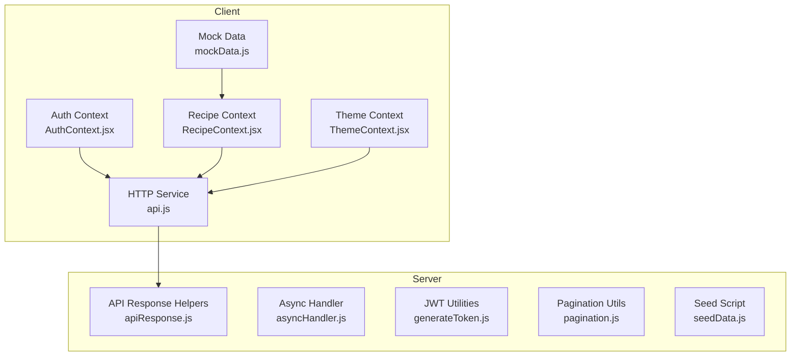

**Diagram sources**
- [api.js:1-172](file://client/src/services/api.js#L1-L172)
- [AuthContext.jsx:1-72](file://client/src/context/AuthContext.jsx#L1-L72)
- [RecipeContext.jsx:1-194](file://client/src/context/RecipeContext.jsx#L1-L194)
- [ThemeContext.jsx:1-43](file://client/src/context/ThemeContext.jsx#L1-L43)
- [mockData.js:1-587](file://client/src/data/mockData.js#L1-L587)
- [apiResponse.js:1-71](file://server/utils/apiResponse.js#L1-L71)
- [asyncHandler.js:1-14](file://server/utils/asyncHandler.js#L1-L14)
- [generateToken.js:1-26](file://server/utils/generateToken.js#L1-L26)
- [pagination.js:1-37](file://server/utils/pagination.js#L1-L37)
- [seedData.js:1-248](file://server/utils/seedData.js#L1-L248)

**Section sources**
- [api.js:1-172](file://client/src/services/api.js#L1-L172)
- [AuthContext.jsx:1-72](file://client/src/context/AuthContext.jsx#L1-L72)
- [RecipeContext.jsx:1-194](file://client/src/context/RecipeContext.jsx#L1-L194)
- [ThemeContext.jsx:1-43](file://client/src/context/ThemeContext.jsx#L1-L43)
- [mockData.js:1-587](file://client/src/data/mockData.js#L1-L587)
- [apiResponse.js:1-71](file://server/utils/apiResponse.js#L1-L71)
- [asyncHandler.js:1-14](file://server/utils/asyncHandler.js#L1-L14)
- [generateToken.js:1-26](file://server/utils/generateToken.js#L1-L26)
- [pagination.js:1-37](file://server/utils/pagination.js#L1-L37)
- [seedData.js:1-248](file://server/utils/seedData.js#L1-L248)

## Core Components
This section highlights the primary utility components and their responsibilities:

- HTTP Service Abstraction (Client): Centralizes API communication, manages authentication headers, and exposes convenient methods for user and recipe operations.
- Authentication Context (Client): Manages user session state, persistence via localStorage, and exposes login/signup/logout/update flows.
- Recipe Context (Client): Provides CRUD operations for recipes, user interactions (likes, saves, ratings, comments), and trending data retrieval with localStorage synchronization.
- Theme Context (Client): Handles theme switching between light/dark modes with persistent storage and DOM class toggling.
- API Response Helpers (Server): Standardizes success/error/paginated responses for consistent API contracts.
- Async Handler (Server): Wraps async route handlers to eliminate repetitive try-catch blocks.
- JWT Utilities (Server): Generates and verifies JWT tokens for secure authentication.
- Pagination Utilities (Server): Computes skip/limit/page metadata for MongoDB queries.
- Database Seeding Script (Server): Seeds the database with realistic users, recipes, and sample interactions.

**Section sources**
- [api.js:25-49](file://client/src/services/api.js#L25-L49)
- [AuthContext.jsx:19-48](file://client/src/context/AuthContext.jsx#L19-L48)
- [RecipeContext.jsx:34-156](file://client/src/context/RecipeContext.jsx#L34-L156)
- [ThemeContext.jsx:25-27](file://client/src/context/ThemeContext.jsx#L25-L27)
- [apiResponse.js:12-43](file://server/utils/apiResponse.js#L12-L43)
- [asyncHandler.js:7-11](file://server/utils/asyncHandler.js#L7-L11)
- [generateToken.js:8-23](file://server/utils/generateToken.js#L8-L23)
- [pagination.js:8-34](file://server/utils/pagination.js#L8-L34)
- [seedData.js:178-245](file://server/utils/seedData.js#L178-L245)

## Architecture Overview
The utility layer sits between the presentation layer (React components) and the backend services. On the client, contexts orchestrate state and interactions, while the HTTP service encapsulates network concerns. On the server, utilities standardize responses, handle async flows, manage tokens, and support pagination and seeding.

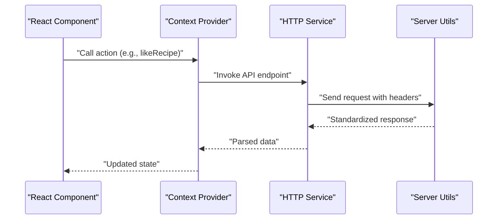

**Diagram sources**
- [RecipeContext.jsx:56-66](file://client/src/context/RecipeContext.jsx#L56-L66)
- [api.js:143-147](file://client/src/services/api.js#L143-L147)
- [apiResponse.js:12-23](file://server/utils/apiResponse.js#L12-L23)

## Detailed Component Analysis

### HTTP Service Abstraction (Client)
The HTTP service centralizes API communication:
- Base URL configuration with environment variable support.
- Token retrieval and Authorization header injection.
- Unified request method with error handling and logging.
- Dedicated endpoints for authentication, user management, recipes, and interactions.

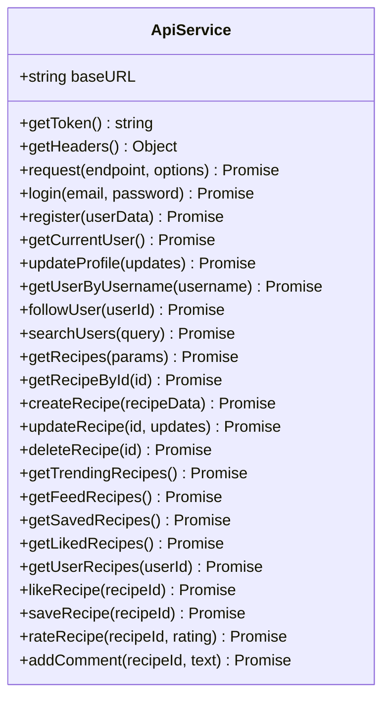

**Diagram sources**
- [api.js:3-171](file://client/src/services/api.js#L3-L171)

**Section sources**
- [api.js:1-172](file://client/src/services/api.js#L1-L172)

### Authentication Context (Client)
Manages user session lifecycle:
- Persists user data to localStorage.
- Provides login, signup, logout, and update functions.
- Tracks authentication state and loading status.

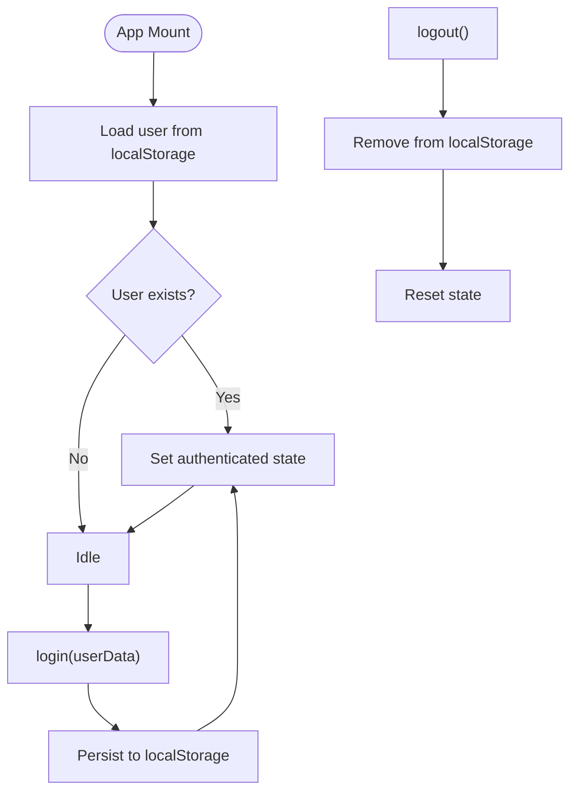

**Diagram sources**
- [AuthContext.jsx:10-42](file://client/src/context/AuthContext.jsx#L10-L42)

**Section sources**
- [AuthContext.jsx:1-72](file://client/src/context/AuthContext.jsx#L1-L72)

### Recipe Context (Client)
Provides comprehensive recipe and user interaction management:
- CRUD operations for recipes with local persistence.
- Interaction functions: like, save, rate, comment, follow.
- Helper methods for retrieving trending, saved, liked, and user-specific data.

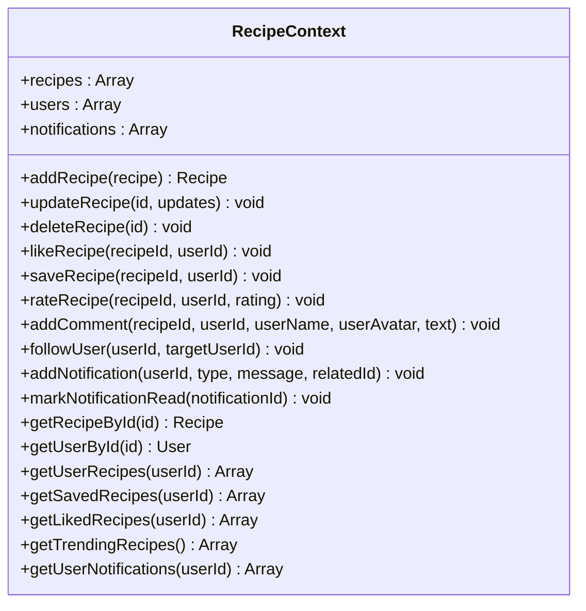

**Diagram sources**
- [RecipeContext.jsx:6-184](file://client/src/context/RecipeContext.jsx#L6-L184)

**Section sources**
- [RecipeContext.jsx:1-194](file://client/src/context/RecipeContext.jsx#L1-L194)

### Theme Context (Client)
Handles theme switching with persistence:
- Reads initial theme preference from localStorage or OS setting.
- Applies/removes dark mode class on the document element.
- Exposes toggle function for theme switching.

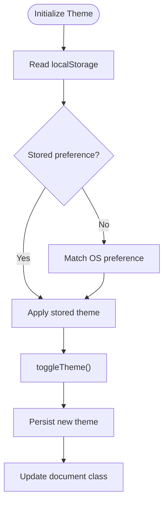

**Diagram sources**
- [ThemeContext.jsx:6-23](file://client/src/context/ThemeContext.jsx#L6-L23)

**Section sources**
- [ThemeContext.jsx:1-43](file://client/src/context/ThemeContext.jsx#L1-L43)

### API Response Helpers (Server)
Standardizes API responses:
- Success response builder with optional data payload.
- Error response builder with optional error details.
- Paginated response builder with pagination metadata.

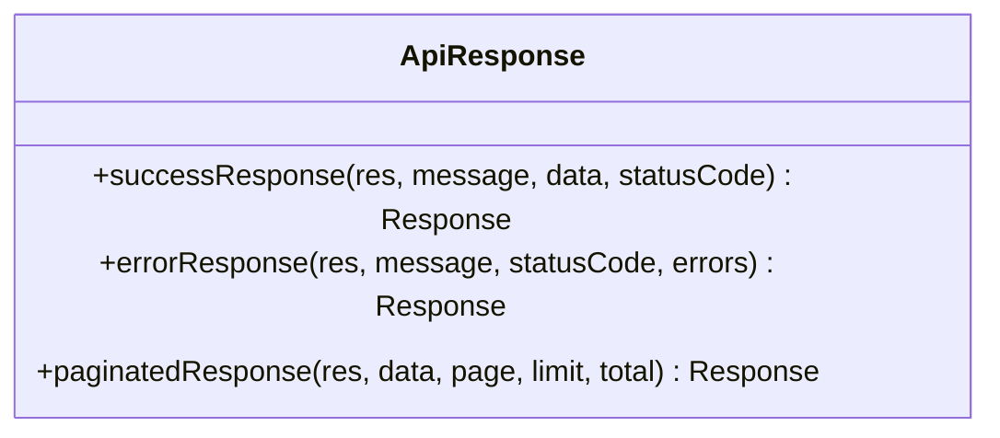

**Diagram sources**
- [apiResponse.js:12-68](file://server/utils/apiResponse.js#L12-L68)

**Section sources**
- [apiResponse.js:1-71](file://server/utils/apiResponse.js#L1-L71)

### Async Handler (Server)
Wraps async route handlers:
- Returns an Express middleware that catches errors and forwards them to the next handler.

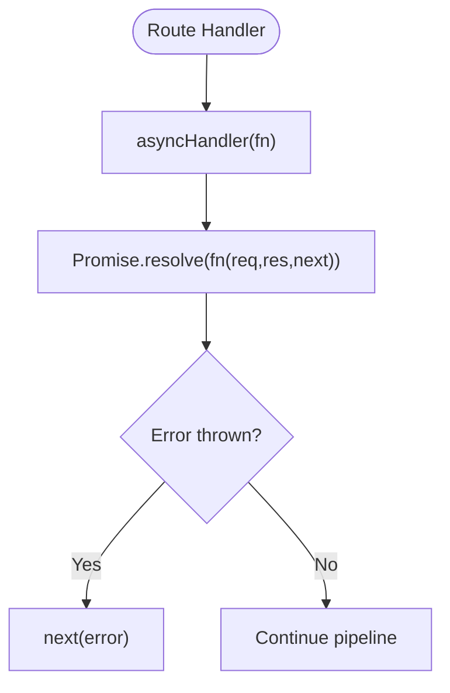

**Diagram sources**
- [asyncHandler.js:7-11](file://server/utils/asyncHandler.js#L7-L11)

**Section sources**
- [asyncHandler.js:1-14](file://server/utils/asyncHandler.js#L1-L14)

### JWT Utilities (Server)
Token management:
- Generates JWT with userId and expiration.
- Verifies JWT tokens using the secret.

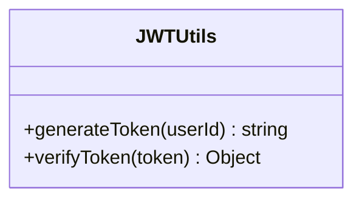

**Diagram sources**
- [generateToken.js:8-23](file://server/utils/generateToken.js#L8-L23)

**Section sources**
- [generateToken.js:1-26](file://server/utils/generateToken.js#L1-L26)

### Pagination Utilities (Server)
Pagination helpers:
- Computes validated page, limit, and skip values.
- Builds pagination metadata including total pages and navigation flags.

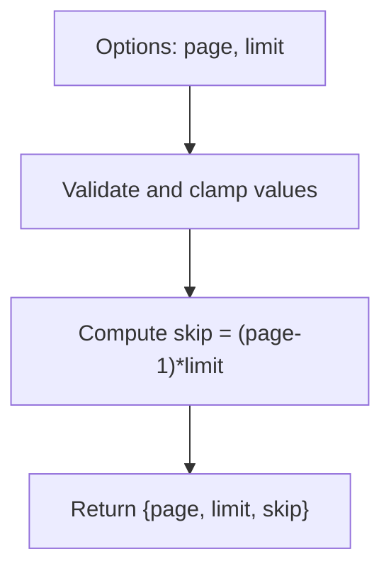

**Diagram sources**
- [pagination.js:8-14](file://server/utils/pagination.js#L8-L14)

**Section sources**
- [pagination.js:1-37](file://server/utils/pagination.js#L1-L37)

### Database Seeding Script (Server)
Automates database initialization:
- Connects to the database and clears existing collections.
- Creates sample users and recipes.
- Establishes follow relationships and prints login credentials.
- Disconnects and exits with appropriate status codes.

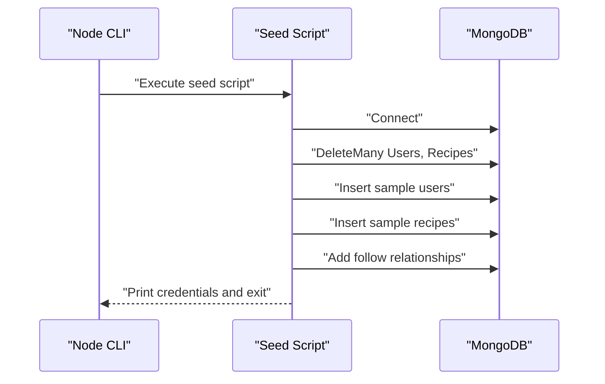

**Diagram sources**
- [seedData.js:178-245](file://server/utils/seedData.js#L178-L245)

**Section sources**
- [seedData.js:1-248](file://server/utils/seedData.js#L1-L248)

## Dependency Analysis
The utilities form a cohesive layer that reduces duplication and improves testability:
- Client contexts depend on the HTTP service for remote operations and on localStorage for persistence.
- The HTTP service depends on environment configuration for base URLs and on localStorage for tokens.
- Server utilities are independent modules that can be imported by controllers and middleware.

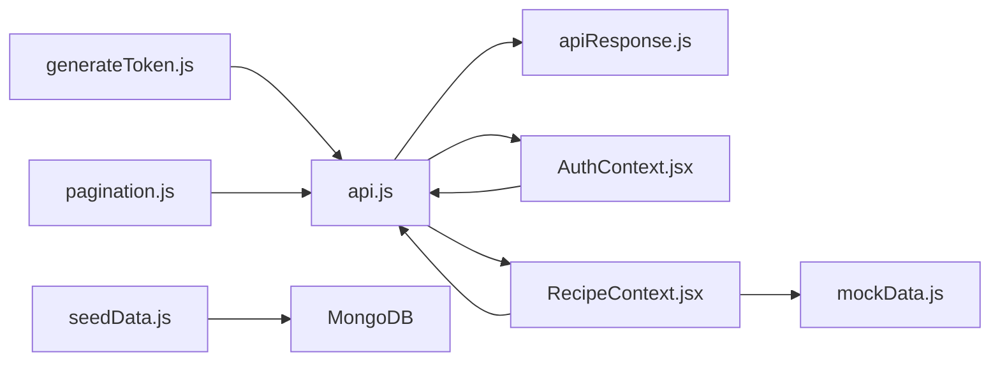

**Diagram sources**
- [api.js:1-172](file://client/src/services/api.js#L1-L172)
- [AuthContext.jsx:1-72](file://client/src/context/AuthContext.jsx#L1-L72)
- [RecipeContext.jsx:1-194](file://client/src/context/RecipeContext.jsx#L1-L194)
- [mockData.js:1-587](file://client/src/data/mockData.js#L1-L587)
- [apiResponse.js:1-71](file://server/utils/apiResponse.js#L1-L71)
- [generateToken.js:1-26](file://server/utils/generateToken.js#L1-L26)
- [pagination.js:1-37](file://server/utils/pagination.js#L1-L37)
- [seedData.js:1-248](file://server/utils/seedData.js#L1-L248)

**Section sources**
- [api.js:1-172](file://client/src/services/api.js#L1-L172)
- [AuthContext.jsx:1-72](file://client/src/context/AuthContext.jsx#L1-L72)
- [RecipeContext.jsx:1-194](file://client/src/context/RecipeContext.jsx#L1-L194)
- [mockData.js:1-587](file://client/src/data/mockData.js#L1-L587)
- [apiResponse.js:1-71](file://server/utils/apiResponse.js#L1-L71)
- [generateToken.js:1-26](file://server/utils/generateToken.js#L1-L26)
- [pagination.js:1-37](file://server/utils/pagination.js#L1-L37)
- [seedData.js:1-248](file://server/utils/seedData.js#L1-L248)

## Performance Considerations
- Client-side caching: LocalStorage-backed contexts minimize redundant network requests during development and improve perceived performance.
- Efficient pagination: Server-side pagination utilities compute skip/limit efficiently and avoid loading excessive data.
- Token reuse: HTTP service avoids repeated header construction by composing headers once per request.
- Asynchronous handling: Async handler eliminates boilerplate try-catch blocks, reducing overhead and improving readability.

## Troubleshooting Guide
Common issues and resolutions:
- Authentication failures: Verify token presence in localStorage and ensure Authorization headers are included by the HTTP service.
- Context provider errors: Ensure components using contexts are wrapped in their respective providers; otherwise, hooks will throw errors.
- API connectivity: Confirm the base URL environment variable is set and reachable; inspect network tab for failed requests.
- Pagination anomalies: Validate page and limit parameters; server utilities clamp values to safe ranges.
- JWT verification: Ensure the JWT secret environment variable is configured consistently across environments.
- Seeding failures: Check database connection and permissions; review printed credentials and exit codes from the seeding script.

**Section sources**
- [AuthContext.jsx:65-71](file://client/src/context/AuthContext.jsx#L65-L71)
- [RecipeContext.jsx:187-193](file://client/src/context/RecipeContext.jsx#L187-L193)
- [api.js:25-49](file://client/src/services/api.js#L25-L49)
- [pagination.js:8-14](file://server/utils/pagination.js#L8-L14)
- [generateToken.js:8-23](file://server/utils/generateToken.js#L8-L23)
- [seedData.js:241-244](file://server/utils/seedData.js#L241-L244)

## Conclusion
The utility functions and helpers in this project provide a robust foundation for consistent, maintainable, and scalable development. By centralizing HTTP communication, state management, response formatting, and operational tasks like pagination and seeding, the codebase achieves improved developer experience and reduced duplication. These utilities can be extended and adapted as the application evolves.