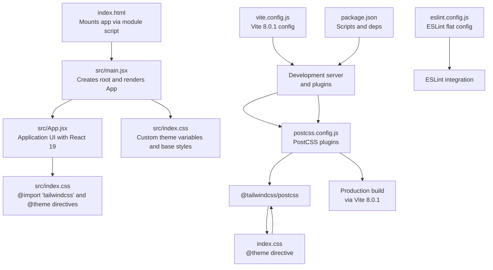
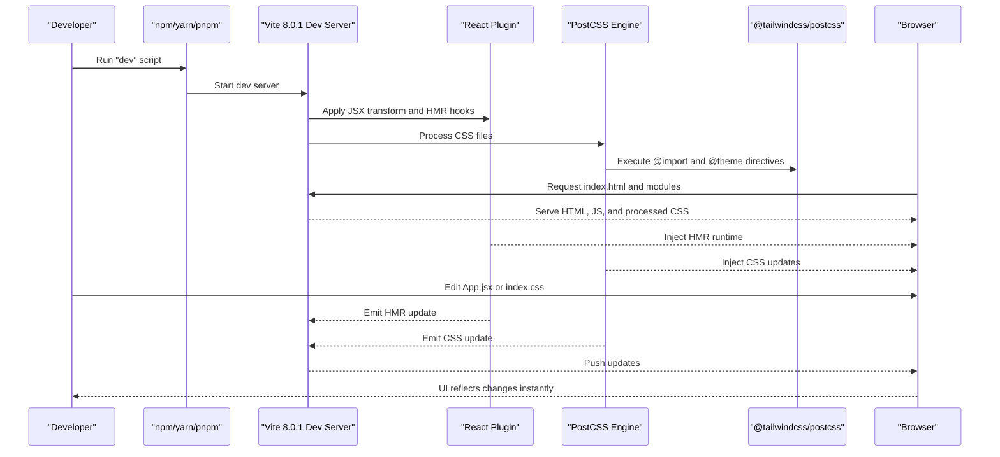
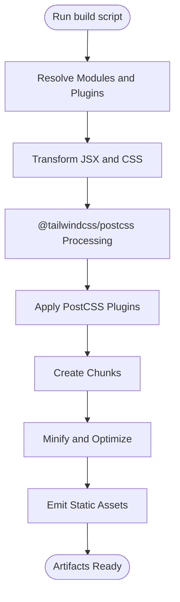
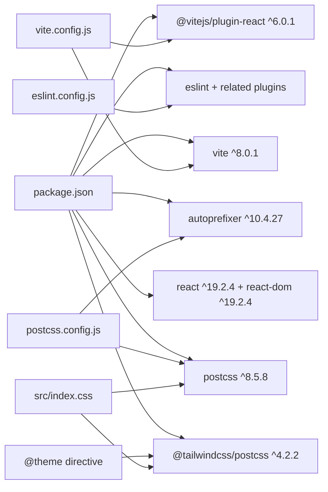

# Build and Development

<cite>
**Referenced Files in This Document**
- [vite.config.js](file://client/vite.config.js)
- [package.json](file://client/package.json)
- [eslint.config.js](file://client/eslint.config.js)
- [postcss.config.js](file://client/postcss.config.js)
- [index.html](file://client/index.html)
- [main.jsx](file://client/src/main.jsx)
- [App.jsx](file://client/src/App.jsx)
- [index.css](file://client/src/index.css)
- [README.md](file://client/README.md)
</cite>

## Update Summary
**Changes Made**
- Updated Vite configuration to reflect the current React 19 integration and modern build system setup
- Documented PostCSS configuration with @tailwindcss/postcss plugin integration
- Updated dependency analysis to show current versions: React 19.2.4, Vite 8.0.1, Tailwind CSS 4.2.2, PostCSS 8.5.8
- Enhanced build pipeline documentation to cover the CSS processing workflow with @theme directive
- Added comprehensive Tailwind CSS configuration documentation using @theme directive for custom color palette
- Updated development workflow to reflect modern React 19 features and HMR capabilities
- Documented the complete dependency tree including all build tools and their roles

## Table of Contents
1. [Introduction](#introduction)
2. [Project Structure](#project-structure)
3. [Core Components](#core-components)
4. [Architecture Overview](#architecture-overview)
5. [Detailed Component Analysis](#detailed-component-analysis)
6. [Dependency Analysis](#dependency-analysis)
7. [Performance Considerations](#performance-considerations)
8. [Troubleshooting Guide](#troubleshooting-guide)
9. [Conclusion](#conclusion)
10. [Appendices](#appendices)

## Introduction
This document explains the build and development setup for the Flavora client project. The project features a modern build pipeline powered by Vite 8.0.1, React 19.2.4, PostCSS 8.5.8, and Tailwind CSS 4.2.2 with the @tailwindcss/postcss plugin. It covers the complete CSS processing workflow, development server features (including Hot Module Replacement), production build characteristics, ESLint integration, available npm scripts, performance strategies, troubleshooting tips, and environment-specific guidance for different deployment targets.

## Project Structure
The project is a modern React 19 + Vite application with a sophisticated CSS processing pipeline. The entry point is an HTML file that mounts a React root rendering an App component. Styles are processed through Tailwind CSS via the @tailwindcss/postcss plugin and PostCSS, with automatic vendor prefixing and CSS optimization.



**Diagram sources**
- [index.html:1-14](file://client/index.html#L1-L14)
- [main.jsx:1-11](file://client/src/main.jsx#L1-L11)
- [App.jsx:1-94](file://client/src/App.jsx#L1-L94)
- [index.css:1-66](file://client/src/index.css#L1-L66)
- [vite.config.js:1-8](file://client/vite.config.js#L1-L8)
- [package.json:1-35](file://client/package.json#L1-L35)
- [eslint.config.js:1-30](file://client/eslint.config.js#L1-L30)
- [postcss.config.js:1-7](file://client/postcss.config.js#L1-L7)

**Section sources**
- [index.html:1-14](file://client/index.html#L1-L14)
- [main.jsx:1-11](file://client/src/main.jsx#L1-L11)
- [App.jsx:1-94](file://client/src/App.jsx#L1-L94)
- [index.css:1-66](file://client/src/index.css#L1-L66)
- [vite.config.js:1-8](file://client/vite.config.js#L1-L8)
- [package.json:1-35](file://client/package.json#L1-L35)
- [eslint.config.js:1-30](file://client/eslint.config.js#L1-L30)
- [postcss.config.js:1-7](file://client/postcss.config.js#L1-L7)

## Core Components
- **Vite 8.0.1 configuration**: Minimal setup enabling the React plugin for JSX transforms and HMR with modern React 19 support.
- **PostCSS pipeline**: Automatic CSS processing with @tailwindcss/postcss plugin and Autoprefixer.
- **Tailwind CSS 4.2.2**: Utility-first CSS framework with custom theme configuration using @theme directive and animations.
- **React 19**: Latest React version with concurrent features and improved performance.
- **Scripts**: Standard Vite commands for development, building, previewing, and linting.
- **ESLint configuration**: Flat config extending recommended rules for JS/JSX, React Hooks, and React Refresh for Vite.
- **Application entry**: Single-page HTML mounting a React 19 root that renders the App component.

Key responsibilities:
- Vite 8.0.1 handles dev server, HMR, and bundling with CSS processing.
- PostCSS processes Tailwind directives and applies vendor prefixes.
- @tailwindcss/postcss generates utility classes from the custom configuration.
- ESLint enforces code quality during development.
- Scripts provide repeatable workflows for local and CI environments.

**Section sources**
- [vite.config.js:1-8](file://client/vite.config.js#L1-L8)
- [package.json:6-11](file://client/package.json#L6-L11)
- [eslint.config.js:1-30](file://client/eslint.config.js#L1-L30)
- [index.html:9-12](file://client/index.html#L9-L12)
- [postcss.config.js:1-7](file://client/postcss.config.js#L1-L7)
- [index.css:1-14](file://client/src/index.css#L1-L14)

## Architecture Overview
The build pipeline is driven by Vite 8.0.1 with an integrated PostCSS/@tailwindcss/postcss processing chain. During development, Vite serves files, applies the React plugin for JSX transforms, enables HMR, and processes CSS through PostCSS with Tailwind directives. Production builds are generated with default Vite optimizations and CSS minification. ESLint runs as a separate quality gate.

```mermaid
graph TB
subgraph "Local Development"
Dev["Vite 8.0.1 Dev Server"] --> HMR["HMR Engine"]
HMR --> Live["Live UI Updates"]
end
subgraph "CSS Processing Pipeline"
PostCSS["PostCSS Engine"] --> Tailwind["@tailwindcss/postcss"]
Tailwind --> Autoprefixer["Autoprefixer"]
Autoprefixer --> CSSOutput["Processed CSS"]
end
subgraph "Build"
Vite["Vite 8.0.1 CLI"] --> Bundle["Bundle Assets"]
Bundle --> Optimize["Optimize Outputs"]
Optimize --> CSSMinify["Minify CSS"]
end
subgraph "Quality"
ESL["ESLint"] --> Lint["Lint Checks"]
end
subgraph "Project"
HTML["index.html"] --> Root["src/main.jsx"]
Root --> App["src/App.jsx"]
App --> CSS["src/index.css"]
CSS --> PostCSS
End
Dev --- Vite
CSSOutput --> Dev
Lint -. optional .- Dev
Root --> Dev
App --> Dev
CSS --> Dev
```

**Diagram sources**
- [vite.config.js:5-7](file://client/vite.config.js#L5-L7)
- [package.json:7-10](file://client/package.json#L7-L10)
- [eslint.config.js:7-29](file://client/eslint.config.js#L7-L29)
- [index.html:9-12](file://client/index.html#L9-L12)
- [main.jsx:6-10](file://client/src/main.jsx#L6-L10)
- [App.jsx:1-94](file://client/src/App.jsx#L1-L94)
- [postcss.config.js:1-7](file://client/postcss.config.js#L1-L7)
- [index.css:1-66](file://client/src/index.css#L1-L66)

## Detailed Component Analysis

### Vite Configuration
- **Plugin**: React plugin is enabled for JSX transformations and HMR with React 19 support.
- **Defaults**: No explicit build.rollupOptions, manualChunks, or outputDir configured, so Vite 8.0.1 uses built-in defaults.
- **CSS Integration**: Vite 8.0.1 automatically processes CSS files through the PostCSS pipeline configured in postcss.config.js.

Implications:
- Fast rebuilds typical of Vite 8.0.1's esbuild-based transform and HMR.
- Default output directory and asset handling apply.
- CSS files are automatically processed through @tailwindcss/postcss and PostCSS.

**Section sources**
- [vite.config.js:1-8](file://client/vite.config.js#L1-L8)

### PostCSS and Tailwind CSS Setup
- **PostCSS Configuration**: Defines @tailwindcss/postcss and Autoprefixer plugins for automatic CSS processing.
- **Tailwind Configuration**: Comprehensive setup using @theme directive with custom color palette, animations, and dark mode support.
- **CSS Directives**: @import "tailwindcss" in index.css triggers the framework's processing.
- **Theme System**: Custom color palette defined using CSS variables with 50-900 shades of orange.

Key features:
- **Custom Primary Color Palette**: Orange-based color scheme with 50-900 shades using CSS variables.
- **Dark Mode**: Class-based dark mode support with automatic CSS variable switching.
- **Utility-First Approach**: Rapid styling with pre-built Tailwind utilities.
- **Modern CSS Features**: Uses @theme directive for advanced theme customization.

**Section sources**
- [postcss.config.js:1-7](file://client/postcss.config.js#L1-L7)
- [index.css:1-14](file://client/src/index.css#L1-L14)

### Development Workflow and HMR
- **Dev server**: Launched via the dev script, serving the HTML entry and resolving module imports.
- **HMR**: Enabled by default with the React plugin; editing components updates the UI without full reloads.
- **CSS Hot Reload**: Changes to CSS files trigger partial CSS updates without full page refresh.
- **Fast rebuilds**: Incremental updates propagate quickly due to Vite 8.0.1's native ES module pipeline and efficient CSS processing.
- **React 19 Features**: Leverages latest React concurrent features and improved performance.



**Diagram sources**
- [package.json:7](file://client/package.json#L7)
- [vite.config.js:6](file://client/vite.config.js#L6)
- [main.jsx:6-10](file://client/src/main.jsx#L6-L10)
- [App.jsx:1-94](file://client/src/App.jsx#L1-L94)
- [postcss.config.js:1-7](file://client/postcss.config.js#L1-L7)
- [index.css:1-66](file://client/src/index.css#L1-L66)

**Section sources**
- [package.json:7](file://client/package.json#L7)
- [vite.config.js:6](file://client/vite.config.js#L6)
- [README.md:3-8](file://client/README.md#L3-L8)

### Production Build Process
- **Build command**: Generates optimized static assets under the default output directory.
- **Asset optimization**: Vite 8.0.1 performs minification and asset handling by default.
- **CSS optimization**: @tailwindcss/postcss processes and optimizes CSS output.
- **Code splitting**: Vite 8.0.1's default Rollup-based bundling may split chunks depending on dynamic imports and module boundaries.
- **Bundle analysis**: Not configured by default; can be added via optional third-party analyzers if needed.



**Diagram sources**
- [package.json:8](file://client/package.json#L8)
- [vite.config.js:6](file://client/vite.config.js#L6)
- [postcss.config.js:1-7](file://client/postcss.config.js#L1-L7)
- [index.css:1-66](file://client/src/index.css#L1-L66)

**Section sources**
- [package.json:8](file://client/package.json#L8)
- [vite.config.js:6](file://client/vite.config.js#L6)

### ESLint Configuration and Code Quality
- **Flat config**: Uses ESLint flat config with recommended rules for JS/JSX, React Hooks, and React Refresh tailored for Vite.
- **Language options**: ECMAScript 2020 with JSX support and browser globals.
- **Rules**: Includes a rule to ignore specific unused variable naming patterns.
- **Integration**: Run linting via the lint script to catch issues early in the development cycle.

Integration:
- Run linting via the lint script to catch issues early.
- Recommended for CI pipelines to enforce consistent code quality.
- Works seamlessly with the Tailwind CSS class naming conventions.

**Section sources**
- [eslint.config.js:1-30](file://client/eslint.config.js#L1-L30)
- [package.json:9](file://client/package.json#L9)

### Script Commands
- **dev**: Starts the Vite 8.0.1 dev server with HMR and CSS processing pipeline.
- **build**: Produces an optimized production build with @tailwindcss/postcss processing.
- **preview**: Serves the production build locally for testing with all optimizations active.
- **lint**: Runs ESLint across the project including CSS files processed through Tailwind.

Usage:
- Use dev for local iteration with live CSS updates.
- Use build for generating deployable assets with optimized CSS.
- Use preview to validate production-like behavior with all optimizations.
- Use lint to maintain code quality across JavaScript and CSS.

**Section sources**
- [package.json:6-11](file://client/package.json#L6-L11)

### Environment-Specific Configurations
- **No separate environment files**: The repository snapshot doesn't include environment-specific configuration files.
- **Typical approach**: Multi-environment setups typically include:
  - Environment variables loaded via Vite's import.meta.env.
  - Separate .env.* files for different targets (development, staging, production).
  - Conditional logic in configuration or code based on mode.
- **Tailwind CSS**: Dark mode support can be controlled via class manipulation or meta tag configuration.

### Deployment Preparation
- **Build artifacts**: Generated by the build script with optimized CSS and JavaScript assets.
- **Preview**: Use the preview script to simulate production behavior locally before deploying.
- **Asset paths**: Default relative paths work for most static hosting scenarios; adjust base path if hosting under a subpath.
- **CSS Optimization**: @tailwindcss/postcss processes CSS output for optimal bundle size.

**Section sources**
- [package.json:8-10](file://client/package.json#L8-L10)

## Dependency Analysis
The project has a comprehensive dependency graph centered around Vite 8.0.1, React 19, PostCSS, @tailwindcss/postcss, and ESLint tooling.



**Diagram sources**
- [package.json:12-33](file://client/package.json#L12-L33)
- [vite.config.js:2](file://client/vite.config.js#L2)
- [eslint.config.js:1-5](file://client/eslint.config.js#L1-L5)
- [postcss.config.js:1-7](file://client/postcss.config.js#L1-L7)
- [index.css:1-66](file://client/src/index.css#L1-L66)

**Section sources**
- [package.json:12-33](file://client/package.json#L12-L33)
- [vite.config.js:2](file://client/vite.config.js#L2)
- [eslint.config.js:1-5](file://client/eslint.config.js#L1-L5)
- [postcss.config.js:1-7](file://client/postcss.config.js#L1-L7)
- [index.css:1-66](file://client/src/index.css#L1-L66)

## Performance Considerations
- **Keep the React Compiler disabled**: Per the template guidance to preserve dev/build performance.
- **Tailwind CSS optimization**: The @tailwindcss/postcss plugin processes CSS efficiently in production builds.
- **PostCSS efficiency**: Minimal plugin overhead with @tailwindcss/postcss and Autoprefixer providing essential CSS processing.
- **Prefer lazy loading**: For large routes or heavy components to leverage Vite 8.0.1's code splitting.
- **CSS custom properties**: Using CSS variables reduces style recalculation and improves rendering performance.
- **Minimize unnecessary re-renders**: Avoid heavy computations in render paths.
- **Monitor asset sizes**: Remove unused dependencies to reduce bundle weight.
- **Use the preview script**: Validate performance in a production-like environment with all optimizations active.

**Section sources**
- [README.md:10-12](file://client/README.md#L10-L12)
- [index.css:1-66](file://client/src/index.css#L1-L66)

## Troubleshooting Guide
Common issues and remedies:
- **HMR not updating**: Verify the dev server is running and that edits occur in recognized files. Restart the dev server if stale behavior persists.
- **Missing icons or assets**: Confirm asset paths resolve correctly; Vite resolves imports at build-time. Use absolute paths from public or import assets properly.
- **Tailwind classes not working**: Ensure @import "tailwindcss" is present in index.css and the @theme directive is properly configured.
- **CSS not processing**: Verify PostCSS configuration has @tailwindcss/postcss and Autoprefixer plugins enabled.
- **Lint errors**: Run the lint script to identify issues; fix according to ESLint rule messages.
- **Unexpected build output**: Review Vite 8.0.1 defaults and consider adding explicit build.rollupOptions if custom chunking or output dir is required.
- **Dark mode issues**: Check that the dark mode class is properly applied and CSS variables are correctly defined.

**Section sources**
- [package.json:7-10](file://client/package.json#L7-L10)
- [eslint.config.js:25-27](file://client/eslint.config.js#L25-L27)
- [postcss.config.js:1-7](file://client/postcss.config.js#L1-L7)
- [index.css:1-66](file://client/src/index.css#L1-L66)

## Conclusion
Flavora's client uses a modern build setup powered by Vite 8.0.1, React 19.2.4, PostCSS 8.5.8, and @tailwindcss/postcss. The configuration emphasizes developer productivity with HMR, fast rebuilds, and seamless CSS processing. The PostCSS pipeline automatically processes Tailwind directives, applies vendor prefixes, and optimizes CSS output. ESLint ensures code quality throughout the development lifecycle. Production builds leverage @tailwindcss/postcss processing for minimal bundle sizes. The provided scripts enable straightforward development, preview, and linting workflows. For advanced needs, consider adding environment-specific files and optional analyzers.

## Appendices

### Appendix A: Development Best Practices
- **Keep dependencies lean**: Maintain the current minimal dependency set for optimal performance.
- **Use strict mode**: Leverage React's StrictMode for improved error detection.
- **Component composition**: Improve maintainability through proper component architecture.
- **CSS custom properties**: Utilize the established CSS variable system for consistent theming.
- **Tailwind utilities**: Follow utility-first approach for rapid development while maintaining consistency.
- **Media queries**: Use responsive design patterns established in the existing CSS.
- **Add logging and error boundaries**: Implement robust UI behavior monitoring.

**Section sources**
- [index.css:1-66](file://client/src/index.css#L1-L66)
- [App.jsx:1-94](file://client/src/App.jsx#L1-L94)

### Appendix B: Debugging Techniques
- **Inspect browser console**: Monitor HMR and runtime errors during development.
- **Check CSS processing**: Verify @import "tailwindcss" and @theme directives are being processed correctly.
- **Temporarily disable plugins**: In Vite config to isolate issues in the build pipeline.
- **Use React DevTools**: Inspect component trees and props effectively.
- **Validate asset loading**: Check network requests in the browser for proper CSS and asset loading.
- **Monitor PostCSS output**: Ensure CSS files are being processed through the PostCSS pipeline.

**Section sources**
- [vite.config.js:6](file://client/vite.config.js#L6)
- [main.jsx:6-10](file://client/src/main.jsx#L6-L10)
- [postcss.config.js:1-7](file://client/postcss.config.js#L1-L7)
- [index.css:1-66](file://client/src/index.css#L1-L66)

### Appendix C: Tailwind CSS Customization Guide
- **Color palette**: The custom orange-based primary color system with 50-900 shades using CSS variables.
- **Theme system**: Built-in @theme directive for advanced theme customization.
- **Dark mode**: Class-based dark mode support with automatic CSS variable switching.
- **Extending themes**: Add new colors, spacing, typography, and component variants as needed.
- **Content configuration**: Ensure file patterns match your project structure for optimal purging.

**Section sources**
- [index.css:3-14](file://client/src/index.css#L3-L14)
- [index.css:1-66](file://client/src/index.css#L1-L66)