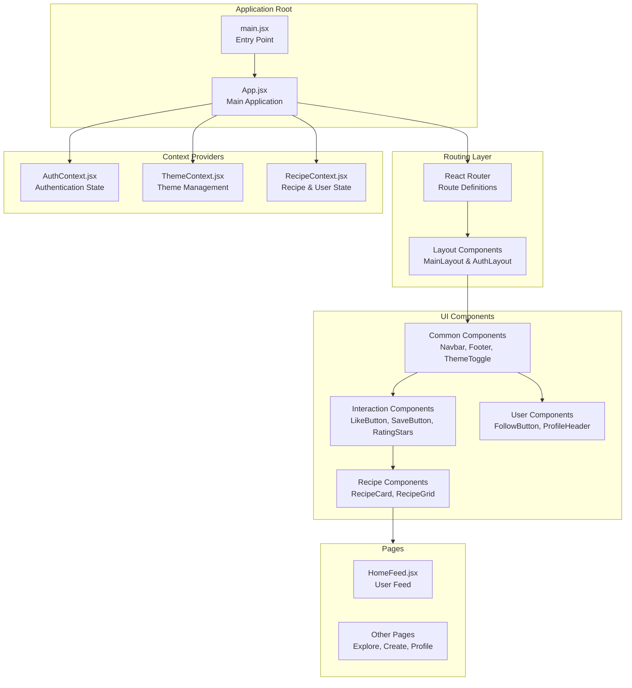
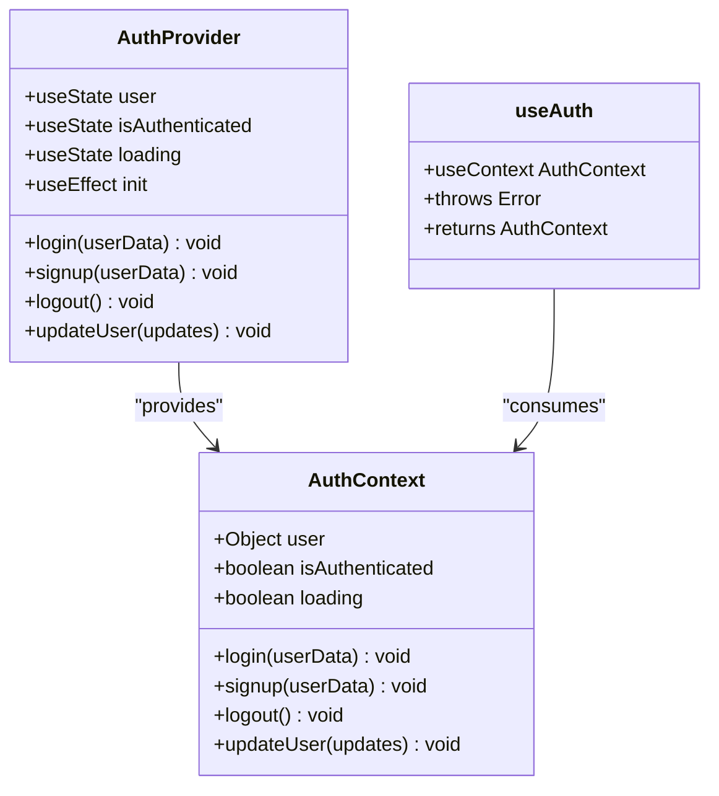
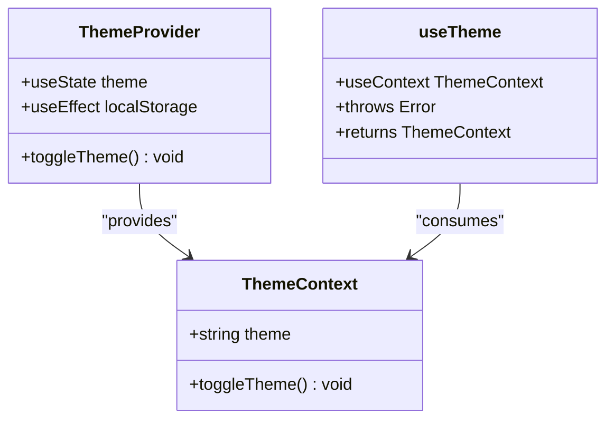
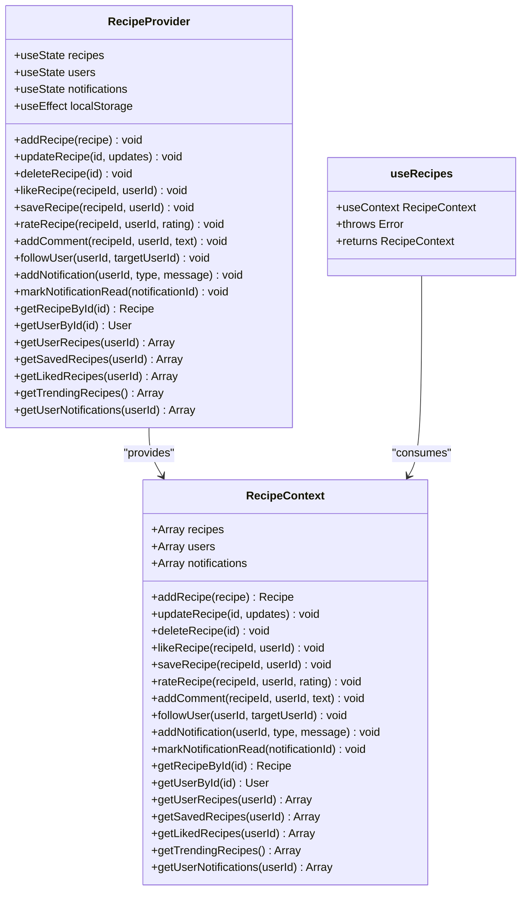
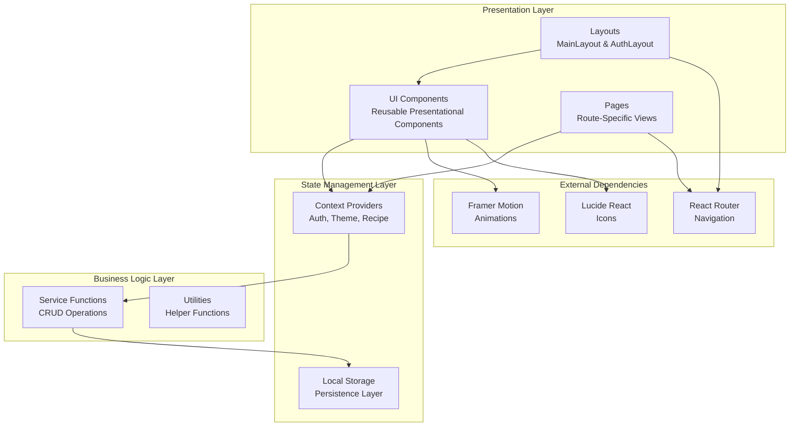
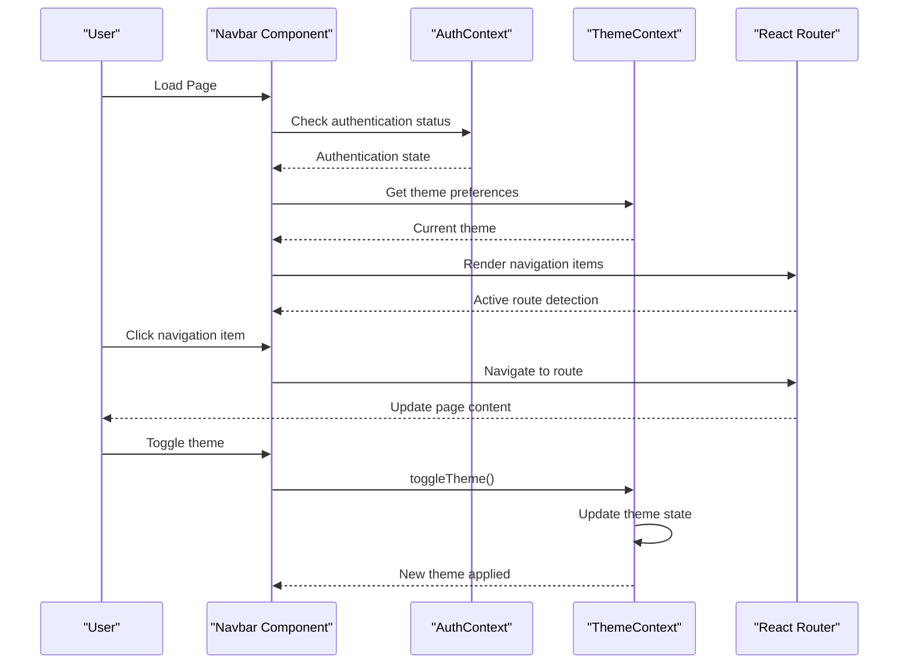
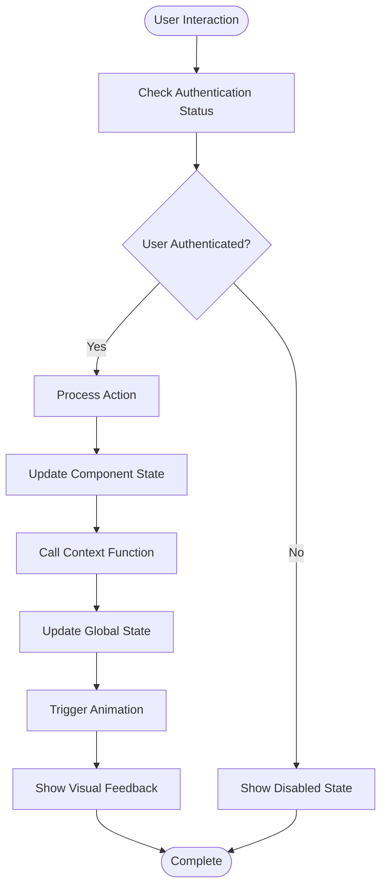
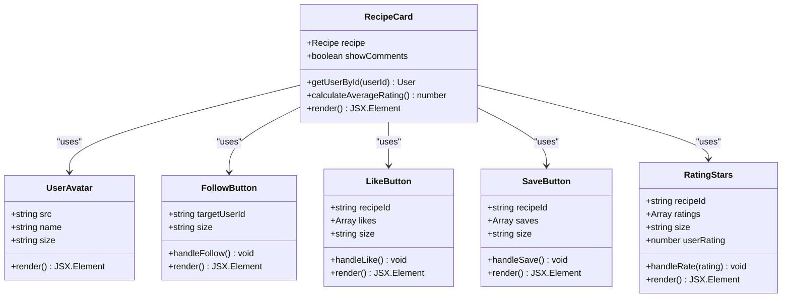
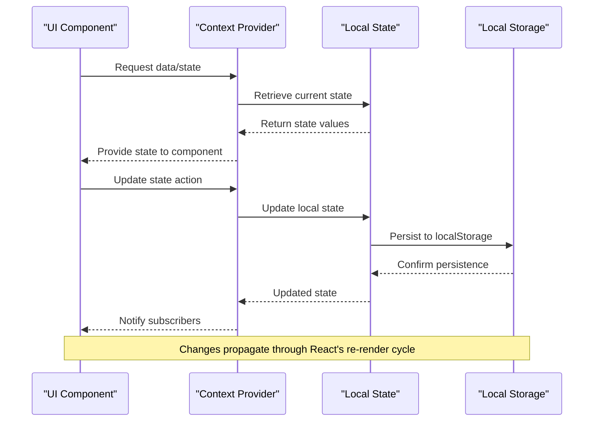
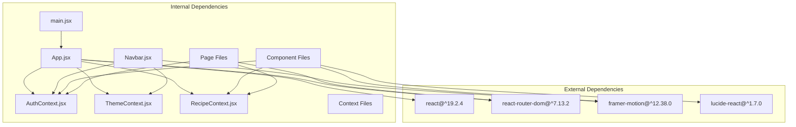

# Component System Architecture

<cite>
**Referenced Files in This Document**
- [App.jsx](file://client/src/App.jsx)
- [main.jsx](file://client/src/main.jsx)
- [package.json](file://client/package.json)
- [AuthContext.jsx](file://client/src/context/AuthContext.jsx)
- [ThemeContext.jsx](file://client/src/context/ThemeContext.jsx)
- [RecipeContext.jsx](file://client/src/context/RecipeContext.jsx)
- [Navbar.jsx](file://client/src/components/common/Navbar.jsx)
- [Footer.jsx](file://client/src/components/common/Footer.jsx)
- [ProtectedRoute.jsx](file://client/src/components/common/ProtectedRoute.jsx)
- [ThemeToggle.jsx](file://client/src/components/common/ThemeToggle.jsx)
- [LikeButton.jsx](file://client/src/components/interactions/LikeButton.jsx)
- [SaveButton.jsx](file://client/src/components/interactions/SaveButton.jsx)
- [RatingStars.jsx](file://client/src/components/interactions/RatingStars.jsx)
- [FollowButton.jsx](file://client/src/components/user/FollowButton.jsx)
- [RecipeCard.jsx](file://client/src/components/recipe/RecipeCard.jsx)
- [HomeFeed.jsx](file://client/src/pages/HomeFeed.jsx)
- [mockData.js](file://client/src/data/mockData.js)
</cite>

## Table of Contents
1. [Introduction](#introduction)
2. [Project Structure](#project-structure)
3. [Core Components](#core-components)
4. [Architecture Overview](#architecture-overview)
5. [Detailed Component Analysis](#detailed-component-analysis)
6. [Dependency Analysis](#dependency-analysis)
7. [Performance Considerations](#performance-considerations)
8. [Troubleshooting Guide](#troubleshooting-guide)
9. [Conclusion](#conclusion)

## Introduction
This document provides a comprehensive analysis of the Flavora client-side component system architecture. The application follows a modern React pattern with a focus on reusable components, centralized state management through React Context, and a clean separation of concerns across feature-based directories. The system emphasizes user experience through smooth animations, responsive design, and intuitive interactions.

## Project Structure
The project follows a feature-based organization that promotes modularity and maintainability. The structure separates concerns into distinct directories for components, pages, contexts, and shared utilities.

**Diagram sources**
- [main.jsx:1-11](file://client/src/main.jsx#L1-L11)
- [App.jsx:44-91](file://client/src/App.jsx#L44-L91)

**Section sources**
- [main.jsx:1-11](file://client/src/main.jsx#L1-L11)
- [App.jsx:1-94](file://client/src/App.jsx#L1-L94)

## Core Components
The component system is built around three primary context providers that manage global state and coordinate interactions across the application.

### Authentication Context
The AuthContext manages user authentication state with persistence support and comprehensive user lifecycle management.

**Diagram sources**
- [AuthContext.jsx:5-72](file://client/src/context/AuthContext.jsx#L5-L72)

### Theme Context
The ThemeContext handles theme switching with system preference detection and persistent storage.

**Diagram sources**
- [ThemeContext.jsx:5-43](file://client/src/context/ThemeContext.jsx#L5-L43)

### Recipe Context
The RecipeContext serves as the central state manager for recipes, users, and notifications with comprehensive CRUD operations.

**Diagram sources**
- [RecipeContext.jsx:6-194](file://client/src/context/RecipeContext.jsx#L6-L194)

**Section sources**
- [AuthContext.jsx:1-72](file://client/src/context/AuthContext.jsx#L1-L72)
- [ThemeContext.jsx:1-43](file://client/src/context/ThemeContext.jsx#L1-L43)
- [RecipeContext.jsx:1-194](file://client/src/context/RecipeContext.jsx#L1-L194)

## Architecture Overview
The application employs a hierarchical architecture with clear separation between presentation, state management, and business logic layers.

**Diagram sources**
- [App.jsx:44-91](file://client/src/App.jsx#L44-L91)
- [Navbar.jsx:20-206](file://client/src/components/common/Navbar.jsx#L20-L206)
- [HomeFeed.jsx:8-96](file://client/src/pages/HomeFeed.jsx#L8-L96)

## Detailed Component Analysis

### Navigation System
The navigation system provides a cohesive user interface with responsive design and theme integration.

**Diagram sources**
- [Navbar.jsx:20-206](file://client/src/components/common/Navbar.jsx#L20-L206)
- [ThemeToggle.jsx:5-30](file://client/src/components/common/ThemeToggle.jsx#L5-L30)
- [ProtectedRoute.jsx:4-21](file://client/src/components/common/ProtectedRoute.jsx#L4-L21)

### Interactive Components
The interaction components demonstrate consistent patterns for user engagement with proper state management and feedback mechanisms.

**Diagram sources**
- [LikeButton.jsx:21-40](file://client/src/components/interactions/LikeButton.jsx#L21-L40)
- [SaveButton.jsx:20-26](file://client/src/components/interactions/SaveButton.jsx#L20-L26)
- [RatingStars.jsx:26-29](file://client/src/components/interactions/RatingStars.jsx#L26-L29)

### Recipe Display System
The recipe display system showcases a sophisticated card component with integrated user interactions and responsive design.

**Diagram sources**
- [RecipeCard.jsx:11-125](file://client/src/components/recipe/RecipeCard.jsx#L11-L125)
- [LikeButton.jsx:7-73](file://client/src/components/interactions/LikeButton.jsx#L7-L73)
- [SaveButton.jsx:7-53](file://client/src/components/interactions/SaveButton.jsx#L7-L53)
- [RatingStars.jsx:7-68](file://client/src/components/interactions/RatingStars.jsx#L7-L68)

**Section sources**
- [Navbar.jsx:1-206](file://client/src/components/common/Navbar.jsx#L1-L206)
- [LikeButton.jsx:1-73](file://client/src/components/interactions/LikeButton.jsx#L1-L73)
- [SaveButton.jsx:1-53](file://client/src/components/interactions/SaveButton.jsx#L1-L53)
- [RatingStars.jsx:1-68](file://client/src/components/interactions/RatingStars.jsx#L1-L68)
- [RecipeCard.jsx:1-125](file://client/src/components/recipe/RecipeCard.jsx#L1-L125)

### State Management Flow
The state management system demonstrates a unidirectional data flow with proper context propagation and local storage synchronization.

**Diagram sources**
- [RecipeContext.jsx:22-32](file://client/src/context/RecipeContext.jsx#L22-L32)
- [AuthContext.jsx:10-17](file://client/src/context/AuthContext.jsx#L10-L17)
- [ThemeContext.jsx:15-23](file://client/src/context/ThemeContext.jsx#L15-L23)

**Section sources**
- [RecipeContext.jsx:1-194](file://client/src/context/RecipeContext.jsx#L1-L194)
- [AuthContext.jsx:1-72](file://client/src/context/AuthContext.jsx#L1-L72)
- [ThemeContext.jsx:1-43](file://client/src/context/ThemeContext.jsx#L1-L43)

## Dependency Analysis
The application maintains clean dependency relationships with clear boundaries between modules and consistent external library usage.

**Diagram sources**
- [package.json:12-18](file://client/package.json#L12-L18)
- [App.jsx:1-9](file://client/src/App.jsx#L1-L9)

**Section sources**
- [package.json:1-35](file://client/package.json#L1-L35)
- [App.jsx:1-94](file://client/src/App.jsx#L1-L94)

## Performance Considerations
The component system incorporates several performance optimization strategies:

- **Lazy Loading**: Route-based code splitting through React Router
- **Component Memoization**: Strategic use of React.memo for expensive components
- **State Optimization**: Context splitting to minimize unnecessary re-renders
- **Animation Performance**: Framer Motion optimized animations with proper cleanup
- **Image Optimization**: Responsive images with appropriate sizing
- **Event Delegation**: Efficient event handling in interactive components

## Troubleshooting Guide
Common issues and their solutions:

### Authentication Issues
- **Problem**: Authentication state not persisting across refresh
- **Solution**: Verify localStorage availability and check AuthContext initialization
- **Debug**: Inspect localStorage keys and browser storage permissions

### Theme Switching Problems
- **Problem**: Theme not applying correctly on initial load
- **Solution**: Ensure ThemeContext properly detects system preference and applies CSS classes
- **Debug**: Check documentElement classList and localStorage theme value

### Context Provider Errors
- **Problem**: "Context must be used within a Provider" errors
- **Solution**: Verify all components are wrapped in appropriate context providers
- **Debug**: Check provider hierarchy in App.jsx

### Performance Issues
- **Problem**: Slow component rendering
- **Solution**: Implement React.memo for static components and optimize heavy computations
- **Debug**: Use React DevTools Profiler to identify bottlenecks

**Section sources**
- [ProtectedRoute.jsx:65-71](file://client/src/components/common/ProtectedRoute.jsx#L65-L71)
- [ThemeContext.jsx:36-42](file://client/src/context/ThemeContext.jsx#L36-L42)
- [AuthContext.jsx:65-71](file://client/src/context/AuthContext.jsx#L65-L71)

## Conclusion
The Flavora component system demonstrates a well-architected React application with clear separation of concerns, robust state management, and consistent design patterns. The modular structure facilitates maintainability and scalability, while the context-based architecture ensures efficient data flow throughout the application. The implementation of reusable components, comprehensive interaction patterns, and thoughtful performance optimizations creates a solid foundation for continued development and feature expansion.