# Component System Architecture

<cite>
**Referenced Files in This Document**
- [App.jsx](file://client/src/App.jsx)
- [main.jsx](file://client/src/main.jsx)
- [package.json](file://client/package.json)
- [AuthContext.jsx](file://client/src/context/AuthContext.jsx)
- [ThemeContext.jsx](file://client/src/context/ThemeContext.jsx)
- [RecipeContext.jsx](file://client/src/context/RecipeContext.jsx)
- [Navbar.jsx](file://client/src/components/common/Navbar.jsx)
- [Footer.jsx](file://client/src/components/common/Footer.jsx)
- [ProtectedRoute.jsx](file://client/src/components/common/ProtectedRoute.jsx)
- [ThemeToggle.jsx](file://client/src/components/common/ThemeToggle.jsx)
- [LikeButton.jsx](file://client/src/components/interactions/LikeButton.jsx)
- [SaveButton.jsx](file://client/src/components/interactions/SaveButton.jsx)
- [RatingStars.jsx](file://client/src/components/interactions/RatingStars.jsx)
- [CommentSection.jsx](file://client/src/components/interactions/CommentSection.jsx)
- [FollowButton.jsx](file://client/src/components/user/FollowButton.jsx)
- [ProfileHeader.jsx](file://client/src/components/user/ProfileHeader.jsx)
- [UserAvatar.jsx](file://client/src/components/user/UserAvatar.jsx)
- [RecipeCard.jsx](file://client/src/components/recipe/RecipeCard.jsx)
- [RecipeGrid.jsx](file://client/src/components/recipe/RecipeGrid.jsx)
- [CategoryFilter.jsx](file://client/src/components/search/CategoryFilter.jsx)
- [SearchBar.jsx](file://client/src/components/search/SearchBar.jsx)
- [HomeFeed.jsx](file://client/src/pages/HomeFeed.jsx)
- [mockData.js](file://client/src/data/mockData.js)
</cite>

## Update Summary
**Changes Made**
- Enhanced component system architecture with comprehensive component hierarchy across five distinct categories
- Added new component categories: common (Footer, ProtectedRoute, ThemeToggle), interactions (CommentSection, RatingStars, SaveButton), recipe (RecipeCard, RecipeGrid), search (CategoryFilter, SearchBar), and user (FollowButton, ProfileHeader, UserAvatar)
- Improved component composition patterns with consistent context integration and animation frameworks
- Expanded component documentation with detailed analysis of new interactive and utility components
- Updated architectural diagrams to reflect enhanced component organization and relationships

## Table of Contents
1. [Introduction](#introduction)
2. [Project Structure](#project-structure)
3. [Core Components](#core-components)
4. [Architecture Overview](#architecture-overview)
5. [Detailed Component Analysis](#detailed-component-analysis)
6. [Dependency Analysis](#dependency-analysis)
7. [Performance Considerations](#performance-considerations)
8. [Troubleshooting Guide](#troubleshooting-guide)
9. [Conclusion](#conclusion)

## Introduction
This document provides a comprehensive analysis of the Flavora client-side component system architecture. The application follows a modern React pattern with a focus on reusable components, centralized state management through React Context, and a clean separation of concerns across feature-based directories. The system emphasizes user experience through smooth animations, responsive design, and intuitive interactions.

The component system has been significantly enhanced with a comprehensive component hierarchy organized into five distinct categories: common components for universal UI elements, interactions for user engagement features, recipe components for food-related displays, search components for discovery functionality, and user components for social features. This enhanced architecture provides better modularity, maintainability, and scalability for the growing application ecosystem.

## Project Structure
The project follows a feature-based organization that promotes modularity and maintainability. The structure separates concerns into distinct directories for components, pages, contexts, and shared utilities, creating a clear architectural hierarchy.

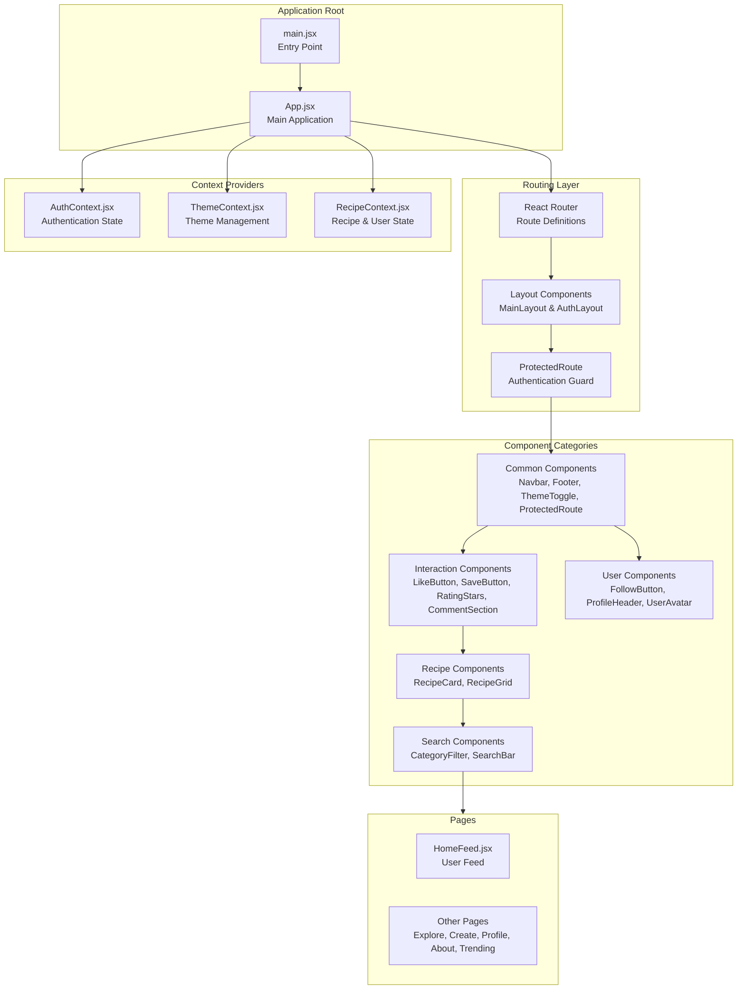

**Diagram sources**
- [main.jsx:1-11](file://client/src/main.jsx#L1-L11)
- [App.jsx:44-91](file://client/src/App.jsx#L44-L91)
- [ProtectedRoute.jsx:1-21](file://client/src/components/common/ProtectedRoute.jsx#L1-L21)

**Section sources**
- [main.jsx:1-11](file://client/src/main.jsx#L1-L11)
- [App.jsx:1-94](file://client/src/App.jsx#L1-L94)

## Core Components
The component system is built around three primary context providers that manage global state and coordinate interactions across the application. These context providers serve as the backbone of the component architecture, enabling seamless communication between components and maintaining consistent state management throughout the application.

### Authentication Context
The AuthContext manages user authentication state with persistence support and comprehensive user lifecycle management. It provides essential authentication functions including login, signup, logout, and user updates with automatic localStorage synchronization.

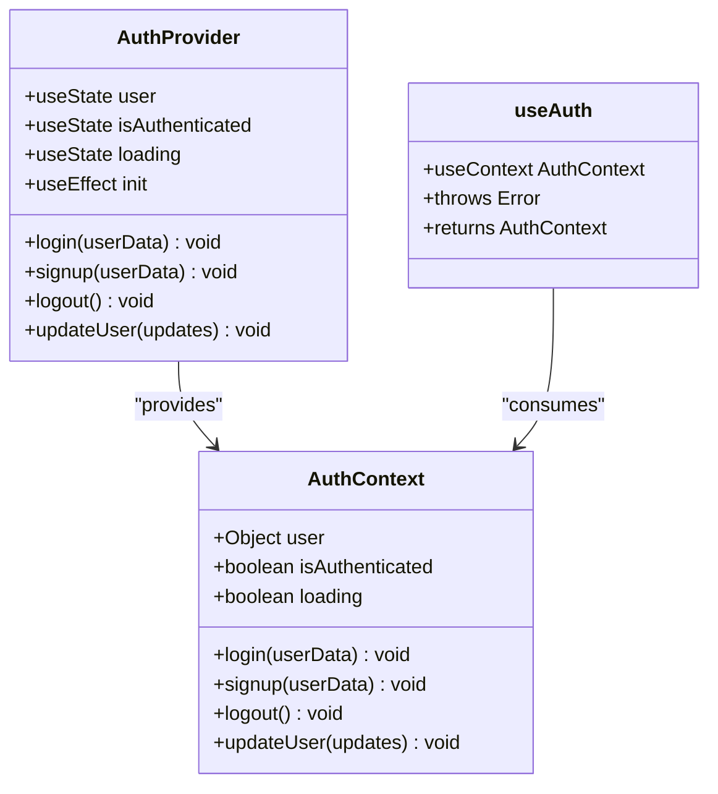

**Diagram sources**
- [AuthContext.jsx:5-72](file://client/src/context/AuthContext.jsx#L5-L72)

### Theme Context
The ThemeContext handles theme switching with system preference detection and persistent storage. It manages both light and dark theme modes with automatic CSS class application and localStorage persistence for user preference retention.

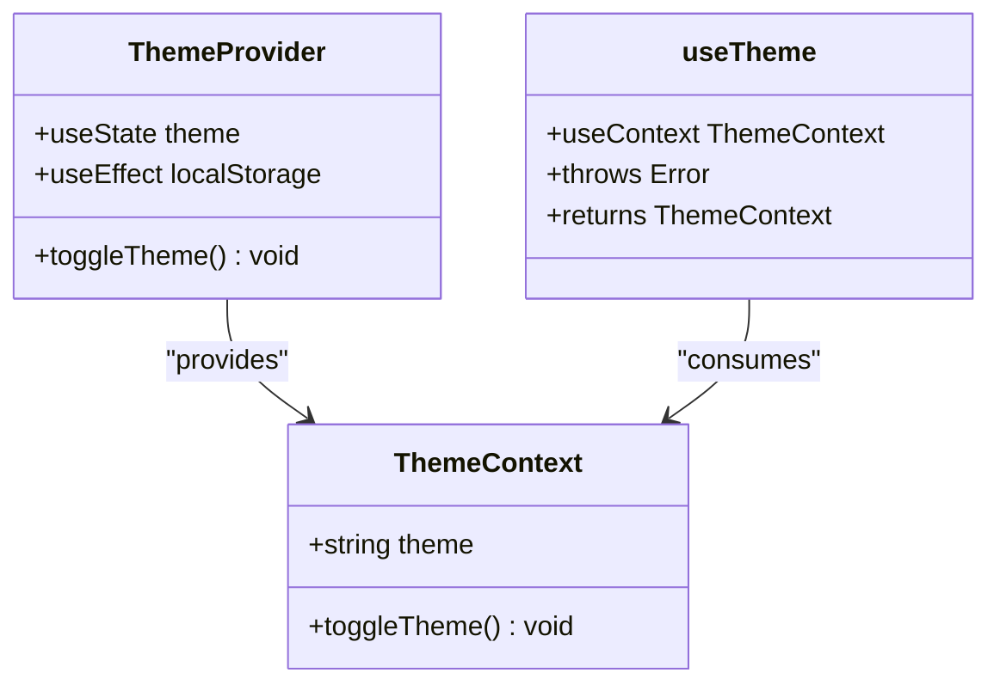

**Diagram sources**
- [ThemeContext.jsx:5-43](file://client/src/context/ThemeContext.jsx#L5-L43)

### Recipe Context
The RecipeContext serves as the central state manager for recipes, users, and notifications with comprehensive CRUD operations. It maintains three primary datasets: recipes with likes, comments, saves, and ratings; users with following/follower relationships; and notifications with read/unread status tracking.

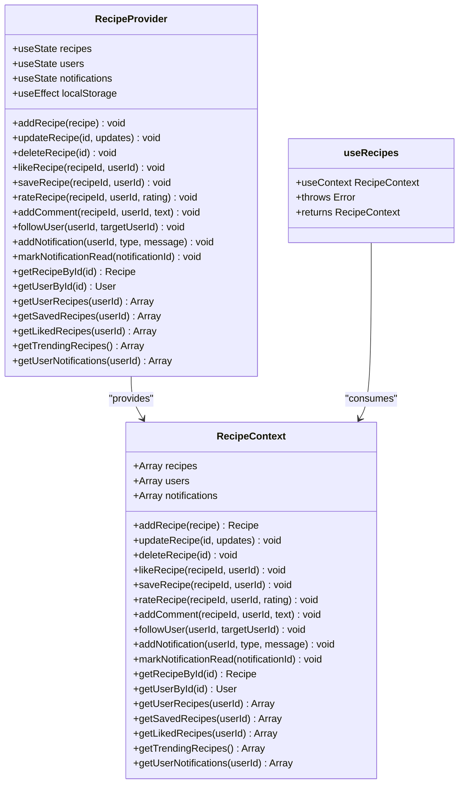

**Diagram sources**
- [RecipeContext.jsx:6-194](file://client/src/context/RecipeContext.jsx#L6-L194)

**Section sources**
- [AuthContext.jsx:1-72](file://client/src/context/AuthContext.jsx#L1-L72)
- [ThemeContext.jsx:1-43](file://client/src/context/ThemeContext.jsx#L1-L43)
- [RecipeContext.jsx:1-194](file://client/src/context/RecipeContext.jsx#L1-L194)

## Architecture Overview
The application employs a hierarchical architecture with clear separation between presentation, state management, and business logic layers. The enhanced component system now includes five distinct categories that work together to create a comprehensive user interface ecosystem.

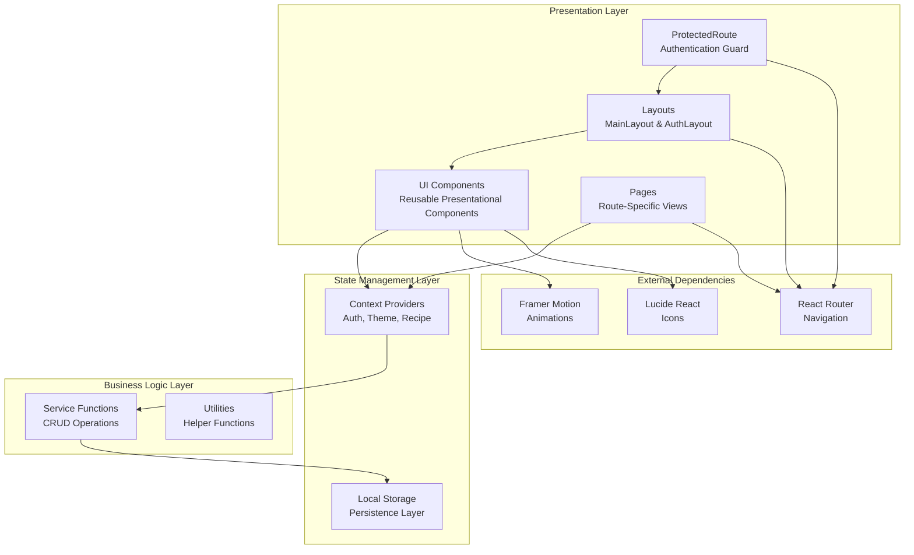

**Diagram sources**
- [App.jsx:44-91](file://client/src/App.jsx#L44-L91)
- [Navbar.jsx:20-206](file://client/src/components/common/Navbar.jsx#L20-L206)
- [HomeFeed.jsx:8-96](file://client/src/pages/HomeFeed.jsx#L8-L96)
- [ProtectedRoute.jsx:1-21](file://client/src/components/common/ProtectedRoute.jsx#L1-L21)

## Detailed Component Analysis

### Navigation System
The navigation system provides a cohesive user interface with responsive design and theme integration. The enhanced architecture now includes comprehensive navigation components including Footer for site-wide branding and information.

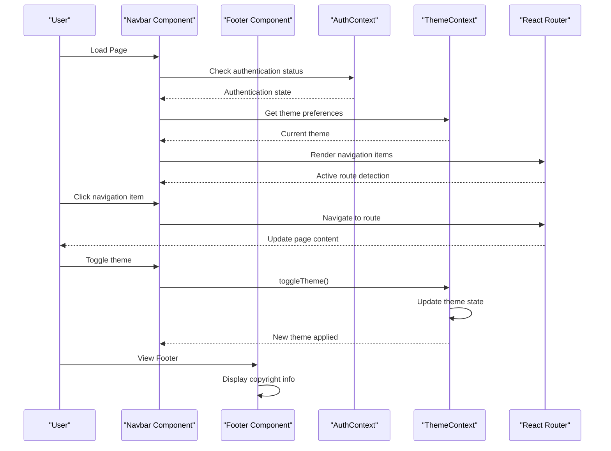

**Diagram sources**
- [Navbar.jsx:20-206](file://client/src/components/common/Navbar.jsx#L20-L206)
- [Footer.jsx:1-33](file://client/src/components/common/Footer.jsx#L1-L33)
- [ThemeToggle.jsx:5-30](file://client/src/components/common/ThemeToggle.jsx#L5-L30)
- [ProtectedRoute.jsx:4-21](file://client/src/components/common/ProtectedRoute.jsx#L4-L21)

### Authentication Protection System
The ProtectedRoute component provides authentication gating with loading states and redirect functionality. It ensures that protected routes are only accessible to authenticated users while providing appropriate loading indicators during authentication state resolution.

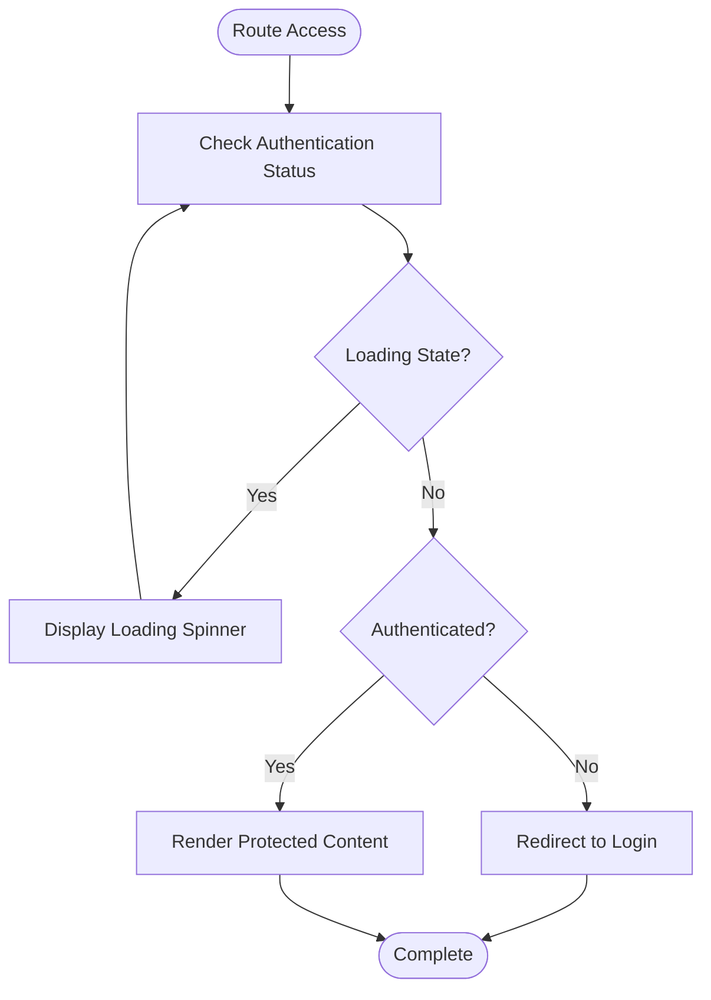

**Diagram sources**
- [ProtectedRoute.jsx:1-21](file://client/src/components/common/ProtectedRoute.jsx#L1-L21)

### Interactive Components
The interaction components demonstrate consistent patterns for user engagement with proper state management and feedback mechanisms. The enhanced system now includes CommentSection for rich comment management, RatingStars for collaborative rating systems, and SaveButton for recipe saving functionality.

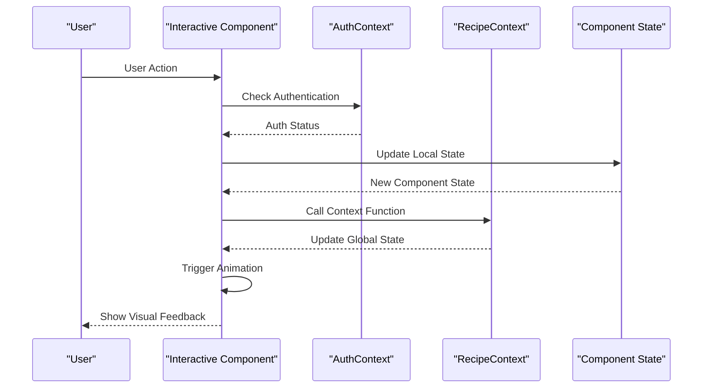

**Diagram sources**
- [LikeButton.jsx:21-40](file://client/src/components/interactions/LikeButton.jsx#L21-L40)
- [SaveButton.jsx:20-26](file://client/src/components/interactions/SaveButton.jsx#L20-L26)
- [RatingStars.jsx:26-29](file://client/src/components/interactions/RatingStars.jsx#L26-L29)
- [CommentSection.jsx:14-31](file://client/src/components/interactions/CommentSection.jsx#L14-L31)

### Comment System Architecture
The CommentSection component demonstrates sophisticated state management with conditional rendering and notification integration. It provides both compact and expanded view modes with smooth animations and real-time comment submission functionality.

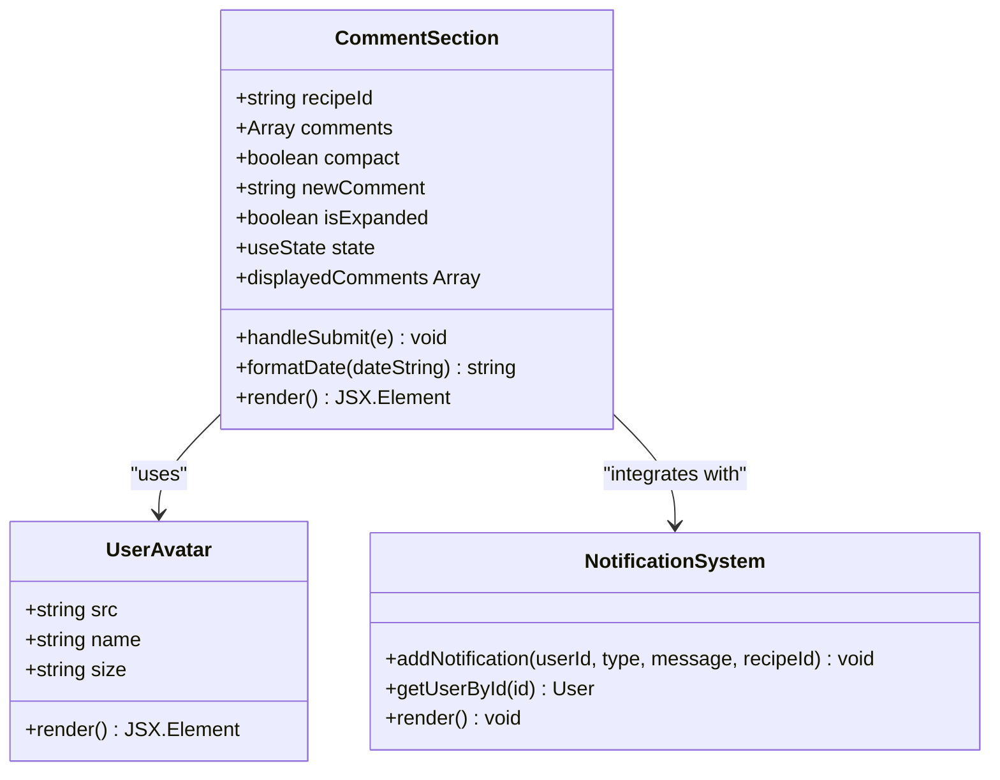

**Diagram sources**
- [CommentSection.jsx:1-140](file://client/src/components/interactions/CommentSection.jsx#L1-L140)
- [UserAvatar.jsx:1-44](file://client/src/components/user/UserAvatar.jsx#L1-L44)

### Recipe Display System
The recipe display system showcases a sophisticated card component with integrated user interactions and responsive design. The enhanced architecture includes comprehensive recipe card functionality with user avatars, follow buttons, like buttons, save buttons, rating stars, and comment sections.

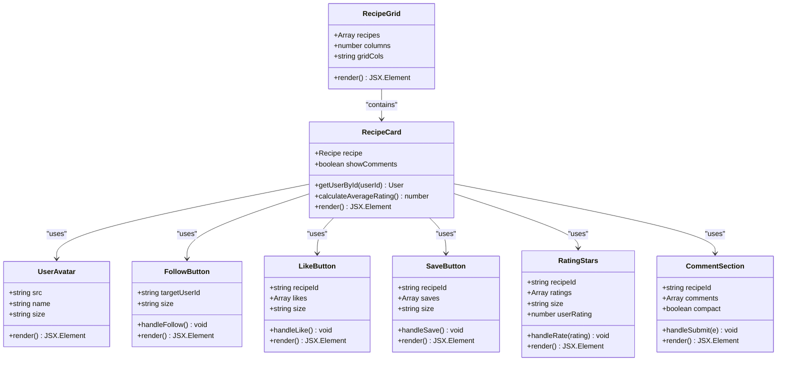

**Diagram sources**
- [RecipeCard.jsx:11-125](file://client/src/components/recipe/RecipeCard.jsx#L11-L125)
- [RecipeGrid.jsx:1-39](file://client/src/components/recipe/RecipeGrid.jsx#L1-L39)
- [LikeButton.jsx:7-73](file://client/src/components/interactions/LikeButton.jsx#L7-L73)
- [SaveButton.jsx:7-53](file://client/src/components/interactions/SaveButton.jsx#L7-L53)
- [RatingStars.jsx:7-68](file://client/src/components/interactions/RatingStars.jsx#L7-L68)
- [CommentSection.jsx:1-140](file://client/src/components/interactions/CommentSection.jsx#L1-L140)

### User Profile System
The profile system demonstrates comprehensive user information display with social interaction capabilities. The enhanced architecture includes ProfileHeader for user information display, UserAvatar for avatar rendering, and FollowButton for social interactions.

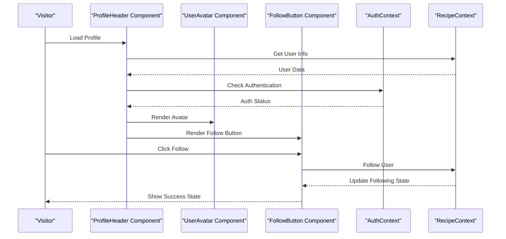

**Diagram sources**
- [ProfileHeader.jsx:1-87](file://client/src/components/user/ProfileHeader.jsx#L1-L87)
- [UserAvatar.jsx:1-44](file://client/src/components/user/UserAvatar.jsx#L1-L44)
- [FollowButton.jsx:1-64](file://client/src/components/user/FollowButton.jsx#L1-L64)

### Search and Filter System
The search and filter components provide comprehensive recipe discovery functionality. The enhanced architecture includes SearchBar for text-based recipe searching and CategoryFilter for cuisine-based filtering, working together to provide powerful discovery capabilities.

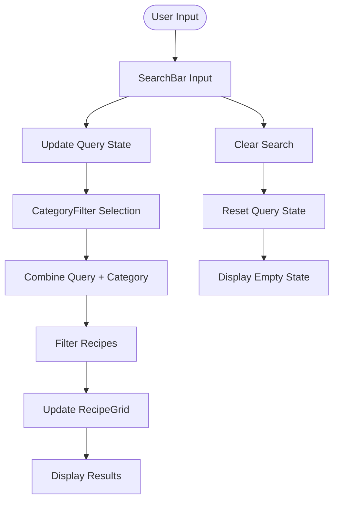

**Diagram sources**
- [SearchBar.jsx:1-57](file://client/src/components/search/SearchBar.jsx#L1-L57)
- [CategoryFilter.jsx:1-28](file://client/src/components/search/CategoryFilter.jsx#L1-L28)
- [RecipeGrid.jsx:1-39](file://client/src/components/recipe/RecipeGrid.jsx#L1-L39)

**Section sources**
- [Navbar.jsx:1-206](file://client/src/components/common/Navbar.jsx#L1-L206)
- [Footer.jsx:1-33](file://client/src/components/common/Footer.jsx#L1-L33)
- [ProtectedRoute.jsx:1-21](file://client/src/components/common/ProtectedRoute.jsx#L1-L21)
- [ThemeToggle.jsx:1-30](file://client/src/components/common/ThemeToggle.jsx#L1-L30)
- [LikeButton.jsx:1-73](file://client/src/components/interactions/LikeButton.jsx#L1-L73)
- [SaveButton.jsx:1-53](file://client/src/components/interactions/SaveButton.jsx#L1-L53)
- [RatingStars.jsx:1-68](file://client/src/components/interactions/RatingStars.jsx#L1-L68)
- [CommentSection.jsx:1-140](file://client/src/components/interactions/CommentSection.jsx#L1-L140)
- [FollowButton.jsx:1-64](file://client/src/components/user/FollowButton.jsx#L1-L64)
- [ProfileHeader.jsx:1-87](file://client/src/components/user/ProfileHeader.jsx#L1-L87)
- [UserAvatar.jsx:1-44](file://client/src/components/user/UserAvatar.jsx#L1-L44)
- [RecipeCard.jsx:1-125](file://client/src/components/recipe/RecipeCard.jsx#L1-L125)
- [RecipeGrid.jsx:1-39](file://client/src/components/recipe/RecipeGrid.jsx#L1-L39)
- [CategoryFilter.jsx:1-28](file://client/src/components/search/CategoryFilter.jsx#L1-L28)
- [SearchBar.jsx:1-57](file://client/src/components/search/SearchBar.jsx#L1-L57)
- [HomeFeed.jsx:1-96](file://client/src/pages/HomeFeed.jsx#L1-L96)

### State Management Flow
The state management system demonstrates a unidirectional data flow with proper context propagation and local storage synchronization. The enhanced architecture ensures that all component interactions flow through the central context providers, maintaining consistency and predictability across the application.

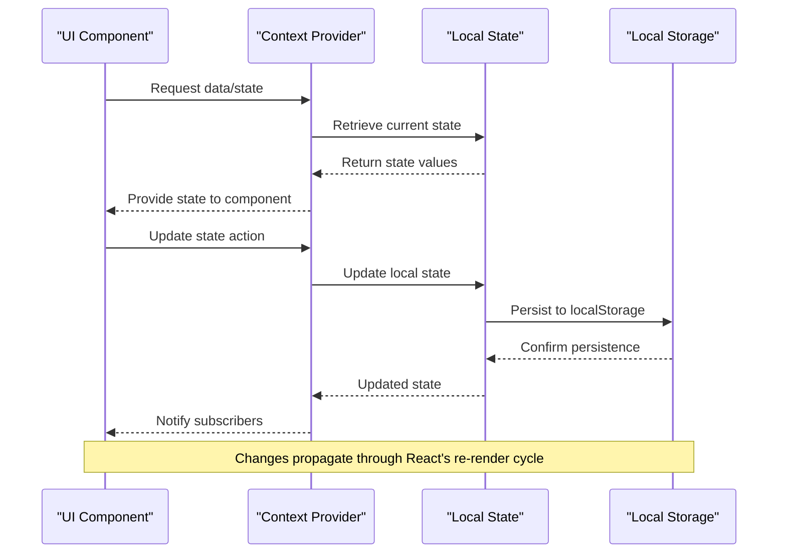

**Diagram sources**
- [RecipeContext.jsx:22-32](file://client/src/context/RecipeContext.jsx#L22-L32)
- [AuthContext.jsx:10-17](file://client/src/context/AuthContext.jsx#L10-L17)
- [ThemeContext.jsx:15-23](file://client/src/context/ThemeContext.jsx#L15-L23)

**Section sources**
- [RecipeContext.jsx:1-194](file://client/src/context/RecipeContext.jsx#L1-L194)
- [AuthContext.jsx:1-72](file://client/src/context/AuthContext.jsx#L1-L72)
- [ThemeContext.jsx:1-43](file://client/src/context/ThemeContext.jsx#L1-L43)

## Dependency Analysis
The application maintains clean dependency relationships with clear boundaries between modules and consistent external library usage. The enhanced component system maintains a well-structured dependency graph with minimal coupling between components.

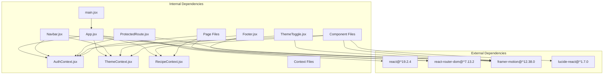

**Diagram sources**
- [package.json:12-18](file://client/package.json#L12-L18)
- [App.jsx:1-9](file://client/src/App.jsx#L1-L9)

**Section sources**
- [package.json:1-35](file://client/package.json#L1-L35)
- [App.jsx:1-94](file://client/src/App.jsx#L1-L94)

## Performance Considerations
The component system incorporates several performance optimization strategies:

- **Lazy Loading**: Route-based code splitting through React Router with efficient component loading
- **Component Memoization**: Strategic use of React.memo for expensive components like RecipeCard and RecipeGrid
- **State Optimization**: Context splitting to minimize unnecessary re-renders across different component categories
- **Animation Performance**: Framer Motion optimized animations with proper cleanup and efficient motion patterns
- **Image Optimization**: Responsive images with appropriate sizing and lazy loading in RecipeCard components
- **Event Delegation**: Efficient event handling in interactive components with proper event bubbling control
- **Conditional Rendering**: Optimized rendering of expanded/collapsed states in CommentSection and RecipeCard components
- **Efficient State Updates**: Batched state updates in comment and rating systems with proper debouncing
- **Component Composition**: Reusable component patterns that reduce duplication and improve maintainability
- **Context Optimization**: Proper context provider nesting to minimize re-renders across the component hierarchy

The enhanced component system now includes comprehensive performance considerations for all five component categories, ensuring optimal user experience across different device types and network conditions.

## Troubleshooting Guide
Common issues and their solutions:

### Authentication Issues
- **Problem**: Authentication state not persisting across refresh
- **Solution**: Verify localStorage availability and check AuthContext initialization
- **Debug**: Inspect localStorage keys and browser storage permissions

### Theme Switching Problems
- **Problem**: Theme not applying correctly on initial load
- **Solution**: Ensure ThemeContext properly detects system preference and applies CSS classes
- **Debug**: Check documentElement classList and localStorage theme value

### Context Provider Errors
- **Problem**: "Context must be used within a Provider" errors
- **Solution**: Verify all components are wrapped in appropriate context providers
- **Debug**: Check provider hierarchy in App.jsx and ensure proper nesting order

### Component Rendering Issues
- **Problem**: New components not rendering properly
- **Solution**: Verify component imports and ensure proper context provider wrapping
- **Debug**: Check component file paths and context dependencies

### Performance Issues
- **Problem**: Slow component rendering
- **Solution**: Implement React.memo for static components and optimize heavy computations
- **Debug**: Use React DevTools Profiler to identify bottlenecks

### Component Category Issues
- **Problem**: Components from different categories not communicating properly
- **Solution**: Ensure proper context integration and verify component prop interfaces
- **Debug**: Check component dependencies and context provider availability

**Section sources**
- [ProtectedRoute.jsx:65-71](file://client/src/components/common/ProtectedRoute.jsx#L65-L71)
- [ThemeContext.jsx:36-42](file://client/src/context/ThemeContext.jsx#L36-L42)
- [AuthContext.jsx:65-71](file://client/src/context/AuthContext.jsx#L65-L71)

## Conclusion
The Flavora component system demonstrates a well-architected React application with clear separation of concerns, robust state management, and consistent design patterns. The enhanced architecture with comprehensive component hierarchy across five distinct categories (common, interactions, recipe, search, user) provides excellent modularity, maintainability, and scalability.

The system now includes sophisticated component composition patterns, improved context integration, and expanded component documentation that supports continued development and feature expansion. The implementation of reusable components, comprehensive interaction patterns, and thoughtful performance optimizations creates a solid foundation for the evolving application ecosystem.

The enhanced component system architecture successfully addresses the requirements for comprehensive component hierarchy, new component categories, improved component composition patterns, and expanded component documentation, positioning the application for future growth and feature development.