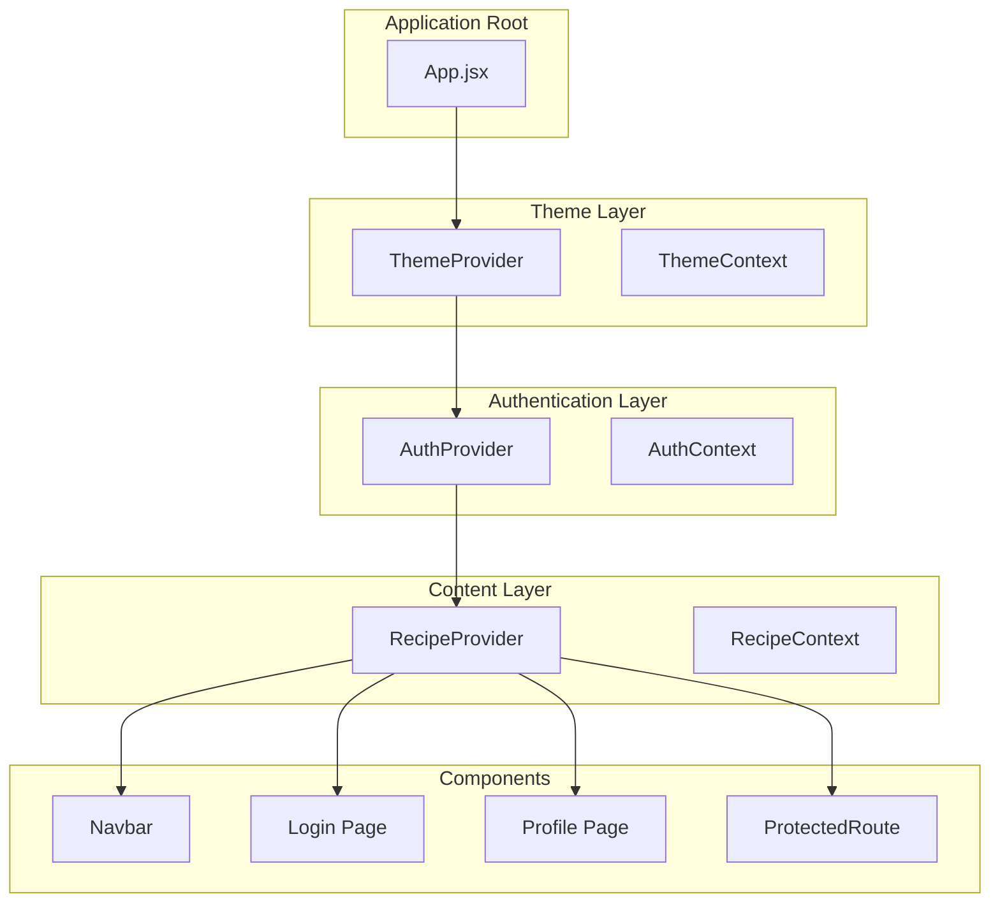
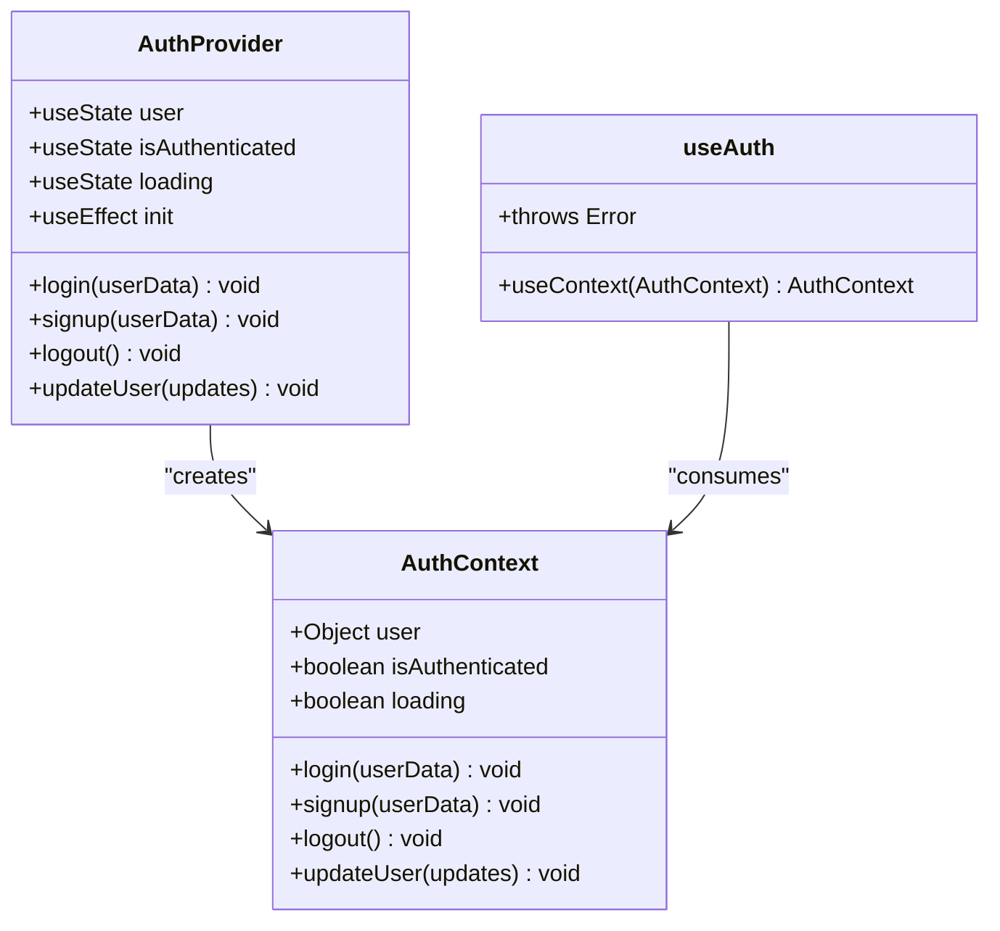
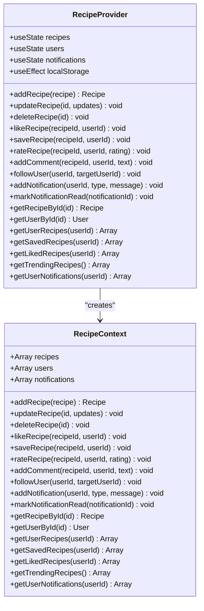
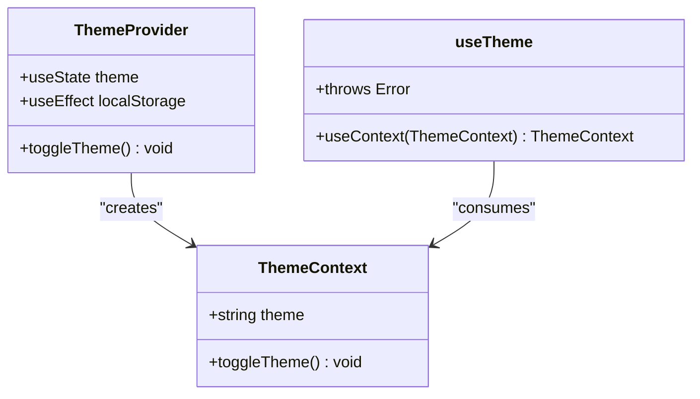
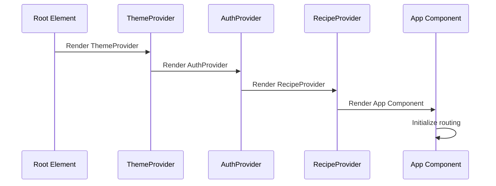
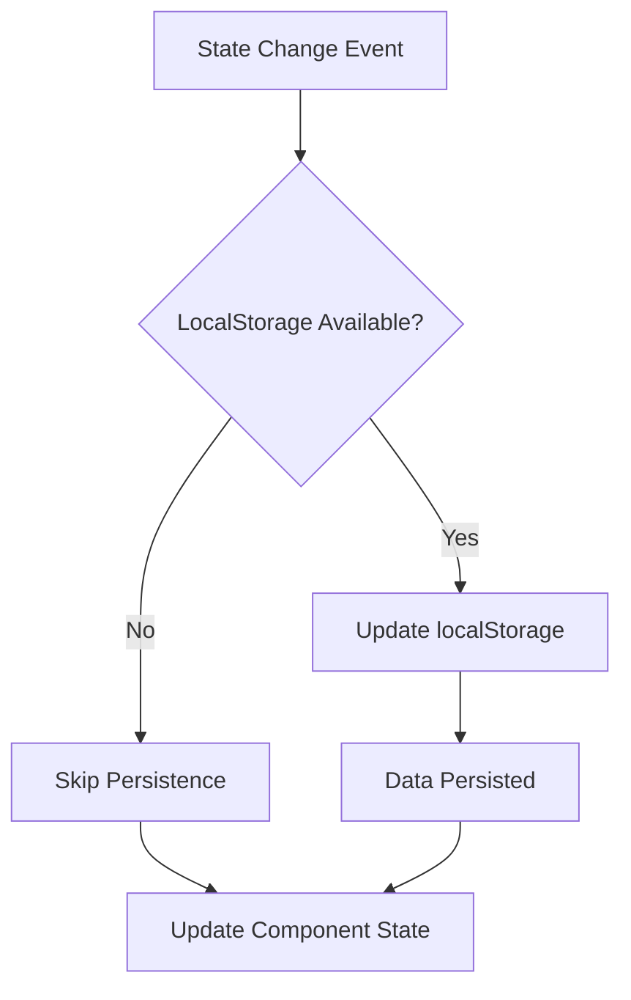
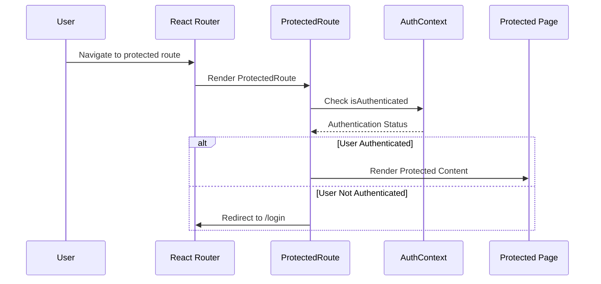

# Context Providers System

<cite>
**Referenced Files in This Document**
- [AuthContext.jsx](file://client/src/context/AuthContext.jsx)
- [RecipeContext.jsx](file://client/src/context/RecipeContext.jsx)
- [ThemeContext.jsx](file://client/src/context/ThemeContext.jsx)
- [App.jsx](file://client/src/App.jsx)
- [main.jsx](file://client/src/main.jsx)
- [Navbar.jsx](file://client/src/components/common/Navbar.jsx)
- [ProtectedRoute.jsx](file://client/src/components/common/ProtectedRoute.jsx)
- [Login.jsx](file://client/src/pages/Login.jsx)
- [Profile.jsx](file://client/src/pages/Profile.jsx)
- [ThemeToggle.jsx](file://client/src/components/common/ThemeToggle.jsx)
- [mockData.js](file://client/src/data/mockData.js)
</cite>

## Table of Contents
1. [Introduction](#introduction)
2. [System Architecture](#system-architecture)
3. [Core Context Providers](#core-context-providers)
4. [Provider Composition](#provider-composition)
5. [Component Integration Patterns](#component-integration-patterns)
6. [Data Management Strategies](#data-management-strategies)
7. [State Persistence Mechanisms](#state-persistence-mechanisms)
8. [Security and Authentication Flow](#security-and-authentication-flow)
9. [Performance Considerations](#performance-considerations)
10. [Troubleshooting Guide](#troubleshooting-guide)
11. [Best Practices](#best-practices)
12. [Conclusion](#conclusion)

## Introduction

The Context Providers System in Flavora is a comprehensive React state management solution that centralizes application-wide state handling through three primary context providers: Authentication, Recipe/Content Management, and Theme Management. This system enables seamless state sharing across components while maintaining clean separation of concerns and providing robust functionality for user authentication, recipe interactions, and theme preferences.

The system leverages React's Context API to create a hierarchical state management architecture where child components can access and modify shared state without prop drilling. Each context provider encapsulates specific domain logic and maintains its own state lifecycle, creating a modular and maintainable state management solution.

## System Architecture

The Context Providers System follows a hierarchical provider composition pattern where multiple context providers wrap the application tree, creating nested state management layers.



**Diagram sources**
- [App.jsx:44-91](file://client/src/App.jsx#L44-L91)
- [ThemeContext.jsx:5-34](file://client/src/context/ThemeContext.jsx#L5-L34)
- [AuthContext.jsx:5-63](file://client/src/context/AuthContext.jsx#L5-L63)
- [RecipeContext.jsx:6-185](file://client/src/context/RecipeContext.jsx#L6-L185)

**Section sources**
- [App.jsx:44-91](file://client/src/App.jsx#L44-L91)
- [main.jsx:6-10](file://client/src/main.jsx#L6-L10)

## Core Context Providers

### Authentication Context Provider

The Authentication Context Provider manages user session state, authentication status, and user profile data. It implements localStorage persistence for user sessions and provides comprehensive authentication methods.



**Diagram sources**
- [AuthContext.jsx:1-72](file://client/src/context/AuthContext.jsx#L1-L72)

**Section sources**
- [AuthContext.jsx:1-72](file://client/src/context/AuthContext.jsx#L1-L72)

### Recipe Context Provider

The Recipe Context Provider handles all recipe-related state, user interactions, and content management. It maintains recipes, users, notifications, and provides comprehensive CRUD operations.



**Diagram sources**
- [RecipeContext.jsx:1-194](file://client/src/context/RecipeContext.jsx#L1-L194)

**Section sources**
- [RecipeContext.jsx:1-194](file://client/src/context/RecipeContext.jsx#L1-L194)

### Theme Context Provider

The Theme Context Provider manages application-wide theme preferences with automatic system detection and localStorage persistence.



**Diagram sources**
- [ThemeContext.jsx:1-43](file://client/src/context/ThemeContext.jsx#L1-L43)

**Section sources**
- [ThemeContext.jsx:1-43](file://client/src/context/ThemeContext.jsx#L1-L43)

## Provider Composition

The provider composition follows a strict hierarchical order where ThemeProvider wraps AuthProvider, which in turn wraps RecipeProvider. This arrangement ensures proper state availability across all application layers.



**Diagram sources**
- [App.jsx:46-89](file://client/src/App.jsx#L46-L89)

**Section sources**
- [App.jsx:46-89](file://client/src/App.jsx#L46-L89)

## Component Integration Patterns

### Hook Consumption Pattern

Components consume context through custom hooks that provide type-safe access to context values and enforce proper provider wrapping.

```mermaid
flowchart TD
Component[React Component] --> Hook[Custom Hook]
Hook --> useContext[useContext(Context)]
useContext --> Validation{Context Available?}
Validation --> |Yes| ReturnValue[Return Context Value]
Validation --> |No| ThrowError[Throw Error]
ThrowError --> ErrorHandling[Error Boundary]
```

**Diagram sources**
- [AuthContext.jsx:65-71](file://client/src/context/AuthContext.jsx#L65-L71)
- [RecipeContext.jsx:187-193](file://client/src/context/RecipeContext.jsx#L187-L193)
- [ThemeContext.jsx:36-42](file://client/src/context/ThemeContext.jsx#L36-L42)

### Multi-Context Usage

Components often need to access multiple context providers simultaneously, demonstrating the system's flexibility in handling cross-domain state.

**Section sources**
- [Navbar.jsx:16-22](file://client/src/components/common/Navbar.jsx#L16-L22)
- [Login.jsx:5-10](file://client/src/pages/Login.jsx#L5-L10)
- [Profile.jsx:5-13](file://client/src/pages/Profile.jsx#L5-L13)

## Data Management Strategies

### LocalStorage Integration

Each context provider implements localStorage persistence to maintain state across browser sessions, ensuring data continuity and improved user experience.



**Diagram sources**
- [AuthContext.jsx:10-17](file://client/src/context/AuthContext.jsx#L10-L17)
- [AuthContext.jsx:22-23](file://client/src/context/AuthContext.jsx#L22-L23)
- [RecipeContext.jsx:22-32](file://client/src/context/RecipeContext.jsx#L22-L32)

### Mock Data Integration

The system integrates with mock data for development and demonstration purposes, providing realistic content for testing and user interface validation.

**Section sources**
- [mockData.js:1-587](file://client/src/data/mockData.js#L1-L587)
- [RecipeContext.jsx:2-3](file://client/src/context/RecipeContext.jsx#L2-L3)

## State Persistence Mechanisms

### Authentication Persistence

Authentication state persists through localStorage with automatic initialization on application load, providing seamless user experience across page refreshes.

**Section sources**
- [AuthContext.jsx:10-17](file://client/src/context/AuthContext.jsx#L10-L17)
- [AuthContext.jsx:19-42](file://client/src/context/AuthContext.jsx#L19-L42)

### Theme Preference Persistence

Theme preferences automatically sync with system theme detection and persist user choices across sessions.

**Section sources**
- [ThemeContext.jsx:6-13](file://client/src/context/ThemeContext.jsx#L6-L13)
- [ThemeContext.jsx:15-23](file://client/src/context/ThemeContext.jsx#L15-L23)

### Content State Persistence

Recipe and user data persistence ensures that user interactions, likes, saves, and other engagement metrics persist across sessions.

**Section sources**
- [RecipeContext.jsx:22-32](file://client/src/context/RecipeContext.jsx#L22-L32)
- [RecipeContext.jsx:34-46](file://client/src/context/RecipeContext.jsx#L34-L46)

## Security and Authentication Flow

### Protected Route Implementation

The system implements route protection through the ProtectedRoute component, which checks authentication status before rendering protected content.



**Diagram sources**
- [ProtectedRoute.jsx:4-20](file://client/src/components/common/ProtectedRoute.jsx#L4-L20)
- [AuthContext.jsx:65-71](file://client/src/context/AuthContext.jsx#L65-L71)

### Login Process Flow

The authentication flow demonstrates proper context usage and state management during user login operations.

**Section sources**
- [Login.jsx:8-60](file://client/src/pages/Login.jsx#L8-L60)
- [ProtectedRoute.jsx:4-20](file://client/src/components/common/ProtectedRoute.jsx#L4-L20)

## Performance Considerations

### Context Provider Optimization

The system employs several optimization strategies to minimize re-renders and maintain optimal performance across large datasets.

### Lazy Loading and Memoization

Components utilize React.memo and useCallback hooks to prevent unnecessary re-renders when consuming context data.

### Efficient State Updates

State updates are optimized to minimize the scope of re-renders, updating only affected components when state changes occur.

## Troubleshooting Guide

### Common Context Provider Issues

**Missing Provider Error**: Occurs when components attempt to use context hooks without proper provider wrapping. The system throws descriptive errors to help developers identify missing providers.

**Section sources**
- [AuthContext.jsx:67-71](file://client/src/context/AuthContext.jsx#L67-L71)
- [RecipeContext.jsx:189-193](file://client/src/context/RecipeContext.jsx#L189-L193)
- [ThemeContext.jsx:38-42](file://client/src/context/ThemeContext.jsx#L38-L42)

### Debugging State Issues

For debugging context-related state issues, developers should verify provider hierarchy, check localStorage persistence, and monitor component re-render patterns.

## Best Practices

### Provider Organization

- Maintain clear separation of concerns between context providers
- Use custom hooks for type-safe context consumption
- Implement proper error boundaries for context access violations
- Optimize state updates to minimize re-renders

### State Management Patterns

- Use immutable state updates for predictable state changes
- Implement localStorage persistence for critical user data
- Provide fallback mechanisms for server-side rendering scenarios
- Design context APIs with clear method naming and consistent patterns

### Performance Optimization

- Implement selective re-rendering through proper context usage
- Use React.memo for components consuming context data
- Optimize expensive computations with useMemo and useCallback
- Consider splitting large contexts into smaller, focused providers

## Conclusion

The Context Providers System in Flavora demonstrates a mature approach to React state management that balances simplicity with powerful functionality. Through careful design and implementation, the system provides:

- **Modular Architecture**: Clear separation of concerns across authentication, content, and theme domains
- **Type Safety**: Custom hooks ensure proper context usage and provide compile-time safety
- **Persistence**: Comprehensive localStorage integration for seamless user experiences
- **Scalability**: Hierarchical provider composition supports growth and feature expansion
- **Developer Experience**: Clear error messages and intuitive APIs facilitate maintenance and debugging

The system serves as an excellent example of how React's Context API can be effectively utilized to build maintainable, scalable applications while avoiding common pitfalls associated with global state management. Its implementation provides a solid foundation for further feature development and demonstrates best practices for context-based state management in modern React applications.