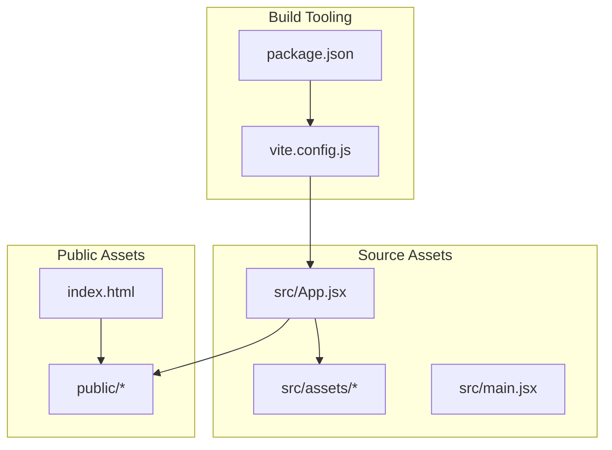
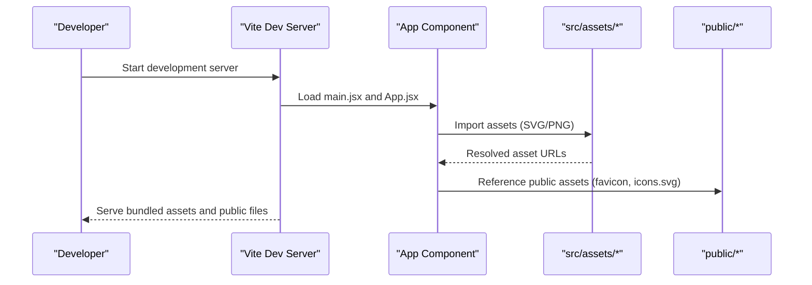
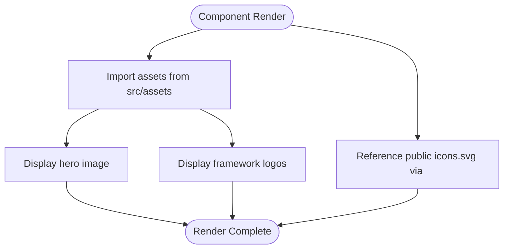
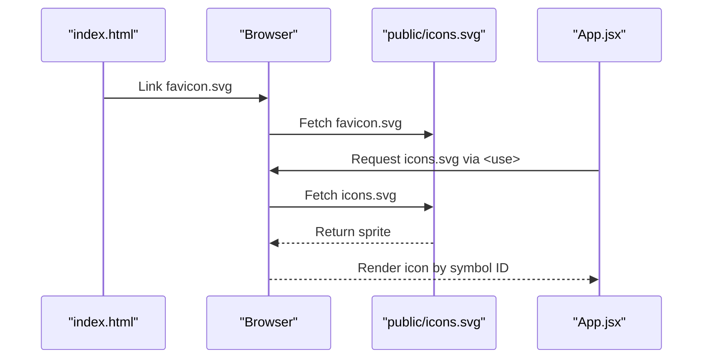
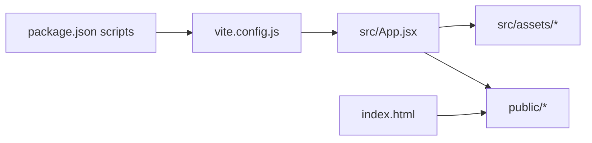

# Asset Loading and Display System

<cite>
**Referenced Files in This Document**
- [vite.config.js](file://client/vite.config.js)
- [package.json](file://client/package.json)
- [index.html](file://client/index.html)
- [main.jsx](file://client/src/main.jsx)
- [App.jsx](file://client/src/App.jsx)
- [index.css](file://client/src/index.css)
- [favicon.svg](file://client/public/favicon.svg)
- [icons.svg](file://client/public/icons.svg)
- [react.svg](file://client/src/assets/react.svg)
- [vite.svg](file://client/src/assets/vite.svg)
- [hero.png](file://client/src/assets/hero.png)
</cite>

## Table of Contents
1. [Introduction](#introduction)
2. [Project Structure](#project-structure)
3. [Core Components](#core-components)
4. [Architecture Overview](#architecture-overview)
5. [Detailed Component Analysis](#detailed-component-analysis)
6. [Dependency Analysis](#dependency-analysis)
7. [Performance Considerations](#performance-considerations)
8. [Troubleshooting Guide](#troubleshooting-guide)
9. [Conclusion](#conclusion)

## Introduction
This document explains the asset management system used in the client application, focusing on static file imports and display patterns. It covers how Vite processes assets, the differences between imported assets and public folder assets, and practical patterns for images, icons, and sprites. It also provides guidance on adding new assets, optimizing performance, and integrating CDNs.

## Project Structure
The asset system spans two primary locations:
- Source assets under `src/assets`: imported directly into JavaScript/JSX files
- Public assets under `public`: served as-is by the dev server and copied to the build output

Key files involved in asset handling:
- Vite configuration defines the build pipeline
- Application entry and components import assets
- HTML references public assets like favicon and sprite icons
- Styles apply visual treatments to assets

**Diagram sources**
- [vite.config.js:1-8](file://client/vite.config.js#L1-L8)
- [package.json:1-28](file://client/package.json#L1-L28)
- [App.jsx:1-122](file://client/src/App.jsx#L1-L122)
- [main.jsx:1-11](file://client/src/main.jsx#L1-L11)
- [index.html:1-14](file://client/index.html#L1-L14)

**Section sources**
- [vite.config.js:1-8](file://client/vite.config.js#L1-L8)
- [package.json:1-28](file://client/package.json#L1-L28)
- [index.html:1-14](file://client/index.html#L1-L14)
- [App.jsx:1-122](file://client/src/App.jsx#L1-L122)
- [main.jsx:1-11](file://client/src/main.jsx#L1-L11)

## Core Components
- Vite configuration: Defines the React plugin and build behavior
- Asset imports in components: Demonstrates importing SVG and PNG assets
- Public assets: Favicon and SVG sprite referenced via absolute paths
- HTML integration: Links public assets at the document level

Key implementation patterns:
- Direct imports from `src/assets` are resolved by Vite and bundled with the app
- Public assets under `public` are served at root paths and copied to the build output
- SVG sprites enable efficient reuse of icons across the application

**Section sources**
- [vite.config.js:1-8](file://client/vite.config.js#L1-L8)
- [App.jsx:1-122](file://client/src/App.jsx#L1-L122)
- [index.html:1-14](file://client/index.html#L1-L14)

## Architecture Overview
The asset pipeline integrates Vite, source imports, and public assets:

**Diagram sources**
- [vite.config.js:1-8](file://client/vite.config.js#L1-L8)
- [main.jsx:1-11](file://client/src/main.jsx#L1-L11)
- [App.jsx:1-122](file://client/src/App.jsx#L1-L122)
- [index.html:1-14](file://client/index.html#L1-L14)

## Detailed Component Analysis

### Static Asset Imports in Components
The application demonstrates two primary patterns:
- Direct imports from `src/assets` for images and logos
- Public asset references via absolute paths for favicon and SVG sprites

Asset usage examples:
- Hero image import and display within a hero section
- Framework logos imported and rendered alongside the hero image
- Public SVG sprite referenced via `<use>` elements for icons

**Diagram sources**
- [App.jsx:1-122](file://client/src/App.jsx#L1-L122)

**Section sources**
- [App.jsx:1-122](file://client/src/App.jsx#L1-L122)

### Public Folder Assets and Sprite Icons
Public assets are served at root paths and referenced directly:
- Favicon configured in HTML as an SVG icon
- SVG sprite (`icons.svg`) referenced via absolute paths in `<use>` elements

Sprite usage pattern:
- Define a single sprite file in the public directory
- Reference individual icons by ID within `<use href="/icons.svg#icon-id">`

**Diagram sources**
- [index.html:1-14](file://client/index.html#L1-L14)
- [icons.svg](file://client/public/icons.svg)
- [App.jsx:36-110](file://client/src/App.jsx#L36-L110)

**Section sources**
- [index.html:1-14](file://client/index.html#L1-L14)
- [App.jsx:36-110](file://client/src/App.jsx#L36-L110)

### Hero Image Integration
The hero image is imported directly and displayed with explicit dimensions:
- Import statement in the component
- Usage within a hero layout section
- Alt attributes applied for accessibility

Best practices illustrated:
- Provide explicit width and height for layout stability
- Use descriptive alt text for meaningful context

**Section sources**
- [App.jsx:13-17](file://client/src/App.jsx#L13-L17)

### Framework Logos Usage
Framework logos are imported and displayed alongside the hero image:
- Imported from `src/assets`
- Used as `src` attributes on `` elements
- Accessibility handled via descriptive alt attributes

**Section sources**
- [App.jsx:14-16](file://client/src/App.jsx#L14-L16)

### Adding New Assets
To add new assets, follow these patterns:

- For imported assets (SVG, PNG):
  - Place files under `src/assets`
  - Import in components and use as `src` attributes
  - Example reference: [App.jsx:1-5](file://client/src/App.jsx#L1-L5)

- For public assets (favicon, sprites):
  - Place files under `public`
  - Reference via absolute paths in HTML or JSX
  - Example references: [index.html:5](file://client/index.html#L5), [App.jsx:36-110](file://client/src/App.jsx#L36-L110)

- For new sprite icons:
  - Add symbols to the existing sprite file in `public/icons.svg`
  - Reference via `<use href="/icons.svg#your-icon-id">`

**Section sources**
- [App.jsx:1-5](file://client/src/App.jsx#L1-L5)
- [index.html:5](file://client/index.html#L5)
- [App.jsx:36-110](file://client/src/App.jsx#L36-L110)

### Lazy Loading Patterns
While the current implementation loads assets synchronously, lazy loading can be achieved by:
- Dynamically importing assets when needed
- Using dynamic `import()` to defer loading until required
- Implementing intersection observer-based triggers for visibility-based loading

These patterns help reduce initial payload and improve perceived performance.

[No sources needed since this section provides general guidance]

### Asset Path Configuration
Vite resolves imports from `src/assets` automatically. Public assets are served from the project root. To configure asset handling:
- Keep imported assets under `src/assets` for bundling and fingerprinting
- Place static assets under `public` for direct serving
- Use absolute paths for public assets in templates and components

**Section sources**
- [vite.config.js:1-8](file://client/vite.config.js#L1-L8)
- [index.html:5](file://client/index.html#L5)
- [App.jsx:1-5](file://client/src/App.jsx#L1-L5)

## Dependency Analysis
The asset system depends on:
- Vite configuration for build behavior
- Package scripts for development, building, and previewing
- HTML linking to public assets
- Component imports for source assets

**Diagram sources**
- [package.json:6-11](file://client/package.json#L6-L11)
- [vite.config.js:1-8](file://client/vite.config.js#L1-L8)
- [App.jsx:1-122](file://client/src/App.jsx#L1-L122)
- [index.html:5](file://client/index.html#L5)

**Section sources**
- [package.json:6-11](file://client/package.json#L6-L11)
- [vite.config.js:1-8](file://client/vite.config.js#L1-L8)
- [index.html:5](file://client/index.html#L5)
- [App.jsx:1-122](file://client/src/App.jsx#L1-L122)

## Performance Considerations
- Prefer imported assets for images that benefit from bundling and optimization
- Use public assets for frequently changing or large static resources served at root paths
- Optimize images by choosing appropriate formats and sizes
- Consider lazy loading for non-critical assets
- Evaluate CDN integration for public assets to reduce origin load and improve global delivery

[No sources needed since this section provides general guidance]

## Troubleshooting Guide
Common issues and resolutions:
- Asset not found errors:
  - Verify import paths match the actual file locations
  - Confirm public assets are placed under `public` and referenced with leading slashes
- Incorrect sprite rendering:
  - Ensure the sprite file exists in `public/icons.svg`
  - Verify symbol IDs in `<use>` match those defined in the sprite
- Build-time vs. runtime asset resolution:
  - Imported assets resolve during build; public assets are served as-is
  - Use appropriate patterns based on whether you need bundling or direct serving

**Section sources**
- [App.jsx:1-5](file://client/src/App.jsx#L1-L5)
- [App.jsx:36-110](file://client/src/App.jsx#L36-L110)
- [index.html:5](file://client/index.html#L5)

## Conclusion
The asset management system combines Vite’s import pipeline for source assets with public folder serving for static resources. Imported assets benefit from bundling and optimization, while public assets offer direct, predictable serving. The SVG sprite pattern enables efficient icon reuse, and the established patterns support straightforward addition of new assets with attention to performance and maintainability.