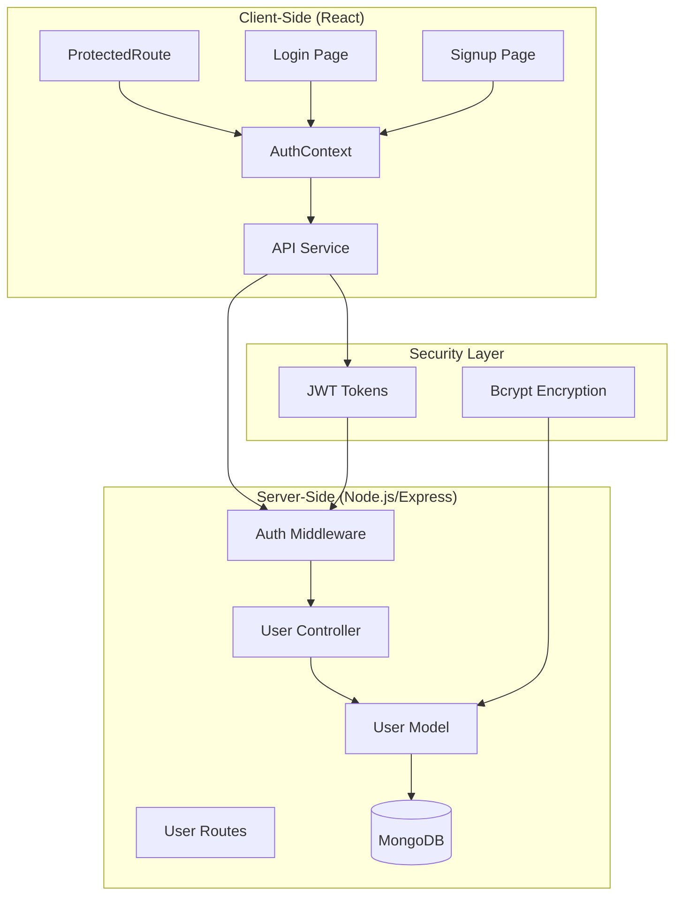
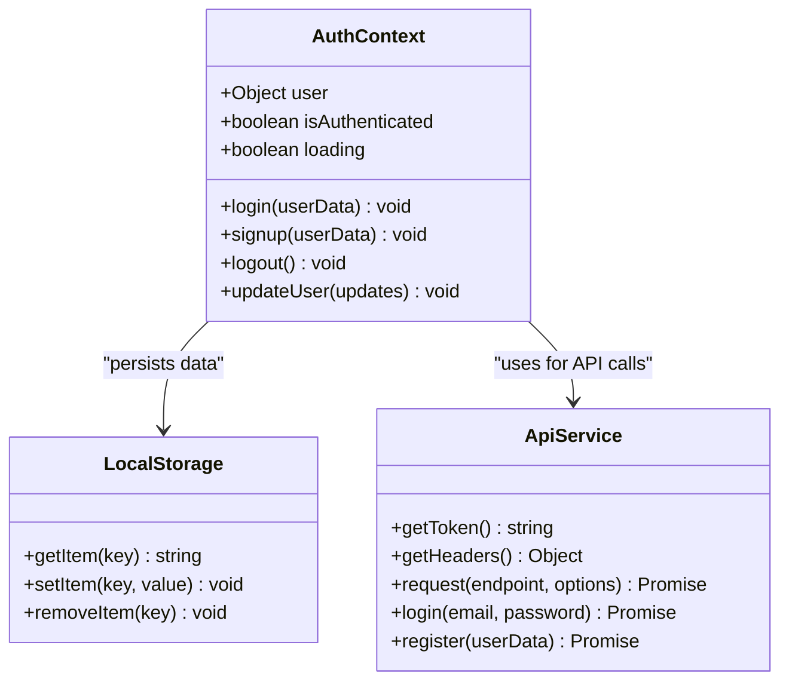
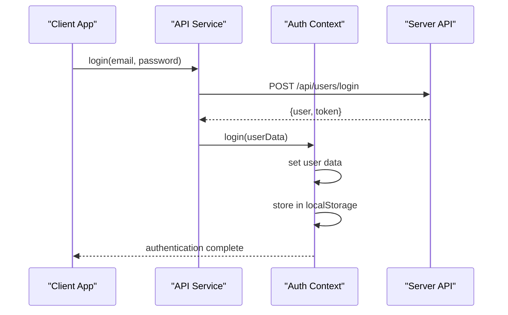
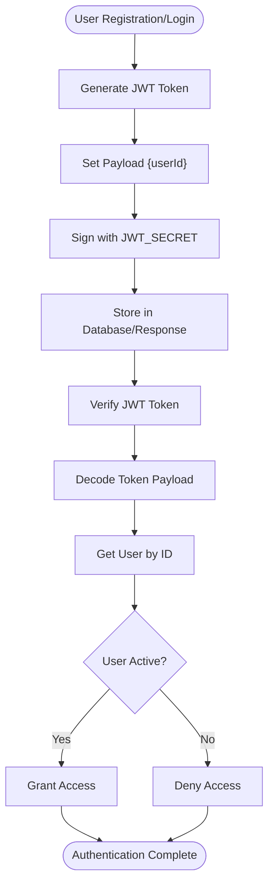
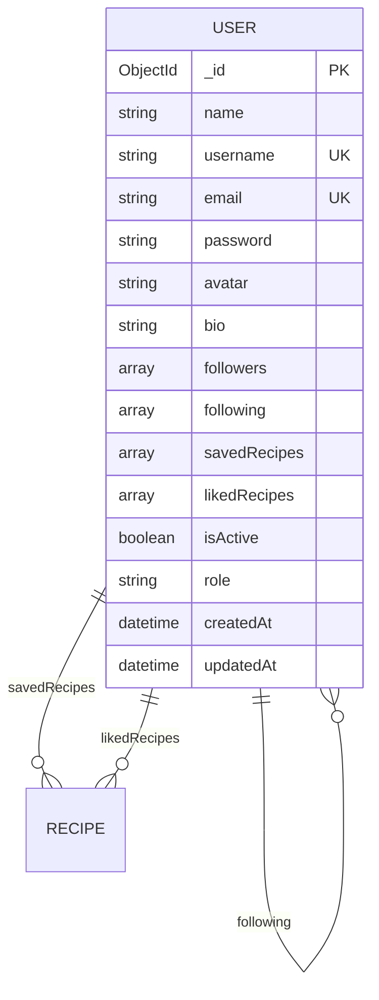
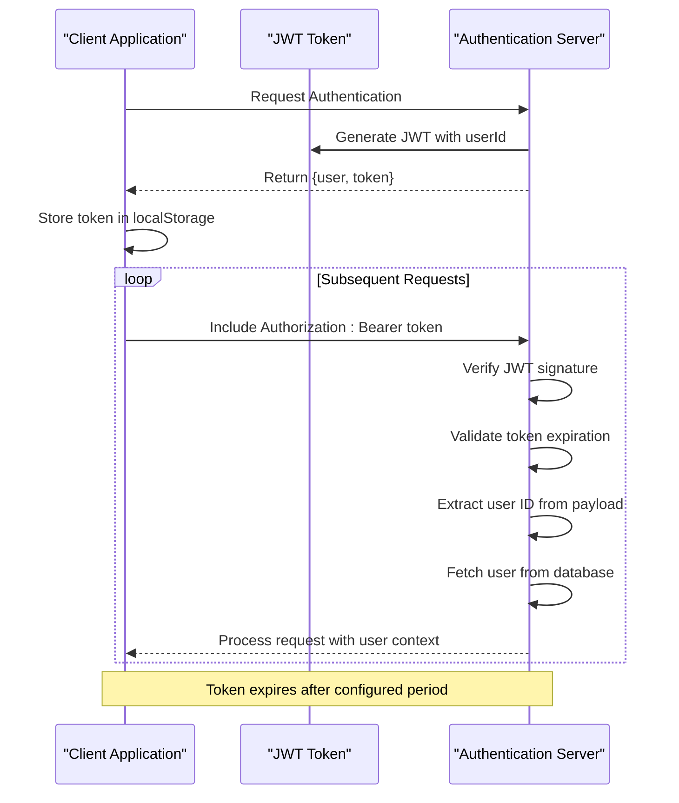
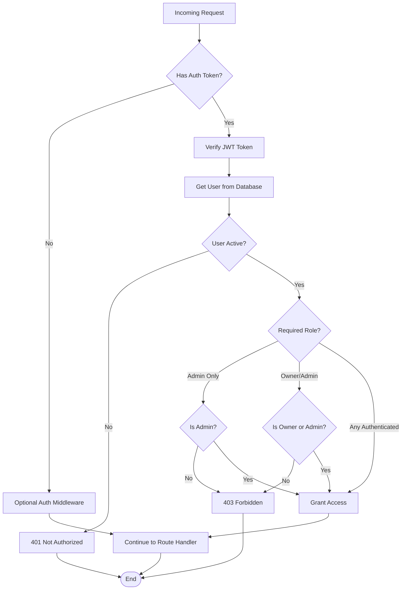
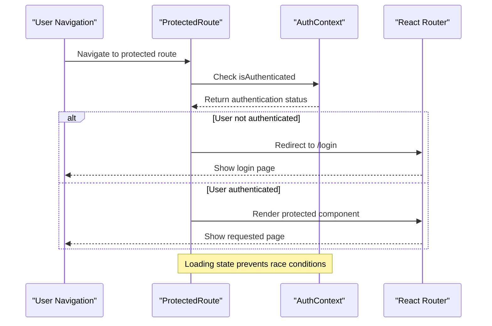
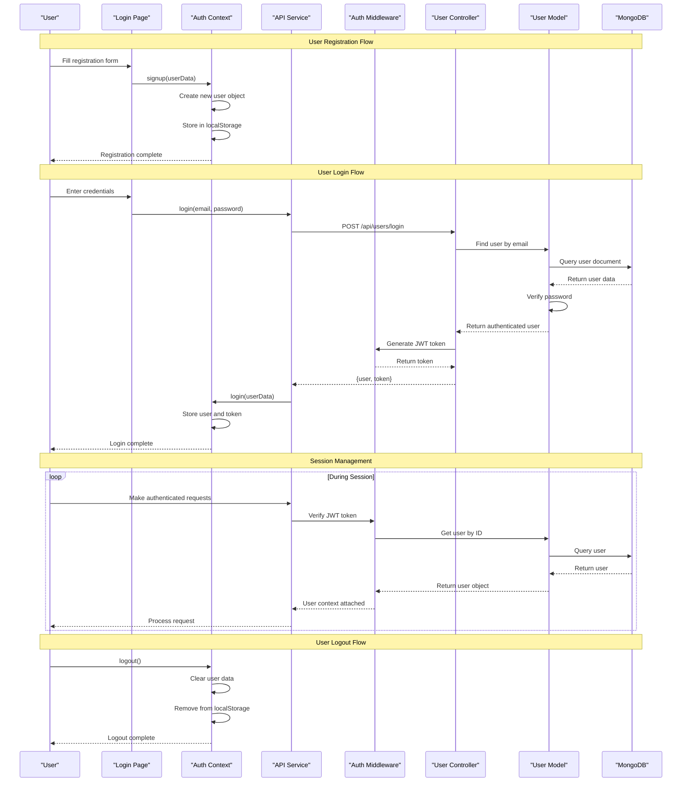

# Authentication and Authorization System

<cite>
**Referenced Files in This Document**
- [AuthContext.jsx](file://client/src/context/AuthContext.jsx)
- [ProtectedRoute.jsx](file://client/src/components/common/ProtectedRoute.jsx)
- [api.js](file://client/src/services/api.js)
- [Login.jsx](file://client/src/pages/Login.jsx)
- [Signup.jsx](file://client/src/pages/Signup.jsx)
- [App.jsx](file://client/src/App.jsx)
- [auth.js](file://server/middleware/auth.js)
- [generateToken.js](file://server/utils/generateToken.js)
- [userController.js](file://server/controllers/userController.js)
- [User.js](file://server/models/User.js)
- [userRoutes.js](file://server/routes/userRoutes.js)
- [index.js](file://server/index.js)
- [errorHandler.js](file://server/middleware/errorHandler.js)
</cite>

## Table of Contents
1. [Introduction](#introduction)
2. [System Architecture](#system-architecture)
3. [Client-Side Authentication](#client-side-authentication)
4. [Server-Side Authentication](#server-side-authentication)
5. [JWT Token Management](#jwt-token-management)
6. [Authorization Middleware](#authorization-middleware)
7. [Protected Routes Implementation](#protected-routes-implementation)
8. [Authentication Flow](#authentication-flow)
9. [Security Considerations](#security-considerations)
10. [Troubleshooting Guide](#troubleshooting-guide)
11. [Conclusion](#conclusion)

## Introduction

The Flavora application implements a comprehensive authentication and authorization system that provides secure user management for a social recipe sharing platform. The system consists of a React-based frontend with local state management and a Node.js/Express backend with JWT-based authentication and MongoDB integration.

The authentication system supports user registration, login, profile management, and role-based authorization with admin capabilities. It provides both client-side route protection and server-side API security enforcement.

## System Architecture

The authentication system follows a modern client-server architecture with clear separation of concerns:

**Diagram sources**
- [AuthContext.jsx:1-72](file://client/src/context/AuthContext.jsx#L1-L72)
- [auth.js:1-105](file://server/middleware/auth.js#L1-L105)
- [User.js:1-142](file://server/models/User.js#L1-L142)

## Client-Side Authentication

### Authentication Context

The client-side authentication is managed through a React Context that provides centralized state management for user authentication status and data persistence.

**Diagram sources**
- [AuthContext.jsx:5-63](file://client/src/context/AuthContext.jsx#L5-L63)
- [api.js:8-23](file://client/src/services/api.js#L8-L23)

The authentication context manages three critical states:
- **User Data**: Complete user profile information
- **Authentication Status**: Boolean flag indicating login state
- **Loading State**: Handles initial authentication checking

**Section sources**
- [AuthContext.jsx:1-72](file://client/src/context/AuthContext.jsx#L1-L72)

### API Service Integration

The client-side API service handles all authentication-related requests and automatically manages JWT tokens in request headers.

**Diagram sources**
- [api.js:52-68](file://client/src/services/api.js#L52-L68)
- [AuthContext.jsx:19-42](file://client/src/context/AuthContext.jsx#L19-L42)

**Section sources**
- [api.js:1-172](file://client/src/services/api.js#L1-L172)

## Server-Side Authentication

### JWT Token Generation and Verification

The server implements robust JWT-based authentication using JSON Web Tokens for stateless session management.

**Diagram sources**
- [generateToken.js:8-23](file://server/utils/generateToken.js#L8-L23)
- [auth.js:22-48](file://server/middleware/auth.js#L22-L48)

**Section sources**
- [generateToken.js:1-26](file://server/utils/generateToken.js#L1-L26)
- [auth.js:1-105](file://server/middleware/auth.js#L1-L105)

### User Model Security

The MongoDB User model implements comprehensive security measures including password hashing and sensitive data protection.

**Diagram sources**
- [User.js:4-142](file://server/models/User.js#L4-L142)

**Section sources**
- [User.js:1-142](file://server/models/User.js#L1-L142)

## JWT Token Management

### Token Lifecycle

The JWT token management system ensures secure token handling throughout the user's session:

1. **Token Generation**: Upon successful authentication
2. **Token Storage**: Client-side localStorage persistence
3. **Token Transmission**: Automatic Authorization headers
4. **Token Validation**: Server-side verification on each request
5. **Token Expiration**: Configurable expiry period

**Diagram sources**
- [generateToken.js:8-14](file://server/utils/generateToken.js#L8-L14)
- [api.js:8-23](file://client/src/services/api.js#L8-L23)

**Section sources**
- [generateToken.js:1-26](file://server/utils/generateToken.js#L1-L26)
- [api.js:1-172](file://client/src/services/api.js#L1-L172)

## Authorization Middleware

### Role-Based Access Control

The authorization middleware implements a multi-layered security approach with different access levels:

**Diagram sources**
- [auth.js:9-102](file://server/middleware/auth.js#L9-L102)

**Section sources**
- [auth.js:1-105](file://server/middleware/auth.js#L1-L105)

### Route Protection Strategies

The system implements three distinct authorization strategies:

1. **protect**: Requires valid authentication for all requests
2. **optionalAuth**: Attaches user context if token exists, otherwise continues
3. **adminOnly**: Restricts access to administrative users only
4. **authorizeOwnerOrAdmin**: Allows resource owners or administrators

**Section sources**
- [auth.js:79-102](file://server/middleware/auth.js#L79-L102)

## Protected Routes Implementation

### Client-Side Route Protection

The ProtectedRoute component provides seamless client-side route protection using React Router's navigation blocking capabilities.

**Diagram sources**
- [ProtectedRoute.jsx:4-20](file://client/src/components/common/ProtectedRoute.jsx#L4-L20)
- [App.jsx:67-82](file://client/src/App.jsx#L67-L82)

**Section sources**
- [ProtectedRoute.jsx:1-21](file://client/src/components/common/ProtectedRoute.jsx#L1-L21)
- [App.jsx:1-94](file://client/src/App.jsx#L1-L94)

### Server-Side Route Protection

The server enforces authentication and authorization through middleware applied to route handlers:

**Section sources**
- [userRoutes.js:19-37](file://server/routes/userRoutes.js#L19-L37)
- [userController.js:94-117](file://server/controllers/userController.js#L94-L117)

## Authentication Flow

### Complete Authentication Lifecycle

The authentication system implements a comprehensive flow covering user registration, login, session management, and logout:

**Diagram sources**
- [Login.jsx:40-60](file://client/src/pages/Login.jsx#L40-L60)
- [AuthContext.jsx:19-42](file://client/src/context/AuthContext.jsx#L19-L42)
- [userController.js:60-87](file://server/controllers/userController.js#L60-L87)
- [auth.js:9-49](file://server/middleware/auth.js#L9-L49)

**Section sources**
- [Login.jsx:1-218](file://client/src/pages/Login.jsx#L1-L218)
- [Signup.jsx:1-316](file://client/src/pages/Signup.jsx#L1-L316)
- [userController.js:13-53](file://server/controllers/userController.js#L13-L53)

## Security Considerations

### Client-Side Security Measures

The client-side implementation includes several security considerations:

1. **Local Storage Security**: User data is persisted locally but should be considered insecure
2. **Token Management**: JWT tokens are stored in localStorage for convenience
3. **Form Validation**: Comprehensive client-side validation prevents malformed requests
4. **Loading States**: Prevents race conditions during authentication state transitions

### Server-Side Security Measures

The server implements robust security measures:

1. **Password Hashing**: Bcrypt encryption with 12 rounds of salting
2. **JWT Security**: Secret key management and token expiration
3. **Input Validation**: Express-validator middleware for request sanitization
4. **Error Handling**: Centralized error response formatting
5. **Database Security**: Proper indexing and query optimization

**Section sources**
- [User.js:89-105](file://server/models/User.js#L89-L105)
- [auth.js:22-48](file://server/middleware/auth.js#L22-L48)
- [errorHandler.js:1-49](file://server/middleware/errorHandler.js#L1-L49)

## Troubleshooting Guide

### Common Authentication Issues

**Authentication Token Problems**
- **Issue**: Users cannot stay logged in after refresh
- **Solution**: Verify JWT_SECRET environment variable is set correctly
- **Check**: localStorage contains flavora_token and flavora_user entries

**Login Failures**
- **Issue**: Users cannot log in despite correct credentials
- **Solution**: Check database connectivity and user existence
- **Debug**: Verify password hashing and JWT token generation

**Route Protection Issues**
- **Issue**: Protected routes accessible without authentication
- **Solution**: Ensure auth middleware is properly applied to routes
- **Check**: Verify Authorization headers are present in requests

**Authorization Errors**
- **Issue**: 403 Forbidden errors for legitimate users
- **Solution**: Verify user roles and permissions
- **Check**: Admin-only routes require 'admin' role

**Section sources**
- [errorHandler.js:6-46](file://server/middleware/errorHandler.js#L6-L46)
- [auth.js:39-48](file://server/middleware/auth.js#L39-L48)

## Conclusion

The Flavora authentication and authorization system provides a robust foundation for secure user management in a social recipe sharing application. The system successfully implements:

- **Stateless Authentication**: JWT-based tokens eliminate server-side session storage
- **Multi-Layer Security**: Client-side and server-side validation layers
- **Flexible Authorization**: Support for different access levels (public, authenticated, admin)
- **Seamless User Experience**: Transparent authentication flow with proper error handling

The architecture balances security with usability, providing a solid foundation for future enhancements such as refresh token implementation, two-factor authentication, and enhanced session management. The modular design allows for easy extension and maintenance as the application grows.

Key strengths of the implementation include comprehensive error handling, proper separation of concerns, and adherence to RESTful API principles. The system provides a strong foundation for building additional features while maintaining security and performance standards.