# Core Features

<cite>
**Referenced Files in This Document**
- [App.jsx](file://client/src/App.jsx)
- [App.css](file://client/src/App.css)
- [index.css](file://client/src/index.css)
- [main.jsx](file://client/src/main.jsx)
- [index.html](file://client/index.html)
- [package.json](file://client/package.json)
- [vite.config.js](file://client/vite.config.js)
- [README.md](file://client/README.md)
- [AuthContext.jsx](file://client/src/context/AuthContext.jsx)
- [RecipeContext.jsx](file://client/src/context/RecipeContext.jsx)
- [ThemeContext.jsx](file://client/src/context/ThemeContext.jsx)
- [Navbar.jsx](file://client/src/components/common/Navbar.jsx)
- [Footer.jsx](file://client/src/components/common/Footer.jsx)
- [ProtectedRoute.jsx](file://client/src/components/common/ProtectedRoute.jsx)
- [ThemeToggle.jsx](file://client/src/components/common/ThemeToggle.jsx)
- [LikeButton.jsx](file://client/src/components/interactions/LikeButton.jsx)
- [SaveButton.jsx](file://client/src/components/interactions/SaveButton.jsx)
- [CommentSection.jsx](file://client/src/components/interactions/CommentSection.jsx)
- [RatingStars.jsx](file://client/src/components/interactions/RatingStars.jsx)
- [FollowButton.jsx](file://client/src/components/user/FollowButton.jsx)
- [ProfileHeader.jsx](file://client/src/components/user/ProfileHeader.jsx)
- [UserAvatar.jsx](file://client/src/components/user/UserAvatar.jsx)
- [SearchBar.jsx](file://client/src/components/search/SearchBar.jsx)
- [CategoryFilter.jsx](file://client/src/components/search/CategoryFilter.jsx)
- [RecipeCard.jsx](file://client/src/components/recipe/RecipeCard.jsx)
- [RecipeGrid.jsx](file://client/src/components/recipe/RecipeGrid.jsx)
- [Login.jsx](file://client/src/pages/Login.jsx)
- [Signup.jsx](file://client/src/pages/Signup.jsx)
- [Explore.jsx](file://client/src/pages/Explore.jsx)
- [HomeFeed.jsx](file://client/src/pages/HomeFeed.jsx)
- [RecipeDetailPage.jsx](file://client/src/pages/RecipeDetailPage.jsx)
- [CreateRecipe.jsx](file://client/src/pages/CreateRecipe.jsx)
- [Profile.jsx](file://client/src/pages/Profile.jsx)
- [Trending.jsx](file://client/src/pages/Trending.jsx)
- [Notifications.jsx](file://client/src/pages/Notifications.jsx)
- [About.jsx](file://client/src/pages/About.jsx)
- [mockData.js](file://client/src/data/mockData.js)
</cite>

## Update Summary
**Changes Made**
- Enhanced documentation to cover comprehensive recipe sharing platform capabilities
- Added detailed coverage of social interaction features (likes, saves, comments, following)
- Documented content discovery mechanisms (trending, search, feed)
- Expanded user management features including profile tabs and collections
- Updated context providers with advanced state management for recipes, users, and notifications
- Added practical examples for recipe creation workflow, social features, and notification system

## Table of Contents
1. [Introduction](#introduction)
2. [Project Structure](#project-structure)
3. [Core Components](#core-components)
4. [Architecture Overview](#architecture-overview)
5. [Detailed Component Analysis](#detailed-component-analysis)
6. [Context Providers and State Management](#context-providers-and-state-management)
7. [Component Library Overview](#component-library-overview)
8. [Recipe Creation System](#recipe-creation-system)
9. [Recipe Interaction System](#recipe-interaction-system)
10. [User Interaction Components](#user-interaction-components)
11. [Navigation and Routing](#navigation-and-routing)
12. [Search and Discovery Features](#search-and-discovery-features)
13. [User Profile Management](#user-profile-management)
14. [Social Features and Notifications](#social-features-and-notifications)
15. [Recipe Discovery and Trending](#recipe-discovery-and-trending)
16. [Authentication and Authorization](#authentication-and-authorization)
17. [Dependency Analysis](#dependency-analysis)
18. [Performance Considerations](#performance-considerations)
19. [Troubleshooting Guide](#troubleshooting-guide)
20. [Conclusion](#conclusion)
21. [Appendices](#appendices)

## Introduction
This document provides comprehensive coverage of the Flavora application's core features, now featuring a complete recipe-sharing platform with advanced social interaction capabilities. The application has evolved from a simple demonstration to a sophisticated culinary community platform with interactive features, user management, and rich social networking capabilities. Key areas covered include:

- Multi-step recipe creation workflow with form validation and state management
- Advanced recipe discovery through search, filtering, and trending algorithms
- User profile management with recipe collections and follower interactions
- Real-time notifications system for social activities
- Comprehensive recipe detail pages with social features
- Enhanced navigation with responsive design and theme support
- Context-based state management for authentication, recipes, and themes
- Social media integration links and external documentation resources
- Practical examples and customization/extensibility guidance

## Project Structure
The application follows a modular React architecture with a clear separation of concerns and comprehensive page-based organization:

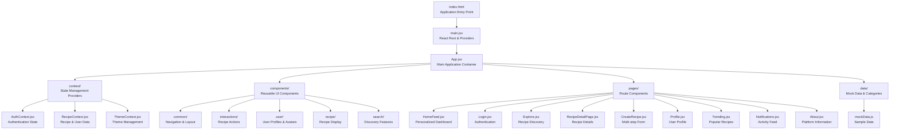
```mermaid
graph TB
A["index.html<br/>Application Entry Point"] --> B["main.jsx<br/>React Root & Providers"]
B --> C["App.jsx<br/>Main Application Container"]
C --> D["context/<br/>State Management Providers"]
D --> E["AuthContext.jsx<br/>Authentication State"]
D --> F["RecipeContext.jsx<br/>Recipe & User Data"]
D --> G["ThemeContext.jsx<br/>Theme Management"]
C --> H["components/<br/>Reusable UI Components"]
H --> I["common/<br/>Navigation & Layout"]
H --> J["interactions/<br/>Recipe Actions"]
H --> K["user/<br/>User Profiles & Avatars"]
H --> L["recipe/<br/>Recipe Display"]
H --> M["search/<br/>Discovery Features"]
C --> N["pages/<br/>Route Components"]
N --> O["HomeFeed.jsx<br/>Personalized Dashboard"]
N --> P["Login.jsx<br/>Authentication"]
N --> Q["Explore.jsx<br/>Recipe Discovery"]
N --> R["RecipeDetailPage.jsx<br/>Recipe Details"]
N --> S["CreateRecipe.jsx<br/>Multi-step Form"]
N --> T["Profile.jsx<br/>User Profile"]
N --> U["Trending.jsx<br/>Popular Recipes"]
N --> V["Notifications.jsx<br/>Activity Feed"]
N --> W["About.jsx<br/>Platform Information"]
C --> X["data/<br/>Mock Data & Categories"]
X --> Y["mockData.js<br/>Sample Data"]
```

**Diagram sources**
- [main.jsx:1-11](file://client/src/main.jsx#L1-L11)
- [App.jsx:1-94](file://client/src/App.jsx#L1-L94)
- [AuthContext.jsx:1-72](file://client/src/context/AuthContext.jsx#L1-L72)
- [RecipeContext.jsx:1-194](file://client/src/context/RecipeContext.jsx#L1-L194)
- [ThemeContext.jsx:1-43](file://client/src/context/ThemeContext.jsx#L1-L43)

**Section sources**
- [main.jsx:1-11](file://client/src/main.jsx#L1-L11)
- [App.jsx:1-94](file://client/src/App.jsx#L1-L94)

## Core Components
The application maintains its original interactive counter while expanding into a comprehensive component ecosystem with enhanced functionality:

### Interactive Counter Component
- **State Management**: Uses React's useState hook to manage numeric count with controlled updates
- **User Interaction**: Demonstrates immediate feedback through click handlers and re-rendering
- **Styling**: Inherits accent colors and transitions from CSS custom properties

### Enhanced Hero Asset System
- **Layered Composition**: Base PNG hero image with framework logos positioned absolutely
- **SVG Integration**: Framework logos imported and rendered with descriptive alt attributes
- **Responsive Positioning**: Absolute positioning with transform effects for layered visual appeal

### Documentation and Social Integration
- **External Links**: Vite and React documentation with inline framework logos
- **Social Media**: GitHub, Discord, X.com, and Bluesky links with SVG sprite icons
- **Accessibility**: Proper aria-hidden handling for decorative icons

**Section sources**
- [App.jsx:7-30](file://client/src/App.jsx#L7-L30)
- [App.jsx:13-17](file://client/src/App.jsx#L13-L17)
- [App.jsx:34-113](file://client/src/App.jsx#L34-L113)

## Architecture Overview
The application now operates on a sophisticated provider-based architecture with multiple context consumers and comprehensive page routing:

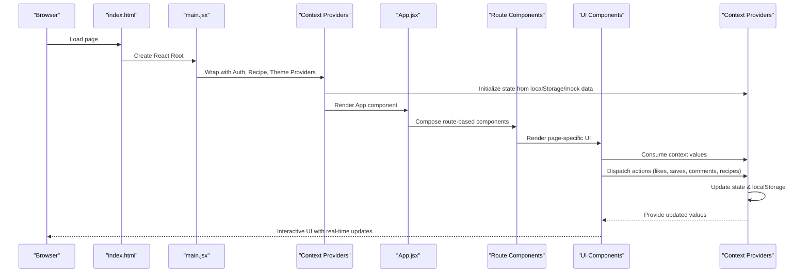
```mermaid
sequenceDiagram
participant Browser as "Browser"
participant HTML as "index.html"
participant Root as "main.jsx"
participant Providers as "Context Providers"
participant App as "App.jsx"
participant Routes as "Route Components"
participant Components as "UI Components"
participant Data as "Context Providers"
Browser->>HTML : Load page
HTML->>Root : Create React Root
Root->>Providers : Wrap with Auth, Recipe, Theme Providers
Providers->>Data : Initialize state from localStorage/mock data
Providers->>App : Render App component
App->>Routes : Compose route-based components
Routes->>Components : Render page-specific UI
Components->>Data : Consume context values
Components->>Data : Dispatch actions (likes, saves, comments, recipes)
Data->>Data : Update state & localStorage
Data-->>Components : Provide updated values
Components-->>Browser : Interactive UI with real-time updates
```

**Diagram sources**
- [main.jsx:1-11](file://client/src/main.jsx#L1-L11)
- [AuthContext.jsx:5-62](file://client/src/context/AuthContext.jsx#L5-L62)
- [RecipeContext.jsx:6-183](file://client/src/context/RecipeContext.jsx#L6-L183)
- [ThemeContext.jsx:5-33](file://client/src/context/ThemeContext.jsx#L5-L33)

## Detailed Component Analysis

### Interactive Counter Component
The counter demonstrates fundamental React state management patterns:

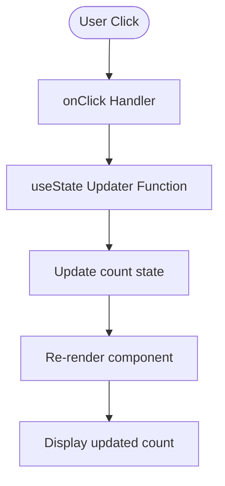
```mermaid
flowchart TD
Start(["User Click"]) --> Handler["onClick Handler"]
Handler --> Updater["useState Updater Function"]
Updater --> StateChange["Update count state"]
StateChange --> ReRender["Re-render component"]
ReRender --> Display["Display updated count"]
```

**Diagram sources**
- [App.jsx:24-29](file://client/src/App.jsx#L24-L29)
- [App.jsx:8](file://client/src/App.jsx#L8)

**Section sources**
- [App.jsx:7-30](file://client/src/App.jsx#L7-L30)

### Asset Loading System
Enhanced asset management with improved organization:

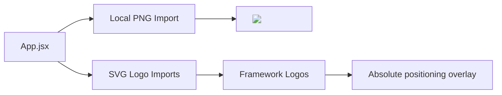
```mermaid
graph LR
A["App.jsx"] --> B["Local PNG Import"]
A --> C["SVG Logo Imports"]
B --> D["<img src={heroImg}>"]
C --> E["Framework Logos"]
E --> F["Absolute positioning overlay"]
```

**Diagram sources**
- [App.jsx:2-4](file://client/src/App.jsx#L2-L4)
- [App.jsx:13-17](file://client/src/App.jsx#L13-L17)

**Section sources**
- [App.jsx:2-4](file://client/src/App.jsx#L2-L4)
- [App.jsx:13-17](file://client/src/App.jsx#L13-L17)

### Responsive Design with CSS Custom Properties
The responsive system has been expanded to support the new component library:

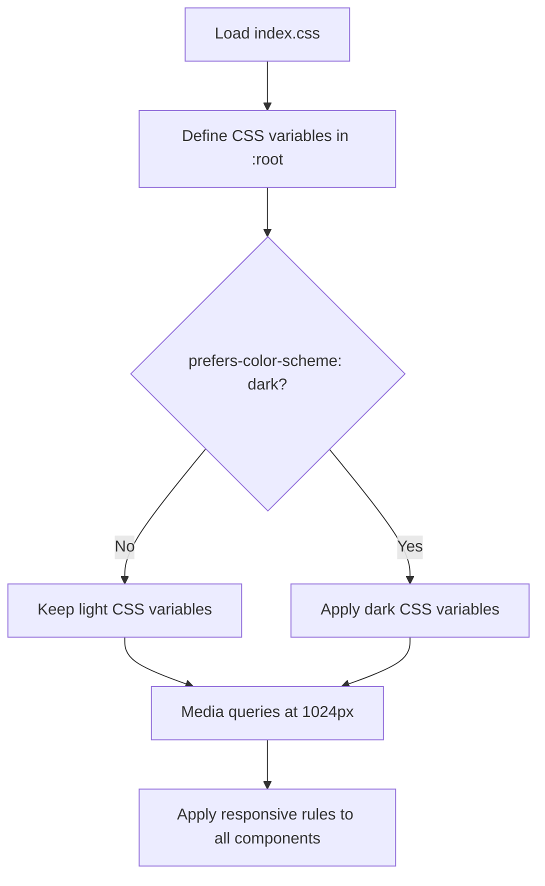
```mermaid
flowchart TD
Init["Load index.css"] --> DefineVars["Define CSS variables in :root"]
DefineVars --> DarkQuery{"prefers-color-scheme: dark?"}
DarkQuery --> |Yes| DarkTheme["Apply dark CSS variables"]
DarkQuery --> |No| LightTheme["Keep light CSS variables"]
LightTheme --> MQ["Media queries at 1024px"]
DarkTheme --> MQ
MQ --> ApplyRules["Apply responsive rules to all components"]
```

**Diagram sources**
- [index.css:1-31](file://client/src/index.css#L1-L31)
- [index.css:33-51](file://client/src/index.css#L33-L51)

**Section sources**
- [index.css:1-112](file://client/src/index.css#L1-L112)

### Dark/Light Theme Support
Enhanced theme management with persistent storage:

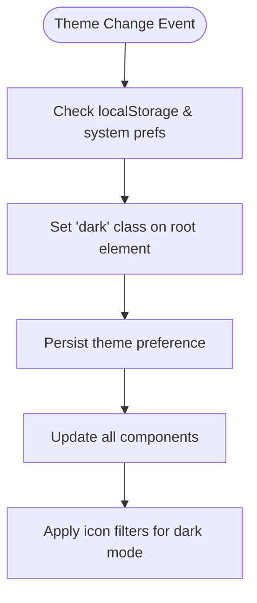
```mermaid
flowchart TD
Start(["Theme Change Event"]) --> Detect["Check localStorage & system prefs"]
Detect --> SetClass["Set 'dark' class on root element"]
SetClass --> Store["Persist theme preference"]
Store --> Update["Update all components"]
Update --> Icons["Apply icon filters for dark mode"]
```

**Diagram sources**
- [ThemeContext.jsx:6-23](file://client/src/context/ThemeContext.jsx#L6-L23)
- [ThemeContext.jsx:25-27](file://client/src/context/ThemeContext.jsx#L25-L27)

**Section sources**
- [ThemeContext.jsx:1-43](file://client/src/context/ThemeContext.jsx#L1-L43)

### Social Media Integration
Comprehensive social integration with proper accessibility:

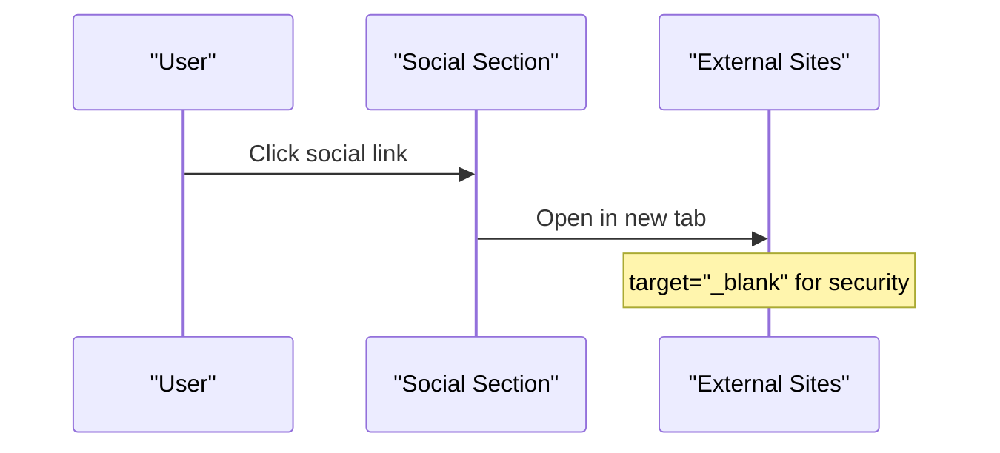
```mermaid
sequenceDiagram
participant User as "User"
participant Social as "Social Section"
participant External as "External Sites"
User->>Social : Click social link
Social->>External : Open in new tab
Note over External : target="_blank" for security
```

**Diagram sources**
- [App.jsx:62-111](file://client/src/App.jsx#L62-L111)

**Section sources**
- [App.jsx:34-113](file://client/src/App.jsx#L34-L113)

## Context Providers and State Management

### Authentication Context (AuthContext)
Manages user authentication state with persistence:

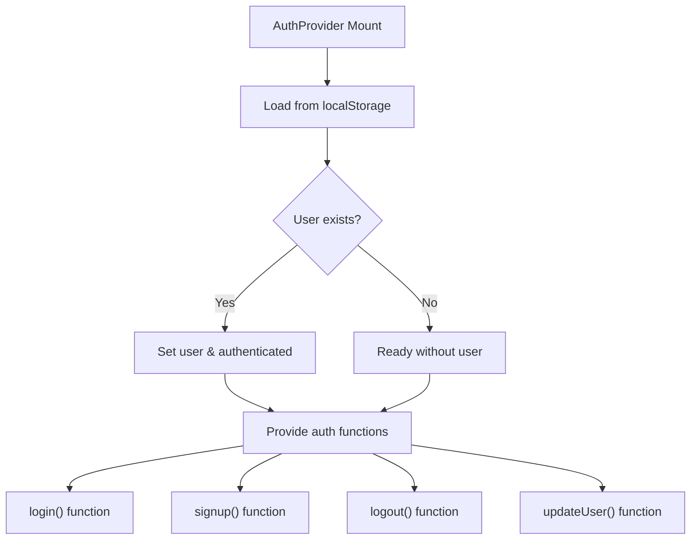
```mermaid
flowchart TD
Init["AuthProvider Mount"] --> Load["Load from localStorage"]
Load --> Check{"User exists?"}
Check --> |Yes| SetState["Set user & authenticated"]
Check --> |No| Ready["Ready without user"]
SetState --> Provide["Provide auth functions"]
Ready --> Provide
Provide --> Login["login() function"]
Provide --> Signup["signup() function"]
Provide --> Logout["logout() function"]
Provide --> UpdateUser["updateUser() function"]
```

**Diagram sources**
- [AuthContext.jsx:10-17](file://client/src/context/AuthContext.jsx#L10-L17)
- [AuthContext.jsx:19-48](file://client/src/context/AuthContext.jsx#L19-L48)

### Recipe Context (RecipeContext)
Centralized state management for recipes, users, and interactions with comprehensive CRUD operations:

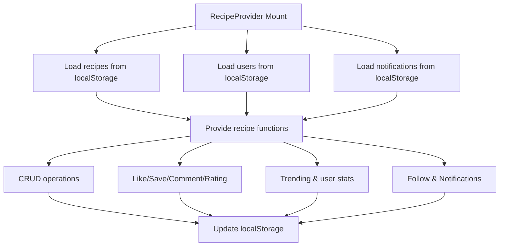
```mermaid
flowchart TD
Init["RecipeProvider Mount"] --> LoadRecipes["Load recipes from localStorage"]
Init --> LoadUsers["Load users from localStorage"]
Init --> LoadNotifications["Load notifications from localStorage"]
LoadRecipes --> Provide["Provide recipe functions"]
LoadUsers --> Provide
LoadNotifications --> Provide
Provide --> CRUD["CRUD operations"]
Provide --> Interactions["Like/Save/Comment/Rating"]
Provide --> Analytics["Trending & user stats"]
Provide --> Social["Follow & Notifications"]
CRUD --> UpdateLocalStorage["Update localStorage"]
Interactions --> UpdateLocalStorage
Analytics --> UpdateLocalStorage
Social --> UpdateLocalStorage
```

**Diagram sources**
- [RecipeContext.jsx:7-32](file://client/src/context/RecipeContext.jsx#L7-L32)
- [RecipeContext.jsx:34-156](file://client/src/context/RecipeContext.jsx#L34-L156)

### Theme Context (ThemeContext)
Persistent theme management with system preference detection:

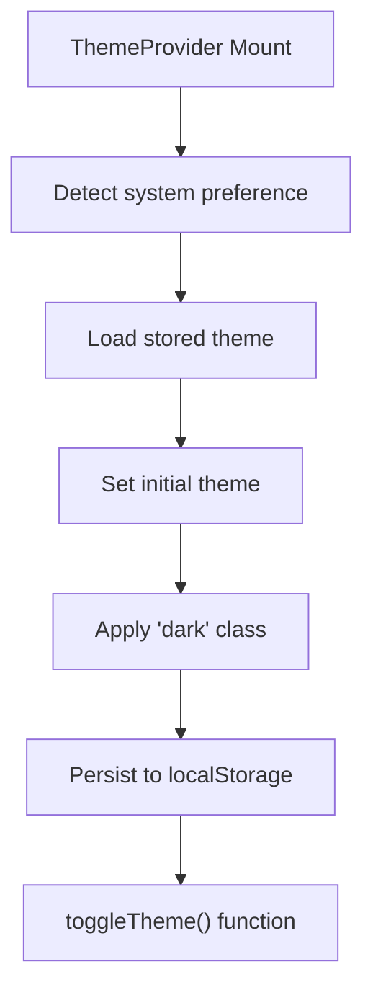
```mermaid
flowchart TD
Init["ThemeProvider Mount"] --> Detect["Detect system preference"]
Detect --> LoadStored["Load stored theme"]
LoadStored --> SetTheme["Set initial theme"]
SetTheme --> ApplyClass["Apply 'dark' class"]
ApplyClass --> Persist["Persist to localStorage"]
Persist --> Toggle["toggleTheme() function"]
```

**Diagram sources**
- [ThemeContext.jsx:6-23](file://client/src/context/ThemeContext.jsx#L6-L23)
- [ThemeContext.jsx:25-27](file://client/src/context/ThemeContext.jsx#L25-L27)

**Section sources**
- [AuthContext.jsx:1-72](file://client/src/context/AuthContext.jsx#L1-L72)
- [RecipeContext.jsx:1-194](file://client/src/context/RecipeContext.jsx#L1-L194)
- [ThemeContext.jsx:1-43](file://client/src/context/ThemeContext.jsx#L1-L43)

## Component Library Overview

### Common Components
The common component library provides foundational UI elements with enhanced functionality:

#### Navigation Components
- **Navbar**: Responsive navigation with mobile menu, authentication-aware routing, notification badges, and animated interactions
- **Footer**: Standard footer component for consistent layout
- **ThemeToggle**: Interactive theme switching with animation
- **ProtectedRoute**: Route protection for authenticated-only pages

#### User Interface Elements
- **UserAvatar**: Flexible avatar component with size variants, fallback initials, and gradient backgrounds
- **ProfileHeader**: User profile header with stats, follow controls, and social information

**Section sources**
- [Navbar.jsx:1-206](file://client/src/components/common/Navbar.jsx#L1-L206)
- [ThemeToggle.jsx](file://client/src/components/common/ThemeToggle.jsx)
- [ProtectedRoute.jsx](file://client/src/components/common/ProtectedRoute.jsx)
- [UserAvatar.jsx](file://client/src/components/user/UserAvatar.jsx)
- [ProfileHeader.jsx](file://client/src/components/user/ProfileHeader.jsx)

## Recipe Creation System

### Multi-Step Recipe Creation
The CreateRecipe component provides a comprehensive multi-step form for recipe creation with validation and state management:

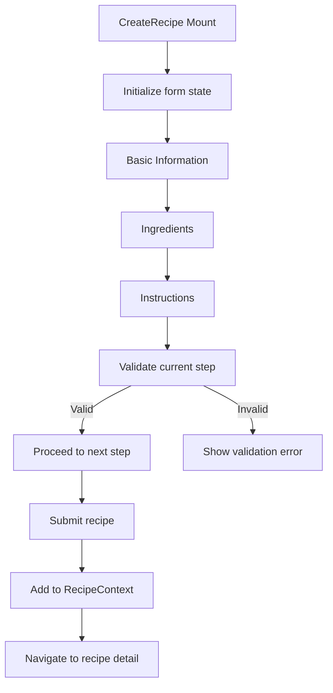
```mermaid
flowchart TD
Mount["CreateRecipe Mount"] --> InitForm["Initialize form state"]
InitForm --> Step1["Basic Information"]
Step1 --> Step2["Ingredients"]
Step2 --> Step3["Instructions"]
Step3 --> Validate["Validate current step"]
Validate --> |Valid| NextStep["Proceed to next step"]
Validate --> |Invalid| ShowError["Show validation error"]
NextStep --> Submit["Submit recipe"]
Submit --> AddRecipe["Add to RecipeContext"]
AddRecipe --> Navigate["Navigate to recipe detail"]
```

**Diagram sources**
- [CreateRecipe.jsx:18-130](file://client/src/pages/CreateRecipe.jsx#L18-L130)
- [CreateRecipe.jsx:101-117](file://client/src/pages/CreateRecipe.jsx#L101-L117)

### Form State Management
Advanced form handling with dynamic ingredient and instruction management:

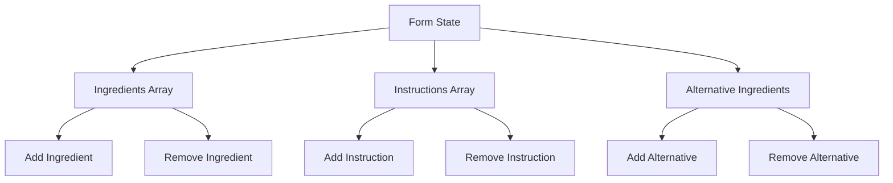
```mermaid
flowchart TD
FormData["Form State"] --> Ingredients["Ingredients Array"]
FormData --> Instructions["Instructions Array"]
FormData --> AltIngredients["Alternative Ingredients"]
Ingredients --> AddIng["Add Ingredient"]
Ingredients --> RemoveIng["Remove Ingredient"]
Instructions --> AddInst["Add Instruction"]
Instructions --> RemoveInst["Remove Instruction"]
AltIngredients --> AddAlt["Add Alternative"]
AltIngredients --> RemoveAlt["Remove Alternative"]
```

**Diagram sources**
- [CreateRecipe.jsx:38-100](file://client/src/pages/CreateRecipe.jsx#L38-L100)

**Section sources**
- [CreateRecipe.jsx:1-519](file://client/src/pages/CreateRecipe.jsx#L1-L519)

## Recipe Interaction System

### LikeButton Component
Interactive recipe liking with animations and notifications:

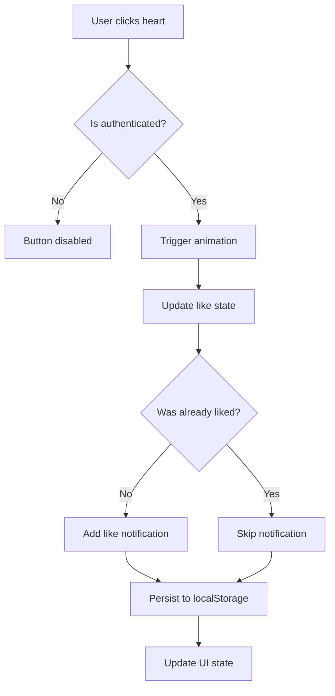
```mermaid
flowchart TD
Click["User clicks heart"] --> CheckAuth{"Is authenticated?"}
CheckAuth --> |No| Disabled["Button disabled"]
CheckAuth --> |Yes| Animate["Trigger animation"]
Animate --> UpdateState["Update like state"]
UpdateState --> CheckExisting{"Was already liked?"}
CheckExisting --> |No| AddNotification["Add like notification"]
CheckExisting --> |Yes| Skip["Skip notification"]
AddNotification --> Persist["Persist to localStorage"]
Skip --> Persist
Persist --> UpdateUI["Update UI state"]
```

**Diagram sources**
- [LikeButton.jsx:21-40](file://client/src/components/interactions/LikeButton.jsx#L21-L40)
- [LikeButton.jsx:42-71](file://client/src/components/interactions/LikeButton.jsx#L42-L71)

### SaveButton Component
Recipe saving functionality with visual feedback:

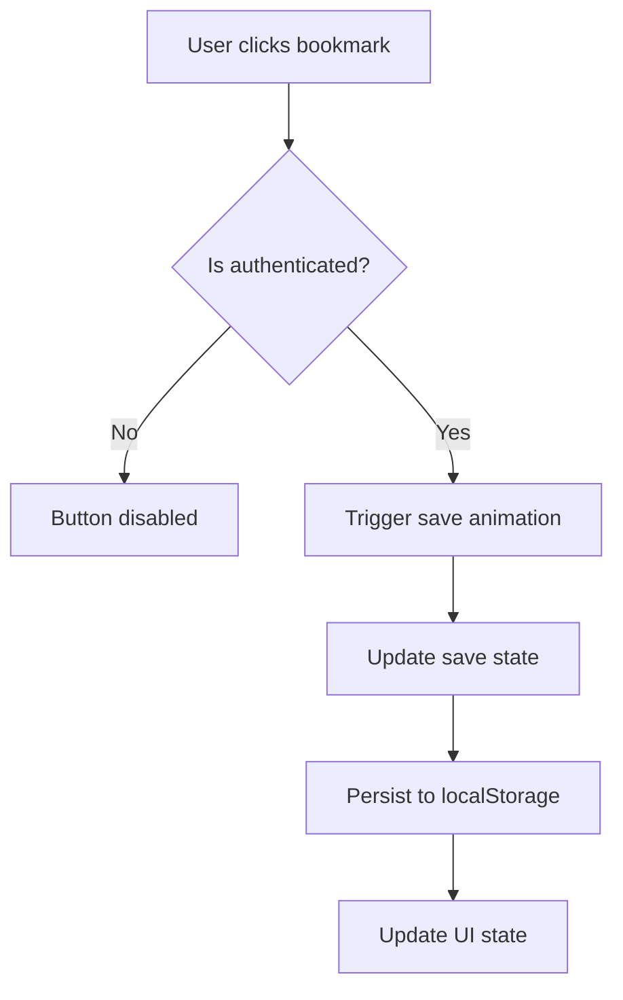
```mermaid
flowchart TD
Click["User clicks bookmark"] --> CheckAuth{"Is authenticated?"}
CheckAuth --> |No| Disabled["Button disabled"]
CheckAuth --> |Yes| Animate["Trigger save animation"]
Animate --> UpdateState["Update save state"]
UpdateState --> Persist["Persist to localStorage"]
Persist --> UpdateUI["Update UI state"]
```

**Diagram sources**
- [SaveButton.jsx:20-26](file://client/src/components/interactions/SaveButton.jsx#L20-L26)
- [SaveButton.jsx:28-50](file://client/src/components/interactions/SaveButton.jsx#L28-L50)

### CommentSection Component
Rich comment system with real-time updates and user avatars:

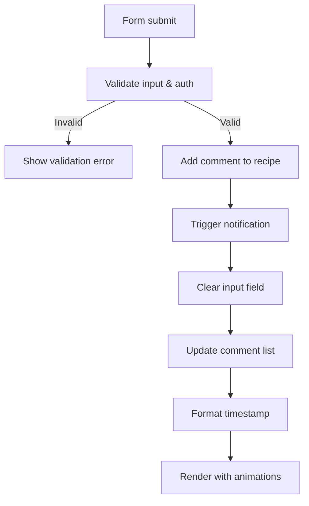
```mermaid
flowchart TD
Submit["Form submit"] --> Validate["Validate input & auth"]
Validate --> |Invalid| ShowError["Show validation error"]
Validate --> |Valid| AddComment["Add comment to recipe"]
AddComment --> TriggerNotify["Trigger notification"]
TriggerNotify --> ClearInput["Clear input field"]
ClearInput --> UpdateList["Update comment list"]
UpdateList --> FormatDate["Format timestamp"]
FormatDate --> Render["Render with animations"]
```

**Diagram sources**
- [CommentSection.jsx:14-31](file://client/src/components/interactions/CommentSection.jsx#L14-L31)
- [CommentSection.jsx:72-109](file://client/src/components/interactions/CommentSection.jsx#L72-L109)

### RatingStars Component
Interactive star rating system with precision:

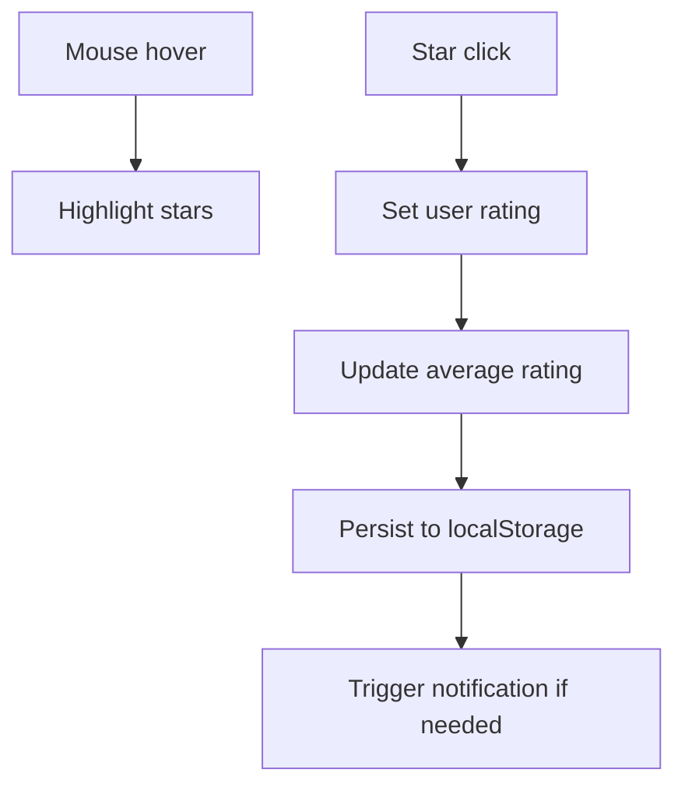
```mermaid
flowchart TD
Hover["Mouse hover"] --> Highlight["Highlight stars"]
Click["Star click"] --> SetRating["Set user rating"]
SetRating --> UpdateAvg["Update average rating"]
UpdateAvg --> Persist["Persist to localStorage"]
Persist --> Notify["Trigger notification if needed"]
```

**Diagram sources**
- [RatingStars.jsx](file://client/src/components/interactions/RatingStars.jsx)

**Section sources**
- [LikeButton.jsx:1-73](file://client/src/components/interactions/LikeButton.jsx#L1-L73)
- [SaveButton.jsx:1-53](file://client/src/components/interactions/SaveButton.jsx#L1-L53)
- [CommentSection.jsx:1-140](file://client/src/components/interactions/CommentSection.jsx#L1-L140)
- [RatingStars.jsx](file://client/src/components/interactions/RatingStars.jsx)

## User Interaction Components

### FollowButton Component
Social following system with mutual relationship tracking:

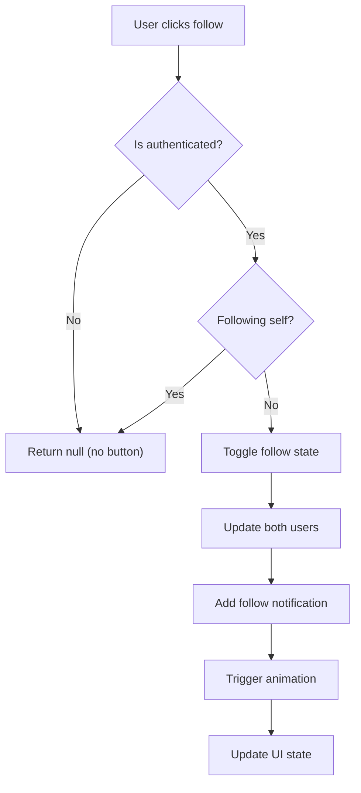
```mermaid
flowchart TD
Click["User clicks follow"] --> CheckAuth{"Is authenticated?"}
CheckAuth --> |No| ReturnNull["Return null (no button)"]
CheckAuth --> |Yes| CheckSelf{"Following self?"}
CheckSelf --> |Yes| ReturnNull
CheckSelf --> |No| ToggleFollow["Toggle follow state"]
ToggleFollow --> UpdateBoth["Update both users"]
UpdateBoth --> AddNotification["Add follow notification"]
AddNotification --> Animate["Trigger animation"]
Animate --> UpdateUI["Update UI state"]
```

**Diagram sources**
- [FollowButton.jsx:12-37](file://client/src/components/user/FollowButton.jsx#L12-L37)
- [FollowButton.jsx:39-61](file://client/src/components/user/FollowButton.jsx#L39-L61)

### UserAvatar Component
Flexible avatar system with fallbacks and sizing:

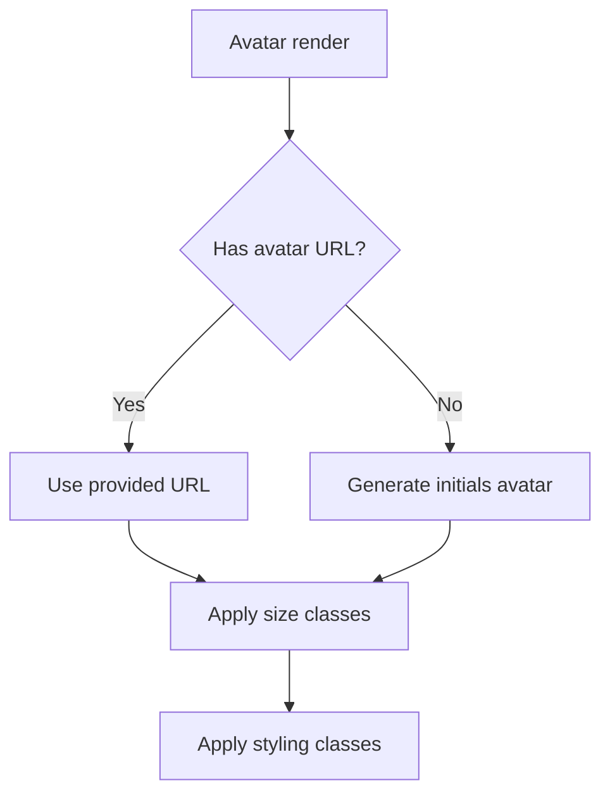
```mermaid
flowchart TD
Render["Avatar render"] --> CheckSrc{"Has avatar URL?"}
CheckSrc --> |Yes| UseURL["Use provided URL"]
CheckSrc --> |No| GenerateInitials["Generate initials avatar"]
UseURL --> ApplySize["Apply size classes"]
GenerateInitials --> ApplySize
ApplySize --> ApplyStyles["Apply styling classes"]
```

**Diagram sources**
- [UserAvatar.jsx](file://client/src/components/user/UserAvatar.jsx)

**Section sources**
- [FollowButton.jsx:1-64](file://client/src/components/user/FollowButton.jsx#L1-L64)
- [UserAvatar.jsx](file://client/src/components/user/UserAvatar.jsx)

## Navigation and Routing

### Enhanced Navigation System
Sophisticated navigation with authentication awareness and real-time notifications:

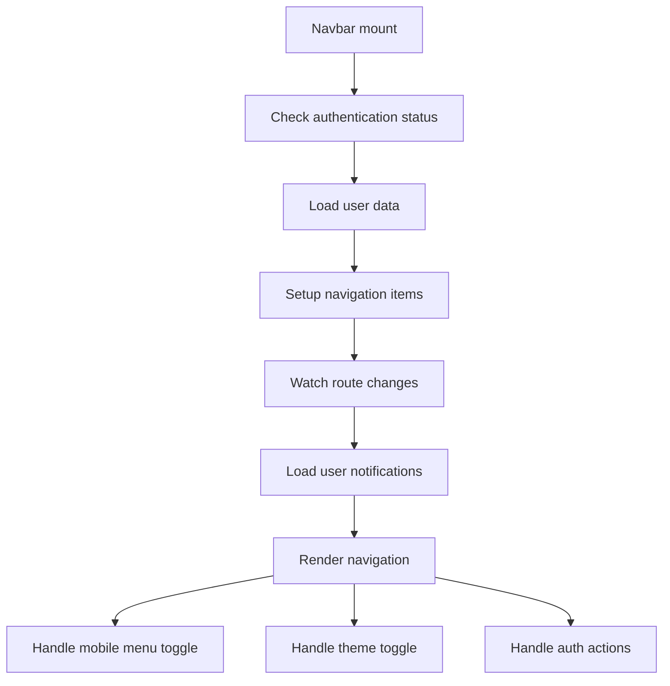
```mermaid
flowchart TD
Mount["Navbar mount"] --> CheckAuth["Check authentication status"]
CheckAuth --> LoadUser["Load user data"]
LoadUser --> SetupNav["Setup navigation items"]
SetupNav --> WatchLocation["Watch route changes"]
WatchLocation --> LoadNotifications["Load user notifications"]
LoadNotifications --> Render["Render navigation"]
Render --> MobileToggle["Handle mobile menu toggle"]
Render --> ThemeToggle["Handle theme toggle"]
Render --> AuthActions["Handle auth actions"]
```

**Diagram sources**
- [Navbar.jsx:21-44](file://client/src/components/common/Navbar.jsx#L21-L44)
- [Navbar.jsx:65-91](file://client/src/components/common/Navbar.jsx#L65-L91)

### ProtectedRoute Component
Route protection mechanism with authentication flow:

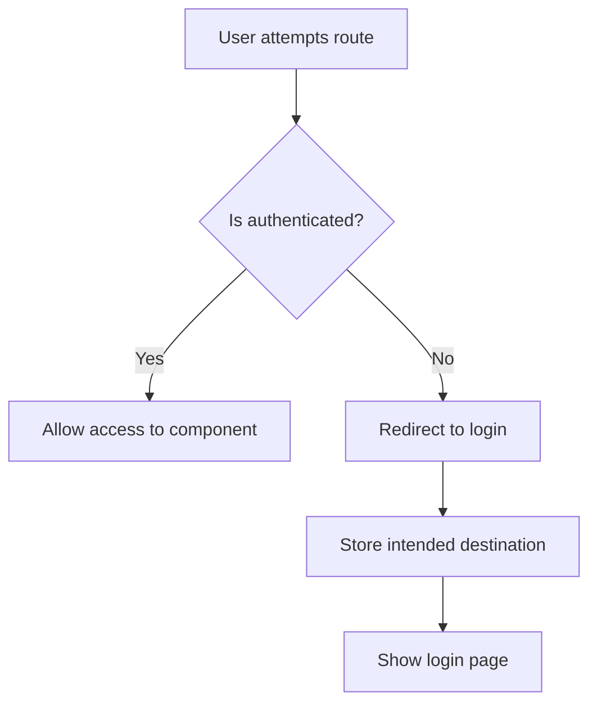
```mermaid
flowchart TD
AccessRoute["User attempts route"] --> CheckAuth{"Is authenticated?"}
CheckAuth --> |Yes| Allow["Allow access to component"]
CheckAuth --> |No| Redirect["Redirect to login"]
Redirect --> StoreReferrer["Store intended destination"]
StoreReferrer --> ShowLogin["Show login page"]
```

**Diagram sources**
- [ProtectedRoute.jsx](file://client/src/components/common/ProtectedRoute.jsx)

**Section sources**
- [Navbar.jsx:1-206](file://client/src/components/common/Navbar.jsx#L1-L206)
- [ProtectedRoute.jsx](file://client/src/components/common/ProtectedRoute.jsx)

## Search and Discovery Features

### Advanced Search and Filtering
Comprehensive recipe discovery system with multiple filter criteria:

```mermaid
flowchart TD
UserInput["User search input"] --> Debounce["Debounce input"]
Debounce --> FilterRecipes["Filter recipes by criteria"]
FilterRecipes --> CategoryFilter["Apply cuisine filter"]
CategoryFilter --> SortRecipes["Sort by criteria"]
SortRecipes --> UpdateResults["Update filtered results"]
UpdateResults --> RenderGrid["Render recipe grid"]
```

**Diagram sources**
- [Explore.jsx:15-44](file://client/src/pages/Explore.jsx#L15-L44)
- [SearchBar.jsx](file://client/src/components/search/SearchBar.jsx)
- [CategoryFilter.jsx](file://client/src/components/search/CategoryFilter.jsx)

### Recipe Discovery Algorithms
Smart recipe recommendation and trending systems:

```mermaid
flowchart TD
GetRecipes["Get all recipes"] --> Trending["Calculate trending score"]
Trending --> Popular["Sort by popularity"]
Popular --> Personalized["Personalize for user"]
Personalized --> Display["Display recommendations"]
```

**Diagram sources**
- [Explore.jsx:37-41](file://client/src/pages/Explore.jsx#L37-L41)
- [Trending.jsx:11-17](file://client/src/pages/Trending.jsx#L11-L17)

**Section sources**
- [Explore.jsx:1-133](file://client/src/pages/Explore.jsx#L1-L133)
- [SearchBar.jsx](file://client/src/components/search/SearchBar.jsx)
- [CategoryFilter.jsx](file://client/src/components/search/CategoryFilter.jsx)

## User Profile Management

### Comprehensive Profile System
User profile management with recipe collections and social metrics:

```mermaid
flowchart TD
ProfileMount["Profile mount"] --> GetUser["Get user data"]
GetUser --> LoadRecipes["Load user recipes"]
LoadRecipes --> LoadCollections["Load saved/liked recipes"]
LoadCollections --> SetupTabs["Setup tab navigation"]
SetupTabs --> RenderProfile["Render profile header"]
RenderProfile --> TabContent["Render tab content"]
TabContent --> RecipeGrid["Display recipe grid"]
```

**Diagram sources**
- [Profile.jsx:10-52](file://client/src/pages/Profile.jsx#L10-L52)
- [ProfileHeader.jsx:7-28](file://client/src/components/user/ProfileHeader.jsx#L7-L28)

### Profile Header Component
Enhanced user profile header with social statistics:

```mermaid
flowchart TD
RenderHeader["Render profile header"] --> CheckUser["Verify user exists"]
CheckUser --> LoadStats["Load user statistics"]
LoadStats --> RenderInfo["Render user info"]
RenderInfo --> RenderFollow["Render follow button"]
RenderFollow --> RenderBio["Render bio & join date"]
RenderBio --> RenderStats["Render stats cards"]
```

**Diagram sources**
- [ProfileHeader.jsx:30-87](file://client/src/components/user/ProfileHeader.jsx#L30-L87)

**Section sources**
- [Profile.jsx:1-121](file://client/src/pages/Profile.jsx#L1-L121)
- [ProfileHeader.jsx:1-87](file://client/src/components/user/ProfileHeader.jsx#L1-L87)

## Social Features and Notifications

### Real-Time Notifications System
Comprehensive notifications system with multiple notification types:

```mermaid
flowchart TD
GetNotifications["Get user notifications"] --> FilterUnread["Filter unread notifications"]
FilterUnread --> SortByTime["Sort by creation time"]
SortByTime --> RenderList["Render notification list"]
RenderList --> IndividualNotif["Render individual notification"]
IndividualNotif --> CheckType["Check notification type"]
CheckType --> |like| LikeIcon["Render heart icon"]
CheckType --> |comment| CommentIcon["Render message icon"]
CheckType --> |follow| FollowIcon["Render user plus icon"]
CheckType --> |recipe| RecipeIcon["Render chef hat icon"]
```

**Diagram sources**
- [Notifications.jsx:15-41](file://client/src/pages/Notifications.jsx#L15-L41)
- [Notifications.jsx:99-133](file://client/src/pages/Notifications.jsx#L99-L133)

### Notification Management
Notification state management and user interactions:

```mermaid
flowchart TD
UserAction["User action"] --> GetNotifs["Get notifications"]
GetNotifs --> MarkRead["Mark as read"]
MarkRead --> UpdateState["Update notification state"]
UpdateState --> UpdateUI["Update UI immediately"]
UpdateUI --> Persist["Persist to localStorage"]
```

**Diagram sources**
- [Notifications.jsx:86-93](file://client/src/pages/Notifications.jsx#L86-L93)
- [RecipeContext.jsx:145-149](file://client/src/context/RecipeContext.jsx#L145-L149)

**Section sources**
- [Notifications.jsx:1-150](file://client/src/pages/Notifications.jsx#L1-L150)
- [RecipeContext.jsx:132-149](file://client/src/context/RecipeContext.jsx#L132-L149)

## Recipe Discovery and Trending

### Trending Algorithm
Sophisticated trending recipe calculation:

```mermaid
flowchart TD
GetRecipes["Get all recipes"] --> CalculateScore["Calculate engagement score"]
CalculateScore --> WeightLikes["Weight likes by recency"]
WeightLikes --> WeightSaves["Weight saves by recency"]
WeightSaves --> WeightRatings["Weight ratings by recency"]
WeightRatings --> CombineScores["Combine weighted scores"]
CombineScores --> SortTrending["Sort by trending score"]
SortTrending --> ReturnTop["Return top trending recipes"]
```

**Diagram sources**
- [Trending.jsx:11-17](file://client/src/pages/Trending.jsx#L11-L17)
- [RecipeContext.jsx:156](file://client/src/context/RecipeContext.jsx#L156)

### Recipe Detail Enhancement
Comprehensive recipe detail page with all interactive features:

```mermaid
flowchart TD
LoadRecipe["Load recipe by ID"] --> LoadAuthor["Load recipe author"]
LoadAuthor --> CheckExists{"Recipe exists?"}
CheckExists --> |No| ShowNotFound["Show not found page"]
CheckExists --> |Yes| RenderDetail["Render recipe detail"]
RenderDetail --> LoadInteractions["Load user interactions"]
LoadInteractions --> RenderHero["Render hero image"]
RenderHero --> RenderMeta["Render metadata"]
RenderMeta --> RenderContent["Render content sections"]
RenderContent --> RenderInteractions["Render interactive components"]
```

**Diagram sources**
- [RecipeDetailPage.jsx:20-46](file://client/src/pages/RecipeDetailPage.jsx#L20-L46)
- [RecipeDetailPage.jsx:67-115](file://client/src/pages/RecipeDetailPage.jsx#L67-L115)

**Section sources**
- [Trending.jsx:1-139](file://client/src/pages/Trending.jsx#L1-L139)
- [RecipeDetailPage.jsx:1-244](file://client/src/pages/RecipeDetailPage.jsx#L1-L244)

## Authentication and Authorization

### Enhanced Authentication Flow
Comprehensive authentication interface with form validation:

```mermaid
flowchart TD
Mount["Login component mount"] --> InitForm["Initialize form state"]
InitForm --> HandleInput["Handle input changes"]
HandleInput --> ValidateForm["Validate form inputs"]
ValidateForm --> |Invalid| ShowErrors["Show validation errors"]
ValidateForm --> |Valid| SubmitForm["Submit authentication request"]
SubmitForm --> CheckUser["Check user credentials"]
CheckUser --> |Valid| LoginSuccess["Successful login"]
CheckUser --> |Invalid| ShowError["Show invalid credentials error"]
LoginSuccess --> NavigateHome["Navigate to home"]
```

**Diagram sources**
- [Login.jsx:21-60](file://client/src/pages/Login.jsx#L21-L60)
- [Login.jsx:96-183](file://client/src/pages/Login.jsx#L96-L183)

### Authentication State Management
End-to-end authentication process with context integration:

```mermaid
sequenceDiagram
participant User as "User"
participant Login as "Login Page"
participant AuthCtx as "Auth Context"
participant Router as "Router"
participant Home as "Home Feed"
User->>Login : Enter credentials
Login->>AuthCtx : Call login() with user data
AuthCtx->>AuthCtx : Store user in state & localStorage
AuthCtx->>Router : Trigger navigation
Router->>Home : Render home feed
Home->>User : Display personalized content
```

**Diagram sources**
- [Login.jsx:40-60](file://client/src/pages/Login.jsx#L40-L60)
- [AuthContext.jsx:19-23](file://client/src/context/AuthContext.jsx#L19-L23)

**Section sources**
- [Login.jsx:1-218](file://client/src/pages/Login.jsx#L1-L218)
- [AuthContext.jsx:1-72](file://client/src/context/AuthContext.jsx#L1-L72)

## Dependency Analysis
The application has evolved to use modern React patterns with comprehensive dependencies and enhanced functionality:

```mermaid
graph TB
Pkg["package.json<br/>React 18.2.0, React DOM 18.2.0"] --> Vite["vite.config.js<br/>React plugin & dev server"]
Vite --> Dev["Development Server"]
Pkg --> Router["react-router-dom<br/>v6.22.0"]
Pkg --> Icons["lucide-react<br/>v0.365.0"]
Pkg --> Motion["framer-motion<br/>v10.16.4"]
Pkg --> Context["React Context API<br/>Built-in"]
Router --> Pages["Page Components"]
Icons --> UI["SVG Icons"]
Motion --> Animations["Smooth Animations"]
Context --> State["Global State Management"]
```

**Diagram sources**
- [package.json:1-28](file://client/package.json#L1-L28)
- [vite.config.js:1-8](file://client/vite.config.js#L1-L8)
- [Navbar.jsx:3](file://client/src/components/common/Navbar.jsx#L3)

**Section sources**
- [package.json:1-28](file://client/package.json#L1-L28)
- [vite.config.js:1-8](file://client/vite.config.js#L1-L8)

## Performance Considerations
Enhanced performance optimizations for the expanded component library with comprehensive state management:

### State Persistence
- **Local Storage Integration**: All context providers persist state to localStorage for seamless reloads
- **Efficient Updates**: Context updates trigger minimal re-renders through selective state management
- **Memoization**: Strategic useMemo usage for computed values like trending recipes and filtered results

### Component Optimization
- **React.memo**: Strategic memoization for expensive components like RecipeCard and RecipeGrid
- **Lazy Loading**: Dynamic imports for non-critical components
- **Virtual Scrolling**: For large recipe lists and comment sections
- **Optimized Rendering**: Conditional rendering based on user authentication status

### Asset Management
- **Image Optimization**: Responsive image loading with appropriate sizing and lazy loading
- **SVG Optimization**: Single sprite file for icon reuse with lucide-react
- **Bundle Splitting**: Code splitting for route-based lazy loading and component optimization

### Animation Performance
- **Hardware Acceleration**: CSS transforms for smooth animations
- **Motion Optimizations**: Efficient framer-motion configurations with staggered animations
- **Reduced Reflows**: Optimized layout calculations and batched state updates

## Troubleshooting Guide
Comprehensive troubleshooting for the expanded component library with new features:

### Authentication Issues
- **Login Failures**: Verify mock user data matches entered credentials in mockData.js
- **Session Persistence**: Check localStorage availability and quota limits for auth state
- **Protected Routes**: Ensure AuthContext is properly wrapped around App with all providers

### State Management Problems
- **Context Not Found**: Verify all components are wrapped in respective providers (ThemeProvider, AuthProvider, RecipeProvider)
- **State Not Updating**: Check for proper context consumption and provider setup
- **Data Loss**: Confirm localStorage is enabled and accessible for state persistence

### Component Rendering Issues
- **Missing Icons**: Verify lucide-react installation and SVG icon imports
- **Animation Problems**: Check framer-motion version compatibility and animation configurations
- **Responsive Breakpoints**: Ensure CSS custom properties are properly defined and media queries are working
- **Form Validation**: Verify form state management and validation logic in CreateRecipe component

### Performance Issues
- **Slow Initial Load**: Implement code splitting for large components and optimize image loading
- **Memory Leaks**: Check for proper cleanup in useEffect hooks and cleanup functions
- **Excessive Re-renders**: Use React.memo, useMemo, and useCallback strategically
- **Large Lists**: Implement virtual scrolling for recipe grids and comment sections

### New Feature Issues
- **Recipe Creation**: Verify form validation and state updates in CreateRecipe component
- **Search Functionality**: Check debouncing and filtering logic in Explore page
- **Notifications**: Ensure notification state updates and localStorage persistence
- **Profile Management**: Verify user data loading and recipe collection functionality

**Section sources**
- [AuthContext.jsx:65-71](file://client/src/context/AuthContext.jsx#L65-L71)
- [RecipeContext.jsx:187-193](file://client/src/context/RecipeContext.jsx#L187-L193)
- [ThemeContext.jsx:36-42](file://client/src/context/ThemeContext.jsx#L36-L42)

## Conclusion
The Flavora application has evolved into a comprehensive recipe-sharing platform with a robust component library and sophisticated state management. Key achievements include:

- **Complete Component Ecosystem**: From basic interactions to complex recipe management and social features
- **Modern React Patterns**: Context providers, hooks, component composition, and page-based architecture
- **Enhanced User Experience**: Multi-step recipe creation, real-time notifications, and personalized feeds
- **Advanced Discovery Features**: Intelligent search, filtering, and trending algorithms
- **Scalable Architecture**: Modular structure supporting future feature additions and performance optimizations
- **Comprehensive State Management**: Persistent local storage, efficient updates, and cross-component communication
- **Performance Optimization**: Memoization, lazy loading, virtual scrolling, and hardware-accelerated animations

The application demonstrates best practices in React development while providing a solid foundation for continued growth and feature expansion with its comprehensive recipe management, social interaction, and discovery capabilities.

## Appendices
- **Development Workflow**: Use Vite's hot module replacement for rapid iteration and testing
- **Component Extension**: Follow established patterns for adding new components and pages
- **State Management**: Leverage context providers for cross-component communication and data persistence
- **Testing Strategy**: Implement unit tests for critical business logic, form validation, and component interactions
- **Performance Monitoring**: Use React DevTools Profiler to identify optimization opportunities
- **Accessibility**: Ensure proper ARIA labels, keyboard navigation, and screen reader support across all components

**Section sources**
- [README.md:1-17](file://client/README.md#L1-L17)
- [vite.config.js:1-8](file://client/vite.config.js#L1-L8)
- [mockData.js:1-363](file://client/src/data/mockData.js#L1-L363)