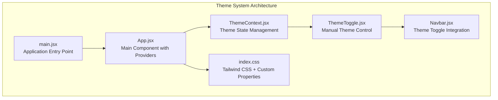
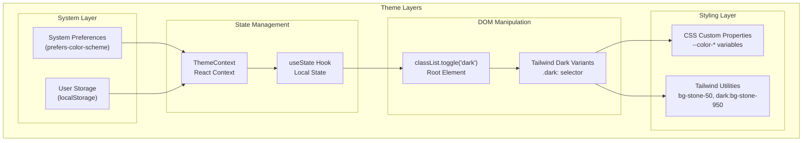
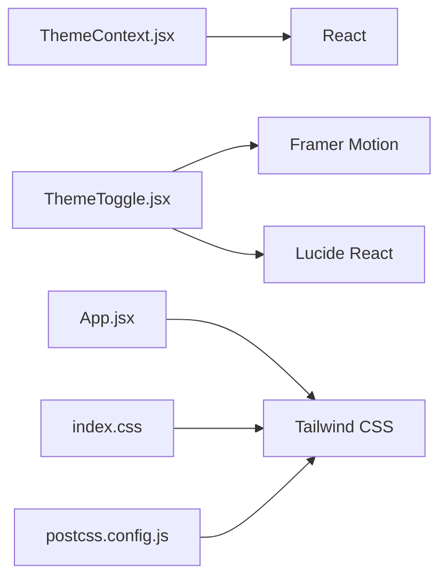

# Dark/Light Theme System

<cite>
**Referenced Files in This Document**
- [index.css](file://client/src/index.css)
- [App.css](file://client/src/App.css)
- [App.jsx](file://client/src/App.jsx)
- [main.jsx](file://client/src/main.jsx)
- [ThemeContext.jsx](file://client/src/context/ThemeContext.jsx)
- [ThemeToggle.jsx](file://client/src/components/common/ThemeToggle.jsx)
- [Navbar.jsx](file://client/src/components/common/Navbar.jsx)
- [package.json](file://client/package.json)
- [postcss.config.js](file://client/postcss.config.js)
- [vite.config.js](file://client/vite.config.js)
</cite>

## Update Summary
**Changes Made**
- Updated to reflect the enhanced theme system with Tailwind CSS integration
- Added documentation for the new ThemeContext implementation with manual toggle functionality
- Documented the hybrid approach combining CSS custom properties with Tailwind utilities
- Added comprehensive coverage of the ThemeProvider and ThemeToggle components
- Updated architecture diagrams to show the complete theme system flow

## Table of Contents
1. [Introduction](#introduction)
2. [Project Structure](#project-structure)
3. [Core Components](#core-components)
4. [Architecture Overview](#architecture-overview)
5. [Detailed Component Analysis](#detailed-component-analysis)
6. [Tailwind CSS Integration](#tailwind-css-integration)
7. [Manual Theme Toggle Implementation](#manual-theme-toggle-implementation)
8. [Theme Persistence and System Detection](#theme-persistence-and-system-detection)
9. [Dependency Analysis](#dependency-analysis)
10. [Performance Considerations](#performance-considerations)
11. [Accessibility Considerations](#accessibility-considerations)
12. [Extending the Theme System](#extending-the-theme-system)
13. [Troubleshooting Guide](#troubleshooting-guide)
14. [Conclusion](#conclusion)
15. [Appendices](#appendices)

## Introduction
This document explains the enhanced dark/light theme system implemented in the project using a hybrid approach combining CSS custom properties with Tailwind CSS utilities. The system provides automatic theme switching based on system preferences while allowing manual user control through a theme toggle component. It covers the CSS variable definitions, Tailwind CSS integration, React context management, and component-based theme consumption.

## Project Structure
The theme system is implemented through a combination of Tailwind CSS configuration, CSS custom properties, React context providers, and component-based theme controls. The system uses a hybrid approach where Tailwind utility classes handle most styling while CSS custom properties manage color schemes.

**Diagram sources**
- [main.jsx:1-11](file://client/src/main.jsx#L1-L11)
- [App.jsx:1-94](file://client/src/App.jsx#L1-L94)
- [ThemeContext.jsx:1-43](file://client/src/context/ThemeContext.jsx#L1-L43)
- [ThemeToggle.jsx:1-30](file://client/src/components/common/ThemeToggle.jsx#L1-L30)
- [index.css:1-66](file://client/src/index.css#L1-L66)
- [Navbar.jsx:1-206](file://client/src/components/common/Navbar.jsx#L1-L206)

**Section sources**
- [main.jsx:1-11](file://client/src/main.jsx#L1-L11)
- [App.jsx:1-94](file://client/src/App.jsx#L1-L94)
- [ThemeContext.jsx:1-43](file://client/src/context/ThemeContext.jsx#L1-L43)
- [ThemeToggle.jsx:1-30](file://client/src/components/common/ThemeToggle.jsx#L1-L30)
- [index.css:1-66](file://client/src/index.css#L1-L66)
- [Navbar.jsx:1-206](file://client/src/components/common/Navbar.jsx#L1-L206)

## Core Components

### Theme Context Provider
The ThemeContext manages the global theme state using React's Context API. It handles:
- Initial theme detection from localStorage or system preferences
- Theme state persistence in localStorage
- Theme switching functionality
- Provider pattern for theme consumption throughout the application

### Theme Toggle Component
The ThemeToggle component provides manual theme control with:
- Animated sun/moon icons indicating current theme
- Smooth scaling animations for hover and tap interactions
- Accessible ARIA labels for screen readers
- Integration with the ThemeContext for state management

### Tailwind CSS Integration
The system uses Tailwind CSS v4.2.2 with PostCSS processing. Key features include:
- Utility-first styling with dark mode variants
- Custom color palette using CSS custom properties
- Responsive design patterns
- Backdrop blur effects for modern UI elements

**Section sources**
- [ThemeContext.jsx:5-34](file://client/src/context/ThemeContext.jsx#L5-L34)
- [ThemeToggle.jsx:5-29](file://client/src/components/common/ThemeToggle.jsx#L5-L29)
- [index.css:1-14](file://client/src/index.css#L1-L14)
- [postcss.config.js:1-7](file://client/postcss.config.js#L1-L7)

## Architecture Overview
The theme system follows a hybrid architecture combining CSS custom properties with Tailwind CSS utilities. The system operates through several layers:

**Diagram sources**
- [ThemeContext.jsx:6-23](file://client/src/context/ThemeContext.jsx#L6-L23)
- [index.css:20-33](file://client/src/index.css#L20-L33)
- [App.jsx:25-41](file://client/src/App.jsx#L25-L41)

## Detailed Component Analysis

### Theme Context Implementation
The ThemeContext provides centralized theme state management with the following key features:

**Initial Theme Detection:**
- Checks localStorage for previously saved theme preference
- Falls back to system preference detection using `window.matchMedia`
- Default fallback to light theme if neither is available

**State Persistence:**
- Automatically saves theme preference to localStorage
- Updates the root element's class list to enable/disable dark mode
- Maintains theme state across page reloads

**Theme Switching Logic:**
- Simple toggle between light and dark themes
- Immediate DOM updates through class manipulation
- Seamless user experience without page refresh

**Section sources**
- [ThemeContext.jsx:5-34](file://client/src/context/ThemeContext.jsx#L5-L34)

### Theme Toggle Component Features
The ThemeToggle component implements sophisticated UI interactions:

**Visual Feedback:**
- Animated sun/moon icons with rotation transitions
- Scale animations for hover and tap interactions
- Smooth transitions between theme states

**Accessibility Features:**
- Proper ARIA labels indicating current theme state
- Keyboard navigable button interface
- Screen reader friendly labeling

**Integration Points:**
- Consumes theme state from ThemeContext
- Triggers theme switching on click events
- Provides visual indication of current theme

**Section sources**
- [ThemeToggle.jsx:5-29](file://client/src/components/common/ThemeToggle.jsx#L5-L29)

### Tailwind CSS Theme Configuration
The system uses Tailwind CSS v4.2.2 with custom color palette:

**Custom Color Variables:**
- Primary orange color palette (`--color-primary-*`)
- Stone color family for backgrounds and borders
- Responsive color variants for light/dark modes

**Dark Mode Implementation:**
- `.dark` class on root element triggers dark variants
- Tailwind dark mode utilities for seamless theme switching
- Custom scrollbar styling with theme-aware colors

**Section sources**
- [index.css:3-14](file://client/src/index.css#L3-L14)
- [index.css:20-33](file://client/src/index.css#L20-L33)
- [index.css:41-56](file://client/src/index.css#L41-L56)

## Tailwind CSS Integration

### PostCSS Configuration
The build system uses PostCSS with Tailwind CSS plugin:

**Build Tools:**
- Tailwind CSS v4.2.2 for utility-first styling
- Autoprefixer for vendor prefix support
- Vite for development and production builds

**Plugin Configuration:**
- Tailwind CSS PostCSS plugin integration
- Automatic CSS generation and optimization
- Responsive design support out of the box

### Utility Classes Usage
Components extensively use Tailwind utility classes:

**Layout and Spacing:**
- Flexbox utilities for responsive layouts
- Padding and margin utilities for consistent spacing
- Responsive breakpoint utilities

**Color System:**
- Stone color palette for backgrounds and borders
- Orange accent colors for interactive elements
- Dark mode variants with `dark:` prefix

**Effects and Interactions:**
- Backdrop blur for navbar transparency
- Transition utilities for smooth animations
- Hover and focus state utilities

**Section sources**
- [postcss.config.js:1-7](file://client/postcss.config.js#L1-L7)
- [package.json:19-32](file://client/package.json#L19-L32)
- [Navbar.jsx:47](file://client/src/components/common/Navbar.jsx#L47)

## Manual Theme Toggle Implementation

### Component Integration
The ThemeToggle component is seamlessly integrated into the navigation system:

**Navigation Placement:**
- Positioned in the top-right corner of the navbar
- Integrated with mobile-responsive navigation
- Accessible via keyboard navigation

**State Synchronization:**
- Real-time theme state updates across all components
- Visual feedback through icon rotation animation
- Persistent theme preference across sessions

### User Experience Features
The theme toggle provides enhanced user experience:

**Animation Transitions:**
- Smooth rotation animation for sun/moon icons
- Scale animations for hover and tap interactions
- Duration-controlled transitions for visual appeal

**Accessibility Compliance:**
- Proper ARIA labels for screen readers
- Keyboard navigation support
- Focus indicators for accessible interaction

**Section sources**
- [Navbar.jsx:95](file://client/src/components/common/Navbar.jsx#L95)
- [ThemeToggle.jsx:9-28](file://client/src/components/common/ThemeToggle.jsx#L9-L28)

## Theme Persistence and System Detection

### Local Storage Management
The system implements robust theme persistence:

**Storage Strategy:**
- Theme preference saved to localStorage
- Automatic loading on application startup
- Fallback mechanisms for edge cases

**System Preference Fallback:**
- Detection of OS-level dark mode preference
- Automatic theme selection when no user preference exists
- Dynamic switching when system preference changes

### Root Element Class Management
The theme system manipulates the root element for global effect:

**Class Manipulation:**
- Adding/removing `.dark` class on document element
- Triggering Tailwind dark mode variants
- Enabling CSS custom property overrides

**Section sources**
- [ThemeContext.jsx:15-23](file://client/src/context/ThemeContext.jsx#L15-L23)
- [index.css:20-33](file://client/src/index.css#L20-L33)

## Dependency Analysis
The theme system has minimal but essential dependencies:

**Runtime Dependencies:**
- React for context and component system
- Framer Motion for smooth animations
- Lucide React for iconography
- Tailwind CSS for utility classes

**Build Dependencies:**
- PostCSS for CSS processing
- Tailwind CSS PostCSS plugin
- Autoprefixer for vendor prefixes

**Diagram sources**
- [ThemeContext.jsx:1-43](file://client/src/context/ThemeContext.jsx#L1-L43)
- [ThemeToggle.jsx:1-30](file://client/src/components/common/ThemeToggle.jsx#L1-L30)
- [App.jsx:1-94](file://client/src/App.jsx#L1-L94)
- [index.css:1-66](file://client/src/index.css#L1-L66)
- [postcss.config.js:1-7](file://client/postcss.config.js#L1-L7)

**Section sources**
- [package.json:12-32](file://client/package.json#L12-L32)
- [ThemeContext.jsx:1-43](file://client/src/context/ThemeContext.jsx#L1-L43)
- [ThemeToggle.jsx:1-30](file://client/src/components/common/ThemeToggle.jsx#L1-L30)

## Performance Considerations
The theme system is designed for optimal performance:

**CSS Custom Properties:**
- Efficient color variable resolution
- Minimal recalculation overhead
- Hardware-accelerated animations

**React Context Optimization:**
- Single source of truth for theme state
- Efficient provider/consumer pattern
- Minimal re-renders when theme changes

**Tailwind CSS Benefits:**
- Utility-first approach reduces CSS bloat
- Automatic purging of unused styles
- Optimized build process

**Animation Performance:**
- GPU-accelerated transforms for smooth transitions
- Reduced layout thrashing during theme changes
- Optimized animation durations

## Accessibility Considerations
The theme system incorporates several accessibility features:

**Color Contrast:**
- High contrast ratios maintained across themes
- Stone color palette optimized for readability
- Automatic contrast adjustments in dark mode

**Screen Reader Support:**
- Proper ARIA labels for interactive elements
- Semantic HTML structure in components
- Focus management for keyboard navigation

**Motion Preferences:**
- Reduced motion support through CSS media queries
- Smooth transitions that respect user preferences
- Optional animation disabling for sensitive users

**Keyboard Navigation:**
- Full keyboard accessibility for theme toggle
- Focus indicators for interactive elements
- Tab order optimization

## Extending the Theme System

### Adding New Color Variables
To extend the color palette:

**CSS Custom Properties:**
- Define new color variables in the CSS theme block
- Create light and dark mode variants
- Use semantic naming conventions

**Tailwind Integration:**
- Add new colors to Tailwind configuration
- Create responsive variants
- Implement dark mode equivalents

### Creating New Theme Variants
The system supports multiple theme approaches:

**High Contrast Mode:**
- Additional color variables for accessibility
- Enhanced border and contrast definitions
- Specialized component styling

**Custom Brand Themes:**
- Extend the existing color palette
- Add brand-specific color variables
- Maintain dark mode compatibility

### Component-Level Theming
Individual components can extend the theme system:

**CSS Custom Properties:**
- Define component-specific variables
- Create theme-aware styling patterns
- Maintain consistency with global palette

**Tailwind Utilities:**
- Use existing utility classes for styling
- Leverage dark mode variants
- Maintain responsive design patterns

## Troubleshooting Guide

### Theme Not Switching
**Common Issues:**
- Missing ThemeProvider wrapper around components
- Incorrect class manipulation on root element
- CSS specificity conflicts with theme variables

**Solutions:**
- Ensure ThemeProvider is at the application root
- Verify `.dark` class is properly added/removed
- Check CSS cascade order and specificity

### Theme Toggle Not Working
**Common Issues:**
- ThemeContext not properly consumed
- Missing useTheme hook in component
- Event handler not bound correctly

**Solutions:**
- Wrap application with ThemeProvider
- Import and use useTheme hook correctly
- Verify event handler binding and state updates

### Color Inconsistencies
**Common Issues:**
- Mixed usage of CSS variables and Tailwind utilities
- Inconsistent color naming across components
- Missing dark mode variants

**Solutions:**
- Standardize on either CSS variables or Tailwind utilities
- Use consistent color naming conventions
- Ensure all components have dark mode variants

**Section sources**
- [ThemeContext.jsx:36-42](file://client/src/context/ThemeContext.jsx#L36-L42)
- [ThemeToggle.jsx:3-4](file://client/src/components/common/ThemeToggle.jsx#L3-L4)

## Conclusion
The enhanced theme system successfully combines CSS custom properties with Tailwind CSS utilities to create a flexible, accessible, and performant dark/light theme solution. The hybrid approach leverages the strengths of both methodologies: CSS custom properties for dynamic color management and Tailwind utilities for rapid UI development. The React context implementation provides seamless state management with manual user control, while the system maintains excellent performance and accessibility standards.

## Appendices

### Build Configuration
The theme system works with the following build configuration:

**Development Environment:**
- Vite for fast development server
- Hot module replacement for instant updates
- Development-friendly error reporting

**Production Optimization:**
- Automatic CSS purging and minification
- Tree shaking for unused code
- Optimized asset bundling

**Section sources**
- [vite.config.js:1-8](file://client/vite.config.js#L1-L8)
- [package.json:6-11](file://client/package.json#L6-L11)

### Migration from Previous Implementation
The new system replaces the previous CSS-only approach with:

**Enhanced Features:**
- Manual theme toggle capability
- Local storage persistence
- Improved accessibility support
- Better performance characteristics

**Breaking Changes:**
- Removal of pure CSS media query approach
- New React context dependency
- Updated component integration patterns

**Migration Benefits:**
- More responsive theme switching
- Better user control over preferences
- Enhanced developer experience
- Future extensibility for additional themes