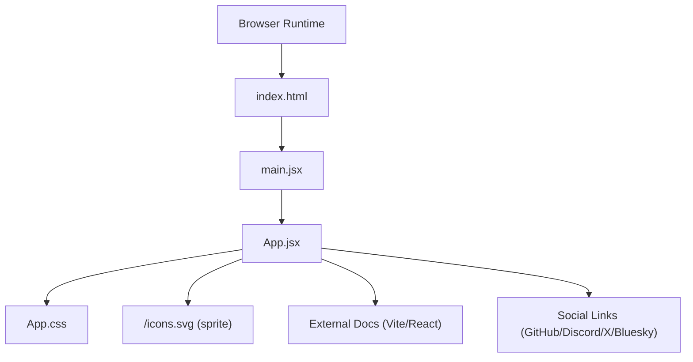
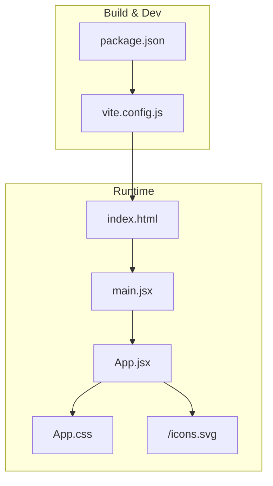
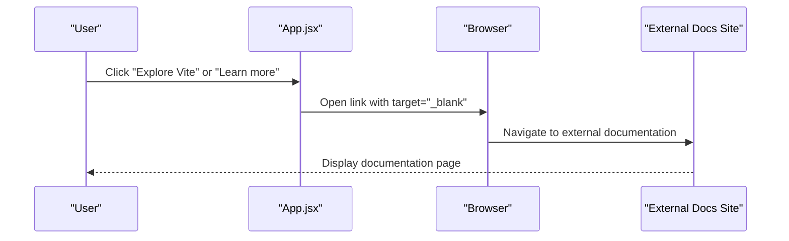
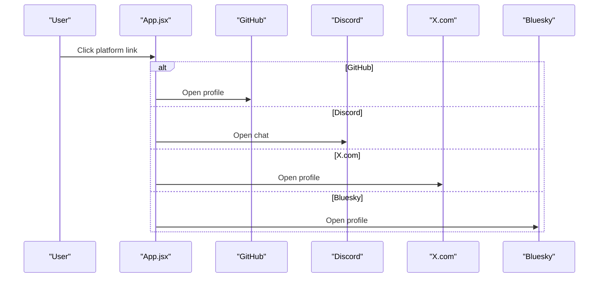
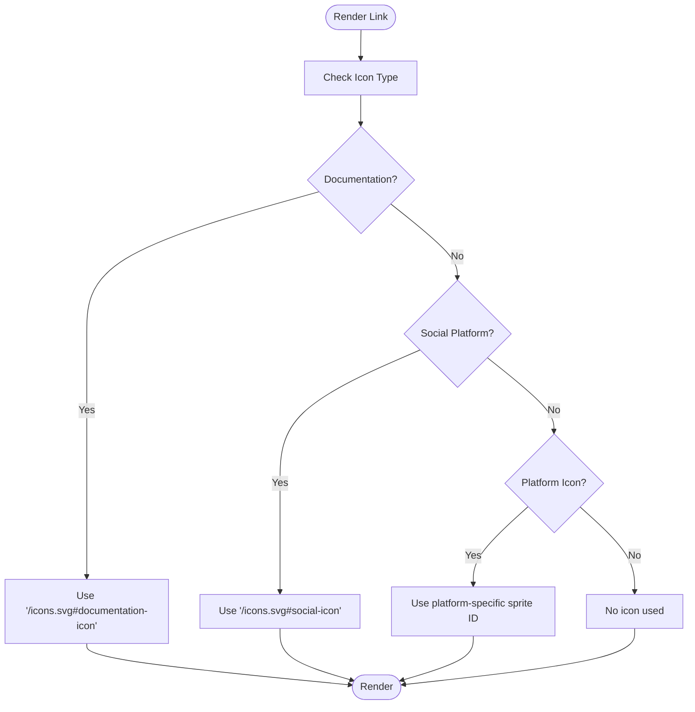
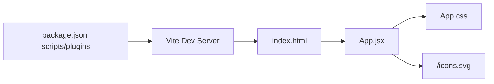

# External Documentation and Social Media Integrations

<cite>
**Referenced Files in This Document**
- [package.json](file://client/package.json)
- [vite.config.js](file://client/vite.config.js)
- [index.html](file://client/index.html)
- [App.jsx](file://client/src/App.jsx)
- [App.css](file://client/src/App.css)
- [README.md](file://client/README.md)
</cite>

## Table of Contents
1. [Introduction](#introduction)
2. [Project Structure](#project-structure)
3. [Core Components](#core-components)
4. [Architecture Overview](#architecture-overview)
5. [Detailed Component Analysis](#detailed-component-analysis)
6. [Dependency Analysis](#dependency-analysis)
7. [Performance Considerations](#performance-considerations)
8. [Security and Accessibility Guidelines](#security-and-accessibility-guidelines)
9. [SEO Best Practices](#seo-best-practices)
10. [Troubleshooting Guide](#troubleshooting-guide)
11. [Conclusion](#conclusion)

## Introduction
This document explains how external documentation and social media integrations are implemented in the project. It covers:
- External link patterns and target blank usage
- SVG sprite icon implementation for documentation and social platforms
- Vite and React integration for loading external resources
- Social media platform connections (GitHub, Discord, X.com, Bluesky)
- How to add new external links, customize icon displays, and implement click tracking
- Security considerations, accessibility improvements for screen readers, and SEO implications

## Project Structure
The integration spans a small React application built with Vite. Key areas:
- Application entry and rendering in the browser via index.html and main.jsx
- External documentation and social media links in App.jsx
- Styling and icon presentation in App.css
- Build-time configuration in vite.config.js and package.json scripts

**Diagram sources**
- [index.html:1-14](file://client/index.html#L1-L14)
- [App.jsx:1-122](file://client/src/App.jsx#L1-L122)
- [App.css:1-185](file://client/src/App.css#L1-L185)

**Section sources**
- [index.html:1-14](file://client/index.html#L1-L14)
- [App.jsx:1-122](file://client/src/App.jsx#L1-L122)
- [App.css:1-185](file://client/src/App.css#L1-L185)
- [vite.config.js:1-8](file://client/vite.config.js#L1-L8)
- [package.json:1-28](file://client/package.json#L1-L28)

## Core Components
- External documentation links: Vite and React documentation pages
- Social media links: GitHub, Discord chat, X.com, and Bluesky
- SVG sprite icons: Reusable icons loaded via `/icons.svg` with `<use href="/icons.svg#id">`
- Target blank pattern: All external links open in new tabs for safety and UX
- Styling: CSS defines icon sizes, hover states, and responsive layouts

Key implementation references:
- External docs list and Vite/React logos: [App.jsx:42-54](file://client/src/App.jsx#L42-L54)
- Social media list and SVG icons: [App.jsx:63-111](file://client/src/App.jsx#L63-L111)
- Icon sizing and button styles: [App.css:86-154](file://client/src/App.css#L86-L154)

**Section sources**
- [App.jsx:42-54](file://client/src/App.jsx#L42-L54)
- [App.jsx:63-111](file://client/src/App.jsx#L63-L111)
- [App.css:86-154](file://client/src/App.css#L86-L154)

## Architecture Overview
The external integration architecture combines:
- Static asset delivery via Vite’s development server and build pipeline
- SVG sprite delivery from the public directory
- React components rendering links and icons
- CSS controlling layout, spacing, and icon appearance

**Diagram sources**
- [vite.config.js:1-8](file://client/vite.config.js#L1-L8)
- [package.json:1-28](file://client/package.json#L1-L28)
- [index.html:1-14](file://client/index.html#L1-L14)
- [App.jsx:1-122](file://client/src/App.jsx#L1-L122)
- [App.css:1-185](file://client/src/App.css#L1-L185)

## Detailed Component Analysis

### External Documentation Integration
- Purpose: Provide quick links to official documentation for Vite and React
- Implementation pattern:
  - Links use `target="_blank"` to open in new tabs
  - Icons are embedded via SVG sprites (`/icons.svg#documentation-icon`)
  - Logos are imported assets and displayed alongside links
- Example references:
  - Vite documentation link: [App.jsx:42-47](file://client/src/App.jsx#L42-L47)
  - React documentation link: [App.jsx:48-53](file://client/src/App.jsx#L48-L53)
  - Documentation icon usage: [App.jsx:36-38](file://client/src/App.jsx#L36-L38)

**Diagram sources**
- [App.jsx:42-54](file://client/src/App.jsx#L42-L54)

**Section sources**
- [App.jsx:36-38](file://client/src/App.jsx#L36-L38)
- [App.jsx:42-54](file://client/src/App.jsx#L42-L54)

### Social Media Platform Integrations
- Platforms integrated: GitHub, Discord chat, X.com, Bluesky
- Implementation pattern:
  - Each link opens externally in a new tab
  - Icons are rendered via SVG sprites with unique IDs
  - Screen reader-friendly markup uses `role="presentation"` and `aria-hidden="true"` on decorative icons
- Example references:
  - GitHub: [App.jsx:63-74](file://client/src/App.jsx#L63-L74)
  - Discord: [App.jsx:75-86](file://client/src/App.jsx#L75-L86)
  - X.com: [App.jsx:87-98](file://client/src/App.jsx#L87-L98)
  - Bluesky: [App.jsx:99-110](file://client/src/App.jsx#L99-L110)

**Diagram sources**
- [App.jsx:63-111](file://client/src/App.jsx#L63-L111)

**Section sources**
- [App.jsx:63-111](file://client/src/App.jsx#L63-L111)

### SVG Sprite Icon System
- Location: Public sprite file `/icons.svg` referenced by `<use href="/icons.svg#id">`
- Usage:
  - Documentation icon: [App.jsx:36-38](file://client/src/App.jsx#L36-L38)
  - Social icon: [App.jsx:57-59](file://client/src/App.jsx#L57-L59)
  - Platform-specific icons: [App.jsx:70](file://client/src/App.jsx#L70), [App.jsx:82](file://client/src/App.jsx#L82), [App.jsx:94](file://client/src/App.jsx#L94), [App.jsx:106](file://client/src/App.jsx#L106)
- Styling:
  - Icon sizing controlled via CSS classes (`.icon`, `.button-icon`)
  - Dark mode adjusts icon visibility using filters

**Diagram sources**
- [App.jsx:36-38](file://client/src/App.jsx#L36-L38)
- [App.jsx:57-59](file://client/src/App.jsx#L57-L59)
- [App.jsx:70](file://client/src/App.jsx#L70)
- [App.jsx:82](file://client/src/App.jsx#L82)
- [App.jsx:94](file://client/src/App.jsx#L94)
- [App.jsx:106](file://client/src/App.jsx#L106)

**Section sources**
- [App.jsx:36-38](file://client/src/App.jsx#L36-L38)
- [App.jsx:57-59](file://client/src/App.jsx#L57-L59)
- [App.jsx:70](file://client/src/App.jsx#L70)
- [App.jsx:82](file://client/src/App.jsx#L82)
- [App.jsx:94](file://client/src/App.jsx#L94)
- [App.jsx:106](file://client/src/App.jsx#L106)
- [App.css:86-154](file://client/src/App.css#L86-L154)

### Adding New External Links
Steps to add a new external link:
1. Choose a semantic icon ID from the sprite (e.g., reuse existing IDs or add new ones to `/icons.svg`)
2. Add a new list item under the appropriate section (documentation or social)
3. Set `href` to the external URL and `target="_blank"`
4. Include an icon via `<svg><use href="/icons.svg#your-id"/></svg>` or an image/logo as needed
5. Style adjustments can be made in CSS if necessary

Example references for structure:
- Documentation list item pattern: [App.jsx:42-54](file://client/src/App.jsx#L42-L54)
- Social list item pattern: [App.jsx:63-111](file://client/src/App.jsx#L63-L111)

**Section sources**
- [App.jsx:42-54](file://client/src/App.jsx#L42-L54)
- [App.jsx:63-111](file://client/src/App.jsx#L63-L111)

### Customizing Icon Displays
To customize icon appearance:
- Adjust icon sizing via CSS classes (`.icon`, `.button-icon`)
- Modify hover and focus states for links in the documentation and social sections
- For dark mode, rely on the existing filter-based inversion for platform icons

Example references:
- Icon sizing and hover: [App.css:86-154](file://client/src/App.css#L86-L154)
- Dark mode icon inversion: [App.css:48-50](file://client/src/App.css#L48-L50)

**Section sources**
- [App.css:86-154](file://client/src/App.css#L86-L154)
- [App.css:48-50](file://client/src/App.css#L48-L50)

### Implementing Tracking for External Clicks
Recommended approach:
- Wrap each external link anchor with a click handler that logs the event
- Use analytics libraries or custom tracking endpoints
- Preserve `target="_blank"` behavior while capturing metrics

Implementation pattern references:
- External link anchors: [App.jsx:42-54](file://client/src/App.jsx#L42-L54), [App.jsx:63-111](file://client/src/App.jsx#L63-L111)

Note: The current implementation does not include analytics handlers; add tracking in your own code following the existing anchor structure.

**Section sources**
- [App.jsx:42-54](file://client/src/App.jsx#L42-L54)
- [App.jsx:63-111](file://client/src/App.jsx#L63-L111)

## Dependency Analysis
- Build toolchain: Vite config enables React plugin; scripts manage dev/build/preview/lint
- Runtime dependencies: React and React DOM power the UI
- Asset delivery: Public assets (e.g., `/icons.svg`) are served statically by Vite during development and included in builds

**Diagram sources**
- [package.json:1-28](file://client/package.json#L1-L28)
- [vite.config.js:1-8](file://client/vite.config.js#L1-L8)
- [index.html:1-14](file://client/index.html#L1-L14)
- [App.jsx:1-122](file://client/src/App.jsx#L1-L122)
- [App.css:1-185](file://client/src/App.css#L1-L185)

**Section sources**
- [package.json:1-28](file://client/package.json#L1-L28)
- [vite.config.js:1-8](file://client/vite.config.js#L1-L8)
- [index.html:1-14](file://client/index.html#L1-L14)
- [App.jsx:1-122](file://client/src/App.jsx#L1-L122)
- [App.css:1-185](file://client/src/App.css#L1-L185)

## Performance Considerations
- Keep external links lightweight: avoid heavy assets in external pages
- Prefer SVG sprites for icons to reduce HTTP requests and bundle size
- Lazy-load external content if needed, but keep navigation predictable for users
- Minimize reflows by avoiding excessive DOM manipulation around links

## Security and Accessibility Guidelines
- Security:
  - Always use `rel="noopener noreferrer"` on external links opened in new tabs to prevent reverse tabnabbing
  - Validate and sanitize any dynamic URLs before rendering
- Accessibility:
  - Decorative icons should use `role="presentation"` and `aria-hidden="true"`
  - Provide meaningful link text; avoid generic “Click here”
  - Ensure sufficient color contrast for links and hover states
- Screen readers:
  - Use descriptive link text for social platforms (e.g., “Visit us on GitHub”)
  - Avoid relying solely on icons to convey destination meaning

References:
- External link anchors with `target="_blank"`: [App.jsx:42-54](file://client/src/App.jsx#L42-L54), [App.jsx:63-111](file://client/src/App.jsx#L63-L111)
- Decorative icon pattern: [App.jsx:36-38](file://client/src/App.jsx#L36-L38), [App.jsx:57-59](file://client/src/App.jsx#L57-L59), [App.jsx:70](file://client/src/App.jsx#L70), [App.jsx:82](file://client/src/App.jsx#L82), [App.jsx:94](file://client/src/App.jsx#L94), [App.jsx:106](file://client/src/App.jsx#L106)

**Section sources**
- [App.jsx:36-38](file://client/src/App.jsx#L36-L38)
- [App.jsx:57-59](file://client/src/App.jsx#L57-L59)
- [App.jsx:42-54](file://client/src/App.jsx#L42-L54)
- [App.jsx:63-111](file://client/src/App.jsx#L63-L111)
- [App.jsx:70](file://client/src/App.jsx#L70)
- [App.jsx:82](file://client/src/App.jsx#L82)
- [App.jsx:94](file://client/src/App.jsx#L94)
- [App.jsx:106](file://client/src/App.jsx#L106)

## SEO Best Practices
- Use descriptive anchor text for external links (e.g., “Read Vite documentation”, “Join our Discord community”)
- Avoid cloaking: ensure link text matches the destination platform
- Respect robots.txt and platform policies; avoid scraping or excessive outbound linking
- Keep external links relevant to page content to improve topical authority

## Troubleshooting Guide
Common issues and resolutions:
- Icons not displaying:
  - Verify `/icons.svg` exists in the public directory and the sprite IDs match the `href` values
  - Confirm the sprite file is served by the dev server and included in builds
- Links opening in the same tab:
  - Ensure `target="_blank"` is present on anchors
  - Add `rel="noopener noreferrer"` for security
- Styling inconsistencies:
  - Check CSS classes (`.icon`, `.button-icon`) and media queries for responsiveness
  - Review dark mode overrides for platform icons

**Section sources**
- [App.jsx:36-38](file://client/src/App.jsx#L36-L38)
- [App.jsx:57-59](file://client/src/App.jsx#L57-L59)
- [App.jsx:42-54](file://client/src/App.jsx#L42-L54)
- [App.jsx:63-111](file://client/src/App.jsx#L63-L111)
- [App.css:86-154](file://client/src/App.css#L86-L154)
- [App.css:48-50](file://client/src/App.css#L48-L50)

## Conclusion
The project integrates external documentation and social media links using a clean, maintainable pattern:
- External links consistently open in new tabs with security best practices
- SVG sprites centralize icon management and improve performance
- CSS ensures consistent styling and responsive behavior across platforms
- The structure supports easy addition of new links and customization of icon displays
- Follow the recommended security, accessibility, and SEO guidelines to maintain a safe, inclusive, and discoverable experience