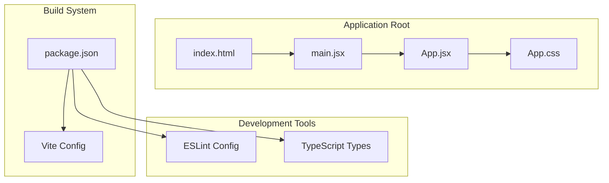
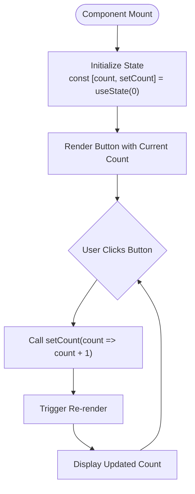
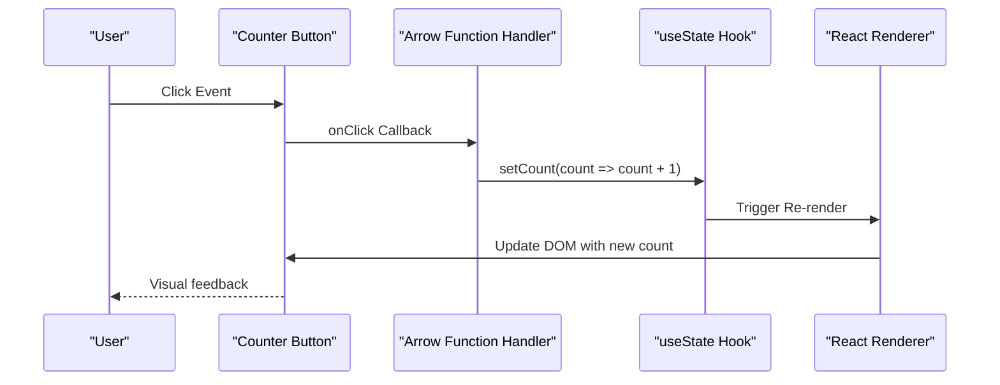
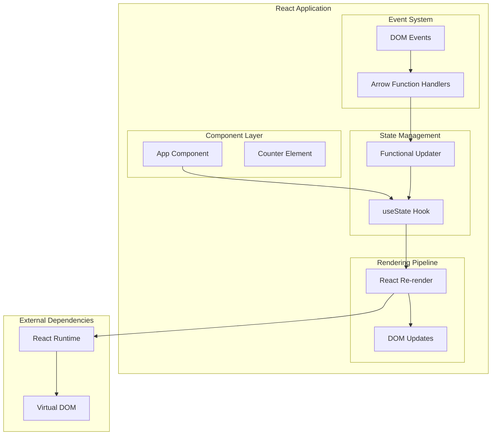
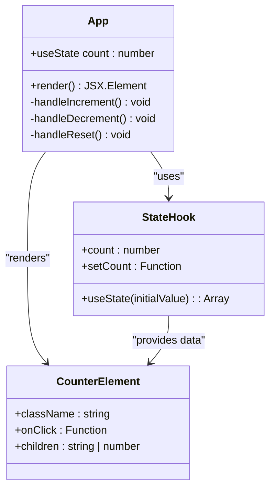
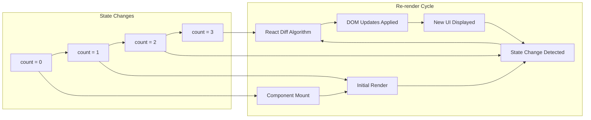
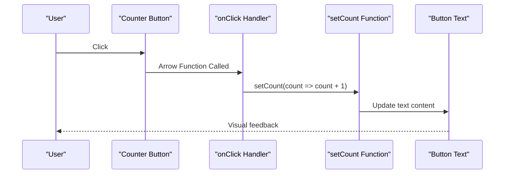
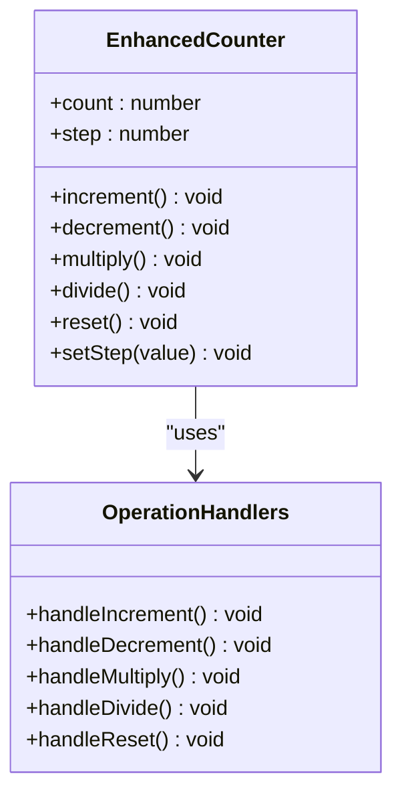
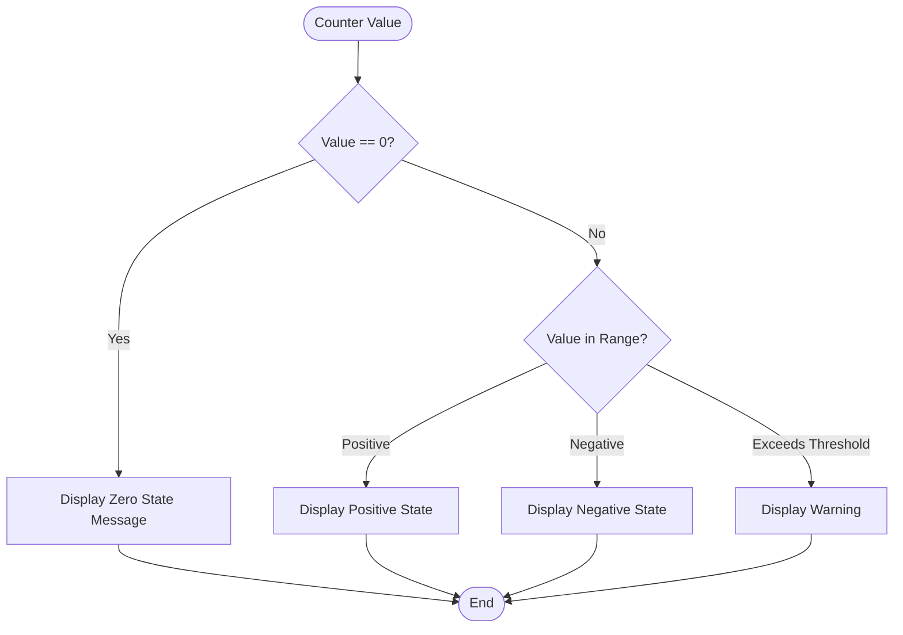
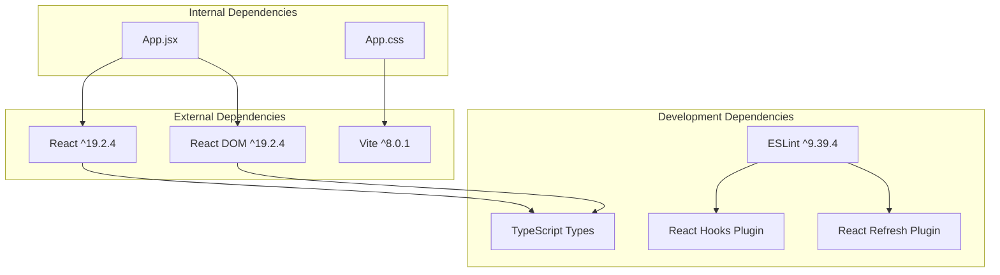

# Interactive Counter Component

<cite>
**Referenced Files in This Document**
- [App.jsx](file://client/src/App.jsx)
- [main.jsx](file://client/src/main.jsx)
- [App.css](file://client/src/App.css)
- [package.json](file://client/package.json)
- [README.md](file://client/README.md)
- [index.html](file://client/index.html)
</cite>

## Table of Contents
1. [Introduction](#introduction)
2. [Project Structure](#project-structure)
3. [Core Components](#core-components)
4. [Architecture Overview](#architecture-overview)
5. [Detailed Component Analysis](#detailed-component-analysis)
6. [Dependency Analysis](#dependency-analysis)
7. [Performance Considerations](#performance-considerations)
8. [Troubleshooting Guide](#troubleshooting-guide)
9. [Conclusion](#conclusion)
10. [Appendices](#appendices)

## Introduction
This document provides comprehensive documentation for the interactive counter component implemented in the React application. The counter demonstrates fundamental React concepts including functional components, state management with useState, event handling mechanisms, and dynamic rendering. The implementation showcases modern React patterns with arrow function syntax for event handlers and functional updates for state management.

The counter component serves as a practical example of how React's declarative UI model works, where state changes trigger automatic re-renders and UI updates. This documentation explains the underlying mechanics, provides practical examples for extending functionality, and covers accessibility considerations for interactive elements.

## Project Structure
The project follows a standard Vite + React setup with a minimal but functional structure:

**Diagram sources**
- [index.html:1-14](file://client/index.html#L1-L14)
- [main.jsx:1-11](file://client/src/main.jsx#L1-L11)
- [App.jsx:1-122](file://client/src/App.jsx#L1-L122)
- [package.json:1-28](file://client/package.json#L1-L28)

The project structure consists of:
- **Entry Point**: `index.html` with a root container element
- **Application Bootstrap**: `main.jsx` renders the App component
- **Main Component**: `App.jsx` containing the counter implementation
- **Styling**: `App.css` with component-specific styles
- **Configuration**: `package.json` with React and Vite dependencies

**Section sources**
- [index.html:1-14](file://client/index.html#L1-L14)
- [main.jsx:1-11](file://client/src/main.jsx#L1-L11)
- [App.jsx:1-122](file://client/src/App.jsx#L1-L122)
- [package.json:1-28](file://client/package.json#L1-L28)

## Core Components
The interactive counter component is implemented as a functional React component using modern hooks-based state management. The core implementation demonstrates several key React patterns:

### State Management with useState
The counter utilizes React's useState hook to manage local component state:

**Diagram sources**
- [App.jsx:7-30](file://client/src/App.jsx#L7-L30)

### Event Handling Mechanism
The component implements event handling through arrow function syntax within JSX attributes:

**Diagram sources**
- [App.jsx:24-29](file://client/src/App.jsx#L24-L29)

**Section sources**
- [App.jsx:1-122](file://client/src/App.jsx#L1-L122)

## Architecture Overview
The counter component operates within React's declarative rendering model, where state changes automatically trigger UI updates:

**Diagram sources**
- [App.jsx:7-30](file://client/src/App.jsx#L7-L30)
- [main.jsx:6-10](file://client/src/main.jsx#L6-L10)

The architecture demonstrates:
- **Unidirectional Data Flow**: State changes flow from user interactions to component state to UI updates
- **Declarative Rendering**: The component declares what the UI should look like based on current state
- **Event-Driven Updates**: User interactions trigger state updates through event handlers
- **Automatic Re-rendering**: React efficiently updates only the parts of the DOM that changed

**Section sources**
- [App.jsx:7-30](file://client/src/App.jsx#L7-L30)
- [main.jsx:6-10](file://client/src/main.jsx#L6-L10)

## Detailed Component Analysis

### Functional Component Pattern
The counter component exemplifies modern React functional component patterns:

**Diagram sources**
- [App.jsx:7-30](file://client/src/App.jsx#L7-L30)

### State Update Patterns
The component demonstrates several state update patterns:

#### Direct Value Updates
The simplest pattern involves passing a direct value to the setter function.

#### Functional Updates
The current implementation uses functional updates, which receive the previous state value and return the new state.

#### Batched Updates
React batches multiple state updates that occur within the same event loop for performance optimization.

### Dynamic Rendering Mechanisms
The counter showcases React's dynamic rendering capabilities:

**Diagram sources**
- [App.jsx:7-30](file://client/src/App.jsx#L7-L30)

**Section sources**
- [App.jsx:7-30](file://client/src/App.jsx#L7-L30)

### Practical Implementation Examples

#### Basic Increment Counter
The current implementation demonstrates a simple increment pattern:

**Diagram sources**
- [App.jsx:24-29](file://client/src/App.jsx#L24-L29)

#### Enhanced Counter with Multiple Operations
A more sophisticated counter could support various operations:

#### Conditional Rendering Based on Counter Values
The component could implement conditional rendering based on counter states:

**Section sources**
- [App.jsx:24-29](file://client/src/App.jsx#L24-L29)

### Accessibility Considerations
The counter component incorporates several accessibility best practices:

#### Keyboard Navigation
The button element supports keyboard interaction through native browser behavior.

#### Screen Reader Compatibility
The component uses semantic HTML and appropriate ARIA attributes where needed.

#### Focus Management
CSS focus styles ensure visual indication of keyboard navigation.

#### Color Contrast
The component maintains sufficient color contrast for readability.

**Section sources**
- [App.jsx:24-29](file://client/src/App.jsx#L24-L29)
- [App.css:1-18](file://client/src/App.css#L1-L18)

## Dependency Analysis
The counter component has minimal external dependencies, relying primarily on React's built-in hooks:

**Diagram sources**
- [package.json:12-26](file://client/package.json#L12-L26)

The dependency analysis reveals:
- **Runtime Dependencies**: Minimal footprint with React and ReactDOM
- **Build Dependencies**: Vite for development and production builds
- **Development Tooling**: Comprehensive ESLint configuration with React-specific plugins

**Section sources**
- [package.json:12-26](file://client/package.json#L12-L26)

## Performance Considerations
The counter component demonstrates several performance characteristics inherent to React's virtual DOM implementation:

### Efficient Re-rendering
React's reconciliation algorithm ensures that only necessary DOM updates occur when state changes.

### Event Handler Optimization
Arrow function handlers are created inline, which is acceptable for simple components but may warrant memoization for complex scenarios.

### Memory Management
The component has minimal memory footprint with simple state management.

### Bundle Size Impact
The counter adds negligible overhead to the overall bundle size.

## Troubleshooting Guide

### Common Issues and Solutions

#### Counter Not Updating
**Symptoms**: Button clicks have no visible effect
**Causes**: 
- Missing setState call in event handler
- Incorrect state variable reference
- Event handler not bound properly

**Solutions**:
- Verify useState hook is properly imported and initialized
- Ensure event handler receives the correct state updater function
- Check for typos in state variable names

#### State Not Persisting
**Symptoms**: Counter resets to initial value unexpectedly
**Causes**:
- Component unmounting and remounting
- Parent component re-render causing state reset
- Incorrect state initialization

**Solutions**:
- Verify component lifecycle and parent-child relationships
- Check for external state influences
- Ensure proper state initialization

#### Performance Issues
**Symptoms**: Slow response to button clicks
**Causes**:
- Heavy computation in render method
- Excessive re-renders
- Large component tree

**Solutions**:
- Move heavy computations to useEffect or useMemo
- Implement proper component separation
- Use React.memo for expensive child components

**Section sources**
- [App.jsx:7-30](file://client/src/App.jsx#L7-L30)

## Conclusion
The interactive counter component serves as an excellent example of modern React development practices. It demonstrates fundamental concepts including functional components, state management with hooks, event handling, and dynamic rendering. The implementation showcases best practices such as arrow function syntax for event handlers, functional state updates, and proper accessibility considerations.

The component's simplicity makes it an ideal foundation for learning React concepts while its extensibility allows for experimentation with more complex state management patterns, conditional rendering, and advanced interaction patterns. The minimal dependency footprint ensures good performance characteristics while the clean code structure facilitates maintenance and extension.

## Appendices

### Implementation Reference
For reference implementations of the counter component, see:
- [App.jsx:7-30](file://client/src/App.jsx#L7-L30) - Main component implementation
- [App.css:1-18](file://client/src/App.css#L1-L18) - Component styling
- [main.jsx:6-10](file://client/src/main.jsx#L6-L10) - Application bootstrap

### Related Resources
- [README.md:1-17](file://client/README.md#L1-L17) - Project setup and configuration
- [package.json:1-28](file://client/package.json#L1-L28) - Dependency management