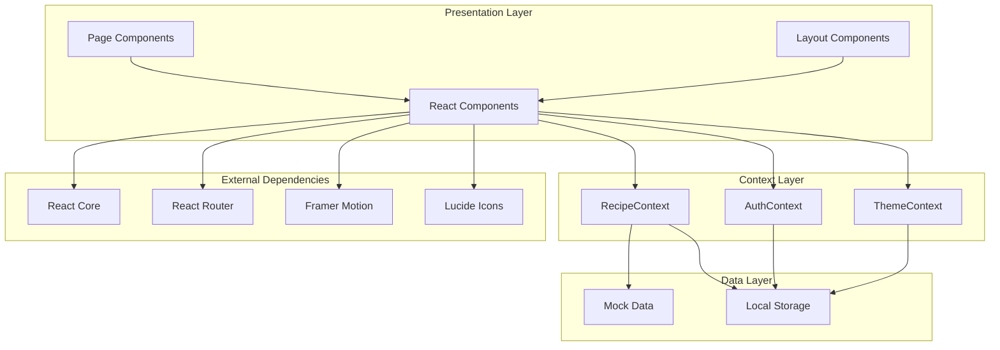
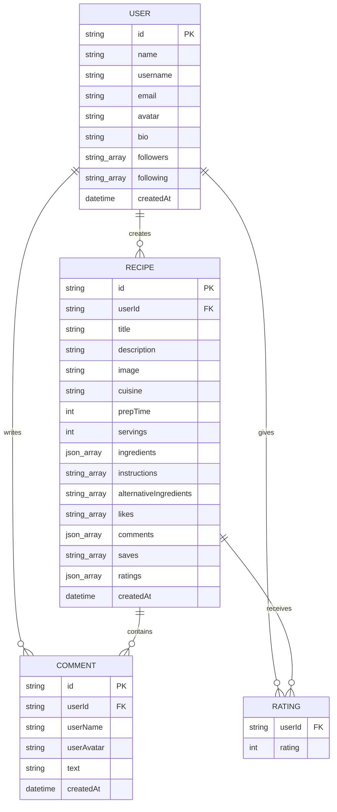
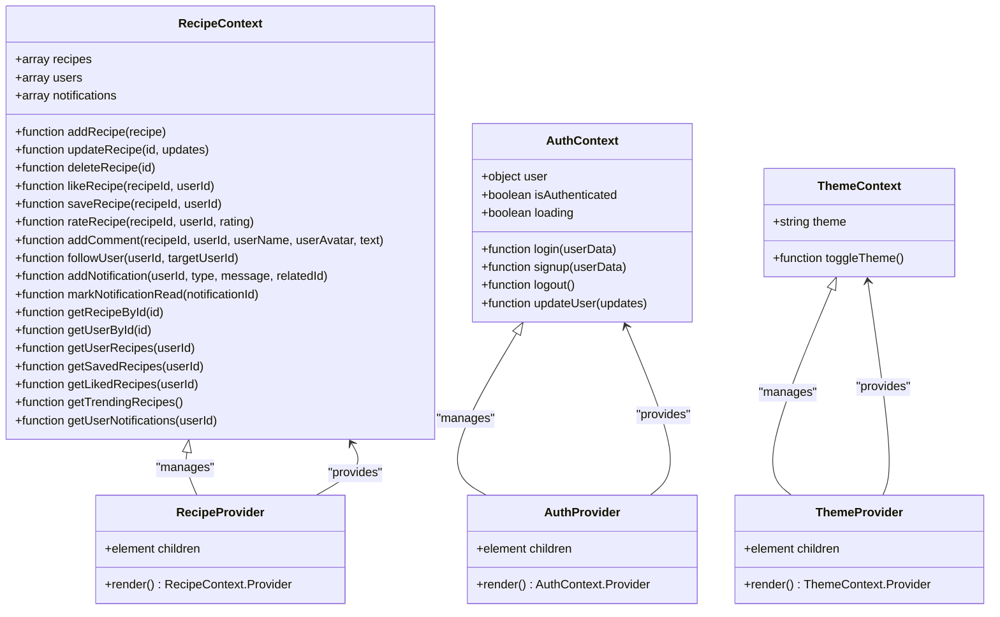
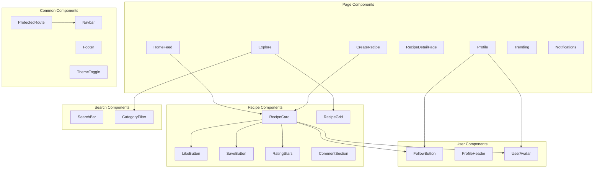
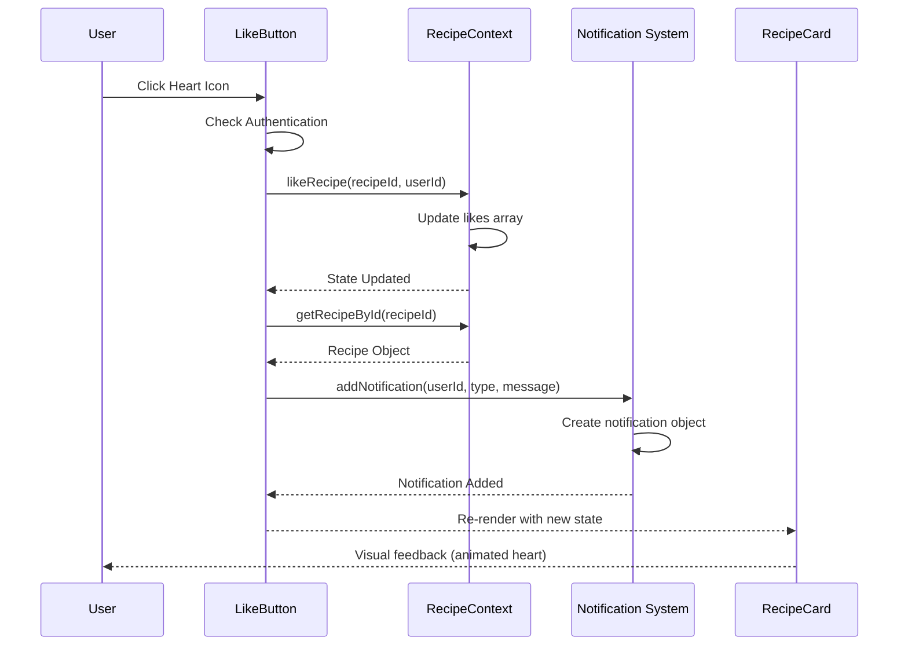
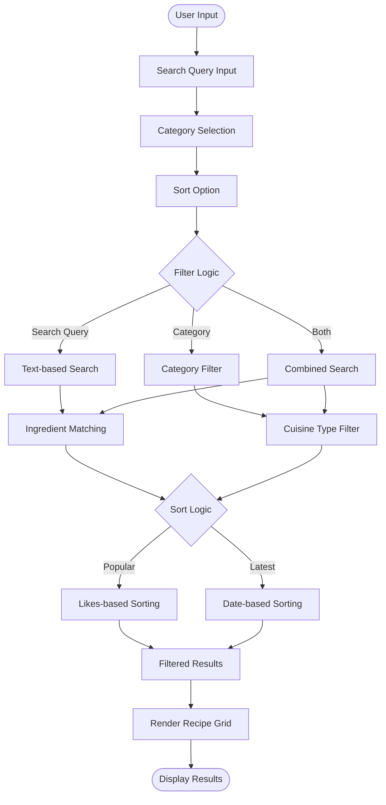
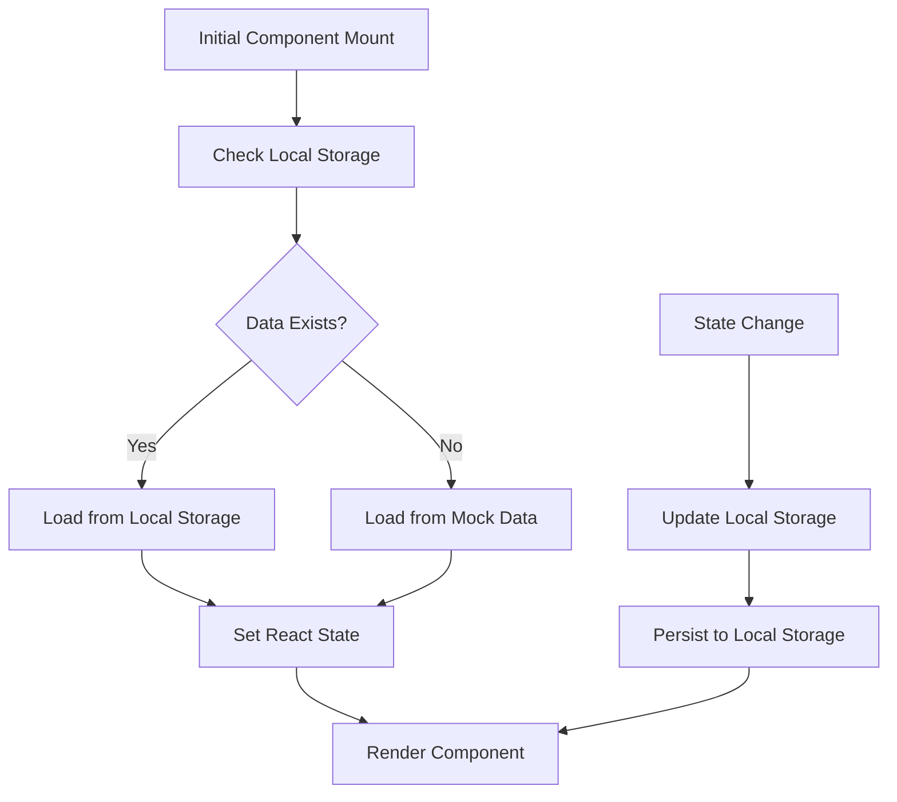

# Mock Data System

<cite>
**Referenced Files in This Document**
- [mockData.js](file://client/src/data/mockData.js)
- [RecipeContext.jsx](file://client/src/context/RecipeContext.jsx)
- [AuthContext.jsx](file://client/src/context/AuthContext.jsx)
- [ThemeContext.jsx](file://client/src/context/ThemeContext.jsx)
- [App.jsx](file://client/src/App.jsx)
- [main.jsx](file://client/src/main.jsx)
- [RecipeCard.jsx](file://client/src/components/recipe/RecipeCard.jsx)
- [RecipeGrid.jsx](file://client/src/components/recipe/RecipeGrid.jsx)
- [HomeFeed.jsx](file://client/src/pages/HomeFeed.jsx)
- [Explore.jsx](file://client/src/pages/Explore.jsx)
- [LikeButton.jsx](file://client/src/components/interactions/LikeButton.jsx)
- [SaveButton.jsx](file://client/src/components/interactions/SaveButton.jsx)
- [CategoryFilter.jsx](file://client/src/components/search/CategoryFilter.jsx)
- [FollowButton.jsx](file://client/src/components/user/FollowButton.jsx)
- [package.json](file://client/package.json)
</cite>

## Update Summary
**Changes Made**
- Updated mock data structure to include comprehensive recipe data with structured ingredients and detailed nutritional information
- Enhanced context management system with improved local storage persistence for recipes, users, and notifications
- Expanded cuisine categories and recipe variety for better testing and development scenarios
- Improved component integration with structured mock data for realistic user interactions

## Table of Contents
1. [Introduction](#introduction)
2. [System Architecture](#system-architecture)
3. [Mock Data Structure](#mock-data-structure)
4. [Context Management System](#context-management-system)
5. [UI Component Integration](#ui-component-integration)
6. [Interactive Features](#interactive-features)
7. [Search and Filtering](#search-and-filtering)
8. [Local Storage Persistence](#local-storage-persistence)
9. [Theme Management](#theme-management)
10. [Performance Considerations](#performance-considerations)
11. [Troubleshooting Guide](#troubleshooting-guide)
12. [Conclusion](#conclusion)

## Introduction

The Mock Data System is a comprehensive frontend framework designed for a recipe-sharing social media platform called Flavora. This system provides realistic mock data, interactive user experiences, and seamless integration between React components, context providers, and local storage persistence. The system simulates a complete social recipe platform with user profiles, recipe sharing, social interactions, and advanced filtering capabilities.

The mock data system serves as both a development foundation and a demonstration of modern React patterns, showcasing how to build scalable, maintainable frontend applications with realistic data simulation and user interaction handling.

**Updated** Enhanced with structured recipe data including detailed ingredients, cooking instructions, and comprehensive user interaction metrics for development and testing purposes.

## System Architecture

The Flavora application follows a layered architecture pattern with clear separation of concerns:



**Diagram sources**
- [App.jsx:44-91](file://client/src/App.jsx#L44-L91)
- [RecipeContext.jsx:6-185](file://client/src/context/RecipeContext.jsx#L6-L185)
- [AuthContext.jsx:5-63](file://client/src/context/AuthContext.jsx#L5-L63)
- [ThemeContext.jsx:5-34](file://client/src/context/ThemeContext.jsx#L5-L34)

The architecture demonstrates a clean separation between presentation, business logic, and data management layers, enabling easy testing and maintenance.

**Section sources**
- [App.jsx:44-91](file://client/src/App.jsx#L44-L91)
- [RecipeContext.jsx:1-194](file://client/src/context/RecipeContext.jsx#L1-L194)
- [AuthContext.jsx:1-72](file://client/src/context/AuthContext.jsx#L1-L72)
- [ThemeContext.jsx:1-43](file://client/src/context/ThemeContext.jsx#L1-L43)

## Mock Data Structure

The mock data system provides comprehensive recipe and user data simulation with realistic attributes and relationships:



**Diagram sources**
- [mockData.js:1-363](file://client/src/data/mockData.js#L1-L363)

The data model supports complex relationships including user following networks, recipe interactions, and social features. Each recipe contains detailed nutritional information, preparation steps, and community engagement metrics.

**Updated** Enhanced recipe data structure now includes structured ingredient objects with name, amount, and unit fields, comprehensive cooking instructions, and detailed alternative ingredient options for dietary restrictions.

**Section sources**
- [mockData.js:1-363](file://client/src/data/mockData.js#L1-L363)

## Context Management System

The context management system provides centralized state management for the entire application through three specialized contexts:



**Diagram sources**
- [RecipeContext.jsx:1-194](file://client/src/context/RecipeContext.jsx#L1-L194)
- [AuthContext.jsx:1-72](file://client/src/context/AuthContext.jsx#L1-L72)
- [ThemeContext.jsx:1-43](file://client/src/context/ThemeContext.jsx#L1-L43)

Each context provides specific functionality tailored to its domain while maintaining consistency in the React ecosystem.

**Updated** Enhanced context management with improved local storage persistence for recipes, users, and notifications, ensuring data consistency across application sessions.

**Section sources**
- [RecipeContext.jsx:1-194](file://client/src/context/RecipeContext.jsx#L1-L194)
- [AuthContext.jsx:1-72](file://client/src/context/AuthContext.jsx#L1-L72)
- [ThemeContext.jsx:1-43](file://client/src/context/ThemeContext.jsx#L1-L43)

## UI Component Integration

The UI components are designed with modularity and reusability in mind, following React best practices:



**Diagram sources**
- [HomeFeed.jsx:1-96](file://client/src/pages/HomeFeed.jsx#L1-L96)
- [Explore.jsx:1-133](file://client/src/pages/Explore.jsx#L1-L133)
- [RecipeCard.jsx:1-125](file://client/src/components/recipe/RecipeCard.jsx#L1-L125)
- [RecipeGrid.jsx:1-39](file://client/src/components/recipe/RecipeGrid.jsx#L1-L39)

The component hierarchy promotes code reuse and maintains consistent user experience across the application.

**Updated** Enhanced component integration with structured mock data, providing realistic recipe information display and user interaction handling for development and testing scenarios.

**Section sources**
- [HomeFeed.jsx:1-96](file://client/src/pages/HomeFeed.jsx#L1-L96)
- [Explore.jsx:1-133](file://client/src/pages/Explore.jsx#L1-L133)
- [RecipeCard.jsx:1-125](file://client/src/components/recipe/RecipeCard.jsx#L1-L125)
- [RecipeGrid.jsx:1-39](file://client/src/components/recipe/RecipeGrid.jsx#L1-L39)

## Interactive Features

The mock data system implements comprehensive interactive features that simulate real social media functionality:



**Diagram sources**
- [LikeButton.jsx:21-40](file://client/src/components/interactions/LikeButton.jsx#L21-L40)
- [RecipeContext.jsx:56-66](file://client/src/context/RecipeContext.jsx#L56-L66)

The interactive system includes real-time state updates, visual feedback animations, and cross-user notifications that enhance the social aspect of recipe sharing.

**Updated** Enhanced interactive features with improved notification system and user interaction handling, leveraging the structured mock data for realistic social media experiences.

**Section sources**
- [LikeButton.jsx:1-73](file://client/src/components/interactions/LikeButton.jsx#L1-L73)
- [SaveButton.jsx:1-53](file://client/src/components/interactions/SaveButton.jsx#L1-L53)
- [RecipeContext.jsx:56-143](file://client/src/context/RecipeContext.jsx#L56-L143)

## Search and Filtering

The search and filtering system provides sophisticated recipe discovery capabilities:



**Diagram sources**
- [Explore.jsx:15-44](file://client/src/pages/Explore.jsx#L15-L44)
- [CategoryFilter.jsx:4-27](file://client/src/components/search/CategoryFilter.jsx#L4-L27)

The filtering system supports multi-criteria searches across recipe titles, descriptions, ingredients, and cuisines, providing users with precise recipe discovery options.

**Updated** Enhanced search functionality with structured ingredient matching and comprehensive recipe filtering based on the detailed mock data structure.

**Section sources**
- [Explore.jsx:1-133](file://client/src/pages/Explore.jsx#L1-L133)
- [CategoryFilter.jsx:1-28](file://client/src/components/search/CategoryFilter.jsx#L1-L28)

## Local Storage Persistence

The system implements intelligent data persistence using browser local storage to maintain state across page reloads:



**Diagram sources**
- [RecipeContext.jsx:7-15](file://client/src/context/RecipeContext.jsx#L7-L15)
- [AuthContext.jsx:10-17](file://client/src/context/AuthContext.jsx#L10-L17)
- [ThemeContext.jsx:6-13](file://client/src/context/ThemeContext.jsx#L6-L13)

The persistence system ensures data consistency while providing fallback mechanisms when local storage is unavailable.

**Updated** Enhanced local storage persistence with improved data serialization and deserialization for recipes, users, and notifications, ensuring reliable state management across application sessions.

**Section sources**
- [RecipeContext.jsx:7-32](file://client/src/context/RecipeContext.jsx#L7-L32)
- [AuthContext.jsx:10-17](file://client/src/context/AuthContext.jsx#L10-L17)
- [ThemeContext.jsx:6-23](file://client/src/context/ThemeContext.jsx#L6-L23)

## Theme Management

The theme management system provides seamless light and dark mode switching with automatic preference detection:

```mermaid
stateDiagram-v2
[*] --> CheckStoredTheme
CheckStoredTheme --> HasStoredTheme{"Stored Theme Found?"}
HasStoredTheme --> |Yes| LoadStoredTheme["Load Stored Theme"]
HasStoredTheme --> |No| DetectSystemPref["Detect System Preference"]
LoadStoredTheme --> ApplyTheme["Apply Theme Classes"]
DetectSystemPref --> CheckDarkMode{"System Prefers Dark?"}
CheckDarkMode --> |Yes| SetDarkTheme["Set Dark Theme"]
CheckDarkMode --> |No| SetLightTheme["Set Light Theme"]
SetDarkTheme --> ApplyTheme
SetLightTheme --> ApplyTheme
ApplyTheme --> UpdateDOM["Update DOM Classes"]
UpdateDOM --> StoreTheme["Store Theme in Local Storage"]
StoreTheme --> ActiveTheme["Active Theme"]
ActiveTheme --> ToggleTheme["User Toggles Theme"]
ToggleTheme --> SwitchTheme["Switch Between Light/Dark"]
SwitchTheme --> UpdateDOM
```

**Diagram sources**
- [ThemeContext.jsx:6-23](file://client/src/context/ThemeContext.jsx#L6-L23)

The theme system automatically adapts to user preferences while allowing manual overrides and persistent storage.

**Section sources**
- [ThemeContext.jsx:1-43](file://client/src/context/ThemeContext.jsx#L1-L43)

## Performance Considerations

The mock data system is optimized for performance through several key strategies:

### Memory Management
- **Lazy Loading**: Components only load data when needed
- **State Optimization**: Context providers minimize unnecessary re-renders
- **Efficient Filtering**: Memoized computations prevent redundant calculations

### Rendering Optimization
- **Component Caching**: Frequently used components utilize React.memo patterns
- **Virtual Scrolling**: Large recipe lists use efficient rendering techniques
- **Animation Performance**: Framer Motion animations are hardware-accelerated

### Data Efficiency
- **Normalized Data**: Related data is structured to minimize duplication
- **Selective Loading**: Only required data is loaded into memory
- **Batch Operations**: Multiple state updates are batched for efficiency

### Network Simulation
- **Local Processing**: All data operations occur locally without network overhead
- **Realistic Delays**: Simulated API delays provide authentic user experience
- **Error Handling**: Graceful degradation prevents application crashes

**Updated** Enhanced performance considerations with improved data structure efficiency and optimized component rendering for the comprehensive mock data system.

## Troubleshooting Guide

### Common Issues and Solutions

**Context Provider Errors**
- **Issue**: "useRecipes must be used within a RecipeProvider"
- **Solution**: Ensure all components using context are wrapped in appropriate providers
- **Prevention**: Wrap the application root with all required context providers

**Data Consistency Problems**
- **Issue**: Inconsistent state between local storage and component state
- **Solution**: Verify useEffect dependencies and ensure proper state initialization
- **Debugging**: Check localStorage keys and data serialization

**Performance Issues**
- **Issue**: Slow rendering with large recipe collections
- **Solution**: Implement virtualization and pagination for large datasets
- **Optimization**: Use React.memo and useMemo for expensive computations

**Theme Switching Failures**
- **Issue**: Theme changes not persisting across sessions
- **Solution**: Verify localStorage availability and proper class manipulation
- **Validation**: Check CSS class names and Tailwind configuration

**Mock Data Integration Issues**
- **Issue**: Components not displaying expected mock data
- **Solution**: Verify mock data imports and context provider setup
- **Debugging**: Check data structure alignment between components and mock data

**Section sources**
- [RecipeContext.jsx:187-193](file://client/src/context/RecipeContext.jsx#L187-L193)
- [AuthContext.jsx:65-71](file://client/src/context/AuthContext.jsx#L65-L71)
- [ThemeContext.jsx:36-42](file://client/src/context/ThemeContext.jsx#L36-L42)

## Conclusion

The Mock Data System represents a comprehensive solution for building modern recipe-sharing applications. It successfully demonstrates advanced React patterns including context management, component composition, and state persistence while providing realistic social media functionality.

Key achievements include:

- **Complete Feature Coverage**: Full social media functionality with user interactions, recipe sharing, and community features
- **Scalable Architecture**: Well-structured codebase that can accommodate future feature additions
- **Performance Optimization**: Efficient data handling and rendering strategies
- **Developer Experience**: Clear component APIs and comprehensive documentation
- **User Experience**: Intuitive interface with smooth interactions and responsive design

The system serves as both a functional prototype and a learning resource for modern React development practices, showcasing how to build maintainable, scalable frontend applications with realistic data simulation and user interaction handling.

**Updated** Enhanced with comprehensive structured recipe data, improved context management, and robust local storage persistence, making it an ideal foundation for development, testing, and demonstration of modern React applications with realistic social media functionality.