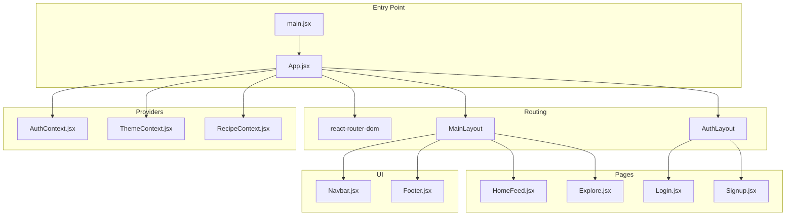
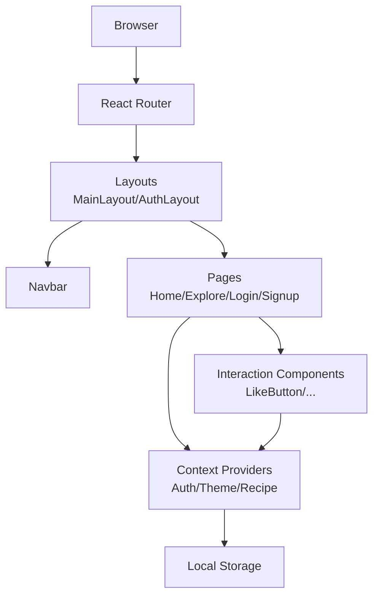
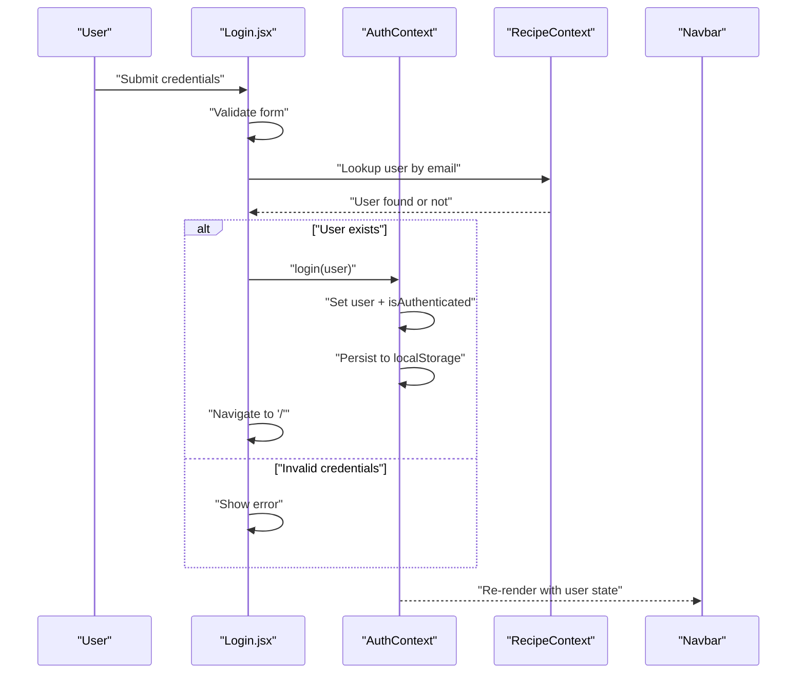
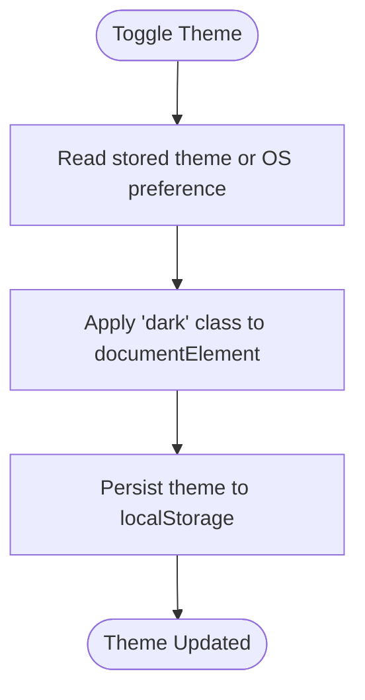
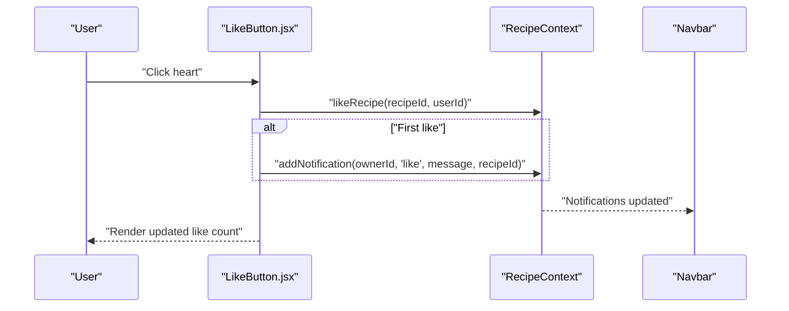
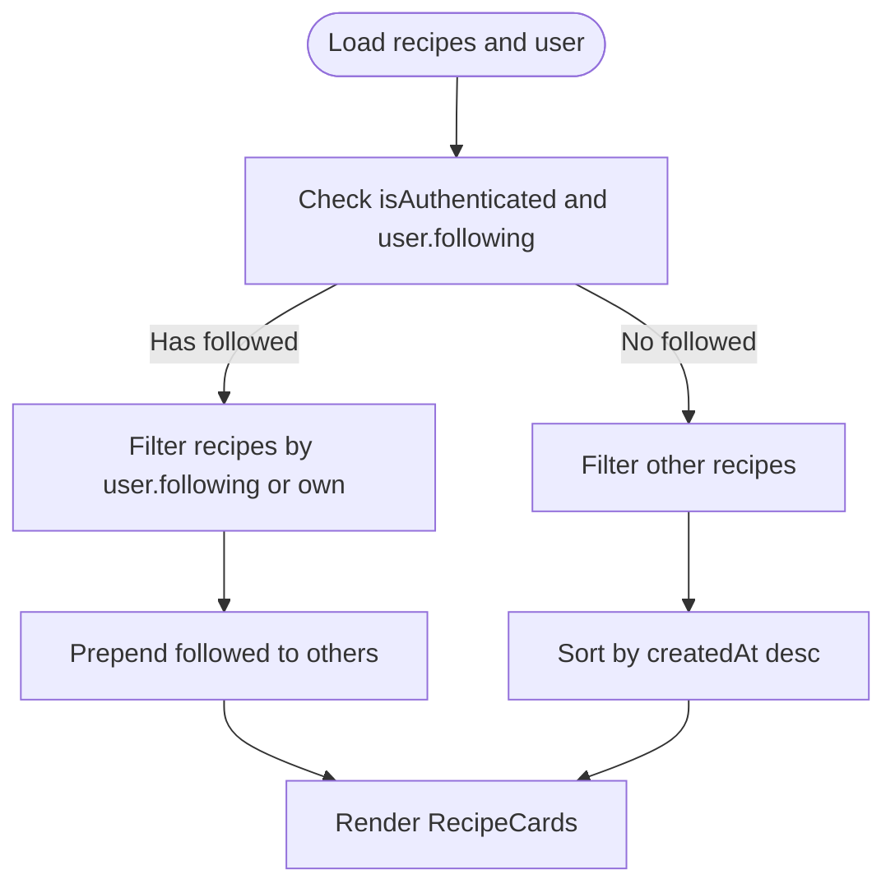
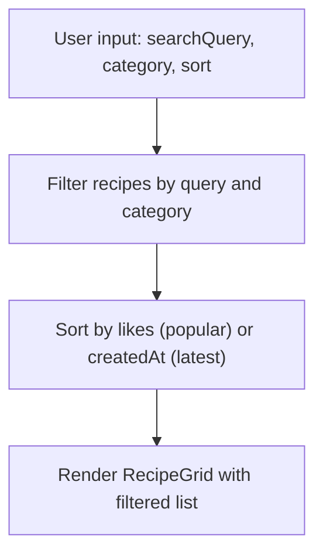
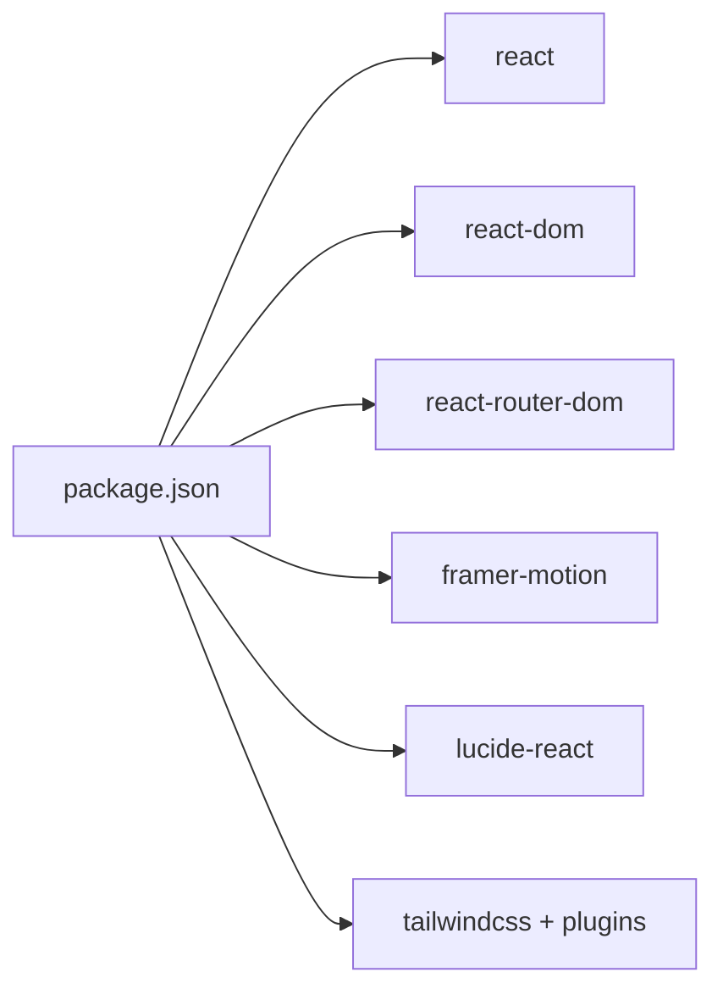

# React Client Application

<cite>
**Referenced Files in This Document**
- [package.json](file://client/package.json)
- [README.md](file://client/README.md)
- [vite.config.js](file://client/vite.config.js)
- [main.jsx](file://client/src/main.jsx)
- [App.jsx](file://client/src/App.jsx)
- [AuthContext.jsx](file://client/src/context/AuthContext.jsx)
- [ThemeContext.jsx](file://client/src/context/ThemeContext.jsx)
- [RecipeContext.jsx](file://client/src/context/RecipeContext.jsx)
- [Navbar.jsx](file://client/src/components/common/Navbar.jsx)
- [Footer.jsx](file://client/src/components/common/Footer.jsx)
- [HomeFeed.jsx](file://client/src/pages/HomeFeed.jsx)
- [Explore.jsx](file://client/src/pages/Explore.jsx)
- [Login.jsx](file://client/src/pages/Login.jsx)
- [Signup.jsx](file://client/src/pages/Signup.jsx)
- [LikeButton.jsx](file://client/src/components/interactions/LikeButton.jsx)
</cite>

## Table of Contents
1. [Introduction](#introduction)
2. [Project Structure](#project-structure)
3. [Core Components](#core-components)
4. [Architecture Overview](#architecture-overview)
5. [Detailed Component Analysis](#detailed-component-analysis)
6. [Dependency Analysis](#dependency-analysis)
7. [Performance Considerations](#performance-considerations)
8. [Troubleshooting Guide](#troubleshooting-guide)
9. [Conclusion](#conclusion)

## Introduction
This document describes the React client application for Flavora, a social recipe platform. The application uses modern React patterns with Vite for development, Tailwind CSS for styling, and Framer Motion for animations. It provides user authentication, recipe browsing and creation, social interactions (likes, comments, saves, ratings), and responsive navigation with light/dark theme support.

## Project Structure
The client application follows a feature-based structure under the `src` directory:
- Entry point initializes the app and renders the root component.
- Routing organizes pages and nested layouts.
- Context providers manage global state for authentication, theme, and recipes.
- Components are grouped by domain (common, interactions, recipe, search, user).
- Pages implement application features and compose reusable components.
- Utilities and data include mock datasets for development.

**Diagram sources**
- [main.jsx:1-11](file://client/src/main.jsx#L1-L11)
- [App.jsx:1-94](file://client/src/App.jsx#L1-L94)
- [AuthContext.jsx:1-72](file://client/src/context/AuthContext.jsx#L1-L72)
- [ThemeContext.jsx:1-43](file://client/src/context/ThemeContext.jsx#L1-L43)
- [RecipeContext.jsx:1-194](file://client/src/context/RecipeContext.jsx#L1-L194)
- [Navbar.jsx:1-206](file://client/src/components/common/Navbar.jsx#L1-L206)
- [Footer.jsx:1-33](file://client/src/components/common/Footer.jsx#L1-L33)
- [HomeFeed.jsx:1-96](file://client/src/pages/HomeFeed.jsx#L1-L96)
- [Explore.jsx:1-133](file://client/src/pages/Explore.jsx#L1-L133)
- [Login.jsx:1-218](file://client/src/pages/Login.jsx#L1-L218)
- [Signup.jsx:1-316](file://client/src/pages/Signup.jsx#L1-L316)

**Section sources**
- [package.json:1-35](file://client/package.json#L1-L35)
- [README.md:1-17](file://client/README.md#L1-L17)
- [vite.config.js:1-8](file://client/vite.config.js#L1-L8)
- [main.jsx:1-11](file://client/src/main.jsx#L1-L11)
- [App.jsx:1-94](file://client/src/App.jsx#L1-L94)

## Core Components
- Authentication Context: Manages user session, login/signup/logout, and profile updates with persistence in local storage.
- Theme Context: Handles light/dark theme switching and persists preference.
- Recipe Context: Central state for recipes, users, notifications, and social actions (likes, saves, comments, ratings, follows).
- Navigation: Responsive navbar with active state, mobile menu, theme toggle, and unread notifications badge.
- Pages: Home feed with personalized content, explore with search and filters, login/signup forms, and trending/profile routes.

**Section sources**
- [AuthContext.jsx:1-72](file://client/src/context/AuthContext.jsx#L1-L72)
- [ThemeContext.jsx:1-43](file://client/src/context/ThemeContext.jsx#L1-L43)
- [RecipeContext.jsx:1-194](file://client/src/context/RecipeContext.jsx#L1-L194)
- [Navbar.jsx:1-206](file://client/src/components/common/Navbar.jsx#L1-L206)
- [HomeFeed.jsx:1-96](file://client/src/pages/HomeFeed.jsx#L1-L96)
- [Explore.jsx:1-133](file://client/src/pages/Explore.jsx#L1-L133)
- [Login.jsx:1-218](file://client/src/pages/Login.jsx#L1-L218)
- [Signup.jsx:1-316](file://client/src/pages/Signup.jsx#L1-L316)

## Architecture Overview
The app uses a layered architecture:
- Presentation Layer: Pages and components render UI and orchestrate user interactions.
- Routing Layer: React Router manages routes, nested layouts, and protected routes.
- State Management Layer: Three contexts provide cross-component state sharing.
- Animation Layer: Framer Motion enhances transitions and micro-interactions.
- Styling Layer: Tailwind CSS with dark mode variants.

**Diagram sources**
- [App.jsx:44-91](file://client/src/App.jsx#L44-L91)
- [Navbar.jsx:20-206](file://client/src/components/common/Navbar.jsx#L20-L206)
- [HomeFeed.jsx:8-96](file://client/src/pages/HomeFeed.jsx#L8-L96)
- [Explore.jsx:9-133](file://client/src/pages/Explore.jsx#L9-L133)
- [Login.jsx:8-218](file://client/src/pages/Login.jsx#L8-L218)
- [Signup.jsx:7-316](file://client/src/pages/Signup.jsx#L7-L316)
- [AuthContext.jsx:5-72](file://client/src/context/AuthContext.jsx#L5-L72)
- [ThemeContext.jsx:5-43](file://client/src/context/ThemeContext.jsx#L5-L43)
- [RecipeContext.jsx:6-194](file://client/src/context/RecipeContext.jsx#L6-L194)

## Detailed Component Analysis

### Authentication Flow
The authentication flow integrates form validation, context updates, and navigation after successful login/signup.

**Diagram sources**
- [Login.jsx:40-60](file://client/src/pages/Login.jsx#L40-L60)
- [AuthContext.jsx:19-42](file://client/src/context/AuthContext.jsx#L19-L42)
- [RecipeContext.jsx:12-15](file://client/src/context/RecipeContext.jsx#L12-L15)
- [Navbar.jsx:21-42](file://client/src/components/common/Navbar.jsx#L21-L42)

**Section sources**
- [Login.jsx:1-218](file://client/src/pages/Login.jsx#L1-L218)
- [AuthContext.jsx:1-72](file://client/src/context/AuthContext.jsx#L1-L72)
- [RecipeContext.jsx:1-194](file://client/src/context/RecipeContext.jsx#L1-L194)
- [Navbar.jsx:1-206](file://client/src/components/common/Navbar.jsx#L1-L206)

### Theme Switching
Theme switching persists user preference and applies CSS classes to the root element.

**Diagram sources**
- [ThemeContext.jsx:5-27](file://client/src/context/ThemeContext.jsx#L5-L27)

**Section sources**
- [ThemeContext.jsx:1-43](file://client/src/context/ThemeContext.jsx#L1-L43)

### Recipe Interaction: Like Button
The like button toggles user likes and triggers notifications for recipe owners.

**Diagram sources**
- [LikeButton.jsx:21-40](file://client/src/components/interactions/LikeButton.jsx#L21-L40)
- [RecipeContext.jsx:56-66](file://client/src/context/RecipeContext.jsx#L56-L66)
- [Navbar.jsx:27-28](file://client/src/components/common/Navbar.jsx#L27-L28)

**Section sources**
- [LikeButton.jsx:1-73](file://client/src/components/interactions/LikeButton.jsx#L1-L73)
- [RecipeContext.jsx:1-194](file://client/src/context/RecipeContext.jsx#L1-L194)
- [Navbar.jsx:1-206](file://client/src/components/common/Navbar.jsx#L1-L206)

### Home Feed Personalization
The home feed prioritizes recipes from followed users and falls back to chronological ordering.

**Diagram sources**
- [HomeFeed.jsx:13-29](file://client/src/pages/HomeFeed.jsx#L13-L29)

**Section sources**
- [HomeFeed.jsx:1-96](file://client/src/pages/HomeFeed.jsx#L1-L96)

### Explore Page Filtering and Sorting
The explore page supports search, category filtering, and sorting by popularity or recency.

**Diagram sources**
- [Explore.jsx:15-44](file://client/src/pages/Explore.jsx#L15-L44)

**Section sources**
- [Explore.jsx:1-133](file://client/src/pages/Explore.jsx#L1-L133)

## Dependency Analysis
External libraries and their roles:
- react and react-dom: UI framework and DOM rendering.
- react-router-dom: Declarative routing and nested layouts.
- framer-motion: Animations for page transitions and interactive feedback.
- lucide-react: Icons for UI affordances.
- tailwindcss and related plugins: Utility-first styling and dark mode.

**Diagram sources**
- [package.json:12-32](file://client/package.json#L12-L32)

**Section sources**
- [package.json:1-35](file://client/package.json#L1-L35)

## Performance Considerations
- Memoized computations: Use memoization for derived data (e.g., filtered lists) to avoid unnecessary re-renders.
- Local storage caching: Persist state to reduce server round-trips during development.
- Conditional rendering: Hide sensitive UI until authentication state is resolved to prevent layout shifts.
- Animation optimization: Keep animation complexity moderate to maintain smoothness on lower-end devices.
- Bundle size: Prefer tree-shaking and lazy loading for future enhancements.

## Troubleshooting Guide
Common issues and resolutions:
- Authentication state not persisting: Verify local storage keys and provider wrapping order.
- Theme not applying: Ensure the root element receives the 'dark' class and local storage preference is readable.
- Notifications not visible: Confirm user ID matches and unread counts are computed from persisted notifications.
- Routing issues: Ensure routes are nested within proper layouts and protected routes wrap page components.

**Section sources**
- [AuthContext.jsx:10-17](file://client/src/context/AuthContext.jsx#L10-L17)
- [ThemeContext.jsx:15-23](file://client/src/context/ThemeContext.jsx#L15-L23)
- [RecipeContext.jsx:17-32](file://client/src/context/RecipeContext.jsx#L17-L32)
- [App.jsx:44-91](file://client/src/App.jsx#L44-L91)

## Conclusion
Flavora’s React client demonstrates a clean separation of concerns with robust context providers, a well-structured routing system, and a polished UI with animations and responsive design. The modular component architecture and clear data flows enable easy extension for additional features such as real-time notifications, image uploads, and backend integrations.