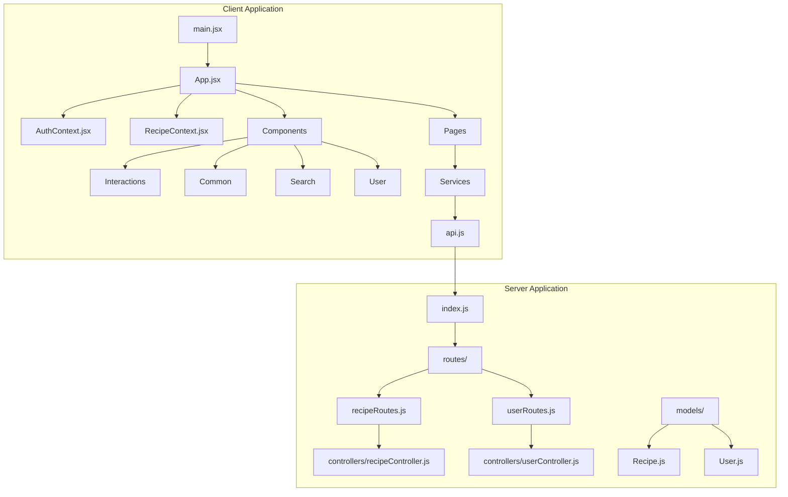
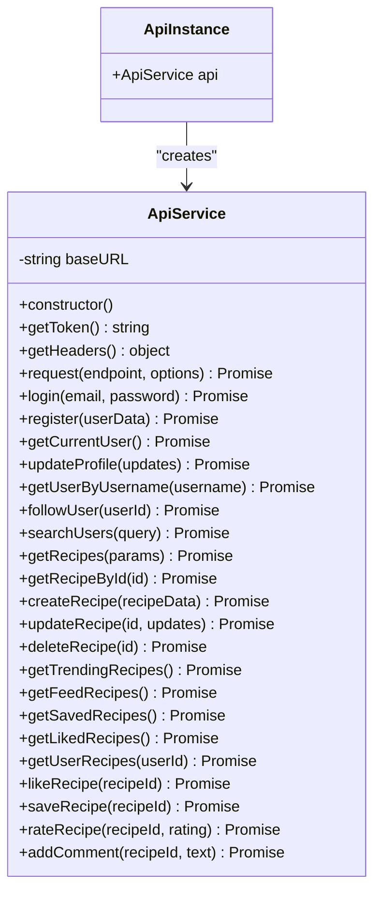
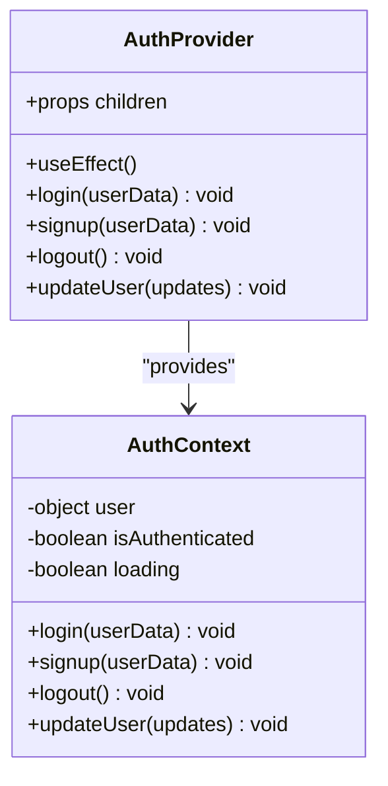
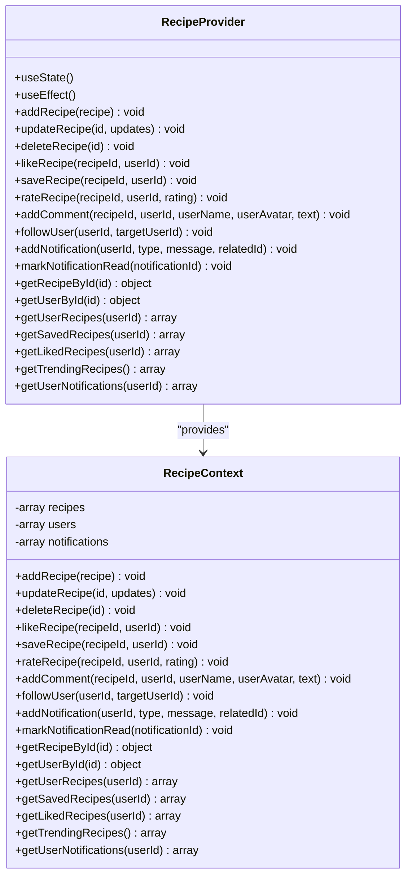
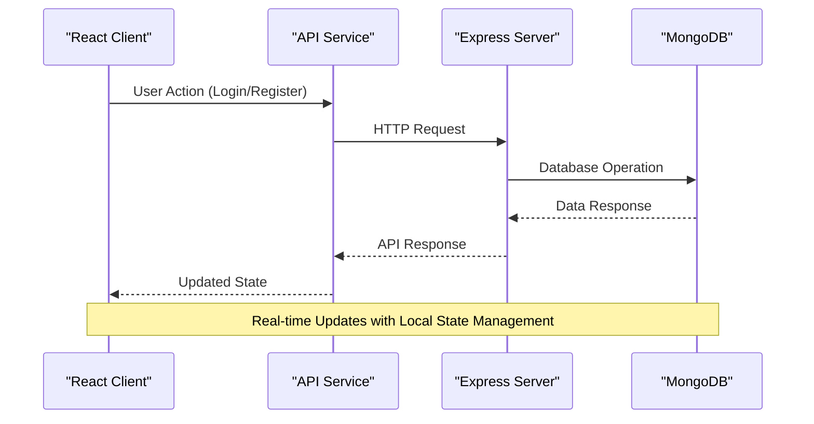
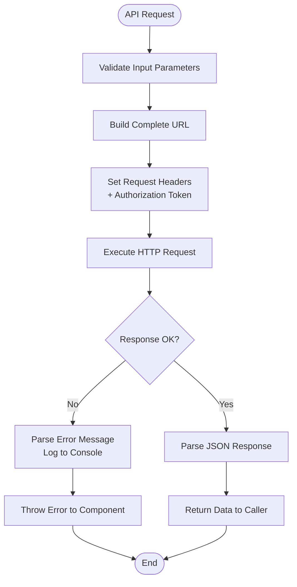
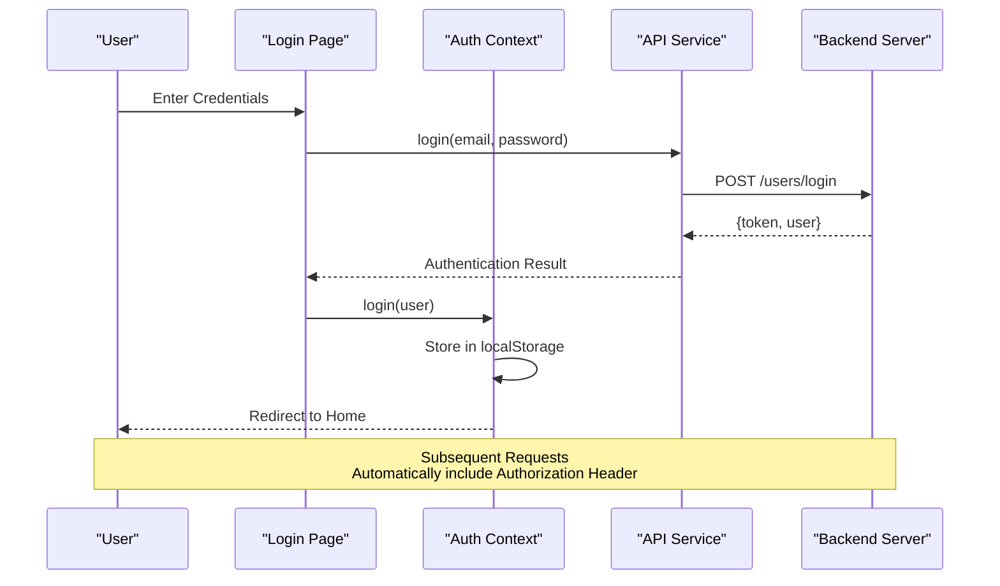
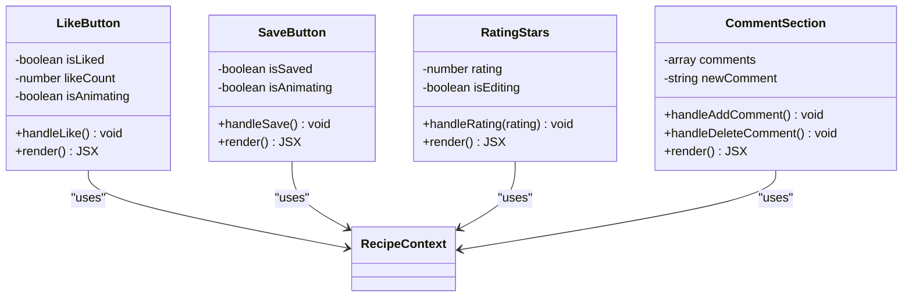
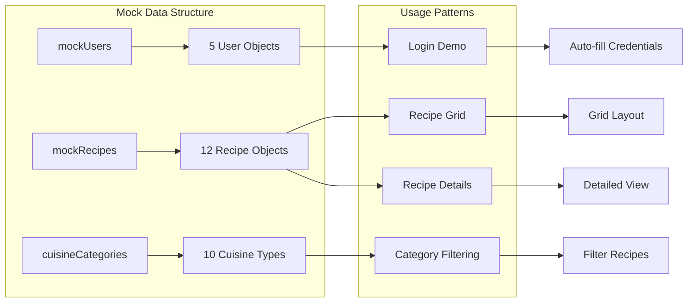
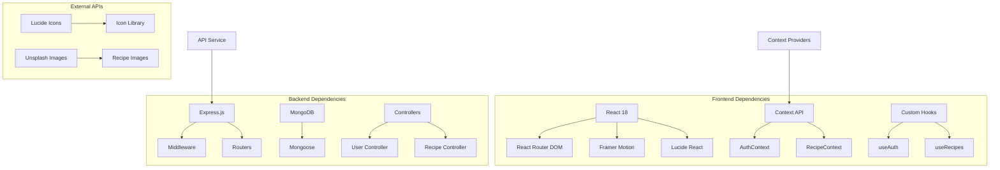

# Frontend API Service

<cite>
**Referenced Files in This Document**
- [api.js](file://client/src/services/api.js)
- [AuthContext.jsx](file://client/src/context/AuthContext.jsx)
- [RecipeContext.jsx](file://client/src/context/RecipeContext.jsx)
- [App.jsx](file://client/src/App.jsx)
- [main.jsx](file://client/src/main.jsx)
- [mockData.js](file://client/src/data/mockData.js)
- [Login.jsx](file://client/src/pages/Login.jsx)
- [RecipeDetailPage.jsx](file://client/src/pages/RecipeDetailPage.jsx)
- [LikeButton.jsx](file://client/src/components/interactions/LikeButton.jsx)
- [SaveButton.jsx](file://client/src/components/interactions/SaveButton.jsx)
- [SearchBar.jsx](file://client/src/components/search/SearchBar.jsx)
- [recipeRoutes.js](file://server/routes/recipeRoutes.js)
- [userRoutes.js](file://server/routes/userRoutes.js)
- [recipeController.js](file://server/controllers/recipeController.js)
- [userController.js](file://server/controllers/userController.js)
</cite>

## Table of Contents
1. [Introduction](#introduction)
2. [Project Structure](#project-structure)
3. [Core Components](#core-components)
4. [Architecture Overview](#architecture-overview)
5. [Detailed Component Analysis](#detailed-component-analysis)
6. [API Endpoint Definitions](#api-endpoint-definitions)
7. [Dependency Analysis](#dependency-analysis)
8. [Performance Considerations](#performance-considerations)
9. [Troubleshooting Guide](#troubleshooting-guide)
10. [Conclusion](#conclusion)

## Introduction

The Frontend API Service is a comprehensive React-based application that provides a modern recipe sharing platform. This service handles all client-side API communications, user authentication, recipe management, and interactive features. The system consists of two main parts: a frontend React application with integrated API service and a backend Node.js/Express server with MongoDB database.

The application enables users to discover recipes, interact with content through likes, saves, ratings, and comments, manage their profiles, and follow other users. The frontend API service acts as a centralized communication layer between the React components and the backend RESTful API endpoints.

## Project Structure

The project follows a well-organized structure with clear separation between frontend and backend concerns:

**Diagram sources**
- [main.jsx:1-11](file://client/src/main.jsx#L1-L11)
- [App.jsx:1-94](file://client/src/App.jsx#L1-L94)
- [api.js:1-172](file://client/src/services/api.js#L1-L172)

The frontend is built with React 18, Vite for development, and utilizes modern JavaScript features including ES6 modules, async/await, and React hooks. The backend uses Express.js with MongoDB for data persistence.

**Section sources**
- [main.jsx:1-11](file://client/src/main.jsx#L1-L11)
- [App.jsx:1-94](file://client/src/App.jsx#L1-L94)

## Core Components

### API Service Layer

The API service provides a centralized interface for all HTTP requests to the backend server. It handles authentication tokens, request formatting, and error management.

**Diagram sources**
- [api.js:3-172](file://client/src/services/api.js#L3-L172)

### Authentication Context

The authentication system manages user sessions, login/logout functionality, and protected route access.

**Diagram sources**
- [AuthContext.jsx:1-72](file://client/src/context/AuthContext.jsx#L1-L72)

### Recipe Management Context

The recipe context handles local state management for recipes, user interactions, and notification systems.

**Diagram sources**
- [RecipeContext.jsx:1-194](file://client/src/context/RecipeContext.jsx#L1-L194)

**Section sources**
- [api.js:1-172](file://client/src/services/api.js#L1-L172)
- [AuthContext.jsx:1-72](file://client/src/context/AuthContext.jsx#L1-L72)
- [RecipeContext.jsx:1-194](file://client/src/context/RecipeContext.jsx#L1-L194)

## Architecture Overview

The application follows a client-server architecture pattern with clear separation of concerns:

**Diagram sources**
- [api.js:25-49](file://client/src/services/api.js#L25-L49)
- [recipeController.js:58-96](file://server/controllers/recipeController.js#L58-L96)

The architecture implements several key patterns:

1. **Centralized API Service**: All HTTP requests are handled through a single ApiService class
2. **Context-Based State Management**: React Context providers manage global application state
3. **Mock Data Integration**: Local mock data for development and offline functionality
4. **Protected Routes**: Authentication guards for private routes
5. **Real-time Interactions**: Immediate UI updates for likes, saves, and comments

**Section sources**
- [App.jsx:44-91](file://client/src/App.jsx#L44-L91)
- [recipeController.js:196-225](file://server/controllers/recipeController.js#L196-L225)

## Detailed Component Analysis

### API Service Implementation

The API service provides a comprehensive interface for all backend communications with robust error handling and authentication support.

**Diagram sources**
- [api.js:25-49](file://client/src/services/api.js#L25-L49)

Key features of the API service:

- **Automatic Authentication**: Automatically includes JWT tokens in request headers
- **Error Handling**: Centralized error management with meaningful error messages
- **Endpoint Organization**: Logical grouping of related endpoints (auth, users, recipes)
- **Flexible Parameters**: Support for query parameters and request bodies
- **Type Safety**: Consistent response formatting across all endpoints

**Section sources**
- [api.js:12-23](file://client/src/services/api.js#L12-L23)
- [api.js:52-68](file://client/src/services/api.js#L52-L68)

### Authentication Flow

The authentication system provides seamless user session management with automatic token handling.

**Diagram sources**
- [Login.jsx:40-60](file://client/src/pages/Login.jsx#L40-L60)
- [AuthContext.jsx:19-23](file://client/src/context/AuthContext.jsx#L19-L23)

The authentication flow includes:

- **Local Storage Persistence**: User data and tokens stored for session continuity
- **Protected Route Access**: Automatic redirection for unauthorized access attempts
- **Token Management**: Automatic inclusion of Authorization headers in all requests
- **State Synchronization**: Real-time updates across all components

**Section sources**
- [AuthContext.jsx:5-17](file://client/src/context/AuthContext.jsx#L5-L17)
- [AuthContext.jsx:38-42](file://client/src/context/AuthContext.jsx#L38-L42)

### Recipe Interaction System

The recipe interaction system enables users to engage with content through likes, saves, ratings, and comments.

**Diagram sources**
- [LikeButton.jsx:1-73](file://client/src/components/interactions/LikeButton.jsx#L1-L73)
- [SaveButton.jsx:1-53](file://client/src/components/interactions/SaveButton.jsx#L1-L53)

Each interaction component provides:

- **Immediate Feedback**: Visual animations and state updates
- **Authentication Validation**: Prevents actions without proper authentication
- **Notification System**: Automatic notifications for recipe owners
- **Consistent Styling**: Unified design language across all interaction types

**Section sources**
- [LikeButton.jsx:21-40](file://client/src/components/interactions/LikeButton.jsx#L21-L40)
- [SaveButton.jsx:20-26](file://client/src/components/interactions/SaveButton.jsx#L20-L26)

### Mock Data Integration

The application includes comprehensive mock data for development and demonstration purposes.

**Diagram sources**
- [mockData.js:1-587](file://client/src/data/mockData.js#L1-L587)

The mock data system provides:

- **Complete User Profiles**: Five realistic user profiles with follower relationships
- **Diverse Recipe Collection**: Twelve varied recipes across different cuisines
- **Realistic Interactions**: Pre-populated likes, comments, and ratings
- **Development Convenience**: Eliminates need for backend during development
- **Testing Foundation**: Comprehensive dataset for component testing

**Section sources**
- [mockData.js:59-573](file://client/src/data/mockData.js#L59-L573)

## API Endpoint Definitions

### User Management Endpoints

The user management system provides comprehensive profile and account functionality.

| Endpoint | Method | Description | Authentication |
|----------|--------|-------------|----------------|
| `/users/register` | POST | Create new user account | Public |
| `/users/login` | POST | Authenticate user login | Public |
| `/users/me` | GET | Retrieve current user profile | Private |
| `/users/me` | PUT | Update user profile | Private |
| `/users/:id/follow` | POST | Follow/unfollow another user | Private |
| `/users/:username` | GET | Get user by username | Public |
| `/users/search` | GET | Search users by name/username | Public |

### Recipe Management Endpoints

The recipe management system handles all recipe-related operations with comprehensive filtering and pagination.

| Endpoint | Method | Description | Authentication |
|----------|--------|-------------|----------------|
| `/recipes` | GET | Get all recipes with filters | Optional |
| `/recipes` | POST | Create new recipe | Private |
| `/recipes/:id` | GET | Get recipe by ID | Optional |
| `/recipes/:id` | PUT | Update recipe | Private |
| `/recipes/:id` | DELETE | Delete recipe | Private |
| `/recipes/:id/like` | POST | Like/unlike recipe | Private |
| `/recipes/:id/save` | POST | Save/unsave recipe | Private |
| `/recipes/:id/rate` | POST | Rate recipe | Private |
| `/recipes/:id/comments` | POST | Add comment | Private |
| `/recipes/:id/comments/:commentId` | DELETE | Delete comment | Private |
| `/recipes/trending` | GET | Get trending recipes | Optional |
| `/recipes/saved/list` | GET | Get user's saved recipes | Private |
| `/recipes/liked/list` | GET | Get user's liked recipes | Private |
| `/recipes/feed/list` | GET | Get feed recipes | Private |
| `/recipes/user/:userId` | GET | Get recipes by user | Optional |

### Request/Response Patterns

All API endpoints follow consistent request/response patterns:

**Request Format:**
- JSON body for POST/PUT requests
- Query parameters for GET requests
- Authorization header for protected routes

**Response Format:**
- Success: `{ success: true, message: string, data: any }`
- Error: `{ success: false, message: string, error: any }`

**Section sources**
- [userRoutes.js:21-34](file://server/routes/userRoutes.js#L21-L34)
- [recipeRoutes.js:28-53](file://server/routes/recipeRoutes.js#L28-L53)
- [userController.js:13-53](file://server/controllers/userController.js#L13-L53)
- [recipeController.js:12-51](file://server/controllers/recipeController.js#L12-L51)

## Dependency Analysis

The application exhibits excellent modularity with clear dependency relationships:

**Diagram sources**
- [package.json](file://client/package.json)
- [server/package.json](file://server/package.json)

Key dependency characteristics:

- **Minimal External Dependencies**: Only essential libraries for functionality
- **Modern JavaScript**: ES6+ features with proper transpilation
- **TypeScript-Free**: Pure JavaScript with JSDoc comments
- **Development Tools**: Vite for fast development and building
- **Production Ready**: Optimized builds with tree-shaking

**Section sources**
- [package.json](file://client/package.json)
- [server/package.json](file://server/package.json)

## Performance Considerations

The application implements several performance optimization strategies:

### Client-Side Optimizations

1. **Lazy Loading**: Components are loaded on-demand based on routing
2. **State Management**: Efficient React Context usage with selective re-renders
3. **Image Optimization**: Responsive images with appropriate sizing
4. **Animation Performance**: Hardware-accelerated CSS transitions
5. **Memory Management**: Proper cleanup of event listeners and subscriptions

### API Performance

1. **Request Batching**: Multiple related requests can be combined
2. **Caching Strategy**: Local storage for frequently accessed data
3. **Pagination**: Server-side pagination for large datasets
4. **Filtering**: Efficient query parameters for data retrieval
5. **Error Boundaries**: Graceful handling of network failures

### Scalability Considerations

1. **Database Indexing**: Proper indexing for common query patterns
2. **Connection Pooling**: Efficient database connection management
3. **Rate Limiting**: Protection against abuse and excessive requests
4. **CDN Integration**: Static asset delivery optimization
5. **Compression**: Gzip compression for reduced payload sizes

## Troubleshooting Guide

### Common Issues and Solutions

**Authentication Problems:**
- **Issue**: Login fails with invalid credentials
- **Solution**: Verify email format and password length requirements
- **Debug**: Check browser developer tools for network errors

**API Communication Errors:**
- **Issue**: Network requests timeout or fail
- **Solution**: Verify API endpoint URLs and server connectivity
- **Debug**: Inspect response status codes and error messages

**State Management Issues:**
- **Issue**: UI not updating after user actions
- **Solution**: Ensure proper context provider wrapping
- **Debug**: Check for missing Provider components

**Performance Issues:**
- **Issue**: Slow page loads or animations
- **Solution**: Implement lazy loading and optimize images
- **Debug**: Use browser performance profiling tools

### Debugging Tools and Techniques

1. **Browser Developer Tools**: Network tab for API monitoring
2. **Console Logging**: Strategic logging for state changes
3. **React DevTools**: Component hierarchy and state inspection
4. **Network Profiling**: Performance analysis and optimization
5. **Error Tracking**: Centralized error reporting and monitoring

**Section sources**
- [api.js:45-48](file://client/src/services/api.js#L45-L48)
- [AuthContext.jsx:65-71](file://client/src/context/AuthContext.jsx#L65-L71)

## Conclusion

The Frontend API Service represents a well-architected, scalable solution for recipe sharing applications. The implementation demonstrates best practices in modern web development including:

- **Clean Architecture**: Clear separation of concerns between frontend and backend
- **Robust State Management**: Comprehensive context-based state handling
- **User Experience**: Smooth interactions with immediate feedback
- **Performance Optimization**: Efficient data management and rendering
- **Maintainability**: Modular code structure with clear documentation

The system successfully balances functionality with simplicity, providing a solid foundation for further feature development while maintaining excellent performance and user experience standards. The comprehensive API service layer ensures reliable communication between client and server, while the context providers enable efficient state management across the application.

Future enhancements could include real-time WebSocket connections for live updates, advanced search capabilities with faceted filtering, and expanded social features for community building around shared recipes.