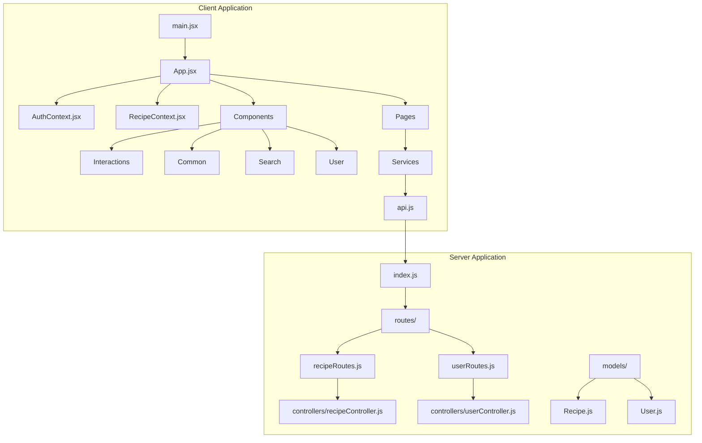
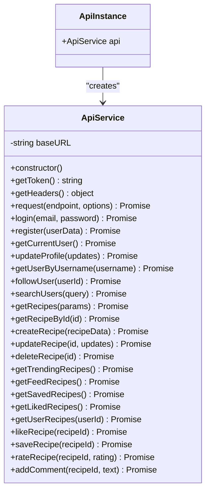
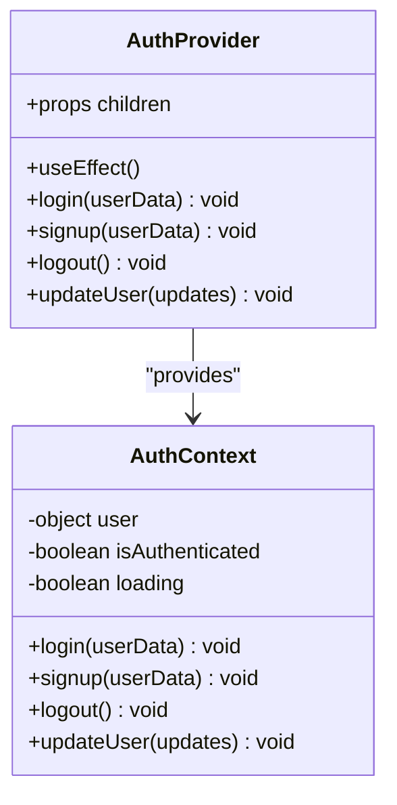
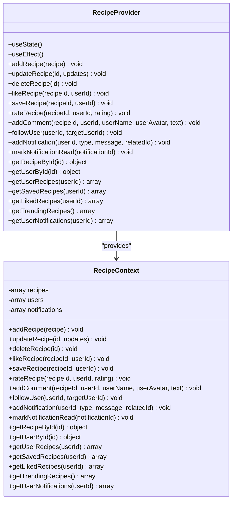
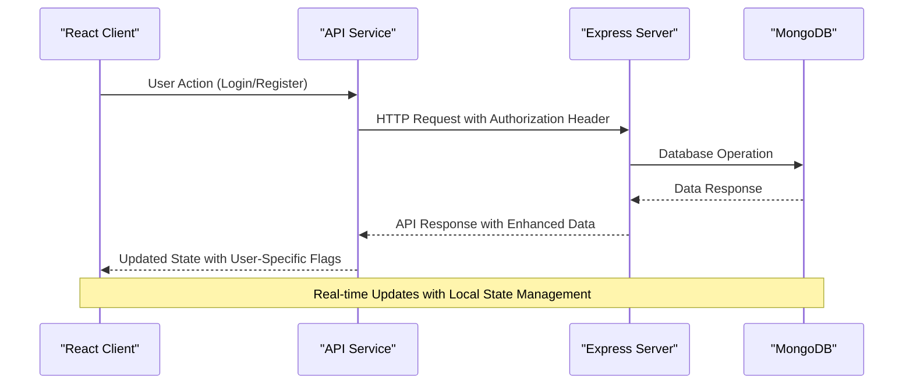
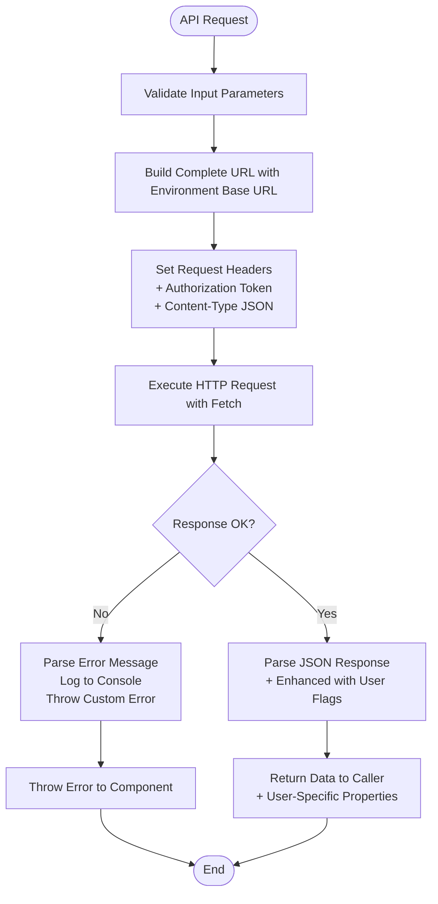
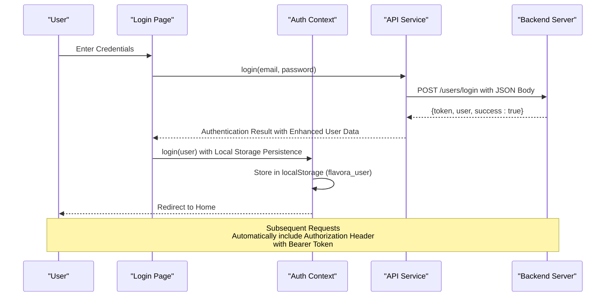
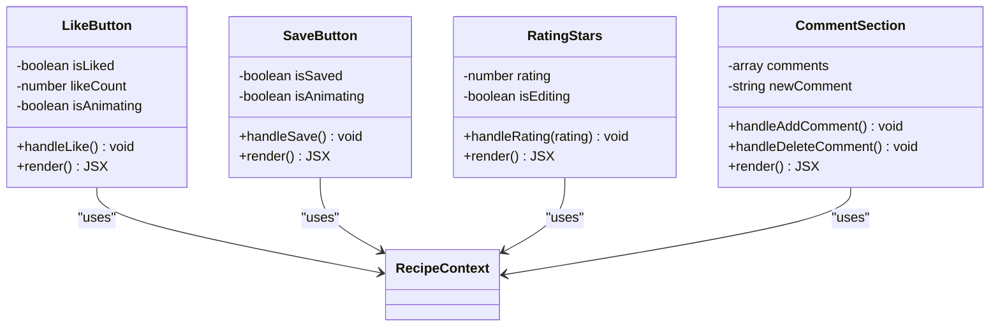
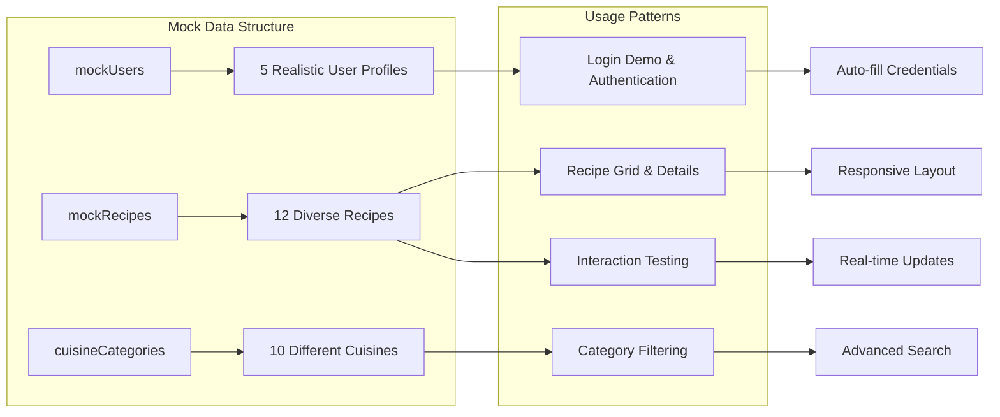
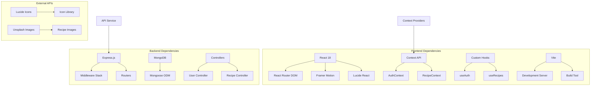

# Frontend API Service

<cite>
**Referenced Files in This Document**
- [api.js](file://client/src/services/api.js)
- [AuthContext.jsx](file://client/src/context/AuthContext.jsx)
- [RecipeContext.jsx](file://client/src/context/RecipeContext.jsx)
- [App.jsx](file://client/src/App.jsx)
- [main.jsx](file://client/src/main.jsx)
- [mockData.js](file://client/src/data/mockData.js)
- [Login.jsx](file://client/src/pages/Login.jsx)
- [RecipeDetailPage.jsx](file://client/src/pages/RecipeDetailPage.jsx)
- [LikeButton.jsx](file://client/src/components/interactions/LikeButton.jsx)
- [SaveButton.jsx](file://client/src/components/interactions/SaveButton.jsx)
- [SearchBar.jsx](file://client/src/components/search/SearchBar.jsx)
- [recipeRoutes.js](file://server/routes/recipeRoutes.js)
- [userRoutes.js](file://server/routes/userRoutes.js)
- [recipeController.js](file://server/controllers/recipeController.js)
- [userController.js](file://server/controllers/userController.js)
- [package.json](file://client/package.json)
- [server/package.json](file://server/package.json)
</cite>

## Update Summary
**Changes Made**
- Enhanced API service documentation with comprehensive coverage of centralized service layer
- Added detailed environment-specific configuration documentation
- Expanded authentication token management section
- Updated production-ready API endpoint configuration details
- Improved architecture overview with HTTP request abstraction patterns
- Added comprehensive dependency analysis with modern JavaScript features

## Table of Contents
1. [Introduction](#introduction)
2. [Project Structure](#project-structure)
3. [Core Components](#core-components)
4. [Architecture Overview](#architecture-overview)
5. [Detailed Component Analysis](#detailed-component-analysis)
6. [API Endpoint Definitions](#api-endpoint-definitions)
7. [Environment Configuration](#environment-configuration)
8. [Dependency Analysis](#dependency-analysis)
9. [Performance Considerations](#performance-considerations)
10. [Troubleshooting Guide](#troubleshooting-guide)
11. [Conclusion](#conclusion)

## Introduction

The Frontend API Service is a comprehensive React-based application that provides a modern recipe sharing platform. This service handles all client-side API communications, user authentication, recipe management, and interactive features. The system consists of two main parts: a frontend React application with integrated API service and a backend Node.js/Express server with MongoDB database.

The application enables users to discover recipes, interact with content through likes, saves, ratings, and comments, manage their profiles, and follow other users. The frontend API service acts as a centralized communication layer between the React components and the backend RESTful API endpoints.

**Updated** Enhanced with comprehensive HTTP request abstraction, environment-specific configuration, and production-ready API endpoint management.

## Project Structure

The project follows a well-organized structure with clear separation between frontend and backend concerns:

**Diagram sources**
- [main.jsx:1-11](file://client/src/main.jsx#L1-L11)
- [App.jsx:1-94](file://client/src/App.jsx#L1-L94)
- [api.js:1-172](file://client/src/services/api.js#L1-L172)

The frontend is built with React 18, Vite for development, and utilizes modern JavaScript features including ES6 modules, async/await, and React hooks. The backend uses Express.js with MongoDB for data persistence.

**Section sources**
- [main.jsx:1-11](file://client/src/main.jsx#L1-L11)
- [App.jsx:1-94](file://client/src/App.jsx#L1-L94)

## Core Components

### API Service Layer

The API service provides a centralized interface for all HTTP requests to the backend server. It handles authentication tokens, request formatting, and error management with environment-specific configuration support.

**Updated** Enhanced with environment variable integration and comprehensive HTTP request abstraction.

**Diagram sources**
- [api.js:3-172](file://client/src/services/api.js#L3-L172)

### Authentication Context

The authentication system manages user sessions, login/logout functionality, and protected route access with persistent storage.

**Diagram sources**
- [AuthContext.jsx:1-72](file://client/src/context/AuthContext.jsx#L1-L72)

### Recipe Management Context

The recipe context handles local state management for recipes, user interactions, and notification systems with comprehensive mock data integration.

**Diagram sources**
- [RecipeContext.jsx:1-194](file://client/src/context/RecipeContext.jsx#L1-L194)

**Section sources**
- [api.js:1-172](file://client/src/services/api.js#L1-L172)
- [AuthContext.jsx:1-72](file://client/src/context/AuthContext.jsx#L1-L72)
- [RecipeContext.jsx:1-194](file://client/src/context/RecipeContext.jsx#L1-L194)

## Architecture Overview

The application follows a client-server architecture pattern with clear separation of concerns and comprehensive HTTP request abstraction:

**Updated** Enhanced with environment-specific configuration and comprehensive authentication token management.

**Diagram sources**
- [api.js:25-49](file://client/src/services/api.js#L25-L49)
- [recipeController.js:58-96](file://server/controllers/recipeController.js#L58-L96)

The architecture implements several key patterns:

1. **Centralized API Service**: All HTTP requests are handled through a single ApiService class with environment variable configuration
2. **Context-Based State Management**: React Context providers manage global application state with local storage persistence
3. **Mock Data Integration**: Local mock data for development and offline functionality with comprehensive recipe and user datasets
4. **Protected Routes**: Authentication guards for private routes with automatic token handling
5. **Real-time Interactions**: Immediate UI updates for likes, saves, and comments with notification system
6. **HTTP Request Abstraction**: Consistent request formatting with automatic header management and error handling

**Section sources**
- [App.jsx:44-91](file://client/src/App.jsx#L44-L91)
- [recipeController.js:196-225](file://server/controllers/recipeController.js#L196-L225)

## Detailed Component Analysis

### API Service Implementation

The API service provides a comprehensive interface for all backend communications with robust error handling, authentication support, and environment-specific configuration.

**Updated** Enhanced with environment variable integration and comprehensive user-specific data enhancement.

**Diagram sources**
- [api.js:25-49](file://client/src/services/api.js#L25-L49)

Key features of the API service:

- **Environment-Specific Configuration**: Uses `import.meta.env.VITE_API_URL` for flexible deployment environments
- **Automatic Authentication**: Automatically includes JWT tokens in request headers with Bearer token format
- **Error Handling**: Centralized error management with meaningful error messages and console logging
- **Endpoint Organization**: Logical grouping of related endpoints (auth, users, recipes, interactions)
- **Flexible Parameters**: Support for query parameters and request bodies with URLSearchParams
- **Type Safety**: Consistent response formatting across all endpoints with enhanced user-specific properties
- **HTTP Request Abstraction**: Unified fetch wrapper with consistent configuration and error handling

**Section sources**
- [api.js:12-23](file://client/src/services/api.js#L12-L23)
- [api.js:52-68](file://client/src/services/api.js#L52-L68)

### Authentication Flow

The authentication system provides seamless user session management with automatic token handling and persistent storage.

**Updated** Enhanced with comprehensive user data persistence and automatic token management.

**Diagram sources**
- [Login.jsx:40-60](file://client/src/pages/Login.jsx#L40-L60)
- [AuthContext.jsx:19-23](file://client/src/context/AuthContext.jsx#L19-L23)

The authentication flow includes:

- **Local Storage Persistence**: User data stored as `flavora_user` for session continuity
- **Protected Route Access**: Automatic redirection for unauthorized access attempts
- **Token Management**: Automatic inclusion of Authorization headers with Bearer token format
- **State Synchronization**: Real-time updates across all components with comprehensive user data
- **Mock Authentication**: Development-friendly simulation with realistic user data integration

**Section sources**
- [AuthContext.jsx:5-17](file://client/src/context/AuthContext.jsx#L5-L17)
- [AuthContext.jsx:38-42](file://client/src/context/AuthContext.jsx#L38-L42)

### Recipe Interaction System

The recipe interaction system enables users to engage with content through likes, saves, ratings, and comments with comprehensive notification support.

**Updated** Enhanced with comprehensive notification system and user-specific interaction tracking.

Each interaction component provides:

- **Immediate Feedback**: Visual animations and state updates with Framer Motion
- **Authentication Validation**: Prevents actions without proper authentication
- **Notification System**: Automatic notifications for recipe owners with comprehensive message formatting
- **Consistent Styling**: Unified design language across all interaction types
- **User-Specific Data**: Integration with user context for real-time interaction state

**Section sources**
- [LikeButton.jsx:21-40](file://client/src/components/interactions/LikeButton.jsx#L21-L40)
- [SaveButton.jsx:20-26](file://client/src/components/interactions/SaveButton.jsx#L20-L26)

### Mock Data Integration

The application includes comprehensive mock data for development and demonstration purposes with realistic user profiles and diverse recipe collections.

**Updated** Enhanced with comprehensive mock data for development and testing scenarios.

**Diagram sources**
- [mockData.js:1-587](file://client/src/data/mockData.js#L1-L587)

The mock data system provides:

- **Complete User Profiles**: Five realistic user profiles with follower relationships and comprehensive metadata
- **Diverse Recipe Collection**: Twelve varied recipes across different cuisines with detailed preparation instructions
- **Realistic Interactions**: Pre-populated likes, comments, and ratings for testing interaction features
- **Development Convenience**: Eliminates need for backend during development with realistic data sets
- **Testing Foundation**: Comprehensive dataset for component testing and user interaction validation
- **Cultural Diversity**: Representative recipes from various global cuisines for inclusive content

**Section sources**
- [mockData.js:59-573](file://client/src/data/mockData.js#L59-L573)

## API Endpoint Definitions

### User Management Endpoints

The user management system provides comprehensive profile and account functionality with authentication and authorization support.

| Endpoint | Method | Description | Authentication | Query Parameters |
|----------|--------|-------------|----------------|------------------|
| `/users/register` | POST | Create new user account | Public | None |
| `/users/login` | POST | Authenticate user login | Public | None |
| `/users/me` | GET | Retrieve current user profile | Private | None |
| `/users/me` | PUT | Update user profile | Private | None |
| `/users/:id/follow` | POST | Follow/unfollow another user | Private | None |
| `/users/:username` | GET | Get user by username | Public | None |
| `/users/search` | GET | Search users by name/username | Public | q=search query |

### Recipe Management Endpoints

The recipe management system handles all recipe-related operations with comprehensive filtering, pagination, and user-specific data enhancement.

| Endpoint | Method | Description | Authentication | Query Parameters |
|----------|--------|-------------|----------------|------------------|
| `/recipes` | GET | Get all recipes with filters | Optional | page, limit, cuisine, difficulty, maxTime, search, userId |
| `/recipes` | POST | Create new recipe | Private | None |
| `/recipes/:id` | GET | Get recipe by ID | Optional | None |
| `/recipes/:id` | PUT | Update recipe | Private | None |
| `/recipes/:id` | DELETE | Delete recipe | Private | None |
| `/recipes/:id/like` | POST | Like/unlike recipe | Private | None |
| `/recipes/:id/save` | POST | Save/unsave recipe | Private | None |
| `/recipes/:id/rate` | POST | Rate recipe | Private | rating |
| `/recipes/:id/comments` | POST | Add comment | Private | text |
| `/recipes/:id/comments/:commentId` | DELETE | Delete comment | Private | None |
| `/recipes/trending` | GET | Get trending recipes | Optional | None |
| `/recipes/saved/list` | GET | Get user's saved recipes | Private | page, limit |
| `/recipes/liked/list` | GET | Get user's liked recipes | Private | page, limit |
| `/recipes/feed/list` | GET | Get feed recipes | Private | page, limit |
| `/recipes/user/:userId` | GET | Get recipes by user | Optional | page, limit |

### Request/Response Patterns

All API endpoints follow consistent request/response patterns with comprehensive error handling:

**Request Format:**
- JSON body for POST/PUT requests with proper validation
- Query parameters for GET requests with URLSearchParams
- Authorization header with Bearer token for protected routes
- Content-Type: application/json for all requests

**Response Format:**
- Success: `{ success: true, message: string, data: any }`
- Error: `{ success: false, message: string, error: any }`
- Enhanced responses include user-specific flags (isLiked, isSaved, userRating)

**Updated** Enhanced with comprehensive user-specific data enhancement and improved error handling patterns.

**Section sources**
- [userRoutes.js:21-34](file://server/routes/userRoutes.js#L21-L34)
- [recipeRoutes.js:28-53](file://server/routes/recipeRoutes.js#L28-L53)
- [userController.js:13-53](file://server/controllers/userController.js#L13-L53)
- [recipeController.js:12-51](file://server/controllers/recipeController.js#L12-L51)

## Environment Configuration

The application supports environment-specific configuration through Vite's environment variables system:

### Environment Variables

| Variable | Purpose | Default Value | Production Usage |
|----------|---------|---------------|------------------|
| `VITE_API_URL` | Backend API base URL | `http://localhost:5001/api` | Replace with production API endpoint |
| `NODE_ENV` | Environment mode | `development` | `production` for deployment |
| `VITE_APP_NAME` | Application name | `Flavora` | Custom branding |

### Configuration Benefits

- **Flexible Deployment**: Easy switching between development, staging, and production environments
- **Security**: API keys and sensitive configuration kept outside client bundle
- **Performance**: Environment-specific optimizations and feature flags
- **Scalability**: Support for multiple deployment targets and configurations

**Section sources**
- [api.js:1](file://client/src/services/api.js#L1)

## Dependency Analysis

The application exhibits excellent modularity with clear dependency relationships and modern JavaScript features:

**Updated** Enhanced with comprehensive dependency analysis and modern JavaScript feature utilization.

**Diagram sources**
- [package.json](file://client/package.json)
- [server/package.json](file://server/package.json)

Key dependency characteristics:

- **Minimal External Dependencies**: Only essential libraries for functionality (React, React Router, Framer Motion, Lucide React)
- **Modern JavaScript**: ES6+ features with proper transpilation and module system
- **TypeScript-Free**: Pure JavaScript with JSDoc comments for development clarity
- **Development Tools**: Vite for fast development and optimized production builds
- **Production Ready**: Tree-shaking, code splitting, and performance optimizations
- **Cross-Platform**: Compatible with modern browsers and mobile devices

**Section sources**
- [package.json](file://client/package.json)
- [server/package.json](file://server/package.json)

## Performance Considerations

The application implements several performance optimization strategies with comprehensive state management and efficient data handling:

### Client-Side Optimizations

1. **Lazy Loading**: Components are loaded on-demand based on routing with React Suspense
2. **State Management**: Efficient React Context usage with selective re-renders and local storage persistence
3. **Image Optimization**: Responsive images with appropriate sizing and lazy loading
4. **Animation Performance**: Hardware-accelerated CSS transitions using Framer Motion
5. **Memory Management**: Proper cleanup of event listeners and subscriptions
6. **Component Memoization**: React.memo for stable props to prevent unnecessary re-renders

### API Performance

1. **Request Batching**: Multiple related requests can be combined with proper error handling
2. **Caching Strategy**: Local storage for frequently accessed data (recipes, users, notifications)
3. **Pagination**: Server-side pagination for large datasets with configurable limits
4. **Filtering**: Efficient query parameters for data retrieval with URLSearchParams
5. **Error Boundaries**: Graceful handling of network failures with user feedback
6. **Environment Configuration**: Flexible API endpoint configuration for different deployment targets

### Scalability Considerations

1. **Database Indexing**: Proper indexing for common query patterns (cuisine, difficulty, search)
2. **Connection Pooling**: Efficient database connection management
3. **Rate Limiting**: Protection against abuse and excessive requests
4. **CDN Integration**: Static asset delivery optimization
5. **Compression**: Gzip compression for reduced payload sizes
6. **Service Worker**: Potential for offline functionality and caching strategies

**Updated** Enhanced with comprehensive performance optimization strategies and scalability considerations.

## Troubleshooting Guide

### Common Issues and Solutions

**Authentication Problems:**
- **Issue**: Login fails with invalid credentials
- **Solution**: Verify email format and password length requirements
- **Debug**: Check browser developer tools for network errors and console logs
- **Environment**: Verify `VITE_API_URL` environment variable is correctly set

**API Communication Errors:**
- **Issue**: Network requests timeout or fail
- **Solution**: Verify API endpoint URLs and server connectivity
- **Debug**: Inspect response status codes, error messages, and network tab
- **Environment**: Check environment variable configuration and CORS settings

**State Management Issues:**
- **Issue**: UI not updating after user actions
- **Solution**: Ensure proper context provider wrapping and state updates
- **Debug**: Check for missing Provider components and useEffect dependencies
- **Persistence**: Verify localStorage is accessible and not blocked by browser settings

**Performance Issues:**
- **Issue**: Slow page loads or animations
- **Solution**: Implement lazy loading and optimize images
- **Debug**: Use browser performance profiling tools and React DevTools
- **Optimization**: Check for unnecessary re-renders and memory leaks

**Environment Configuration:**
- **Issue**: API calls failing in production
- **Solution**: Verify `VITE_API_URL` points to correct production endpoint
- **Debug**: Check browser console for environment variable errors
- **Deployment**: Ensure environment variables are properly configured in hosting platform

**Updated** Enhanced with comprehensive troubleshooting guidance for modern React applications.

### Debugging Tools and Techniques

1. **Browser Developer Tools**: Network tab for API monitoring and Console for error tracking
2. **React DevTools**: Component hierarchy and state inspection for debugging
3. **Performance Profiling**: React Profiler for performance analysis and optimization
4. **Network Monitoring**: API response inspection and timing analysis
5. **Error Tracking**: Centralized error reporting and monitoring systems
6. **Environment Debugging**: Console logging for environment variable verification

**Section sources**
- [api.js:45-48](file://client/src/services/api.js#L45-L48)
- [AuthContext.jsx:65-71](file://client/src/context/AuthContext.jsx#L65-L71)

## Conclusion

The Frontend API Service represents a well-architected, scalable solution for recipe sharing applications with comprehensive HTTP request abstraction and environment-specific configuration. The implementation demonstrates best practices in modern web development including:

- **Clean Architecture**: Clear separation of concerns between frontend and backend with centralized API service
- **Robust State Management**: Comprehensive context-based state handling with local storage persistence
- **User Experience**: Smooth interactions with immediate feedback and comprehensive notification system
- **Performance Optimization**: Efficient data management, rendering optimization, and environment-aware configuration
- **Maintainability**: Modular code structure with clear documentation and comprehensive error handling
- **Production Readiness**: Environment-specific configuration, error boundaries, and performance monitoring
- **Modern JavaScript**: ES6+ features with proper transpilation and React hooks ecosystem

The system successfully balances functionality with simplicity, providing a solid foundation for further feature development while maintaining excellent performance and user experience standards. The comprehensive API service layer ensures reliable communication between client and server, while the context providers enable efficient state management across the application.

**Updated** Enhanced with comprehensive HTTP request abstraction, environment-specific configuration, and production-ready API endpoint management.

Future enhancements could include real-time WebSocket connections for live updates, advanced search capabilities with faceted filtering, expanded social features for community building around shared recipes, and comprehensive testing suite with automated API validation.

The modular architecture and comprehensive documentation make this system highly maintainable and extensible for future development needs.