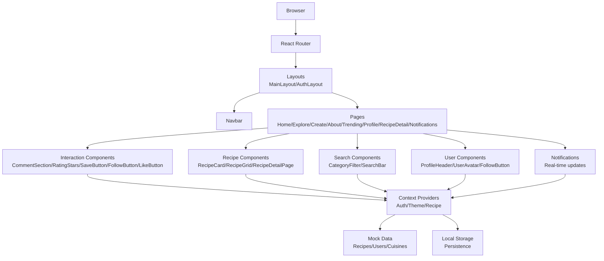
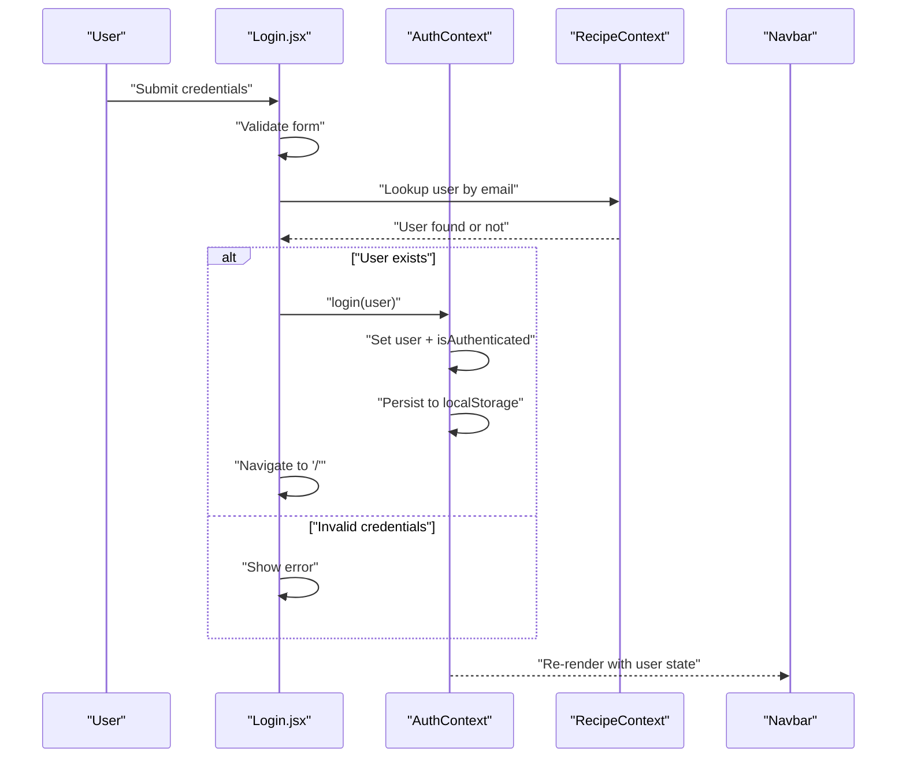
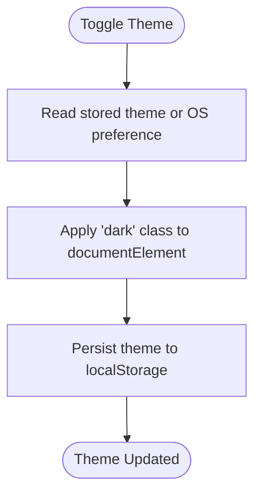
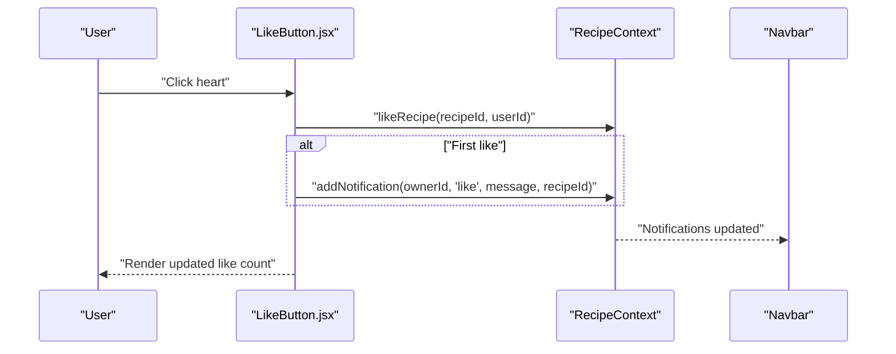
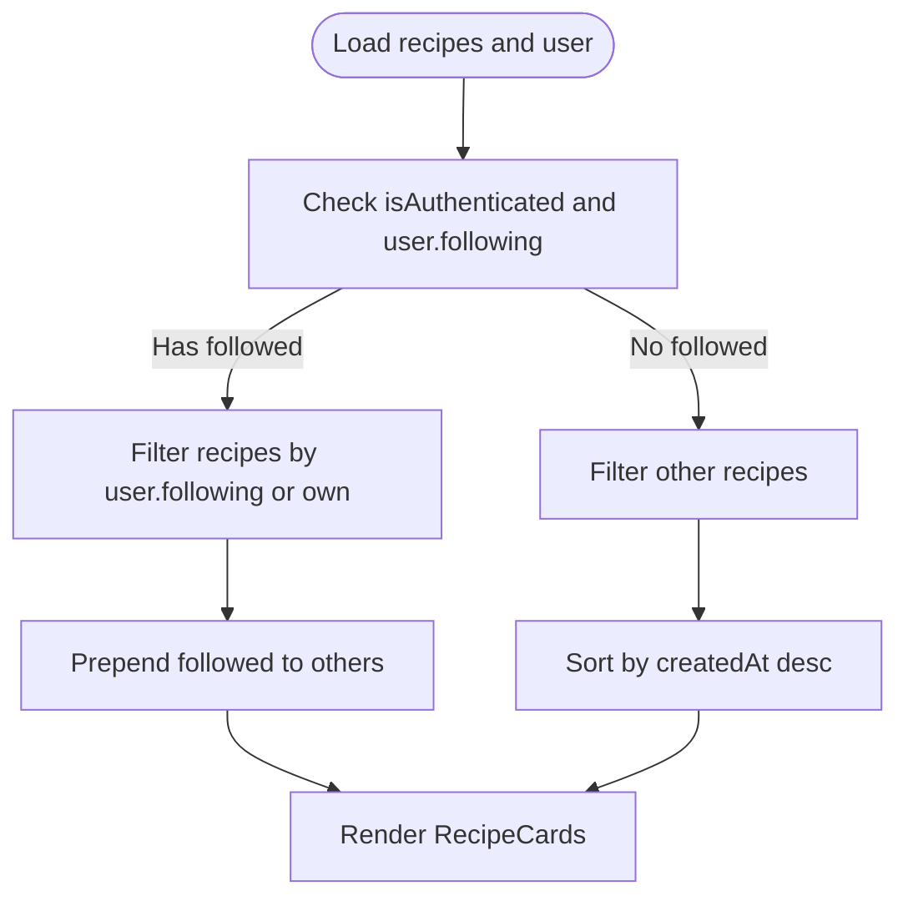
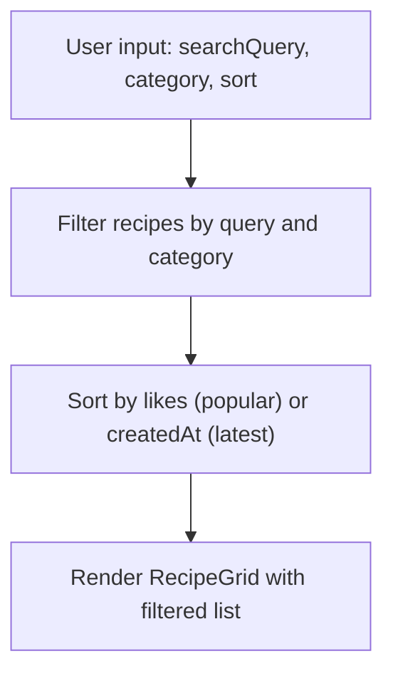
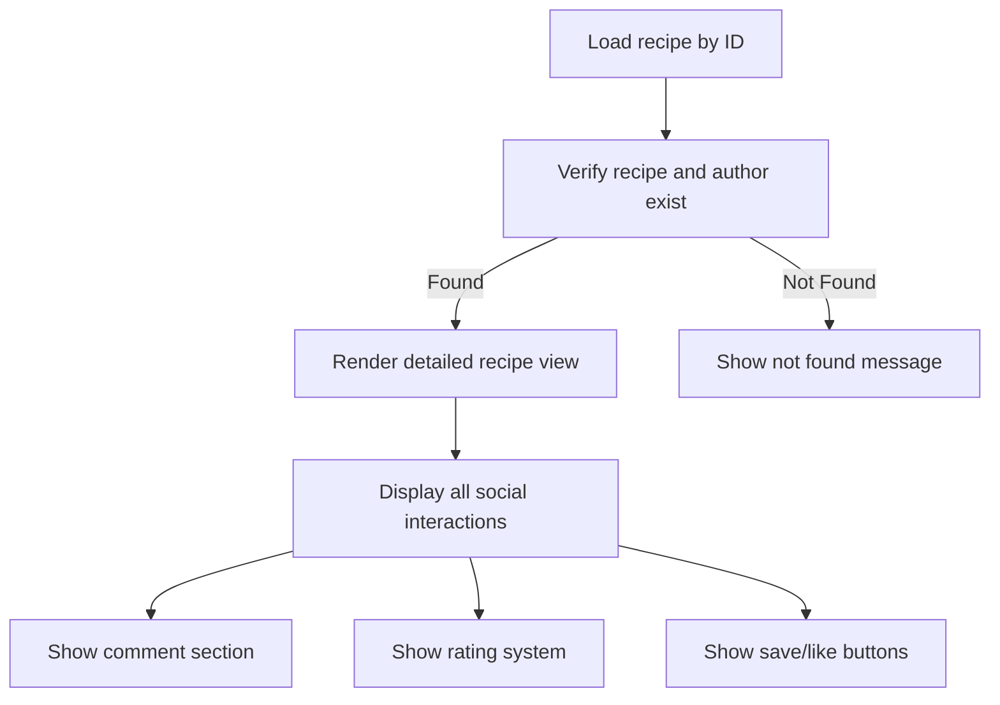
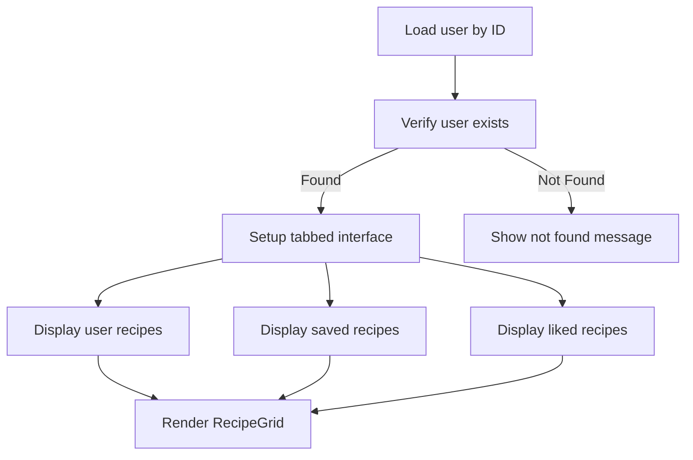
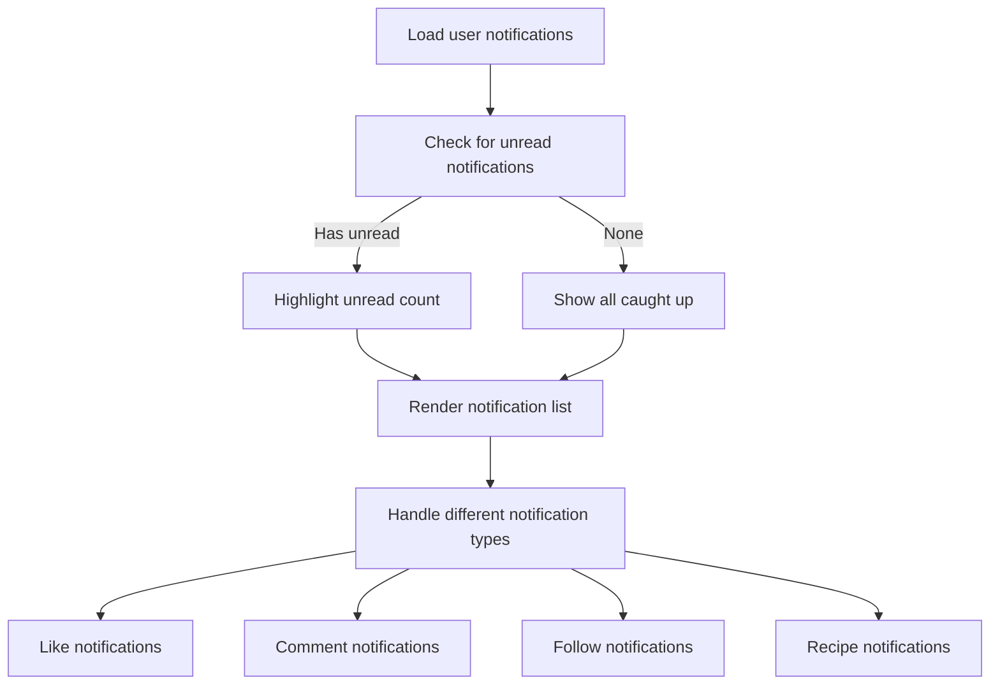
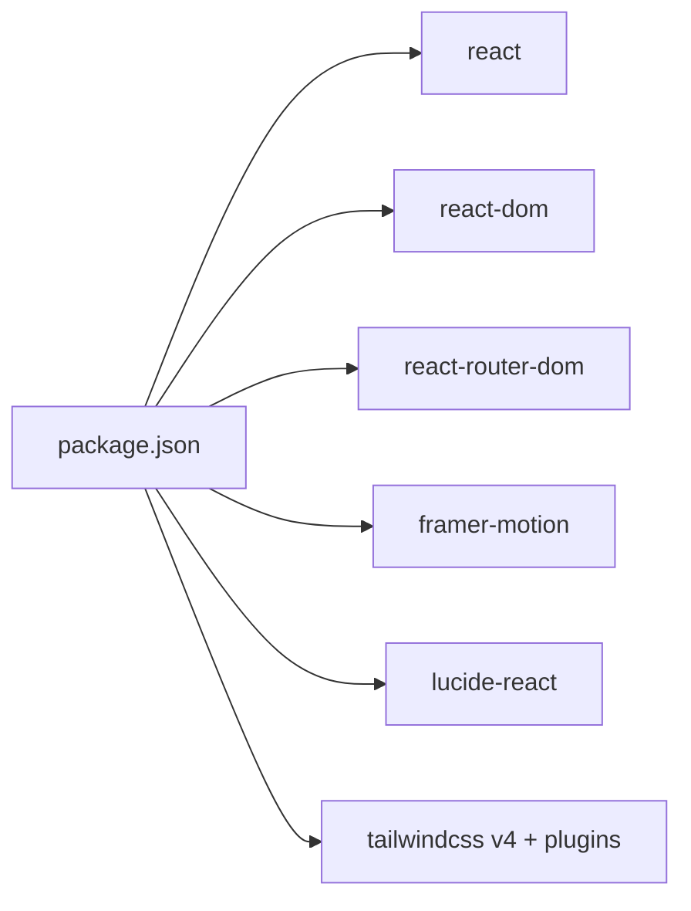

# React Client Application

<cite>
**Referenced Files in This Document**
- [package.json](file://client/package.json)
- [README.md](file://client/README.md)
- [vite.config.js](file://client/vite.config.js)
- [main.jsx](file://client/src/main.jsx)
- [App.jsx](file://client/src/App.jsx)
- [AuthContext.jsx](file://client/src/context/AuthContext.jsx)
- [ThemeContext.jsx](file://client/src/context/ThemeContext.jsx)
- [RecipeContext.jsx](file://client/src/context/RecipeContext.jsx)
- [Navbar.jsx](file://client/src/components/common/Navbar.jsx)
- [Footer.jsx](file://client/src/components/common/Footer.jsx)
- [ProtectedRoute.jsx](file://client/src/components/common/ProtectedRoute.jsx)
- [ThemeToggle.jsx](file://client/src/components/common/ThemeToggle.jsx)
- [CommentSection.jsx](file://client/src/components/interactions/CommentSection.jsx)
- [RatingStars.jsx](file://client/src/components/interactions/RatingStars.jsx)
- [SaveButton.jsx](file://client/src/components/interactions/SaveButton.jsx)
- [LikeButton.jsx](file://client/src/components/interactions/LikeButton.jsx)
- [RecipeCard.jsx](file://client/src/components/recipe/RecipeCard.jsx)
- [RecipeGrid.jsx](file://client/src/components/recipe/RecipeGrid.jsx)
- [CategoryFilter.jsx](file://client/src/components/search/CategoryFilter.jsx)
- [SearchBar.jsx](file://client/src/components/search/SearchBar.jsx)
- [FollowButton.jsx](file://client/src/components/user/FollowButton.jsx)
- [ProfileHeader.jsx](file://client/src/components/user/ProfileHeader.jsx)
- [UserAvatar.jsx](file://client/src/components/user/UserAvatar.jsx)
- [About.jsx](file://client/src/pages/About.jsx)
- [CreateRecipe.jsx](file://client/src/pages/CreateRecipe.jsx)
- [Trending.jsx](file://client/src/pages/Trending.jsx)
- [HomeFeed.jsx](file://client/src/pages/HomeFeed.jsx)
- [Explore.jsx](file://client/src/pages/Explore.jsx)
- [Login.jsx](file://client/src/pages/Login.jsx)
- [Signup.jsx](file://client/src/pages/Signup.jsx)
- [RecipeDetailPage.jsx](file://client/src/pages/RecipeDetailPage.jsx)
- [Profile.jsx](file://client/src/pages/Profile.jsx)
- [Notifications.jsx](file://client/src/pages/Notifications.jsx)
- [mockData.js](file://client/src/data/mockData.js)
</cite>

## Update Summary
**Changes Made**
- Added comprehensive documentation for new pages: RecipeDetailPage, Profile, Notifications
- Enhanced RecipeContext with notification management and trending recipe calculation
- Updated component architecture to include new notification system
- Expanded mock data with comprehensive recipe and user datasets
- Improved routing structure with new protected routes and nested layouts
- Enhanced social interaction components with real-time updates

## Table of Contents
1. [Introduction](#introduction)
2. [Project Structure](#project-structure)
3. [Core Components](#core-components)
4. [Architecture Overview](#architecture-overview)
5. [Detailed Component Analysis](#detailed-component-analysis)
6. [Enhanced Context Providers](#enhanced-context-providers)
7. [New Pages Implementation](#new-pages-implementation)
8. [Component System Architecture](#component-system-architecture)
9. [Dependency Analysis](#dependency-analysis)
10. [Performance Considerations](#performance-considerations)
11. [Troubleshooting Guide](#troubleshooting-guide)
12. [Conclusion](#conclusion)

## Introduction
This document describes the React client application for Flavora, a comprehensive social recipe platform. The application uses modern React patterns with Vite for development, Tailwind CSS v4 for styling, and Framer Motion for animations. It provides user authentication, recipe browsing and creation, social interactions (likes, comments, saves, ratings), user profiles with recipe collections, notifications system, and responsive navigation with light/dark theme support.

## Project Structure
The client application follows a feature-based structure under the `src` directory with enhanced organization:
- Entry point initializes the app with all context providers and renders the root component.
- Routing organizes pages with nested layouts, protected routes, and authentication flows.
- Context providers manage global state for authentication, theme, recipes, and notifications.
- Components are grouped by domain (common, interactions, recipe, search, user, notifications).
- Pages implement application features with comprehensive functionality and compose reusable components.
- Utilities and data include extensive mock datasets for development and testing.

```mermaid
graph TB
subgraph "Entry Point"
MAIN["main.jsx"]
APP["App.jsx"]
end
subgraph "Routing & Layouts"
ROUTER["react-router-dom"]
LAYOUT_MAIN["MainLayout"]
LAYOUT_AUTH["AuthLayout"]
PROTECTED["ProtectedRoute.jsx"]
end
subgraph "Context Providers"
AUTH_CTX["AuthContext.jsx"]
THEME_CTX["ThemeContext.jsx"]
RECIPE_CTX["RecipeContext.jsx"]
end
subgraph "UI Components"
NAVBAR["Navbar.jsx"]
FOOTER["Footer.jsx"]
THEME_TOGGLE["ThemeToggle.jsx"]
END
subgraph "Interaction Components"
COMMENT["CommentSection.jsx"]
RATING["RatingStars.jsx"]
SAVE["SaveButton.jsx"]
LIKE["LikeButton.jsx"]
FOLLOW["FollowButton.jsx"]
END
subgraph "Recipe Components"
CARDS["RecipeCard.jsx"]
GRID["RecipeGrid.jsx"]
DETAIL["RecipeDetailPage.jsx"]
END
subgraph "Search Components"
CATEGORY["CategoryFilter.jsx"]
SEARCH["SearchBar.jsx"]
END
subgraph "User Components"
PROFILE_HEADER["ProfileHeader.jsx"]
AVATAR["UserAvatar.jsx"]
PROFILE_PAGE["Profile.jsx"]
END
subgraph "System Components"
ABOUT["About.jsx"]
CREATE["CreateRecipe.jsx"]
TRENDING["Trending.jsx"]
NOTIFICATIONS["Notifications.jsx"]
END
MAIN --> APP
APP --> ROUTER
APP --> AUTH_CTX
APP --> THEME_CTX
APP --> RECIPE_CTX
APP --> LAYOUT_MAIN
APP --> LAYOUT_AUTH
LAYOUT_MAIN --> NAVBAR
LAYOUT_MAIN --> FOOTER
LAYOUT_MAIN --> PROTECTED
LAYOUT_MAIN --> HOME["HomeFeed.jsx"]
LAYOUT_MAIN --> EXPLORE["Explore.jsx"]
LAYOUT_MAIN --> CREATE["CreateRecipe.jsx"]
LAYOUT_MAIN --> ABOUT["About.jsx"]
LAYOUT_MAIN --> TRENDING["Trending.jsx"]
LAYOUT_MAIN --> PROFILE_PAGE["Profile.jsx"]
LAYOUT_MAIN --> DETAIL["RecipeDetailPage.jsx"]
LAYOUT_AUTH --> LOGIN["Login.jsx"]
LAYOUT_AUTH --> SIGNUP["Signup.jsx"]
```

**Diagram sources**
- [main.jsx:1-11](file://client/src/main.jsx#L1-L11)
- [App.jsx:1-94](file://client/src/App.jsx#L1-L94)
- [ProtectedRoute.jsx:1-21](file://client/src/components/common/ProtectedRoute.jsx#L1-L21)
- [Footer.jsx:1-33](file://client/src/components/common/Footer.jsx#L1-L33)
- [ThemeToggle.jsx:1-30](file://client/src/components/common/ThemeToggle.jsx#L1-L30)
- [CommentSection.jsx:1-140](file://client/src/components/interactions/CommentSection.jsx#L1-L140)
- [RatingStars.jsx:1-68](file://client/src/components/interactions/RatingStars.jsx#L1-L68)
- [SaveButton.jsx:1-53](file://client/src/components/interactions/SaveButton.jsx#L1-L53)
- [LikeButton.jsx:1-73](file://client/src/components/interactions/LikeButton.jsx#L1-L73)
- [RecipeCard.jsx:1-125](file://client/src/components/recipe/RecipeCard.jsx#L1-L125)
- [RecipeGrid.jsx:1-39](file://client/src/components/recipe/RecipeGrid.jsx#L1-L39)
- [CategoryFilter.jsx:1-28](file://client/src/components/search/CategoryFilter.jsx#L1-L28)
- [SearchBar.jsx:1-57](file://client/src/components/search/SearchBar.jsx#L1-L57)
- [FollowButton.jsx:1-64](file://client/src/components/user/FollowButton.jsx#L1-L64)
- [ProfileHeader.jsx:1-87](file://client/src/components/user/ProfileHeader.jsx#L1-L87)
- [UserAvatar.jsx:1-44](file://client/src/components/user/UserAvatar.jsx#L1-L44)
- [About.jsx:1-186](file://client/src/pages/About.jsx#L1-L186)
- [CreateRecipe.jsx:1-624](file://client/src/pages/CreateRecipe.jsx#L1-L624)
- [Trending.jsx:1-139](file://client/src/pages/Trending.jsx#L1-L139)
- [RecipeDetailPage.jsx:1-257](file://client/src/pages/RecipeDetailPage.jsx#L1-L257)
- [Profile.jsx:1-121](file://client/src/pages/Profile.jsx#L1-L121)
- [Notifications.jsx:1-150](file://client/src/pages/Notifications.jsx#L1-L150)

**Section sources**
- [package.json:1-35](file://client/package.json#L1-L35)
- [README.md:1-17](file://client/README.md#L1-L17)
- [vite.config.js:1-8](file://client/vite.config.js#L1-L8)
- [main.jsx:1-11](file://client/src/main.jsx#L1-L11)
- [App.jsx:1-94](file://client/src/App.jsx#L1-L94)

## Core Components
- **Authentication Context**: Manages user session, login/signup/logout, and profile updates with persistence in local storage.
- **Theme Context**: Handles light/dark theme switching and persists preference.
- **Recipe Context**: Central state for recipes, users, notifications, and social actions (likes, saves, comments, ratings, follows) with comprehensive CRUD operations.
- **Navigation**: Responsive navbar with active state, mobile menu, theme toggle, and unread notifications badge.
- **Footer**: Comprehensive footer with branding, social elements, and copyright information.
- **Protected Routes**: Authentication guard for sensitive pages with loading states.
- **Social Interactions**: Complete suite of interaction components for recipe engagement with real-time updates.
- **Recipe Display**: Card-based recipe presentation with metadata and action buttons.
- **Search and Filter**: Advanced search capabilities with category filtering and sorting.
- **User Profiles**: Comprehensive profile system with recipe collections, follower/following management.
- **Notifications**: Real-time notification system with multiple notification types and read/unread status.

**Section sources**
- [AuthContext.jsx:1-72](file://client/src/context/AuthContext.jsx#L1-L72)
- [ThemeContext.jsx:1-43](file://client/src/context/ThemeContext.jsx#L1-L43)
- [RecipeContext.jsx:1-194](file://client/src/context/RecipeContext.jsx#L1-L194)
- [Navbar.jsx:1-206](file://client/src/components/common/Navbar.jsx#L1-L206)
- [Footer.jsx:1-33](file://client/src/components/common/Footer.jsx#L1-L33)
- [ProtectedRoute.jsx:1-21](file://client/src/components/common/ProtectedRoute.jsx#L1-L21)

## Architecture Overview
The app uses a layered architecture with enhanced state management:
- **Presentation Layer**: Pages and components render UI and orchestrate user interactions.
- **Routing Layer**: React Router manages routes, nested layouts, and protected routes with authentication guards.
- **State Management Layer**: Three contexts provide cross-component state sharing with comprehensive CRUD operations.
- **Animation Layer**: Framer Motion enhances transitions and micro-interactions.
- **Styling Layer**: Tailwind CSS v4 with dark mode variants and gradient support.
- **Data Layer**: Mock data system with realistic recipe and user datasets for development.



**Diagram sources**
- [App.jsx:44-91](file://client/src/App.jsx#L44-L91)
- [Navbar.jsx:20-206](file://client/src/components/common/Navbar.jsx#L20-L206)
- [CommentSection.jsx:1-140](file://client/src/components/interactions/CommentSection.jsx#L1-L140)
- [RatingStars.jsx:1-68](file://client/src/components/interactions/RatingStars.jsx#L1-L68)
- [SaveButton.jsx:1-53](file://client/src/components/interactions/SaveButton.jsx#L1-L53)
- [LikeButton.jsx:1-73](file://client/src/components/interactions/LikeButton.jsx#L1-L73)
- [RecipeCard.jsx:1-125](file://client/src/components/recipe/RecipeCard.jsx#L1-L125)
- [CategoryFilter.jsx:1-28](file://client/src/components/search/CategoryFilter.jsx#L1-L28)
- [SearchBar.jsx:1-57](file://client/src/components/search/SearchBar.jsx#L1-L57)
- [FollowButton.jsx:1-64](file://client/src/components/user/FollowButton.jsx#L1-L64)
- [ProfileHeader.jsx:1-87](file://client/src/components/user/ProfileHeader.jsx#L1-L87)
- [UserAvatar.jsx:1-44](file://client/src/components/user/UserAvatar.jsx#L1-L44)
- [RecipeDetailPage.jsx:1-257](file://client/src/pages/RecipeDetailPage.jsx#L1-L257)
- [Profile.jsx:1-121](file://client/src/pages/Profile.jsx#L1-L121)
- [Notifications.jsx:1-150](file://client/src/pages/Notifications.jsx#L1-L150)

## Detailed Component Analysis

### Authentication Flow
The authentication flow integrates form validation, context updates, and navigation after successful login/signup with comprehensive error handling.



**Diagram sources**
- [Login.jsx:40-60](file://client/src/pages/Login.jsx#L40-L60)
- [AuthContext.jsx:19-42](file://client/src/context/AuthContext.jsx#L19-L42)
- [RecipeContext.jsx:12-15](file://client/src/context/RecipeContext.jsx#L12-L15)
- [Navbar.jsx:21-42](file://client/src/components/common/Navbar.jsx#L21-L42)

**Section sources**
- [Login.jsx:1-218](file://client/src/pages/Login.jsx#L1-L218)
- [AuthContext.jsx:1-72](file://client/src/context/AuthContext.jsx#L1-L72)
- [RecipeContext.jsx:1-194](file://client/src/context/RecipeContext.jsx#L1-L194)
- [Navbar.jsx:1-206](file://client/src/components/common/Navbar.jsx#L1-L206)

### Theme Switching
Theme switching persists user preference and applies CSS classes to the root element with smooth transitions.



**Diagram sources**
- [ThemeContext.jsx:5-27](file://client/src/context/ThemeContext.jsx#L5-L27)

**Section sources**
- [ThemeContext.jsx:1-43](file://client/src/context/ThemeContext.jsx#L1-L43)

### Recipe Interaction: Like Button
The like button toggles user likes and triggers notifications for recipe owners with real-time updates.



**Diagram sources**
- [LikeButton.jsx:21-40](file://client/src/components/interactions/LikeButton.jsx#L21-L40)
- [RecipeContext.jsx:56-66](file://client/src/context/RecipeContext.jsx#L56-L66)
- [Navbar.jsx:27-28](file://client/src/components/common/Navbar.jsx#L27-L28)

**Section sources**
- [LikeButton.jsx:1-73](file://client/src/components/interactions/LikeButton.jsx#L1-L73)
- [RecipeContext.jsx:1-194](file://client/src/context/RecipeContext.jsx#L1-L194)
- [Navbar.jsx:1-206](file://client/src/components/common/Navbar.jsx#L1-L206)

### Home Feed Personalization
The home feed prioritizes recipes from followed users and falls back to chronological ordering with enhanced user experience.



**Diagram sources**
- [HomeFeed.jsx:13-29](file://client/src/pages/HomeFeed.jsx#L13-L29)

**Section sources**
- [HomeFeed.jsx:1-96](file://client/src/pages/HomeFeed.jsx#L1-L96)

### Explore Page Filtering and Sorting
The explore page supports search, category filtering, and sorting by popularity or recency with comprehensive filtering options.



**Diagram sources**
- [Explore.jsx:15-44](file://client/src/pages/Explore.jsx#L15-L44)

**Section sources**
- [Explore.jsx:1-133](file://client/src/pages/Explore.jsx#L1-L133)

### Recipe Detail Page
The recipe detail page provides comprehensive recipe presentation with all interactive elements and detailed information display.



**Diagram sources**
- [RecipeDetailPage.jsx:20-46](file://client/src/pages/RecipeDetailPage.jsx#L20-L46)

**Section sources**
- [RecipeDetailPage.jsx:1-257](file://client/src/pages/RecipeDetailPage.jsx#L1-L257)

### User Profile System
The profile system provides comprehensive user information with recipe collections and social interactions.



**Diagram sources**
- [Profile.jsx:10-31](file://client/src/pages/Profile.jsx#L10-L31)

**Section sources**
- [Profile.jsx:1-121](file://client/src/pages/Profile.jsx#L1-L121)

### Notifications System
The notifications system provides real-time updates for user interactions with comprehensive notification types.



**Diagram sources**
- [Notifications.jsx:7-13](file://client/src/pages/Notifications.jsx#L7-L13)

**Section sources**
- [Notifications.jsx:1-150](file://client/src/pages/Notifications.jsx#L1-L150)

## Enhanced Context Providers

### AuthContext Implementation
The AuthContext provides comprehensive user authentication state management with:
- User session persistence in localStorage
- Loading state management during authentication checks
- Form validation integration
- Profile update capabilities
- Authentication guards for protected routes

### ThemeContext Implementation
The ThemeContext offers sophisticated theme management with:
- Automatic OS preference detection
- Persistent theme preferences
- Smooth transition animations
- Accessibility-compliant color schemes
- Dark/light mode variant support

### RecipeContext Enhancement
The RecipeContext has been significantly expanded to support:
- Comprehensive recipe CRUD operations with localStorage persistence
- User relationship management (following/followers) with bidirectional updates
- Social interaction tracking (likes, saves, comments, ratings) with real-time updates
- **New**: Notification system integration with multiple notification types (like, comment, follow, recipe)
- **New**: Trending recipe calculation algorithms based on engagement metrics
- **New**: User-specific recipe filtering for profiles and collections
- **New**: Comprehensive mock data system with realistic recipe and user datasets

**Section sources**
- [AuthContext.jsx:1-72](file://client/src/context/AuthContext.jsx#L1-L72)
- [ThemeContext.jsx:1-43](file://client/src/context/ThemeContext.jsx#L1-L43)
- [RecipeContext.jsx:1-194](file://client/src/context/RecipeContext.jsx#L1-L194)

## New Pages Implementation

### RecipeDetailPage
The RecipeDetailPage provides comprehensive recipe presentation with:
- Full recipe hero image with overlay information
- Author information with follow functionality
- Interactive social elements (likes, saves, ratings, comments)
- Detailed ingredients list with visual indicators
- Step-by-step instructions with animations
- Comprehensive metadata display (prep time, servings, cuisine)

**Section sources**
- [RecipeDetailPage.jsx:1-257](file://client/src/pages/RecipeDetailPage.jsx#L1-L257)

### Profile Page
The Profile page implements a comprehensive user profile system with:
- Profile header with user statistics and bio
- Tabbed interface for recipes, saved, and liked collections
- Recipe grid display with responsive layouts
- Empty state handling for different collection types
- Animated transitions between tab content

**Section sources**
- [Profile.jsx:1-121](file://client/src/pages/Profile.jsx#L1-L121)

### Notifications Page
The Notifications page provides real-time notification management with:
- Comprehensive notification types (likes, comments, follows, recipe updates)
- Unread notification tracking with visual indicators
- Timestamp formatting with relative time display
- Interactive notification marking as read
- Empty state handling for notification lists

**Section sources**
- [Notifications.jsx:1-150](file://client/src/pages/Notifications.jsx#L1-L150)

## Component System Architecture

### Common Components
- **Navbar**: Responsive navigation with authentication state, theme toggle, and notification badge
- **Footer**: Comprehensive footer with branding and social links
- **ProtectedRoute**: Authentication guard for sensitive pages
- **ThemeToggle**: Interactive theme switching with animations

### Interaction Components
- **CommentSection**: Rich comment system with submission and notification generation
- **RatingStars**: Interactive star rating with user-specific management
- **SaveButton**: Recipe saving with authentication checks and visual feedback
- **LikeButton**: Recipe liking with notification system integration

### Recipe Components
- **RecipeCard**: Individual recipe presentation with metadata and actions
- **RecipeGrid**: Flexible grid layout for recipe collections
- **RecipeDetailPage**: Comprehensive recipe detail view

### Search Components
- **CategoryFilter**: Cuisine-based filtering with selection states
- **SearchBar**: Advanced search with focus states and clear functionality

### User Components
- **ProfileHeader**: User profile information with statistics
- **UserAvatar**: Flexible avatar display with multiple sizes
- **FollowButton**: User following with animation feedback

**Section sources**
- [Navbar.jsx:1-206](file://client/src/components/common/Navbar.jsx#L1-L206)
- [Footer.jsx:1-33](file://client/src/components/common/Footer.jsx#L1-L33)
- [ProtectedRoute.jsx:1-21](file://client/src/components/common/ProtectedRoute.jsx#L1-L21)
- [ThemeToggle.jsx:1-30](file://client/src/components/common/ThemeToggle.jsx#L1-L30)
- [CommentSection.jsx:1-140](file://client/src/components/interactions/CommentSection.jsx#L1-L140)
- [RatingStars.jsx:1-68](file://client/src/components/interactions/RatingStars.jsx#L1-L68)
- [SaveButton.jsx:1-53](file://client/src/components/interactions/SaveButton.jsx#L1-L53)
- [LikeButton.jsx:1-73](file://client/src/components/interactions/LikeButton.jsx#L1-L73)
- [RecipeCard.jsx:1-125](file://client/src/components/recipe/RecipeCard.jsx#L1-L125)
- [RecipeGrid.jsx:1-39](file://client/src/components/recipe/RecipeGrid.jsx#L1-L39)
- [CategoryFilter.jsx:1-28](file://client/src/components/search/CategoryFilter.jsx#L1-L28)
- [SearchBar.jsx:1-57](file://client/src/components/search/SearchBar.jsx#L1-L57)
- [ProfileHeader.jsx:1-87](file://client/src/components/user/ProfileHeader.jsx#L1-L87)
- [UserAvatar.jsx:1-44](file://client/src/components/user/UserAvatar.jsx#L1-L44)
- [FollowButton.jsx:1-64](file://client/src/components/user/FollowButton.jsx#L1-L64)

## Dependency Analysis
External libraries and their roles:
- **react and react-dom**: UI framework and DOM rendering with strict mode support.
- **react-router-dom**: Declarative routing and nested layouts with protected routes and layout components.
- **framer-motion**: Animations for page transitions, interactive feedback, and micro-interactions.
- **lucide-react**: Comprehensive icon library for UI affordances and visual elements.
- **tailwindcss v4**: Utility-first styling framework with enhanced dark mode support and gradient utilities.
- **@tailwindcss/postcss**: PostCSS plugin for Tailwind CSS v4 compatibility.



**Diagram sources**
- [package.json:12-32](file://client/package.json#L12-L32)

**Section sources**
- [package.json:1-35](file://client/package.json#L1-L35)

## Performance Considerations
- **Memoized computations**: Use memoization for derived data (e.g., filtered lists, trending calculations, notification counts) to avoid unnecessary re-renders.
- **Local storage caching**: Persist state to reduce server round-trips during development and improve user experience with comprehensive localStorage integration.
- **Conditional rendering**: Hide sensitive UI until authentication state is resolved to prevent layout shifts and improve perceived performance.
- **Animation optimization**: Keep animation complexity moderate to maintain smoothness on lower-end devices with staggered animations.
- **Component lazy loading**: Implement dynamic imports for heavy components to improve initial load performance.
- **Bundle size**: Prefer tree-shaking and optimize imports to minimize bundle size with new components and enhanced functionality.
- **Context optimization**: Use selective context consumption to prevent unnecessary re-renders across the component tree.
- **Image optimization**: Use responsive images and lazy loading for recipe images to improve loading performance.
- **Virtualized lists**: Consider virtualization for large recipe collections to improve rendering performance.

## Troubleshooting Guide
Common issues and resolutions:
- **Authentication state not persisting**: Verify local storage keys and provider wrapping order in App.jsx.
- **Theme not applying**: Ensure the root element receives the 'dark' class and local storage preference is readable.
- **Notifications not visible**: Confirm user ID matches and unread counts are computed from persisted notifications.
- **Routing issues**: Ensure routes are nested within proper layouts and protected routes wrap page components.
- **Component not rendering**: Verify all required context providers are properly wrapped around components.
- **Animation performance**: Check for excessive animations and consider reducing complexity on lower-end devices.
- **Form validation errors**: Ensure all form fields are properly validated before submission.
- **Context provider conflicts**: Verify the correct order of provider wrapping in App.jsx.
- **Recipe data not loading**: Check mock data initialization and localStorage persistence in RecipeContext.
- **Notification system not working**: Verify notification types and related IDs are properly configured.

**Section sources**
- [AuthContext.jsx:10-17](file://client/src/context/AuthContext.jsx#L10-L17)
- [ThemeContext.jsx:15-23](file://client/src/context/ThemeContext.jsx#L15-L23)
- [RecipeContext.jsx:17-32](file://client/src/context/RecipeContext.jsx#L17-L32)
- [App.jsx:44-91](file://client/src/App.jsx#L44-L91)

## Conclusion
Flavora's React client demonstrates a comprehensive and well-architected social recipe platform with extensive component coverage and robust state management. The application has been significantly enhanced with new pages including RecipeDetailPage, Profile, and Notifications, providing users with comprehensive recipe discovery, social interaction, and personalized experiences. The enhanced context providers with AuthContext, RecipeContext, and ThemeContext implementations offer solid foundation for scalable development with comprehensive CRUD operations, notification systems, and real-time updates. The modern styling system with Tailwind CSS v4 and comprehensive animation support creates a polished, responsive user interface that effectively showcases recipes and facilitates social interaction among food enthusiasts. The addition of sophisticated features like recipe detail views, user profiles with collections, and real-time notifications significantly elevates the application's functionality and user experience, making it a complete social recipe platform solution.