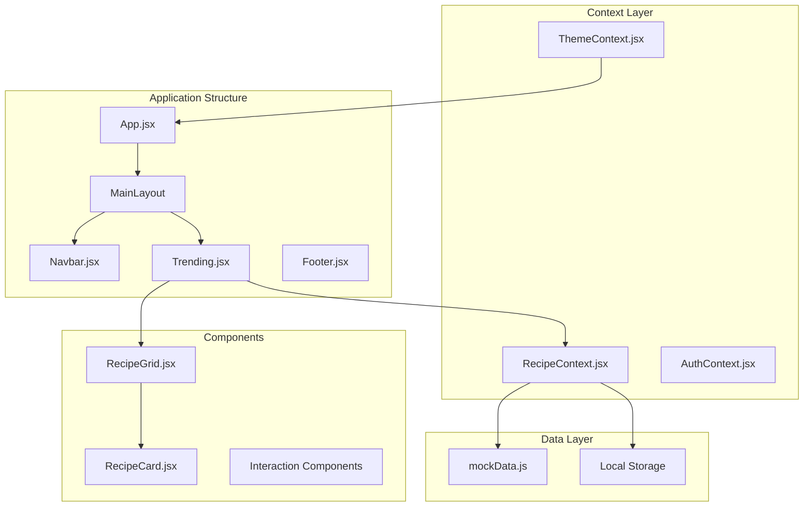
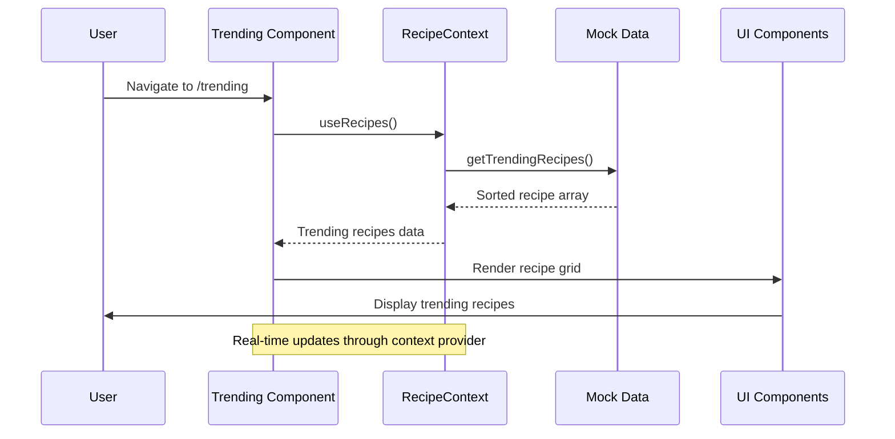
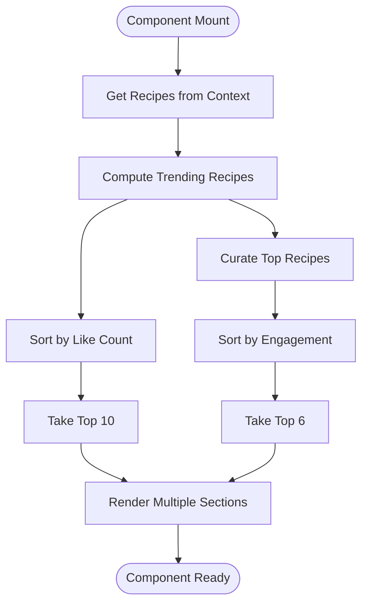
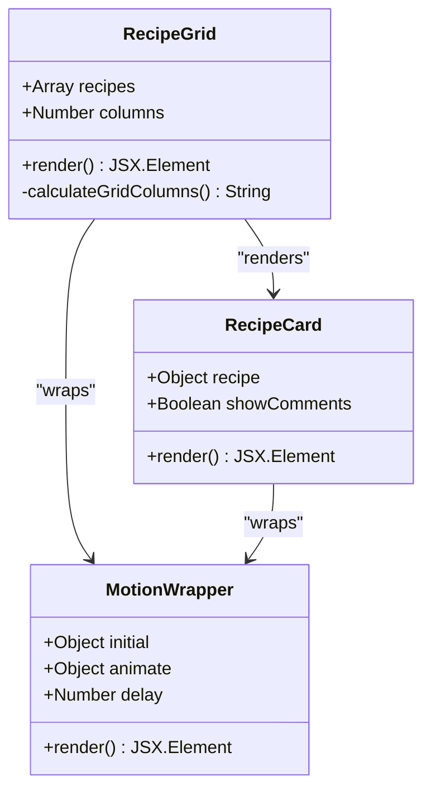
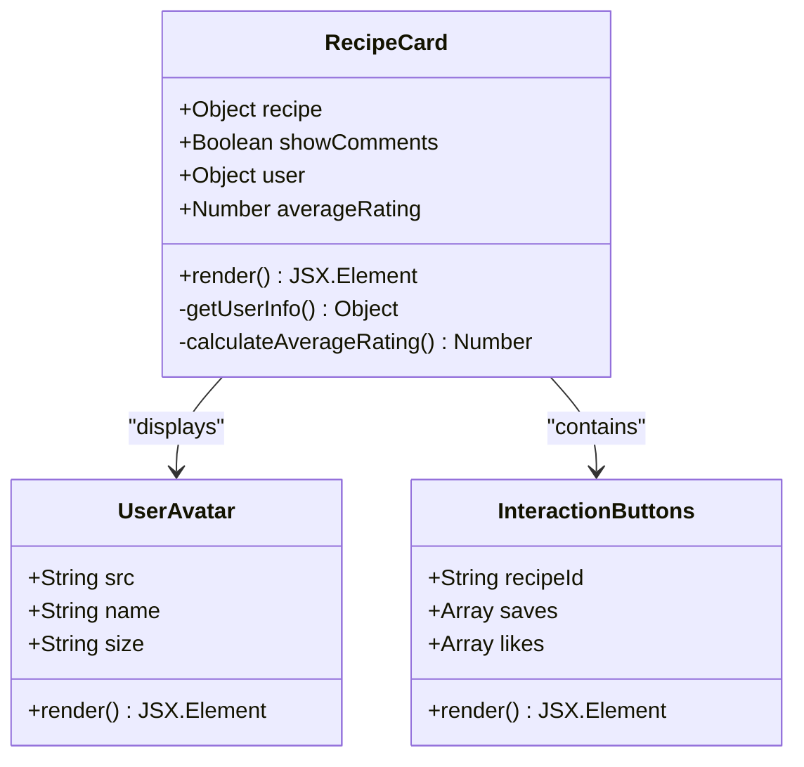
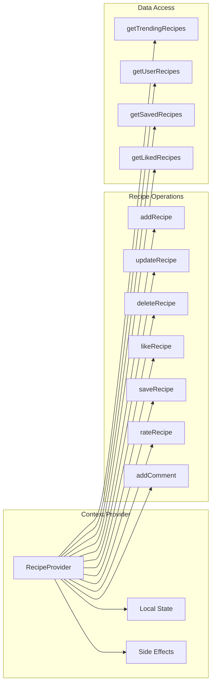
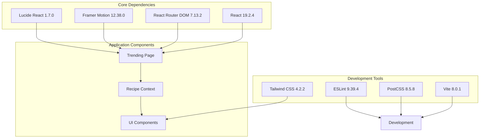

# Trending Page Implementation

<cite>
**Referenced Files in This Document**
- [Trending.jsx](file://client/src/pages/Trending.jsx)
- [RecipeContext.jsx](file://client/src/context/RecipeContext.jsx)
- [mockData.js](file://client/src/data/mockData.js)
- [RecipeGrid.jsx](file://client/src/components/recipe/RecipeGrid.jsx)
- [RecipeCard.jsx](file://client/src/components/recipe/RecipeCard.jsx)
- [App.jsx](file://client/src/App.jsx)
- [Navbar.jsx](file://client/src/components/common/Navbar.jsx)
- [ThemeContext.jsx](file://client/src/context/ThemeContext.jsx)
- [index.css](file://client/src/index.css)
- [package.json](file://client/package.json)
</cite>

## Table of Contents
1. [Introduction](#introduction)
2. [Project Structure](#project-structure)
3. [Core Components](#core-components)
4. [Architecture Overview](#architecture-overview)
5. [Detailed Component Analysis](#detailed-component-analysis)
6. [Dependency Analysis](#dependency-analysis)
7. [Performance Considerations](#performance-considerations)
8. [Troubleshooting Guide](#troubleshooting-guide)
9. [Conclusion](#conclusion)

## Introduction

The Trending Page Implementation is a key feature of the Flavora recipe sharing platform that showcases popular and trending recipes to users. This implementation leverages React's modern hooks, context-based state management, and a responsive design system to deliver an engaging user experience for discovering trending culinary content.

The trending page serves as a discovery hub where users can explore recipes that are currently popular within the community, organized into multiple curated sections including "What's Cooking Right Now," "Trending Flavors," "Flavors You'll Love," and "Discover Your Next Favorite Dish."

## Project Structure

The trending page implementation follows a modular React architecture with clear separation of concerns:

**Diagram sources**
- [App.jsx:44-94](file://client/src/App.jsx#L44-L94)
- [Trending.jsx:8-139](file://client/src/pages/Trending.jsx#L8-L139)
- [RecipeContext.jsx:6-194](file://client/src/context/RecipeContext.jsx#L6-L194)

**Section sources**
- [App.jsx:1-94](file://client/src/App.jsx#L1-L94)
- [package.json:1-35](file://client/package.json#L1-L35)

## Core Components

The trending page implementation consists of several interconnected components that work together to provide a comprehensive recipe discovery experience:

### Main Trending Component
The primary `Trending` component serves as the orchestrator, managing recipe data fetching, sorting, and rendering multiple content sections. It utilizes React's `useMemo` hook for efficient computation and caching of trending recipe lists.

### Recipe Grid System
The `RecipeGrid` component provides a flexible grid layout system that adapts to different screen sizes and column configurations, ensuring optimal display across mobile, tablet, and desktop devices.

### Recipe Card Component
Individual recipe cards encapsulate recipe display logic, user interaction elements, and metadata presentation. Each card includes essential information like preparation time, serving size, and interactive elements for likes, saves, and ratings.

### Context Management
The `RecipeContext` provides centralized state management for recipes, users, and notifications, enabling seamless data sharing across components and persistent storage capabilities.

**Section sources**
- [Trending.jsx:8-139](file://client/src/pages/Trending.jsx#L8-L139)
- [RecipeGrid.jsx:4-39](file://client/src/components/recipe/RecipeGrid.jsx#L4-L39)
- [RecipeCard.jsx:11-125](file://client/src/components/recipe/RecipeCard.jsx#L11-L125)
- [RecipeContext.jsx:6-194](file://client/src/context/RecipeContext.jsx#L6-L194)

## Architecture Overview

The trending page follows a unidirectional data flow architecture with clear separation between presentation and state management:

**Diagram sources**
- [Trending.jsx:9-11](file://client/src/pages/Trending.jsx#L9-L11)
- [RecipeContext.jsx:156-156](file://client/src/context/RecipeContext.jsx#L156-L156)

The architecture implements several key design patterns:

- **Provider Pattern**: Centralized state management through React Context
- **Composition Pattern**: Modular component composition for reusability
- **Hook Pattern**: Custom hooks for state management and data fetching
- **Observer Pattern**: Automatic UI updates when underlying data changes

**Section sources**
- [App.jsx:44-94](file://client/src/App.jsx#L44-L94)
- [RecipeContext.jsx:159-184](file://client/src/context/RecipeContext.jsx#L159-L184)

## Detailed Component Analysis

### Trending Component Implementation

The main trending component demonstrates sophisticated React patterns and performance optimization techniques:

**Diagram sources**
- [Trending.jsx:11-17](file://client/src/pages/Trending.jsx#L11-L17)

Key implementation features include:

#### Trending Recipe Computation
The component calculates trending recipes using a sophisticated algorithm that prioritizes recipes with the highest number of likes, ensuring users see the most popular content first.

#### Curated Recipe Selection
Beyond basic popularity metrics, the component creates curated recipe lists by combining likes and saves to identify recipes with high engagement and user interest.

#### Responsive Layout System
Multiple recipe grid layouts accommodate different screen sizes and content densities, optimizing the user experience across all devices.

**Section sources**
- [Trending.jsx:11-17](file://client/src/pages/Trending.jsx#L11-L17)
- [Trending.jsx:41-77](file://client/src/pages/Trending.jsx#L41-L77)
- [Trending.jsx:79-134](file://client/src/pages/Trending.jsx#L79-L134)

### RecipeGrid Component Analysis

The `RecipeGrid` component implements a flexible grid system with responsive behavior:

**Diagram sources**
- [RecipeGrid.jsx:4-39](file://client/src/components/recipe/RecipeGrid.jsx#L4-L39)
- [RecipeCard.jsx:11-125](file://client/src/components/recipe/RecipeCard.jsx#L11-L125)

The grid system provides:

- **Responsive Column Configuration**: Adapts from 1 column on mobile to 4 columns on large screens
- **Motion Integration**: Smooth animations for enhanced user experience
- **Flexible Rendering**: Handles empty states gracefully

**Section sources**
- [RecipeGrid.jsx:13-18](file://client/src/components/recipe/RecipeGrid.jsx#L13-L18)
- [RecipeGrid.jsx:20-37](file://client/src/components/recipe/RecipeGrid.jsx#L20-L37)

### RecipeCard Component Features

Each recipe card encapsulates comprehensive recipe information and user interaction capabilities:

**Diagram sources**
- [RecipeCard.jsx:11-125](file://client/src/components/recipe/RecipeCard.jsx#L11-L125)

Key features include:

- **User Information Display**: Links to author profiles with avatars and usernames
- **Interactive Elements**: Like, save, and follow buttons integrated seamlessly
- **Metadata Presentation**: Preparation time, serving size, and comment counts
- **Rating System**: Average rating calculation and display

**Section sources**
- [RecipeCard.jsx:17-19](file://client/src/components/recipe/RecipeCard.jsx#L17-L19)
- [RecipeCard.jsx:60-77](file://client/src/components/recipe/RecipeCard.jsx#L60-L77)
- [RecipeCard.jsx:108-120](file://client/src/components/recipe/RecipeCard.jsx#L108-L120)

### Context Provider Architecture

The `RecipeContext` manages all recipe-related state and provides essential CRUD operations:

**Diagram sources**
- [RecipeContext.jsx:6-194](file://client/src/context/RecipeContext.jsx#L6-L194)

The context implementation provides:

- **Persistent Storage**: Automatic localStorage synchronization
- **Real-time Updates**: Immediate UI updates when recipe data changes
- **Comprehensive API**: Full CRUD operations and specialized queries
- **Type Safety**: Well-defined interfaces for all operations

**Section sources**
- [RecipeContext.jsx:156-156](file://client/src/context/RecipeContext.jsx#L156-L156)
- [RecipeContext.jsx:22-32](file://client/src/context/RecipeContext.jsx#L22-L32)

## Dependency Analysis

The trending page implementation relies on several key dependencies that contribute to its functionality and performance:

**Diagram sources**
- [package.json:12-32](file://client/package.json#L12-L32)

### External Dependencies Impact

- **Framer Motion**: Enables smooth animations and transitions throughout the interface
- **Lucide React**: Provides consistent iconography across all components
- **Tailwind CSS**: Delivers utility-first styling with responsive design capabilities
- **React Router**: Manages navigation and route-based rendering

### Internal Dependencies

The trending page maintains loose coupling between components through the context layer, allowing for easy maintenance and future enhancements.

**Section sources**
- [package.json:12-32](file://client/package.json#L12-L32)
- [index.css:1-66](file://client/src/index.css#L1-L66)

## Performance Considerations

The trending page implementation incorporates several performance optimization strategies:

### Memoization Strategy
The component uses `useMemo` hooks to prevent unnecessary recomputation of trending recipes and curated lists, ensuring optimal performance even with large datasets.

### Lazy Loading Implementation
Recipe images utilize lazy loading through the `loading="lazy"` attribute, reducing initial page load time and improving perceived performance.

### Efficient Sorting Algorithms
The trending calculation uses optimized sorting algorithms with O(n log n) complexity, suitable for typical recipe dataset sizes.

### Memory Management
The context provider implements proper cleanup and memory management through React's lifecycle methods and useEffect cleanup functions.

### Responsive Design Optimization
CSS Grid and Flexbox layouts adapt to different screen sizes without requiring JavaScript manipulation, reducing computational overhead.

## Troubleshooting Guide

Common issues and their solutions when working with the trending page implementation:

### Recipe Data Not Loading
**Symptoms**: Empty trending sections or loading errors
**Causes**: 
- Missing mock data initialization
- Context provider not properly configured
- Local storage corruption

**Solutions**:
1. Verify `RecipeProvider` wraps the application
2. Check browser console for data initialization errors
3. Clear browser local storage and refresh the page

### Performance Issues
**Symptoms**: Slow page loading or janky animations
**Causes**:
- Excessive re-renders
- Large image assets
- Inefficient sorting algorithms

**Solutions**:
1. Implement proper memoization for computed values
2. Optimize image loading and compression
3. Consider pagination for large recipe collections

### Styling Problems
**Symptoms**: Incorrect colors, layout issues, or theme inconsistencies
**Causes**:
- Tailwind CSS configuration issues
- Theme context not properly initialized
- CSS specificity conflicts

**Solutions**:
1. Verify theme context provider is active
2. Check Tailwind configuration and build process
3. Inspect CSS custom properties and theme variables

### Navigation Issues
**Symptoms**: Broken links or routing problems
**Causes**:
- Incorrect route configuration
- Missing layout wrappers
- Authentication state conflicts

**Solutions**:
1. Verify route definitions in App.jsx
2. Ensure proper layout wrapping for protected routes
3. Check authentication context integration

**Section sources**
- [RecipeContext.jsx:187-193](file://client/src/context/RecipeContext.jsx#L187-L193)
- [ThemeContext.jsx:5-43](file://client/src/context/ThemeContext.jsx#L5-L43)

## Conclusion

The Trending Page Implementation represents a comprehensive solution for recipe discovery within the Flavora platform. Through careful architectural decisions, performance optimizations, and user-centric design, it delivers an engaging and responsive experience for discovering trending culinary content.

Key strengths of the implementation include:

- **Modular Architecture**: Clean separation of concerns enables maintainability and scalability
- **Performance Optimization**: Strategic memoization and efficient algorithms ensure smooth user experience
- **Responsive Design**: Adaptive layouts provide optimal viewing across all device types
- **Extensible Context System**: Robust state management supports future feature additions
- **Developer Experience**: Clear component boundaries and well-defined APIs facilitate development

The implementation serves as a foundation for future enhancements, including real-time data integration, advanced filtering capabilities, and enhanced social features. Its solid architectural base ensures that new features can be seamlessly integrated without compromising existing functionality.