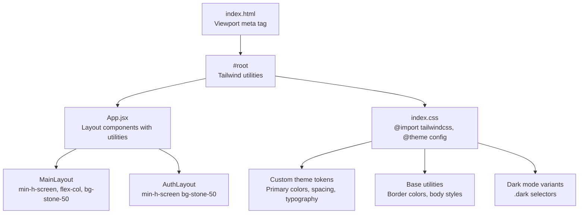
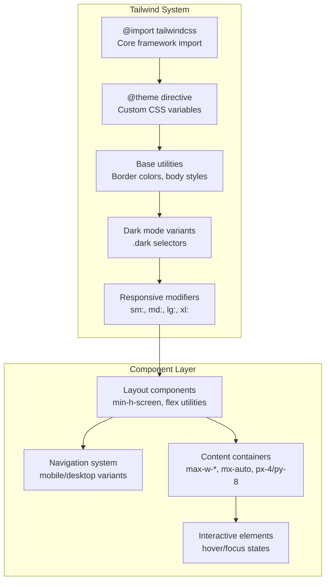
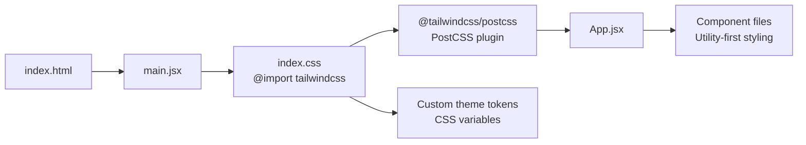

# Responsive Design and Layout System

<cite>
**Referenced Files in This Document**
- [index.css](file://client/src/index.css)
- [App.css](file://client/src/App.css)
- [App.jsx](file://client/src/App.jsx)
- [main.jsx](file://client/src/main.jsx)
- [index.html](file://client/index.html)
- [vite.config.js](file://client/vite.config.js)
- [package.json](file://client/package.json)
- [postcss.config.js](file://client/postcss.config.js)
- [Navbar.jsx](file://client/src/components/common/Navbar.jsx)
- [HomeFeed.jsx](file://client/src/pages/HomeFeed.jsx)
</cite>

## Update Summary
**Changes Made**
- Complete migration from custom CSS properties and manual media queries to Tailwind CSS utility classes
- Updated responsive design system to use mobile-first approach with Tailwind's breakpoint system
- Replaced custom flexbox and grid implementations with Tailwind's utility-first methodology
- Integrated Tailwind CSS v4 with PostCSS pipeline and custom theme configuration
- Modernized component styling with responsive utility classes instead of custom CSS

## Table of Contents
1. [Introduction](#introduction)
2. [Project Structure](#project-structure)
3. [Core Components](#core-components)
4. [Architecture Overview](#architecture-overview)
5. [Detailed Component Analysis](#detailed-component-analysis)
6. [Dependency Analysis](#dependency-analysis)
7. [Performance Considerations](#performance-considerations)
8. [Troubleshooting Guide](#troubleshooting-guide)
9. [Conclusion](#conclusion)
10. [Appendices](#appendices)

## Introduction
This document explains the modern responsive design implementation using Tailwind CSS utility classes and a mobile-first approach. The project has migrated from custom CSS properties and manual media queries to a comprehensive Tailwind CSS system that leverages utility-first styling principles. The responsive architecture now utilizes Tailwind's built-in breakpoint system (sm, md, lg, xl) combined with custom theme tokens for consistent theming across all components.

The implementation focuses on:
- Utility-first CSS methodology for rapid development and maintainability
- Mobile-first responsive design with progressive enhancement
- Custom Tailwind theme configuration with CSS custom properties
- Component-level responsive styling using Tailwind's responsive modifiers
- Integration with PostCSS pipeline for optimized CSS delivery

## Project Structure
The project maintains a React + Vite architecture but now leverages Tailwind CSS for all styling needs:
- Tailwind CSS v4 integrated via PostCSS plugin system
- Custom theme configuration with Tailwind's @theme directive
- Utility-first component styling with responsive modifiers
- Mobile-first approach with progressive desktop enhancements
- Global styles for base elements and custom scrollbar theming

**Diagram sources**
- [index.html:6](file://client/index.html#L6)
- [main.jsx:3](file://client/src/main.jsx#L3)
- [App.jsx:23-42](file://client/src/App.jsx#L23-L42)
- [index.css:1-66](file://client/src/index.css#L1-L66)

**Section sources**
- [index.html:1-14](file://client/index.html#L1-L14)
- [main.jsx:1-11](file://client/src/main.jsx#L1-L11)
- [App.jsx:1-94](file://client/src/App.jsx#L1-L94)
- [index.css:1-66](file://client/src/index.css#L1-L66)
- [postcss.config.js:1-7](file://client/postcss.config.js#L1-L7)
- [package.json:21-32](file://client/package.json#L21-L32)

## Core Components
The responsive design system is built around three core pillars:

### Tailwind CSS Integration
- **PostCSS Pipeline**: Tailwind CSS v4 integrated through @tailwindcss/postcss plugin
- **Custom Theme Configuration**: CSS custom properties defined within @theme directive
- **Utility-First Methodology**: All styling done through Tailwind utility classes
- **Responsive Modifiers**: Mobile-first responsive design using sm:, md:, lg:, xl: prefixes

### Mobile-First Responsive Architecture
- **Base Styles**: Default mobile styles with minimal specificity
- **Progressive Enhancement**: Desktop styles layered on top of mobile foundations
- **Breakpoint Strategy**: Tailwind's default breakpoints (640px, 768px, 1024px, 1280px)
- **Flexible Layout System**: Grid, flexbox, and spacing utilities for adaptive layouts

### Component-Level Responsiveness
- **Navigation System**: Mobile hamburger menu with desktop navigation bar
- **Content Layout**: Max-width containers with responsive padding
- **Interactive Elements**: Hover states, focus management, and transition effects
- **Dark Mode Support**: Automatic dark mode variant generation

**Section sources**
- [index.css:1-14](file://client/src/index.css#L1-L14)
- [index.css:24-33](file://client/src/index.css#L24-L33)
- [Navbar.jsx:47-131](file://client/src/components/common/Navbar.jsx#L47-L131)
- [HomeFeed.jsx:32-94](file://client/src/pages/HomeFeed.jsx#L32-L94)

## Architecture Overview
The responsive architecture now centers around Tailwind's utility-first approach with custom theme integration:

**Diagram sources**
- [index.css:1](file://client/src/index.css#L1)
- [index.css:3-14](file://client/src/index.css#L3-L14)
- [index.css:24-33](file://client/src/index.css#L24-L33)
- [Navbar.jsx:47-131](file://client/src/components/common/Navbar.jsx#L47-L131)
- [HomeFeed.jsx:32-94](file://client/src/pages/HomeFeed.jsx#L32-L94)

## Detailed Component Analysis

### Tailwind CSS Integration and Theme System
The project now uses Tailwind CSS v4 with a custom theme configuration that bridges utility classes with CSS custom properties:

- **Theme Token Definition**: Primary orange color palette defined within @theme directive
- **CSS Variable Bridge**: Custom properties enable seamless integration with existing CSS
- **Dark Mode Integration**: Automatic variant generation for dark color schemes
- **Base Styling**: Global border colors, body background, and typography setup

Responsive considerations:
- **Mobile-First Foundation**: All base styles assume mobile viewport
- **Progressive Desktop Enhancement**: Desktop styles layered via responsive modifiers
- **Custom Scrollbar Theming**: Tailwind utilities combined with custom CSS for dark mode support

**Section sources**
- [index.css:1-14](file://client/src/index.css#L1-L14)
- [index.css:20-33](file://client/src/index.css#L20-L33)
- [index.css:35-65](file://client/src/index.css#L35-L65)

### Layout System with Utility Classes
The main layout components demonstrate the utility-first approach:

- **Main Layout**: min-h-screen flex flex-col bg-stone-50 dark:bg-stone-950
- **Authentication Layout**: min-h-screen bg-stone-50 dark:bg-stone-950 for auth pages
- **Container Pattern**: max-w-7xl mx-auto px-4 sm:px-6 lg:px-8 for responsive widths
- **Spacing System**: Consistent padding and margin utilities across components

Responsive behavior:
- **Mobile-First**: Default styles work on small screens
- **Desktop Enhancement**: Additional padding and spacing for larger viewports
- **Flexible Containers**: Max-width constraints with fluid padding

**Section sources**
- [App.jsx:23-42](file://client/src/App.jsx#L23-L42)
- [Navbar.jsx:47-49](file://client/src/components/common/Navbar.jsx#L47-L49)
- [HomeFeed.jsx:32-33](file://client/src/pages/HomeFeed.jsx#L32-L33)

### Navigation System with Responsive Behavior
The Navbar component exemplifies mobile-first responsive design:

- **Desktop Navigation**: Hidden on mobile, visible from md: breakpoint
- **Mobile Menu**: Hamburger menu transforms into slide-down navigation
- **Active States**: Dynamic styling based on current route
- **Theme Integration**: Consistent color scheme across light/dark modes

Responsive behavior:
- **Mobile Menu Toggle**: State-based visibility control
- **Breakpoint Transitions**: Smooth animations between mobile and desktop views
- **Badge Notifications**: Conditional rendering based on user authentication

**Section sources**
- [Navbar.jsx:47-131](file://client/src/components/common/Navbar.jsx#L47-L131)
- [Navbar.jsx:134-202](file://client/src/components/common/Navbar.jsx#L134-L202)

### Content Layout and Spacing System
Content pages utilize Tailwind's responsive spacing and container utilities:

- **Max Width Constraints**: max-w-2xl for focused content areas
- **Responsive Padding**: px-4 py-8 with mobile-first approach
- **Space Distribution**: Space utilities for consistent vertical rhythm
- **Motion Integration**: Framer Motion animations with utility classes

**Section sources**
- [HomeFeed.jsx:32-94](file://client/src/pages/HomeFeed.jsx#L32-L94)

### Component Styling Patterns
Individual components showcase utility-first styling patterns:

- **Interactive Elements**: Hover states using hover: utility modifier
- **Color Schemes**: Consistent use of stone-50/stone-950 color tokens
- **Gradient Effects**: Background gradients for visual interest
- **Transition Effects**: Smooth state changes with transition utilities

**Section sources**
- [Navbar.jsx:75-79](file://client/src/components/common/Navbar.jsx#L75-L79)
- [HomeFeed.jsx:55-63](file://client/src/pages/HomeFeed.jsx#L55-L63)

## Dependency Analysis
The modern responsive design relies on a streamlined dependency chain:

**Diagram sources**
- [index.html:6](file://client/index.html#L6)
- [main.jsx:3](file://client/src/main.jsx#L3)
- [index.css:1](file://client/src/index.css#L1)
- [postcss.config.js:2-4](file://client/postcss.config.js#L2-L4)
- [package.json:31](file://client/package.json#L31)

**Section sources**
- [index.html:1-14](file://client/index.html#L1-L14)
- [main.jsx:1-11](file://client/src/main.jsx#L1-L11)
- [index.css:1-66](file://client/src/index.css#L1-L66)
- [postcss.config.js:1-7](file://client/postcss.config.js#L1-L7)
- [package.json:12-35](file://client/package.json#L12-L35)

## Performance Considerations
The Tailwind CSS implementation offers several performance benefits:

- **Utility Class Efficiency**: Atomic CSS prevents unused selector bloat
- **Build Optimization**: Purge configuration removes unused styles automatically
- **CSS Custom Property Bridge**: Maintains theme flexibility without extra overhead
- **Minimal JavaScript**: Reduced reliance on complex JavaScript-based styling
- **Fast Render Times**: Utility classes compile to efficient CSS selectors
- **Bundle Size**: Optimized CSS delivery through PostCSS processing

## Troubleshooting Guide
Common issues and resolutions for the Tailwind CSS implementation:

- **Missing Utilities**: Verify Tailwind is properly imported and configured in index.css
- **Theme Token Issues**: Ensure CSS custom properties are defined before utility usage
- **Responsive Breakpoints**: Check that responsive modifiers match Tailwind's default breakpoints
- **Dark Mode Problems**: Verify .dark selector precedence and custom dark mode tokens
- **PostCSS Processing**: Confirm @tailwindcss/postcss plugin is properly configured
- **Build Errors**: Validate Tailwind CSS version compatibility with PostCSS setup

**Section sources**
- [index.css:1](file://client/src/index.css#L1)
- [index.css:3-14](file://client/src/index.css#L3-L14)
- [postcss.config.js:1-7](file://client/postcss.config.js#L1-L7)
- [package.json:31](file://client/package.json#L31)

## Conclusion
The project has successfully migrated to a modern responsive design system using Tailwind CSS utility classes and a mobile-first approach. This implementation provides superior maintainability, faster development cycles, and consistent styling across all components. The combination of Tailwind's utility-first methodology with custom theme tokens ensures both flexibility and consistency, while the PostCSS pipeline delivers optimized CSS for production use.

## Appendices

### Customizing Tailwind Themes and Breakpoints
To customize the responsive design system:

- **Theme Tokens**: Modify values in @theme directive for color, spacing, and typography
- **Breakpoint Customization**: Configure custom breakpoints in Tailwind configuration
- **Utility Extensions**: Add custom utilities for project-specific needs
- **Dark Mode Variants**: Extend dark mode support for new components

### Migration from Custom CSS to Tailwind
Key migration steps:
- Replace custom CSS properties with Tailwind utility classes
- Convert media queries to responsive modifiers (sm:, md:, lg:, xl:)
- Integrate CSS custom properties with Tailwind's theme system
- Test responsive behavior across all device sizes

### Performance Optimization Strategies
- **Purge Unused Styles**: Configure purge options to remove unused CSS
- **Critical CSS**: Extract critical styles for above-the-fold content
- **Font Optimization**: Use font-display: swap for improved loading performance
- **Image Optimization**: Implement responsive images with proper sizing attributes

### Cross-Browser Compatibility
- **Modern Browser Support**: Tailwind CSS targets modern browsers with flexbox and grid support
- **Fallback Strategies**: Provide graceful degradation for older browsers
- **Feature Detection**: Use CSS feature queries for progressive enhancement
- **Testing Strategy**: Validate responsive behavior across target browser versions