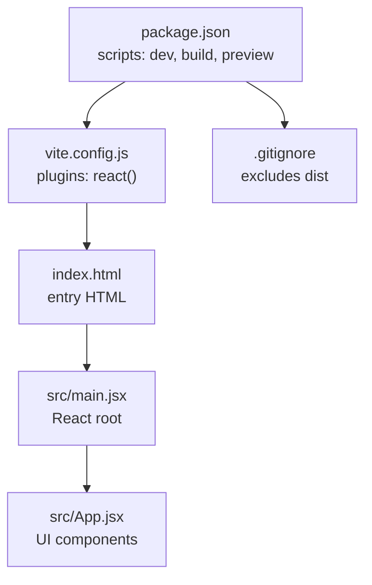
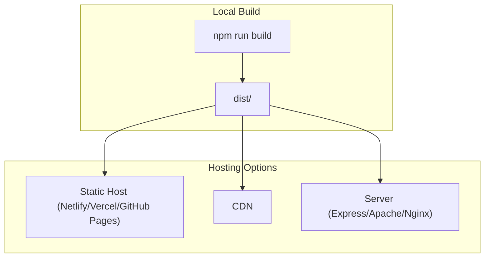
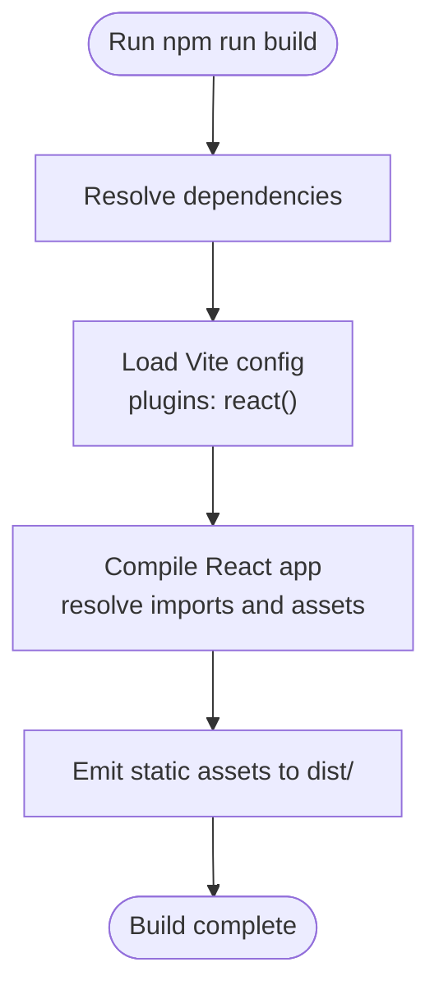
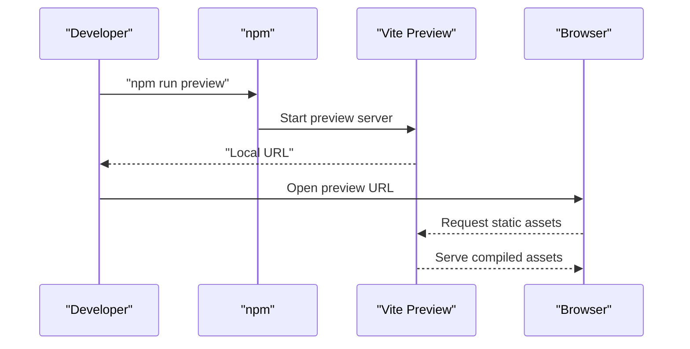
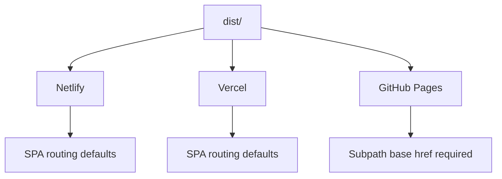
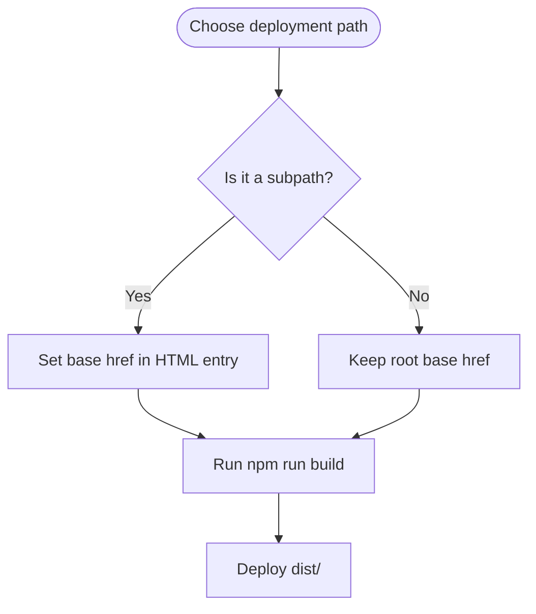
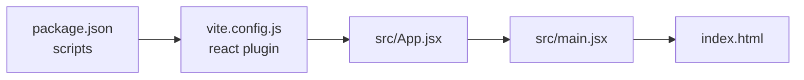

# Deployment and Distribution

<cite>
**Referenced Files in This Document**
- [package.json](file://client/package.json)
- [vite.config.js](file://client/vite.config.js)
- [index.html](file://client/index.html)
- [main.jsx](file://client/src/main.jsx)
- [App.jsx](file://client/src/App.jsx)
- [.gitignore](file://client/.gitignore)
- [README.md](file://client/README.md)
</cite>

## Table of Contents
1. [Introduction](#introduction)
2. [Project Structure](#project-structure)
3. [Core Components](#core-components)
4. [Architecture Overview](#architecture-overview)
5. [Detailed Component Analysis](#detailed-component-analysis)
6. [Dependency Analysis](#dependency-analysis)
7. [Performance Considerations](#performance-considerations)
8. [Troubleshooting Guide](#troubleshooting-guide)
9. [Conclusion](#conclusion)
10. [Appendices](#appendices)

## Introduction
This document explains how to deploy and distribute the Flavora template project built with React and Vite. It covers the production build process, local preview testing, deployment strategies for static hosts and CDNs, server deployment, environment variable configuration, base href and asset path considerations, performance optimizations, caching and security strategies, and troubleshooting best practices.

## Project Structure
The project is a Vite-based React application with a minimal configuration. The build pipeline is driven by Vite, and the development and production scripts are defined in the package manifest. The HTML entry point and the React root are located under the client directory.

**Diagram sources**
- [package.json:6-11](file://client/package.json#L6-L11)
- [vite.config.js:1-8](file://client/vite.config.js#L1-L8)
- [index.html:1-14](file://client/index.html#L1-L14)
- [main.jsx:1-11](file://client/src/main.jsx#L1-L11)
- [App.jsx:1-122](file://client/src/App.jsx#L1-L122)
- [.gitignore:10-12](file://client/.gitignore#L10-L12)

**Section sources**
- [package.json:6-11](file://client/package.json#L6-L11)
- [vite.config.js:1-8](file://client/vite.config.js#L1-L8)
- [index.html:1-14](file://client/index.html#L1-L14)
- [.gitignore:10-12](file://client/.gitignore#L10-L12)

## Core Components
- Build and preview scripts: The project defines standard Vite commands for development, production build, and local preview.
- Vite configuration: Minimal configuration enabling the React plugin.
- Application entry: The HTML entry point mounts the React root, which renders the App component.
- Asset references: Assets are imported directly in components, ensuring Vite resolves them during build.

Key deployment-relevant observations:
- No explicit base href is configured in the HTML entry; routing behavior depends on the hosting environment.
- Assets are referenced via module imports, which Vite embeds or emits according to size and build settings.

**Section sources**
- [package.json:6-11](file://client/package.json#L6-L11)
- [vite.config.js:5-7](file://client/vite.config.js#L5-L7)
- [index.html:9-12](file://client/index.html#L9-L12)
- [main.jsx:6-10](file://client/src/main.jsx#L6-L10)
- [App.jsx:2-4](file://client/src/App.jsx#L2-L4)

## Architecture Overview
The deployment architecture centers on Vite’s build output and the hosting environment. The build produces static assets that are served by the chosen platform. Routing and asset paths must be aligned with the hosting base path.

[No sources needed since this diagram shows conceptual workflow, not actual code structure]

## Detailed Component Analysis

### Production Build Process
- Trigger the build using the standard script defined in the package manifest.
- Vite compiles the React application and emits optimized static assets into the default output directory.
- The build excludes the output directory from version control as per the repository’s ignore rules.

**Diagram sources**
- [package.json:8](file://client/package.json#L8)
- [vite.config.js:5-7](file://client/vite.config.js#L5-L7)

**Section sources**
- [package.json:8](file://client/package.json#L8)
- [.gitignore:11](file://client/.gitignore#L11)

### Local Preview Testing
- Use the preview command to serve the production build locally for validation.
- This helps confirm asset paths, routing, and performance characteristics before deploying.

**Diagram sources**
- [package.json:10](file://client/package.json#L10)

**Section sources**
- [package.json:10](file://client/package.json#L10)

### Static Hosting Platforms
- Netlify: Place the dist folder in the site root. Netlify serves SPA routing automatically when configured. Confirm that redirects are set up to serve index.html for client-side routes if needed.
- Vercel: Deploy the dist folder. Vercel supports SPA routing by default; verify that ISR/SSR settings are not unintentionally enabled.
- GitHub Pages: Publish the dist folder to the gh-pages branch or configure the repository settings to use the dist folder as the source. For subpath deployments, set the base href accordingly.

[No sources needed since this diagram shows conceptual workflow, not actual code structure]

### CDN Integration
- Upload the dist folder contents to a CDN origin or edge network.
- Ensure cache-control headers are configured for long-lived static assets and short-lived HTML.
- Validate that the CDN supports serving index.html for deep links (SPA fallback) if applicable.

[No sources needed since this section provides general guidance]

### Server Deployment
- Serve the dist folder with a static web server or reverse proxy.
- Configure the server to return index.html for unknown routes to support client-side routing.
- Set appropriate cache headers for static assets and disable caching for HTML when needed.

[No sources needed since this section provides general guidance]

### Environment Variables and Base Href
- Environment variables: Define variables in the hosting provider’s dashboard or configuration. Access them at runtime in your application code.
- Base href: If deploying to a subpath (for example, GitHub Pages), set the base href in the HTML entry to match the deployment path. This ensures asset and route resolution is correct.

[No sources needed since this diagram shows conceptual workflow, not actual code structure]

### Asset Path Management
- The template imports assets directly in components. During build, Vite resolves these assets and emits them with hashed filenames when applicable.
- Ensure that the hosting environment serves the emitted assets from the correct path and that the server responds with appropriate cache headers.

**Section sources**
- [App.jsx:2-4](file://client/src/App.jsx#L2-L4)

## Dependency Analysis
The project relies on Vite for bundling and React for rendering. The React plugin is enabled in Vite configuration. The build and preview commands are defined in the package manifest.

**Diagram sources**
- [package.json:6-11](file://client/package.json#L6-L11)
- [vite.config.js:5-7](file://client/vite.config.js#L5-L7)
- [main.jsx:6-10](file://client/src/main.jsx#L6-L10)
- [index.html:9-12](file://client/index.html#L9-L12)

**Section sources**
- [package.json:6-11](file://client/package.json#L6-L11)
- [vite.config.js:5-7](file://client/vite.config.js#L5-L7)

## Performance Considerations
- Enable compression (gzip or brotli) on the server or CDN.
- Leverage long-term caching for static assets and short-term caching for HTML.
- Minimize initial bundle size by code splitting and lazy loading.
- Preload critical resources and defer non-critical ones.
- Use a CDN for global distribution and edge caching.

[No sources needed since this section provides general guidance]

## Troubleshooting Guide
Common issues and resolutions:
- 404 on refresh or deep links: Ensure the server or hosting platform serves index.html for unknown routes to support client-side routing.
- Broken assets after deploy: Verify the base href matches the deployment path and that the server serves the dist folder correctly.
- Incorrect favicon or icon paths: Confirm asset imports resolve correctly and that icons.svg is present in the emitted assets.
- Preview differs from production: Use the preview command locally to validate the production build before deploying.

**Section sources**
- [index.html:5](file://client/index.html#L5)
- [App.jsx:37](file://client/src/App.jsx#L37)
- [package.json:10](file://client/package.json#L10)

## Conclusion
The Flavora template project is ready for production deployment with a straightforward Vite build and preview workflow. Choose a hosting option that fits your needs, configure base href and environment variables appropriately, and apply caching and security best practices. Validate with the preview server and follow the troubleshooting steps to resolve common issues.

[No sources needed since this section summarizes without analyzing specific files]

## Appendices

### Build and Preview Commands
- Build: [package.json:8](file://client/package.json#L8)
- Preview: [package.json:10](file://client/package.json#L10)

### Vite Configuration Reference
- Plugins and defaults: [vite.config.js:5-7](file://client/vite.config.js#L5-L7)

### Application Entry Point
- HTML entry and script mount: [index.html:9-12](file://client/index.html#L9-L12)
- React root render: [main.jsx:6-10](file://client/src/main.jsx#L6-L10)

### Assets and Icons
- Asset imports in components: [App.jsx:2-4](file://client/src/App.jsx#L2-L4)
- Icon sprite usage: [App.jsx:37](file://client/src/App.jsx#L37)

### Version and Tooling Notes
- Project README highlights tooling choices and recommendations: [README.md:1-17](file://client/README.md#L1-L17)