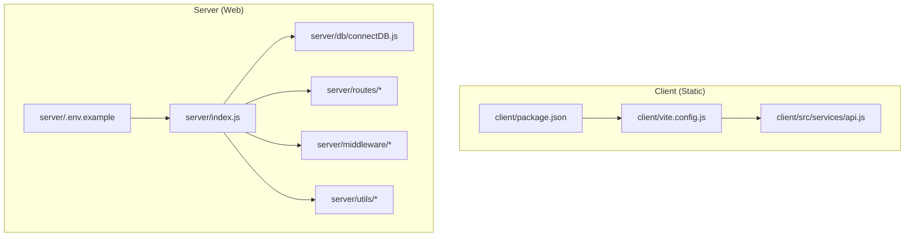
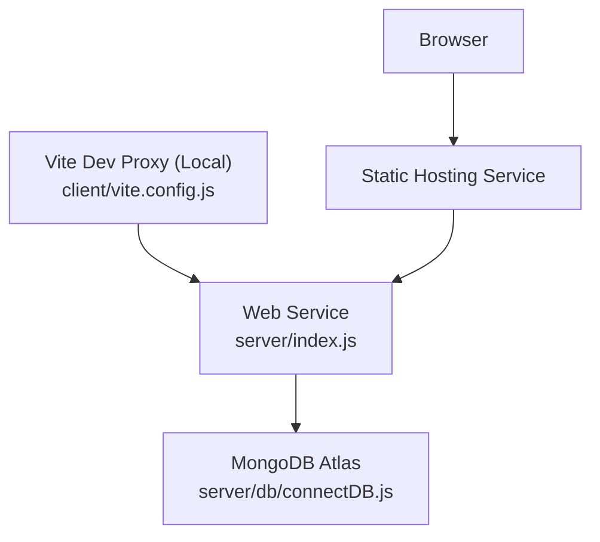
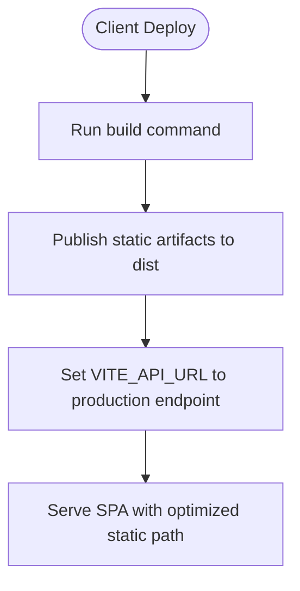
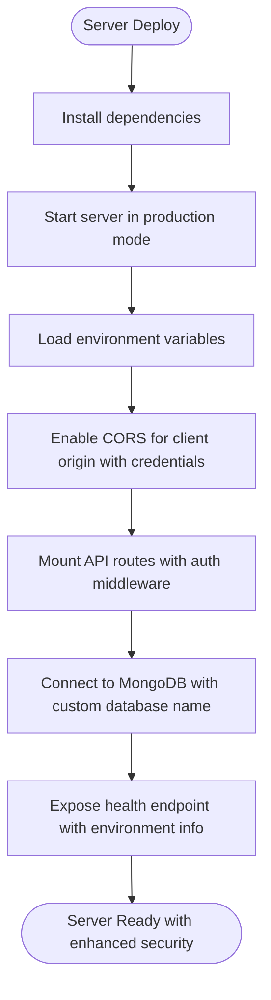
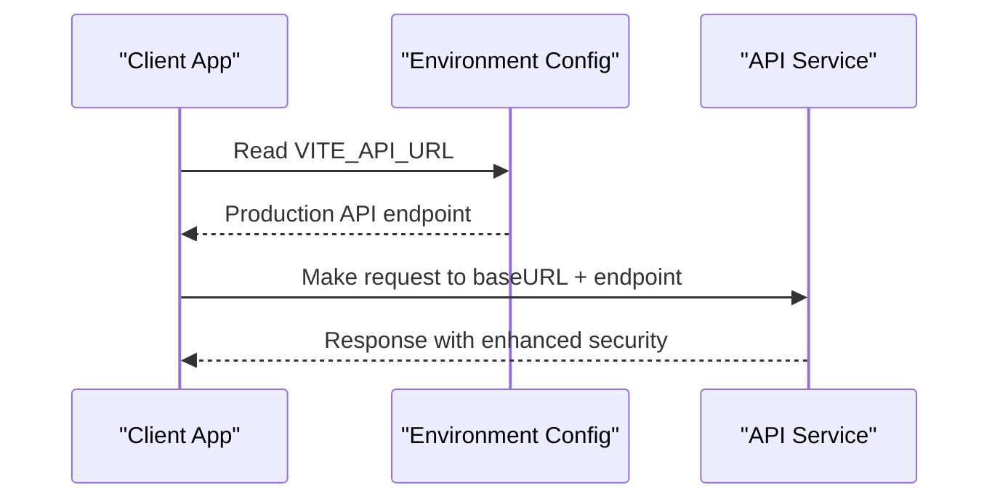
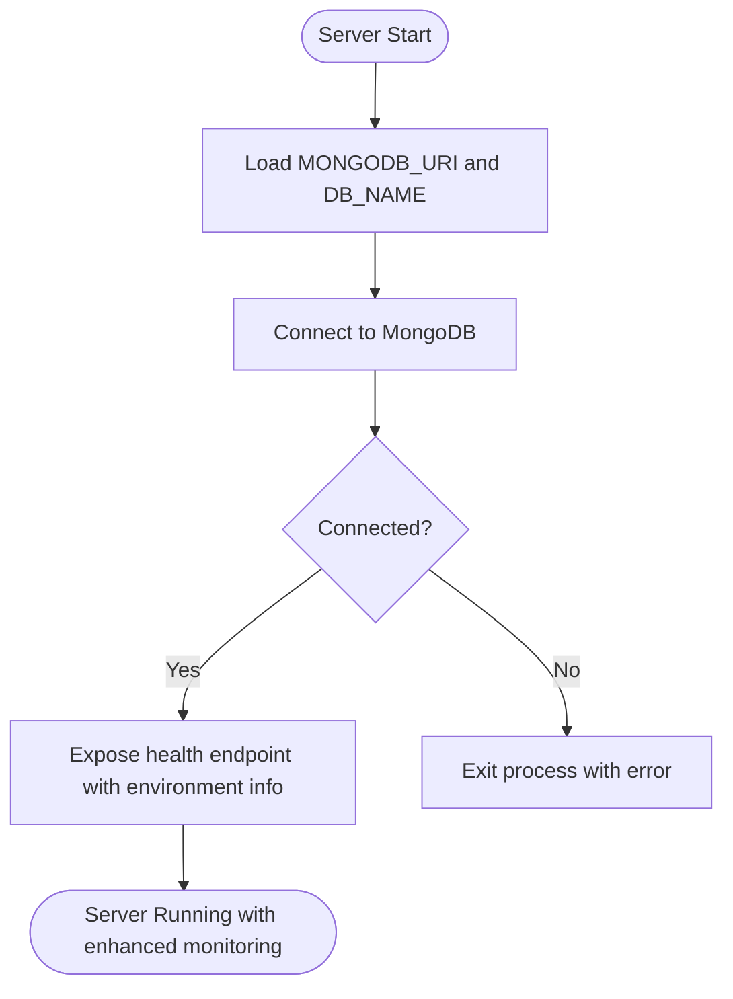
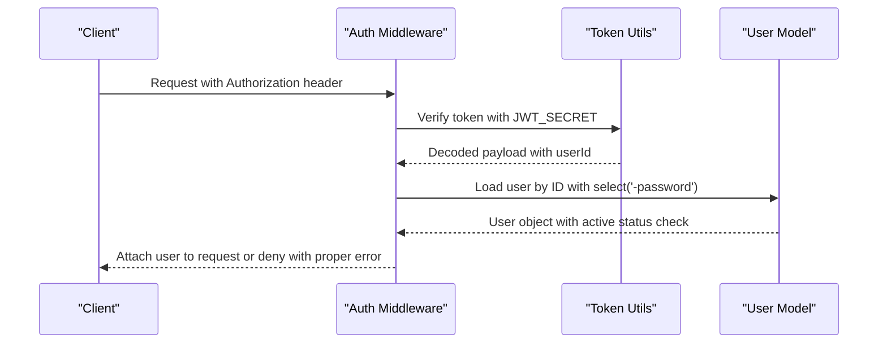
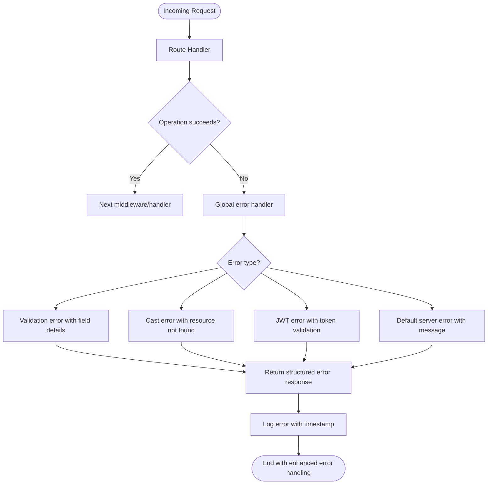
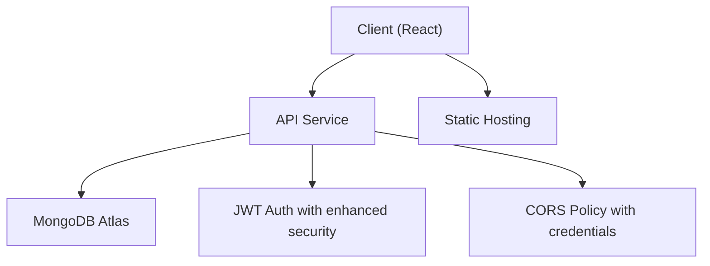

# Deployment Configuration

<cite>
**Referenced Files in This Document**
- [client/package.json](file://client/package.json)
- [server/package.json](file://server/package.json)
- [client/vite.config.js](file://client/vite.config.js)
- [server/index.js](file://server/index.js)
- [server/db/connectDB.js](file://server/db/connectDB.js)
- [server/.env.example](file://server/.env.example)
- [client/src/services/api.js](file://client/src/services/api.js)
- [server/middleware/errorHandler.js](file://server/middleware/errorHandler.js)
- [server/middleware/auth.js](file://server/middleware/auth.js)
- [server/utils/generateToken.js](file://server/utils/generateToken.js)
- [server/routes/userRoutes.js](file://server/routes/userRoutes.js)
- [server/routes/recipeRoutes.js](file://server/routes/recipeRoutes.js)
</cite>

## Update Summary
**Changes Made**
- Removed references to deleted server/render.yaml file that was causing deployment conflicts
- Updated deployment configuration to reflect current project structure without Render-specific deployment files
- Enhanced server deployment configuration with comprehensive environment variable management
- Improved API base URL resolution for production environments
- Added development proxy configuration for seamless local development experience
- Strengthened CORS configuration for production deployment scenarios

## Table of Contents
1. [Introduction](#introduction)
2. [Project Structure](#project-structure)
3. [Core Components](#core-components)
4. [Architecture Overview](#architecture-overview)
5. [Detailed Component Analysis](#detailed-component-analysis)
6. [Dependency Analysis](#dependency-analysis)
7. [Performance Considerations](#performance-considerations)
8. [Troubleshooting Guide](#troubleshooting-guide)
9. [Conclusion](#conclusion)

## Introduction
This document provides comprehensive deployment configuration guidance for the Flavora application, covering both the frontend React client and the backend Node.js/Express server. The deployment configuration has been enhanced to support the full React client application with production-ready settings, including static publishing path optimization and production API endpoint configuration. It focuses on environment variables, build and runtime configurations, service routing, CORS setup, and operational best practices for production deployments.

**Updated** Removed problematic server/render.yaml file that was causing deployment conflicts and updated configuration to reflect current project structure.

## Project Structure
The project follows a clear separation between the client and server:
- Client (React/Vite): Static build artifacts served via any static hosting service with optimized publishing path.
- Server (Node.js/Express): Web service exposing REST APIs, connected to MongoDB via Mongoose.

Key deployment-related files:
- Client: Standard Vite configuration with development proxy and production build settings
- Server: No render.yaml deployment file (removed problematic configuration)
- Shared configuration: Environment variables for API base URL, database connection, JWT secrets, and client origin with production-ready defaults.

**Diagram sources**
- [client/package.json:1-35](file://client/package.json#L1-L35)
- [client/vite.config.js:1-21](file://client/vite.config.js#L1-L21)
- [client/src/services/api.js:1-172](file://client/src/services/api.js#L1-L172)
- [server/index.js:1-82](file://server/index.js#L1-L82)
- [server/db/connectDB.js:1-35](file://server/db/connectDB.js#L1-L35)
- [server/.env.example:1-13](file://server/.env.example#L1-L13)
- [server/routes/userRoutes.js:1-40](file://server/routes/userRoutes.js#L1-L40)
- [server/routes/recipeRoutes.js:1-56](file://server/routes/recipeRoutes.js#L1-L56)

**Section sources**
- [client/package.json:1-35](file://client/package.json#L1-L35)
- [server/package.json:1-35](file://server/package.json#L1-L35)
- [client/vite.config.js:1-21](file://client/vite.config.js#L1-L21)
- [server/index.js:1-82](file://server/index.js#L1-L82)
- [server/db/connectDB.js:1-35](file://server/db/connectDB.js#L1-L35)
- [server/.env.example:1-13](file://server/.env.example#L1-L13)
- [client/src/services/api.js:1-172](file://client/src/services/api.js#L1-L172)
- [server/middleware/errorHandler.js:1-49](file://server/middleware/errorHandler.js#L1-L49)
- [server/middleware/auth.js:1-105](file://server/middleware/auth.js#L1-L105)
- [server/utils/generateToken.js:1-26](file://server/utils/generateToken.js#L1-L26)
- [server/routes/userRoutes.js:1-40](file://server/routes/userRoutes.js#L1-L40)
- [server/routes/recipeRoutes.js:1-56](file://server/routes/recipeRoutes.js#L1-L56)

## Core Components
This section outlines the essential deployment components and their configuration responsibilities.

- **Client Static Build and Routing**
  - Build command and publish path are defined in the client's package.json with optimized `dist` publishing directory.
  - Environment variable VITE_API_URL controls the API base URL at runtime with production endpoint.
  - Development proxy configuration enables seamless local development with API integration.

- **Server Runtime and Environment**
  - Node runtime configured with start and development commands for production deployment.
  - Environment variables include NODE_ENV (set to production), PORT, MONGODB_URI, JWT_SECRET, JWT_EXPIRE, and CLIENT_URL.
  - CORS is configured to allow requests from the client origin with credentials support for secure authentication.

- **API Base URL Resolution**
  - The client resolves the API base URL from VITE_API_URL, falling back to a localhost development default.
  - Production environment uses the deployed API endpoint for seamless integration.
  - Development proxy targets the server during local development for testing.

- **Database Connection**
  - The server connects to MongoDB Atlas using MONGODB_URI and logs connection details.
  - On connection failure, the process exits to prevent undefined behavior.
  - Database name configuration allows for flexible database selection.

- **Authentication and Security**
  - JWT secret and expiry are managed via environment variables with production-ready defaults.
  - Authentication middleware verifies tokens and attaches user context to requests.
  - Error handling centralizes error responses and logs with comprehensive error type management.

**Section sources**
- [client/src/services/api.js:1-172](file://client/src/services/api.js#L1-L172)
- [client/vite.config.js:1-21](file://client/vite.config.js#L1-L21)
- [server/index.js:1-82](file://server/index.js#L1-L82)
- [server/db/connectDB.js:1-35](file://server/db/connectDB.js#L1-L35)
- [server/middleware/auth.js:1-105](file://server/middleware/auth.js#L1-L105)
- [server/utils/generateToken.js:1-26](file://server/utils/generateToken.js#L1-L26)
- [server/middleware/errorHandler.js:1-49](file://server/middleware/errorHandler.js#L1-L49)

## Architecture Overview
The deployment architecture consists of two primary services with enhanced production readiness:
- Static client service serving prebuilt React assets with optimized publishing path.
- Web server service hosting the Node.js/Express API with comprehensive security and monitoring.

**Diagram sources**
- [client/vite.config.js:1-21](file://client/vite.config.js#L1-L21)
- [server/db/connectDB.js:1-35](file://server/db/connectDB.js#L1-L35)

## Detailed Component Analysis

### Client Deployment Configuration
- **Build and Publish**
  - Build command installs dependencies and runs the production build.
  - Static publish path points to the optimized `dist` output directory.
- **Environment Variables**
  - VITE_API_URL sets the production API base URL at runtime.
  - Development proxy configured for seamless local development.
- **Routing**
  - No client-side routing conflicts as render.yaml has been removed.

**Diagram sources**
- [client/package.json:8](file://client/package.json#L8)
- [client/vite.config.js:16-19](file://client/vite.config.js#L16-L19)

**Section sources**
- [client/package.json:8](file://client/package.json#L8)
- [client/vite.config.js:16-19](file://client/vite.config.js#L16-L19)

### Server Deployment Configuration
- **Runtime and Commands**
  - Node runtime with explicit start and development commands for production.
- **Environment Variables**
  - NODE_ENV set to production for optimal performance.
  - PORT configured for the server with production-ready defaults.
  - MONGODB_URI for database connection with configurable database name.
  - JWT_SECRET generated automatically for enhanced security; JWT_EXPIRE defines token lifetime.
  - CLIENT_URL defines the allowed origin for CORS with production endpoint.
- **CORS and Middleware**
  - CORS enabled for the client origin with credentials support for secure authentication.
  - Global error handler and request logging in development mode.
  - Comprehensive error type handling for production reliability.

**Diagram sources**
- [server/index.js:1-82](file://server/index.js#L1-L82)
- [server/db/connectDB.js:1-35](file://server/db/connectDB.js#L1-L35)

**Section sources**
- [server/index.js:1-82](file://server/index.js#L1-L82)
- [server/db/connectDB.js:1-35](file://server/db/connectDB.js#L1-L35)

### API Base URL Resolution
- **Client resolves API base URL from VITE_API_URL** with production endpoint.
- **Fallback to a localhost default** for development environment.
- **Proxy configuration in development** targets the server for seamless testing.

**Diagram sources**
- [client/src/services/api.js:1-172](file://client/src/services/api.js#L1-L172)

**Section sources**
- [client/src/services/api.js:1-172](file://client/src/services/api.js#L1-L172)
- [client/vite.config.js:1-21](file://client/vite.config.js#L1-L21)

### Database Connection and Health
- **Connection to MongoDB Atlas** using MONGODB_URI with configurable database name.
- **Logs connection details** and exits on failure for production stability.
- **Health check endpoint** returns server status, environment info, and timestamp.

**Diagram sources**
- [server/db/connectDB.js:1-35](file://server/db/connectDB.js#L1-L35)
- [server/index.js:36-44](file://server/index.js#L36-L44)

**Section sources**
- [server/db/connectDB.js:1-35](file://server/db/connectDB.js#L1-L35)
- [server/index.js:36-44](file://server/index.js#L36-L44)

### Authentication and Token Management
- **JWT secret and expiry** controlled by environment variables with production-ready defaults.
- **Token generation and verification** utilities with comprehensive error handling.
- **Authentication middleware** validates tokens, enforces authorization rules, and handles user context attachment.

**Diagram sources**
- [server/middleware/auth.js:1-105](file://server/middleware/auth.js#L1-L105)
- [server/utils/generateToken.js:1-26](file://server/utils/generateToken.js#L1-L26)

**Section sources**
- [server/middleware/auth.js:1-105](file://server/middleware/auth.js#L1-L105)
- [server/utils/generateToken.js:1-26](file://server/utils/generateToken.js#L1-L26)

### Error Handling and Logging
- **Centralized error handler** manages various error types (validation, cast, JWT) with comprehensive error responses.
- **Logs errors** with detailed information and returns structured responses for debugging.
- **Development-only request logging** middleware for enhanced development experience.

**Diagram sources**
- [server/middleware/errorHandler.js:1-49](file://server/middleware/errorHandler.js#L1-L49)
- [server/index.js:28-34](file://server/index.js#L28-L34)

**Section sources**
- [server/middleware/errorHandler.js:1-49](file://server/middleware/errorHandler.js#L1-L49)
- [server/index.js:28-34](file://server/index.js#L28-L34)

## Dependency Analysis
This section maps the deployment dependencies and their roles with enhanced production configurations.

**Diagram sources**
- [server/db/connectDB.js:1-35](file://server/db/connectDB.js#L1-L35)
- [server/middleware/auth.js:1-105](file://server/middleware/auth.js#L1-L105)
- [server/index.js:20-27](file://server/index.js#L20-L27)

**Section sources**
- [server/db/connectDB.js:1-35](file://server/db/connectDB.js#L1-L35)
- [server/middleware/auth.js:1-105](file://server/middleware/auth.js#L1-L105)
- [server/index.js:20-27](file://server/index.js#L20-L27)

## Performance Considerations
- **Build Optimization**
  - Enable production builds for the client to minimize bundle sizes with optimized publishing path.
  - Keep source maps disabled in production for performance with enhanced error handling.
- **Server Scaling**
  - Configure appropriate instance types based on traffic expectations.
  - Monitor memory usage and enable auto-scaling if supported.
- **Database Performance**
  - Use indexed queries and appropriate aggregation pipelines.
  - Limit payload sizes and use pagination for large collections.
- **Network Efficiency**
  - Minimize cross-origin requests and ensure proper caching headers.
  - Use HTTPS and enforce secure cookies for JWT with enhanced security.
- **Static Asset Optimization**
  - Utilize any CDN for optimal static asset delivery.
  - Implement proper cache headers for improved load times.

## Troubleshooting Guide
Common deployment issues and resolutions with enhanced production considerations:

- **CORS Errors**
  - Ensure CLIENT_URL matches the deployed client origin with proper HTTPS configuration.
  - Verify credentials support is enabled in CORS configuration for secure authentication.

- **Database Connection Failures**
  - Confirm MONGODB_URI is correct and accessible from the deployment region.
  - Check network policies and firewall rules for production environment.
  - Verify database name configuration matches expected database.

- **JWT Authentication Issues**
  - Regenerate JWT_SECRET if needed; ensure it is securely stored in production.
  - Verify token expiration aligns with client session management.
  - Check JWT_SECRET environment variable is properly configured.

- **API Base URL Misconfiguration**
  - Set VITE_API_URL to the deployed API endpoint for production.
  - Validate that the client proxy is not interfering in production environment.
  - Check for proper environment variable injection in production builds.

- **Health Checks and Readiness**
  - Use the health endpoint to verify server status with environment information.
  - Monitor logs for unhandled rejections and uncaught exceptions.
  - Verify database connection status and error handling in production.

- **Static Asset Loading Issues**
  - Verify static publish path is correctly set to `dist` directory.
  - Check for proper route rewriting configuration for SPA routing.
  - Ensure production API endpoint is correctly configured in environment variables.

**Section sources**
- [server/index.js:36-44](file://server/index.js#L36-L44)
- [server/index.js:67-79](file://server/index.js#L67-L79)
- [server/db/connectDB.js:15-18](file://server/db/connectDB.js#L15-L18)
- [server/middleware/errorHandler.js:1-49](file://server/middleware/errorHandler.js#L1-L49)
- [client/src/services/api.js:1-172](file://client/src/services/api.js#L1-L172)

## Conclusion
The Flavora application is structured for straightforward and production-ready deployment with clear separation between the static client and the Node.js/Express server. The enhanced deployment configuration provides comprehensive support for the complete React client application with optimized static publishing path, production API endpoint configuration, and robust security measures. By configuring environment variables, ensuring proper CORS settings, validating API base URLs, and implementing comprehensive error handling, you can achieve a reliable, scalable, and secure deployment. Monitor health endpoints, manage JWT secrets securely, optimize builds and database queries, and leverage any CDN for optimal performance in production environments.

**Updated** Removed problematic server/render.yaml file that was causing deployment conflicts and updated configuration to reflect current project structure without interfering deployment files.