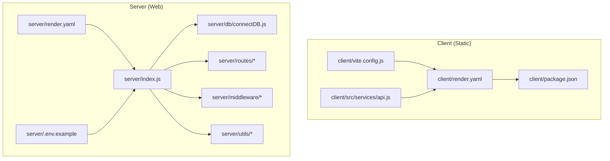
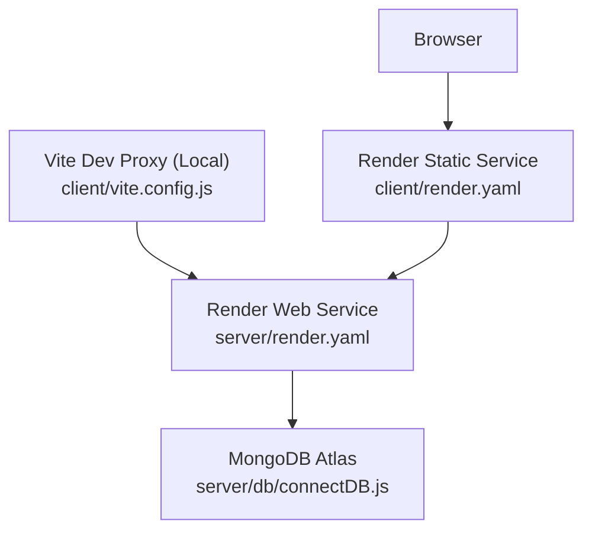
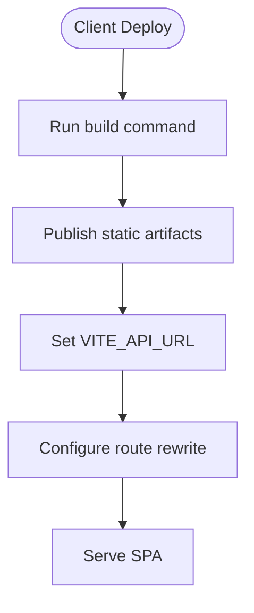
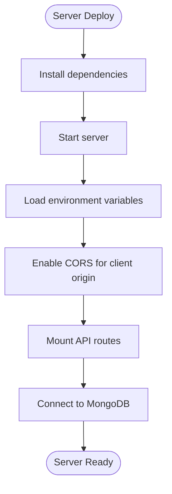
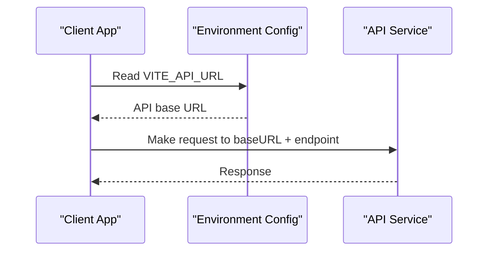
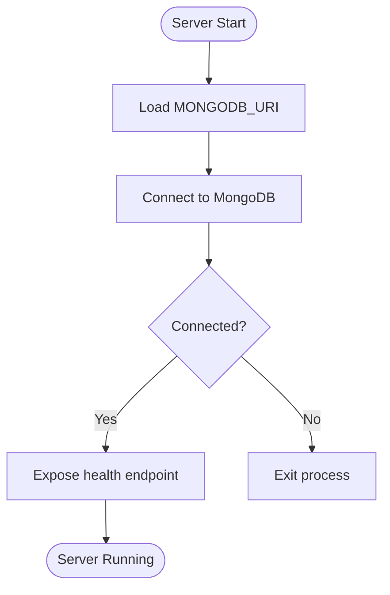
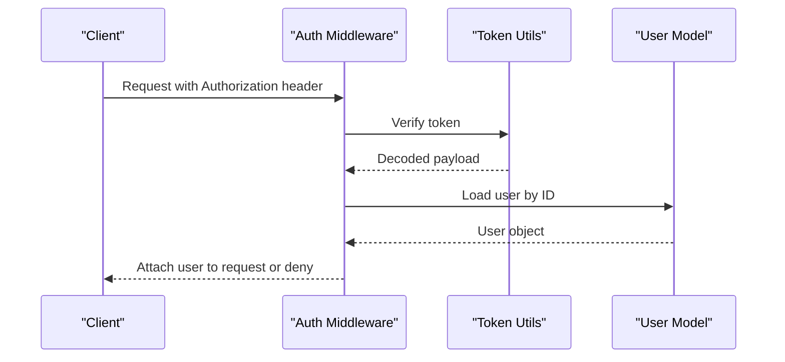
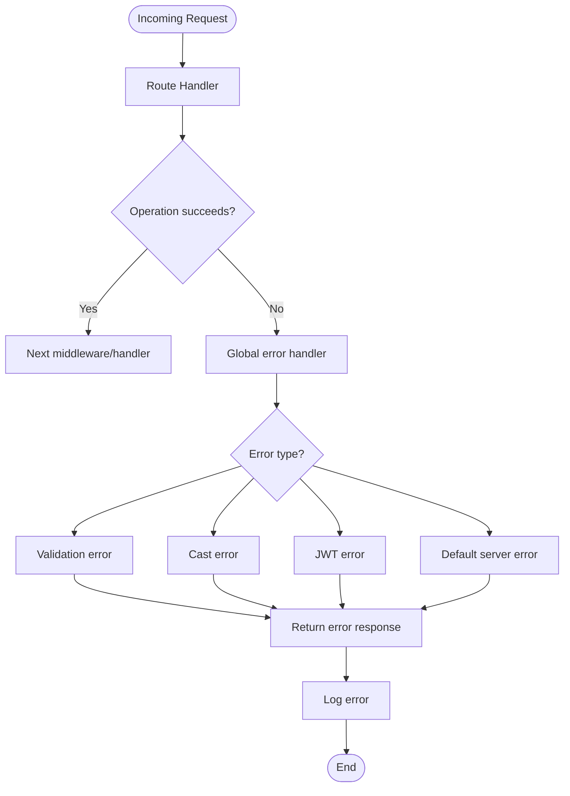
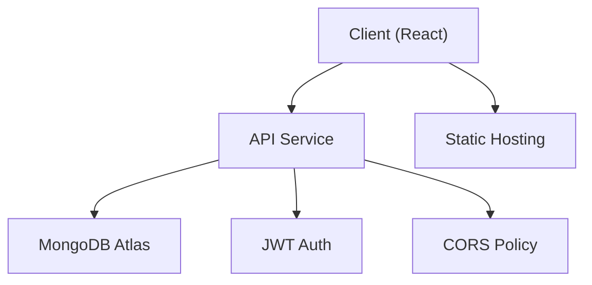

# Deployment Configuration

<cite>
**Referenced Files in This Document**
- [client/render.yaml](file://client/render.yaml)
- [server/render.yaml](file://server/render.yaml)
- [client/package.json](file://client/package.json)
- [server/package.json](file://server/package.json)
- [client/vite.config.js](file://client/vite.config.js)
- [server/index.js](file://server/index.js)
- [server/db/connectDB.js](file://server/db/connectDB.js)
- [server/.env.example](file://server/.env.example)
- [client/src/services/api.js](file://client/src/services/api.js)
- [server/middleware/errorHandler.js](file://server/middleware/errorHandler.js)
- [server/middleware/auth.js](file://server/middleware/auth.js)
- [server/utils/generateToken.js](file://server/utils/generateToken.js)
- [server/routes/userRoutes.js](file://server/routes/userRoutes.js)
- [server/routes/recipeRoutes.js](file://server/routes/recipeRoutes.js)
</cite>

## Table of Contents
1. [Introduction](#introduction)
2. [Project Structure](#project-structure)
3. [Core Components](#core-components)
4. [Architecture Overview](#architecture-overview)
5. [Detailed Component Analysis](#detailed-component-analysis)
6. [Dependency Analysis](#dependency-analysis)
7. [Performance Considerations](#performance-considerations)
8. [Troubleshooting Guide](#troubleshooting-guide)
9. [Conclusion](#conclusion)

## Introduction
This document provides comprehensive deployment configuration guidance for the Flavora application, covering both the frontend React client and the backend Node.js/Express server. It focuses on environment variables, build and runtime configurations, service routing, CORS setup, and operational best practices for production deployments on Render.

## Project Structure
The project follows a clear separation between the client and server:
- Client (React/Vite): Static build artifacts served via Render's static service.
- Server (Node.js/Express): Web service exposing REST APIs, connected to MongoDB via Mongoose.

Key deployment-related files:
- Client: render.yaml defines build commands, publish path, environment variables, and routing behavior.
- Server: render.yaml defines Node runtime, build/start commands, environment variables, and CORS origin.
- Shared configuration: Environment variables for API base URL, database connection, JWT secrets, and client origin.

**Diagram sources**
- [client/render.yaml:1-14](file://client/render.yaml#L1-L14)
- [client/package.json:1-35](file://client/package.json#L1-L35)
- [client/vite.config.js:1-21](file://client/vite.config.js#L1-L21)
- [client/src/services/api.js:1-172](file://client/src/services/api.js#L1-L172)
- [server/render.yaml:1-20](file://server/render.yaml#L1-L20)
- [server/index.js:1-82](file://server/index.js#L1-L82)
- [server/db/connectDB.js:1-35](file://server/db/connectDB.js#L1-L35)
- [server/.env.example:1-13](file://server/.env.example#L1-L13)
- [server/routes/userRoutes.js:1-40](file://server/routes/userRoutes.js#L1-L40)
- [server/routes/recipeRoutes.js:1-56](file://server/routes/recipeRoutes.js#L1-L56)

**Section sources**
- [client/render.yaml:1-14](file://client/render.yaml#L1-L14)
- [server/render.yaml:1-20](file://server/render.yaml#L1-L20)
- [client/package.json:1-35](file://client/package.json#L1-L35)
- [server/package.json:1-35](file://server/package.json#L1-L35)
- [client/vite.config.js:1-21](file://client/vite.config.js#L1-L21)
- [server/index.js:1-82](file://server/index.js#L1-L82)
- [server/db/connectDB.js:1-35](file://server/db/connectDB.js#L1-L35)
- [server/.env.example:1-13](file://server/.env.example#L1-L13)
- [client/src/services/api.js:1-172](file://client/src/services/api.js#L1-L172)
- [server/middleware/errorHandler.js:1-49](file://server/middleware/errorHandler.js#L1-L49)
- [server/middleware/auth.js:1-105](file://server/middleware/auth.js#L1-L105)
- [server/utils/generateToken.js:1-26](file://server/utils/generateToken.js#L1-L26)
- [server/routes/userRoutes.js:1-40](file://server/routes/userRoutes.js#L1-L40)
- [server/routes/recipeRoutes.js:1-56](file://server/routes/recipeRoutes.js#L1-L56)

## Core Components
This section outlines the essential deployment components and their configuration responsibilities.

- Client Static Build and Routing
  - Build command and publish path are defined in the client's render.yaml.
  - Environment variable VITE_API_URL controls the API base URL at runtime.
  - Route rewrite ensures SPA routing works correctly on the static host.

- Server Runtime and Environment
  - Node runtime configured with build and start commands.
  - Environment variables include NODE_ENV, PORT, MONGODB_URI, JWT_SECRET, JWT_EXPIRE, and CLIENT_URL.
  - CORS is configured to allow requests from the client origin.

- API Base URL Resolution
  - The client resolves the API base URL from VITE_API_URL, falling back to a localhost development default.
  - The client proxy in development targets the server during local development.

- Database Connection
  - The server connects to MongoDB Atlas using MONGODB_URI and logs connection details.
  - On connection failure, the process exits to prevent undefined behavior.

- Authentication and Security
  - JWT secret and expiry are managed via environment variables.
  - Authentication middleware verifies tokens and attaches user context to requests.
  - Error handling centralizes error responses and logs.

**Section sources**
- [client/render.yaml:1-14](file://client/render.yaml#L1-L14)
- [client/src/services/api.js:1-172](file://client/src/services/api.js#L1-L172)
- [client/vite.config.js:1-21](file://client/vite.config.js#L1-L21)
- [server/render.yaml:1-20](file://server/render.yaml#L1-L20)
- [server/index.js:1-82](file://server/index.js#L1-L82)
- [server/db/connectDB.js:1-35](file://server/db/connectDB.js#L1-L35)
- [server/middleware/auth.js:1-105](file://server/middleware/auth.js#L1-L105)
- [server/utils/generateToken.js:1-26](file://server/utils/generateToken.js#L1-L26)
- [server/middleware/errorHandler.js:1-49](file://server/middleware/errorHandler.js#L1-L49)

## Architecture Overview
The deployment architecture consists of two primary services:
- Static client service serving prebuilt React assets.
- Web server service hosting the Node.js/Express API.

**Diagram sources**
- [client/render.yaml:1-14](file://client/render.yaml#L1-L14)
- [client/vite.config.js:1-21](file://client/vite.config.js#L1-L21)
- [server/render.yaml:1-20](file://server/render.yaml#L1-L20)
- [server/db/connectDB.js:1-35](file://server/db/connectDB.js#L1-L35)

## Detailed Component Analysis

### Client Deployment Configuration
- Build and Publish
  - Build command installs dependencies and runs the production build.
  - Static publish path points to the built output directory.
- Environment Variables
  - VITE_API_URL sets the API base URL at runtime.
- Routing
  - Rewrite rule forwards all routes to the SPA entry point for client-side routing.

**Diagram sources**
- [client/render.yaml:1-14](file://client/render.yaml#L1-L14)

**Section sources**
- [client/render.yaml:1-14](file://client/render.yaml#L1-L14)

### Server Deployment Configuration
- Runtime and Commands
  - Node runtime with explicit build and start commands.
- Environment Variables
  - NODE_ENV set to production.
  - PORT configured for the server.
  - MONGODB_URI for database connection.
  - JWT_SECRET generated automatically; JWT_EXPIRE defines token lifetime.
  - CLIENT_URL defines the allowed origin for CORS.
- CORS and Middleware
  - CORS enabled for the client origin with credentials support.
  - Global error handler and request logging in development.

**Diagram sources**
- [server/render.yaml:1-20](file://server/render.yaml#L1-L20)
- [server/index.js:1-82](file://server/index.js#L1-L82)
- [server/db/connectDB.js:1-35](file://server/db/connectDB.js#L1-L35)

**Section sources**
- [server/render.yaml:1-20](file://server/render.yaml#L1-L20)
- [server/index.js:1-82](file://server/index.js#L1-L82)
- [server/db/connectDB.js:1-35](file://server/db/connectDB.js#L1-L35)

### API Base URL Resolution
- Client resolves API base URL from VITE_API_URL.
- Fallback to a localhost default for development.
- Proxy configuration in development targets the server.

**Diagram sources**
- [client/src/services/api.js:1-172](file://client/src/services/api.js#L1-L172)

**Section sources**
- [client/src/services/api.js:1-172](file://client/src/services/api.js#L1-L172)
- [client/vite.config.js:1-21](file://client/vite.config.js#L1-L21)

### Database Connection and Health
- Connection to MongoDB Atlas using MONGODB_URI.
- Logs connection details and exits on failure.
- Health check endpoint returns server status and environment info.

**Diagram sources**
- [server/db/connectDB.js:1-35](file://server/db/connectDB.js#L1-L35)
- [server/index.js:36-44](file://server/index.js#L36-L44)

**Section sources**
- [server/db/connectDB.js:1-35](file://server/db/connectDB.js#L1-L35)
- [server/index.js:36-44](file://server/index.js#L36-L44)

### Authentication and Token Management
- JWT secret and expiry controlled by environment variables.
- Token generation and verification utilities.
- Authentication middleware validates tokens and enforces authorization rules.

**Diagram sources**
- [server/middleware/auth.js:1-105](file://server/middleware/auth.js#L1-L105)
- [server/utils/generateToken.js:1-26](file://server/utils/generateToken.js#L1-L26)

**Section sources**
- [server/middleware/auth.js:1-105](file://server/middleware/auth.js#L1-L105)
- [server/utils/generateToken.js:1-26](file://server/utils/generateToken.js#L1-L26)

### Error Handling and Logging
- Centralized error handler manages various error types (validation, cast, JWT).
- Logs errors and returns structured responses.
- Development-only request logging middleware.

**Diagram sources**
- [server/middleware/errorHandler.js:1-49](file://server/middleware/errorHandler.js#L1-L49)
- [server/index.js:28-34](file://server/index.js#L28-L34)

**Section sources**
- [server/middleware/errorHandler.js:1-49](file://server/middleware/errorHandler.js#L1-L49)
- [server/index.js:28-34](file://server/index.js#L28-L34)

## Dependency Analysis
This section maps the deployment dependencies and their roles.

**Diagram sources**
- [client/render.yaml:1-14](file://client/render.yaml#L1-L14)
- [server/render.yaml:1-20](file://server/render.yaml#L1-L20)
- [server/db/connectDB.js:1-35](file://server/db/connectDB.js#L1-L35)
- [server/middleware/auth.js:1-105](file://server/middleware/auth.js#L1-L105)
- [server/index.js:20-27](file://server/index.js#L20-L27)

**Section sources**
- [client/render.yaml:1-14](file://client/render.yaml#L1-L14)
- [server/render.yaml:1-20](file://server/render.yaml#L1-L20)
- [server/db/connectDB.js:1-35](file://server/db/connectDB.js#L1-L35)
- [server/middleware/auth.js:1-105](file://server/middleware/auth.js#L1-L105)
- [server/index.js:20-27](file://server/index.js#L20-L27)

## Performance Considerations
- Build Optimization
  - Enable production builds for the client to minimize bundle sizes.
  - Keep source maps disabled in production for performance.
- Server Scaling
  - Configure appropriate instance types on Render based on traffic expectations.
  - Monitor memory usage and enable auto-scaling if supported.
- Database Performance
  - Use indexed queries and appropriate aggregation pipelines.
  - Limit payload sizes and use pagination for large collections.
- Network Efficiency
  - Minimize cross-origin requests and ensure proper caching headers.
  - Use HTTPS and enforce secure cookies for JWT.

## Troubleshooting Guide
Common deployment issues and resolutions:

- CORS Errors
  - Ensure CLIENT_URL matches the deployed client origin.
  - Verify credentials support is enabled in CORS configuration.

- Database Connection Failures
  - Confirm MONGODB_URI is correct and accessible from the deployment region.
  - Check network policies and firewall rules.

- JWT Authentication Issues
  - Regenerate JWT_SECRET if needed; ensure it is securely stored.
  - Verify token expiration aligns with client session management.

- API Base URL Misconfiguration
  - Set VITE_API_URL to the deployed API endpoint.
  - Validate that the client proxy is not interfering in production.

- Health Checks and Readiness
  - Use the health endpoint to verify server status.
  - Monitor logs for unhandled rejections and uncaught exceptions.

**Section sources**
- [server/index.js:36-44](file://server/index.js#L36-L44)
- [server/index.js:67-79](file://server/index.js#L67-L79)
- [server/db/connectDB.js:15-18](file://server/db/connectDB.js#L15-L18)
- [server/middleware/errorHandler.js:1-49](file://server/middleware/errorHandler.js#L1-L49)
- [client/src/services/api.js:1-172](file://client/src/services/api.js#L1-L172)

## Conclusion
The Flavora application is structured for straightforward deployment across Render with clear separation between the static client and the Node.js/Express server. By configuring environment variables, ensuring proper CORS settings, and validating API base URLs, you can achieve a reliable and scalable deployment. Monitor health endpoints, manage JWT secrets securely, and optimize builds and database queries for production performance.