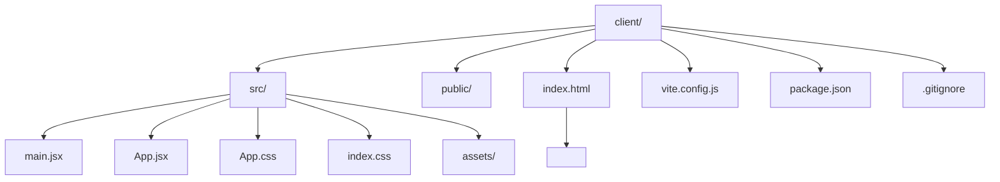
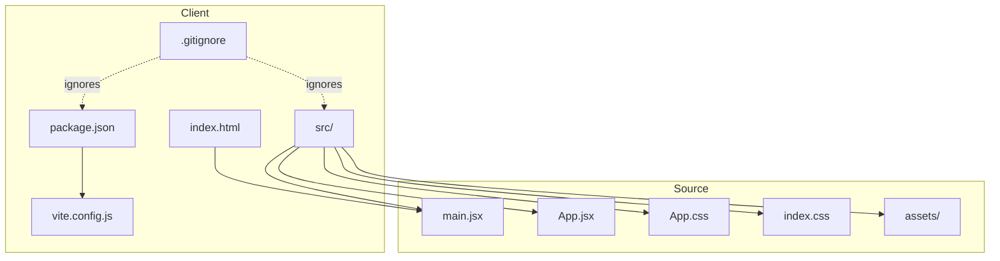

# Getting Started

<cite>
**Referenced Files in This Document**
- [package.json](file://client/package.json)
- [vite.config.js](file://client/vite.config.js)
- [README.md](file://client/README.md)
- [index.html](file://client/index.html)
- [main.jsx](file://client/src/main.jsx)
- [App.jsx](file://client/src/App.jsx)
- [App.css](file://client/src/App.css)
- [index.css](file://client/src/index.css)
- [eslint.config.js](file://client/eslint.config.js)
- [.gitignore](file://client/.gitignore)
</cite>

## Table of Contents
1. [Introduction](#introduction)
2. [Project Structure](#project-structure)
3. [Prerequisites](#prerequisites)
4. [Installation](#installation)
5. [Development Workflow](#development-workflow)
6. [Build and Preview](#build-and-preview)
7. [Project Structure Overview](#project-structure-overview)
8. [Key Files and What They Do](#key-files-and-what-they-do)
9. [Verification Steps](#verification-steps)
10. [Troubleshooting Guide](#troubleshooting-guide)
11. [Browser Compatibility](#browser-compatibility)
12. [Conclusion](#conclusion)

## Introduction
Welcome to Flavora! This guide helps you install, run, and verify the project locally so you can start developing right away. The project is a React application bundled with Vite and configured with ESLint for code quality. It uses modern JavaScript and JSX, and provides scripts for development, building, and previewing the app.

## Project Structure
The project is organized under the client directory. At a glance:
- client: Application source and configuration
  - src: React application code and styles
  - public: Static assets referenced by HTML
  - Configuration files for Vite, ESLint, and package management

**Diagram sources**
- [index.html:1-14](file://client/index.html#L1-L14)
- [main.jsx:1-11](file://client/src/main.jsx#L1-L11)
- [App.jsx:1-122](file://client/src/App.jsx#L1-L122)
- [App.css:1-185](file://client/src/App.css#L1-L185)
- [index.css:1-112](file://client/src/index.css#L1-L112)
- [vite.config.js:1-8](file://client/vite.config.js#L1-L8)
- [package.json:1-28](file://client/package.json#L1-L28)

**Section sources**
- [package.json:1-28](file://client/package.json#L1-L28)
- [vite.config.js:1-8](file://client/vite.config.js#L1-L8)
- [index.html:1-14](file://client/index.html#L1-L14)

## Prerequisites
- Node.js: Install a current LTS version compatible with your platform. Vite and modern React tooling generally support recent Node.js releases.
- Package manager: Choose one of the following. The scripts in this project are designed to work with npm, yarn, or pnpm.
  - npm (comes with Node.js)
  - yarn
  - pnpm

Tip: Confirm your Node.js and package manager versions before installing dependencies.

**Section sources**
- [package.json:1-28](file://client/package.json#L1-L28)

## Installation
Follow these steps to install dependencies and prepare your environment.

Step-by-step:
1. Open a terminal in the client directory.
2. Install dependencies using your preferred package manager:
   - npm: Run the install command from the client directory.
   - yarn: Run the install command from the client directory.
   - pnpm: Run the install command from the client directory.
3. After installation completes, you are ready to develop.

Notes:
- The project uses a private package configuration and modern module syntax.
- The scripts rely on Vite and React tooling defined in the configuration files.

**Section sources**
- [package.json:1-28](file://client/package.json#L1-L28)
- [vite.config.js:1-8](file://client/vite.config.js#L1-L8)

## Development Workflow
Start the local development server to edit code and see changes instantly.

Command:
- npm run dev
- yarn dev
- pnpm dev

What happens:
- Vite starts a development server with hot module replacement (HMR).
- Your browser opens automatically to the development URL.
- Editing JSX or CSS updates the page without a full reload.

Related configuration:
- Vite plugin for React is enabled in the configuration file.

**Section sources**
- [package.json:6-11](file://client/package.json#L6-L11)
- [vite.config.js:5-7](file://client/vite.config.js#L5-L7)

## Build and Preview
After developing, build the project for production and preview the static bundle locally.

Commands:
- npm run build
- yarn build
- pnpm build
- npm run preview
- yarn preview
- pnpm preview

What happens:
- The build script compiles and bundles the app for production.
- The preview script serves the built files locally to validate the production build.

Outputs:
- The build output is directed to a dist folder by default in Vite projects.

**Section sources**
- [package.json:6-11](file://client/package.json#L6-L11)
- [vite.config.js:5-7](file://client/vite.config.js#L5-L7)

## Project Structure Overview
High-level layout of the most relevant parts of the project:

**Diagram sources**
- [package.json:1-28](file://client/package.json#L1-L28)
- [vite.config.js:1-8](file://client/vite.config.js#L1-L8)
- [index.html:1-14](file://client/index.html#L1-L14)
- [main.jsx:1-11](file://client/src/main.jsx#L1-L11)
- [App.jsx:1-122](file://client/src/App.jsx#L1-L122)
- [App.css:1-185](file://client/src/App.css#L1-L185)
- [index.css:1-112](file://client/src/index.css#L1-L112)
- [.gitignore:1-25](file://client/.gitignore#L1-L25)

## Key Files and What They Do
- package.json
  - Defines scripts for dev, build, lint, and preview.
  - Declares runtime dependencies (React) and devDependencies (Vite, React plugin, ESLint).
- vite.config.js
  - Enables the React plugin for Vite.
- index.html
  - Provides the root element and loads the main entry script.
- src/main.jsx
  - Initializes the React root and renders the App component.
- src/App.jsx
  - The main React component with sample UI and interactive counter.
- src/App.css and src/index.css
  - Styles for the app layout, theme tokens, and responsive design.
- eslint.config.js
  - Configures ESLint with recommended rules and React-related plugins.
- .gitignore
  - Ignores node_modules, build artifacts, logs, and editor-specific files.

**Section sources**
- [package.json:1-28](file://client/package.json#L1-L28)
- [vite.config.js:1-8](file://client/vite.config.js#L1-L8)
- [index.html:1-14](file://client/index.html#L1-L14)
- [main.jsx:1-11](file://client/src/main.jsx#L1-L11)
- [App.jsx:1-122](file://client/src/App.jsx#L1-L122)
- [App.css:1-185](file://client/src/App.css#L1-L185)
- [index.css:1-112](file://client/src/index.css#L1-L112)
- [eslint.config.js:1-30](file://client/eslint.config.js#L1-L30)
- [.gitignore:1-25](file://client/.gitignore#L1-L25)

## Verification Steps
After installation and running the dev server, verify your setup:

- Development server
  - Run the dev script and confirm the browser opens to the development URL.
  - Edit src/App.jsx and save to verify hot reloading updates the page.
- Build and preview
  - Run the build script and then preview the production bundle.
  - Confirm the preview server serves the app without errors.
- Linting
  - Run the lint script to check for style and correctness issues.

**Section sources**
- [package.json:6-11](file://client/package.json#L6-L11)
- [App.jsx:1-122](file://client/src/App.jsx#L1-L122)

## Troubleshooting Guide
Common setup issues and fixes:

- Node.js version mismatch
  - Symptom: Errors during install or build.
  - Fix: Use a supported Node.js version and clear caches if needed.
- Port already in use
  - Symptom: Dev server fails to start on the default port.
  - Fix: Stop the conflicting process or configure a different port in Vite config.
- Missing dependencies after clone
  - Symptom: Errors about missing modules.
  - Fix: Reinstall dependencies using your chosen package manager from the client directory.
- Permission errors on Windows
  - Symptom: Errors related to file permissions.
  - Fix: Run the terminal as administrator or adjust permissions for the project directory.
- Git hooks or pre-commit interference
  - Symptom: Unexpected lint or build failures.
  - Fix: Temporarily bypass hooks to reproduce the issue, then fix linting problems.

**Section sources**
- [package.json:1-28](file://client/package.json#L1-L28)
- [vite.config.js:5-7](file://client/vite.config.js#L5-L7)
- [eslint.config.js:1-30](file://client/eslint.config.js#L1-L30)

## Browser Compatibility
- The project targets modern browsers compatible with current Vite and React versions.
- If you need to support older browsers, consult Vite’s browser support guidance and consider adding polyfills or adjusting the build target accordingly.

[No sources needed since this section provides general guidance]

## Conclusion
You now have everything needed to install, run, build, and verify the Flavora client app. Use the development server for rapid iteration, the build script for production, and the preview script to validate the production bundle. Refer to the key files and scripts for deeper customization as your project grows.

[No sources needed since this section summarizes without analyzing specific files]