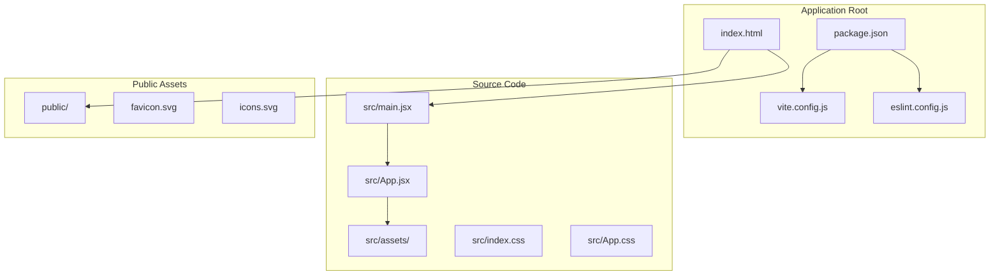

# Project Overview

<cite>
**Referenced Files in This Document**
- [package.json](file://client/package.json)
- [vite.config.js](file://client/vite.config.js)
- [main.jsx](file://client/src/main.jsx)
- [App.jsx](file://client/src/App.jsx)
- [index.html](file://client/index.html)
- [index.css](file://client/src/index.css)
- [App.css](file://client/src/App.css)
- [eslint.config.js](file://client/eslint.config.js)
- [README.md](file://client/README.md)
</cite>

## Table of Contents
1. [Introduction](#introduction)
2. [Project Structure](#project-structure)
3. [Core Components](#core-components)
4. [Architecture Overview](#architecture-overview)
5. [Technology Stack](#technology-stack)
6. [Development Workflow](#development-workflow)
7. [Performance Characteristics](#performance-characteristics)
8. [Target Audience](#target-audience)
9. [Why This Template Exists](#why-this-template-exists)
10. [Conclusion](#conclusion)

## Introduction

Flavora is a minimal React + Vite template designed to provide developers with a lightweight, fast, and efficient foundation for building modern React applications. This template serves as a streamlined starting point that enables rapid development while maintaining excellent performance characteristics and developer experience.

The project embodies modern React development practices by offering a clean, unopinionated foundation that developers can quickly customize and extend for their specific needs. It focuses on delivering essential functionality without unnecessary complexity, making it ideal for both learning React fundamentals and launching production-ready applications.

## Project Structure

The Flavora template follows a conventional React application structure optimized for Vite's development server and build pipeline:

**Diagram sources**
- [index.html:1-14](file://client/index.html#L1-L14)
- [main.jsx:1-11](file://client/src/main.jsx#L1-L11)
- [App.jsx:1-122](file://client/src/App.jsx#L1-L122)

The structure emphasizes simplicity and modularity, with clear separation between application entry points, component logic, styling, and static assets. This organization enables developers to quickly locate and modify specific aspects of the application while maintaining a clean mental model of the codebase.

**Section sources**
- [index.html:1-14](file://client/index.html#L1-L14)
- [main.jsx:1-11](file://client/src/main.jsx#L1-L11)
- [App.jsx:1-122](file://client/src/App.jsx#L1-L122)

## Core Components

### Application Entry Point

The application bootstraps through a minimal entry point that establishes the React rendering context and mounts the root component. This approach ensures optimal startup performance while providing a clean foundation for subsequent development.

### Root Component Architecture

The root component serves as both a functional demonstration and a practical starting point for new projects. It incorporates interactive elements, asset loading, and responsive design patterns that showcase modern React capabilities while remaining easily customizable.

### Asset Management System

The template includes a structured asset management system with SVG icons, framework logos, and responsive image handling. This demonstrates best practices for media optimization and accessibility while providing visual feedback during development.

**Section sources**
- [main.jsx:1-11](file://client/src/main.jsx#L1-L11)
- [App.jsx:1-122](file://client/src/App.jsx#L1-L122)

## Architecture Overview

Flavora implements a lightweight frontend architecture that prioritizes performance and developer productivity:

```mermaid
graph TD
subgraph "Runtime Layer"
Browser[Browser Environment]
React[React Runtime]
ReactDOM[ReactDOM]
end
subgraph "Build Layer"
Vite[Vite Dev Server]
Plugins[Vite Plugins]
Transform[JSX Transform]
end
subgraph "Development Tools"
ESLint[ESLint]
Hooks[React Hooks]
Refresh[React Refresh]
end
subgraph "Asset Pipeline"
Static[Static Assets]
CSS[CSS Modules]
Images[Image Optimization]
end
Browser --> React
React --> ReactDOM
Vite --> Plugins
Plugins --> Transform
ESLint --> Hooks
Hooks --> Refresh
Static --> CSS
CSS --> Images
```

**Diagram sources**
- [vite.config.js:1-8](file://client/vite.config.js#L1-L8)
- [main.jsx:1-11](file://client/src/main.jsx#L1-L11)
- [eslint.config.js:1-30](file://client/eslint.config.js#L1-L30)

This architecture leverages Vite's native ES module support and hot module replacement capabilities to deliver instant feedback during development while maintaining optimal bundle sizes for production builds.

## Technology Stack

### Frontend Framework

The template utilizes React 19 as its primary UI library, providing modern React features including concurrent rendering improvements, enhanced hooks, and optimized component lifecycle management. React 19's focus on performance and developer experience aligns perfectly with the template's goals of enabling fast, efficient development.

### Build Toolchain

Vite 8 serves as the cornerstone of the development experience, offering:
- Lightning-fast cold starts and hot module replacement
- Native ES module support eliminating bundling overhead
- Optimized development server with built-in TypeScript support
- Efficient production builds with tree-shaking and code splitting

### Modern JavaScript Features

The template embraces contemporary JavaScript standards and features:
- ES2020+ language features for improved readability and performance
- JSX syntax for declarative UI composition
- Module system for clean dependency management
- Async/await patterns for asynchronous operations

### Development Dependencies

The development toolchain includes comprehensive linting and quality assurance:
- ESLint with React-specific configurations
- React Hooks and React Refresh plugins
- TypeScript definitions for enhanced development experience
- Modern CSS preprocessing capabilities

**Section sources**
- [package.json:12-26](file://client/package.json#L12-L26)
- [vite.config.js:1-8](file://client/vite.config.js#L1-L8)
- [eslint.config.js:1-30](file://client/eslint.config.js#L1-L30)

## Development Workflow

### Rapid Prototyping

The template enables immediate development through its minimal configuration approach. Developers can start coding without extensive setup, focusing on application logic rather than build configuration.

### Hot Module Replacement

Vite's HMR system provides instant feedback during development, automatically reloading changed modules without full page refreshes. This creates an efficient development loop that accelerates iteration speed.

### Code Quality Assurance

Integrated ESLint configuration enforces consistent code quality standards with React-specific rules for hooks and component patterns. The configuration balances strictness with developer productivity.

### Performance Monitoring

The template includes performance-conscious defaults that prevent unnecessary optimizations from impacting development speed. This approach ensures that developers can focus on functionality while maintaining awareness of performance implications.

**Section sources**
- [README.md:1-17](file://client/README.md#L1-L17)
- [eslint.config.js:1-30](file://client/eslint.config.js#L1-L30)

## Performance Characteristics

### Startup Performance

The template achieves fast application startup through:
- Minimal bundle size with essential dependencies only
- Lazy loading patterns for non-critical resources
- Optimized asset delivery strategies
- Efficient DOM rendering through React's virtual DOM

### Runtime Efficiency

Performance optimizations include:
- React 19's concurrent rendering improvements
- Efficient state management with modern hooks
- CSS-in-JS patterns for scoped styling
- Responsive design that adapts to various screen sizes

### Development Experience

The development environment prioritizes:
- Sub-second rebuild times during development
- Instant error reporting and recovery
- Optimized memory usage during development
- Streamlined debugging workflows

## Target Audience

### React Developers

The template targets developers at all skill levels who need a reliable foundation for React applications. It provides sufficient functionality for beginners while offering extensibility for advanced use cases.

### Frontend Teams

Development teams seeking a standardized starting point benefit from the template's consistent structure and established conventions. This reduces onboarding time and promotes code consistency across projects.

### Learning Environment

Educators and students appreciate the template's clarity and educational value. The minimal complexity allows focus on React concepts without distraction from build configuration.

### Production Projects

Teams building production applications can leverage the template's performance characteristics and modern tooling while customizing it to meet specific project requirements.

## Why This Template Exists

### Modern Development Practices

The template addresses the need for contemporary React development workflows that emphasize:
- Developer experience over configuration complexity
- Performance-first design principles
- Progressive enhancement capabilities
- Future-proof technology choices

### Ecosystem Alignment

By aligning with React 19 and Vite 8, the template participates in the evolving React ecosystem while providing stability and reliability. This positioning ensures long-term viability and community support.

### Performance Focus

The template's emphasis on performance reflects modern web development priorities. It demonstrates how thoughtful architecture choices can improve both development experience and end-user performance.

### Community Standards

The template adheres to established community standards for React development, including proper project structure, testing approaches, and deployment strategies.

## Conclusion

Flavora represents a carefully crafted balance between simplicity and capability, providing React developers with an optimal starting point for modern web applications. Its minimalist approach, combined with cutting-edge technology choices, enables rapid development without sacrificing performance or maintainability.

The template's architecture and tooling choices reflect contemporary React development best practices while remaining flexible enough to accommodate diverse project requirements. By focusing on developer productivity and application performance, Flavora delivers a compelling solution for both individual developers and development teams.

This foundation enables developers to concentrate on solving business problems rather than wrestling with build configuration, ultimately accelerating the creation of high-quality React applications.