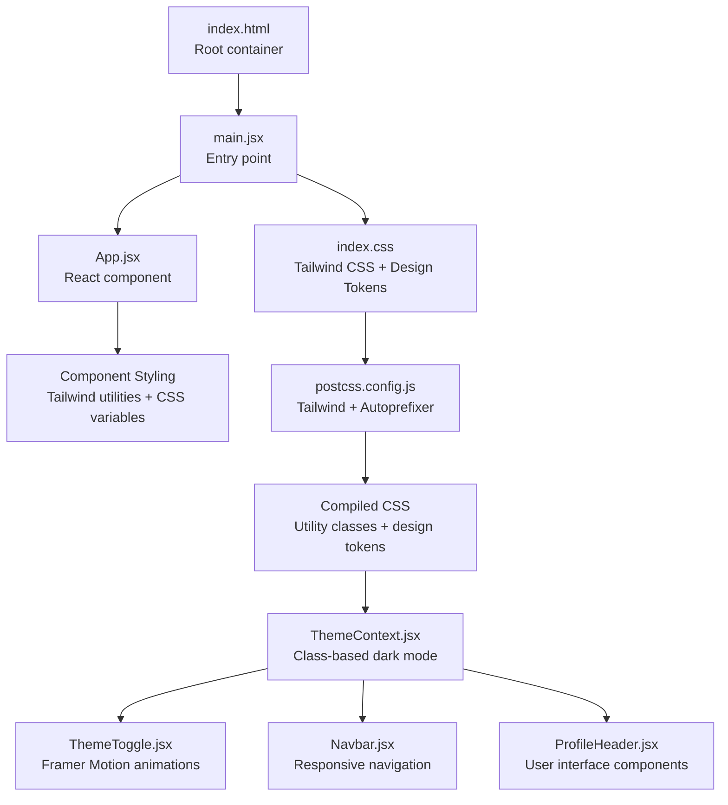
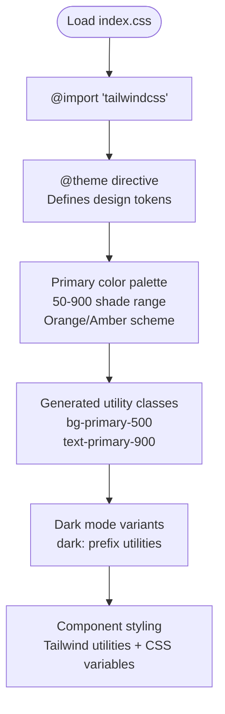
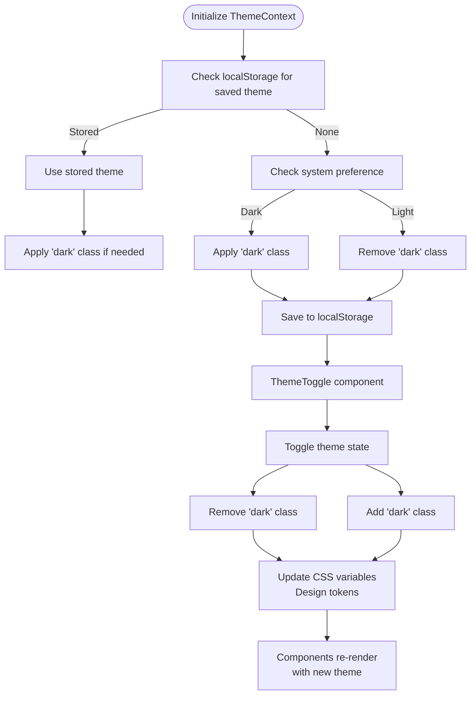
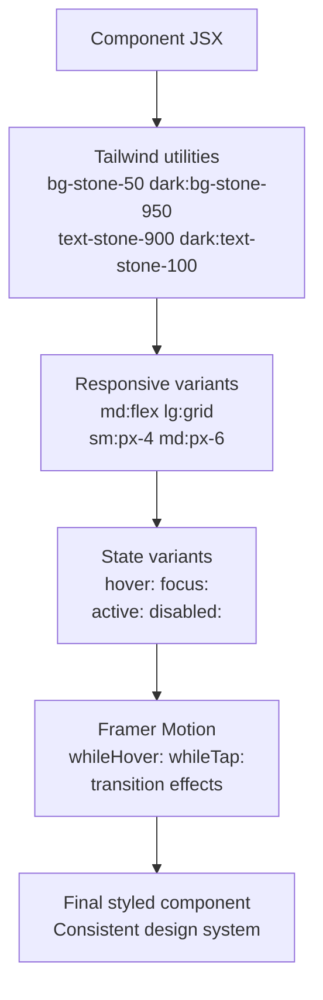
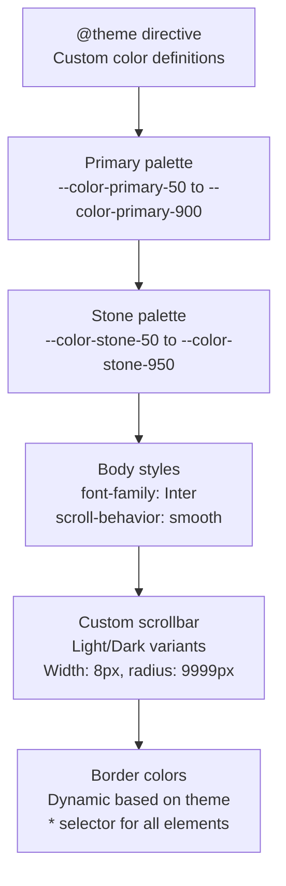
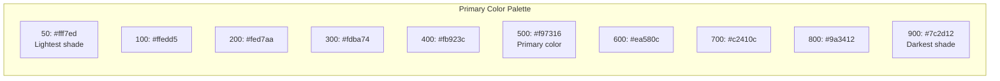
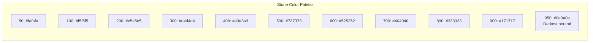
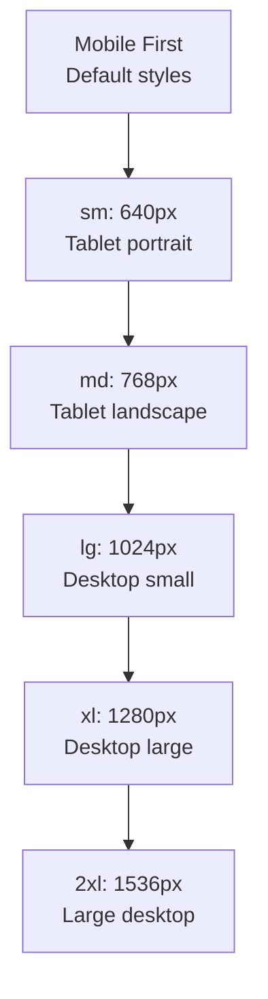
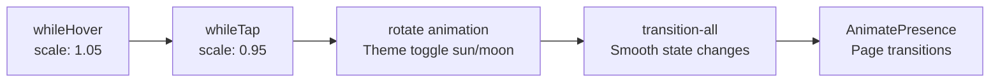

# Styling System

<cite>
**Referenced Files in This Document**
- [index.css](file://client/src/index.css)
- [App.css](file://client/src/App.css)
- [App.jsx](file://client/src/App.jsx)
- [main.jsx](file://client/src/main.jsx)
- [index.html](file://client/index.html)
- [package.json](file://client/package.json)
- [vite.config.js](file://client/vite.config.js)
- [postcss.config.js](file://client/postcss.config.js)
- [ThemeContext.jsx](file://client/src/context/ThemeContext.jsx)
- [ThemeToggle.jsx](file://client/src/components/common/ThemeToggle.jsx)
- [Navbar.jsx](file://client/src/components/common/Navbar.jsx)
- [ProfileHeader.jsx](file://client/src/components/user/ProfileHeader.jsx)
- [HomeFeed.jsx](file://client/src/pages/HomeFeed.jsx)
- [RecipeCard.jsx](file://client/src/components/recipe/RecipeCard.jsx)
- [SearchBar.jsx](file://client/src/components/search/SearchBar.jsx)
- [LikeButton.jsx](file://client/src/components/interactions/LikeButton.jsx)
</cite>

## Update Summary
**Changes Made**
- Complete styling overhaul with Tailwind CSS v4.2.2 as the primary styling framework
- Modern design token system using CSS @theme directive for custom color schemes
- Enhanced dark mode implementation with class-based approach using 'dark' class
- Integration of Framer Motion for advanced component animations
- Responsive design patterns leveraging Tailwind's utility-first methodology
- Component-specific styling approach utilizing Tailwind utilities with CSS variables
- Removal of legacy CSS custom properties in favor of modern design tokens
- **Updated**: Enhanced visual components with improved gradient backgrounds, backdrop blur effects, and sophisticated hover animations
- **Updated**: Refined design token system with comprehensive color palette and semantic color naming
- **Updated**: Improved component styling patterns with consistent utility-first approach and theme-aware variants

## Table of Contents
1. [Introduction](#introduction)
2. [Project Structure](#project-structure)
3. [Core Components](#core-components)
4. [Architecture Overview](#architecture-overview)
5. [Detailed Component Analysis](#detailed-component-analysis)
6. [Design Token System](#design-token-system)
7. [Responsive Design Patterns](#responsive-design-patterns)
8. [Component Styling Approach](#component-styling-approach)
9. [Animation System](#animation-system)
10. [Dark Mode Implementation](#dark-mode-implementation)
11. [Performance Considerations](#performance-considerations)
12. [Troubleshooting Guide](#troubleshooting-guide)
13. [Conclusion](#conclusion)
14. [Appendices](#appendices)

## Introduction
Flavora's styling system has undergone a complete transformation, adopting Tailwind CSS v4.2.2 as the primary styling framework while implementing modern design token principles. The system now features a sophisticated hybrid approach combining utility-first CSS with a custom design token system, providing both rapid development capabilities and consistent theming across light and dark modes. This documentation covers the new styling architecture, design tokens, responsive patterns, and component styling methodologies.

## Project Structure
The styling system is built on Tailwind CSS with a modern design token approach, featuring a clean separation between global styles, component styling, and theme management. The architecture emphasizes maintainability and scalability through utility-first development and design token consistency.



**Diagram sources**
- [index.html:1-14](file://client/index.html#L1-L14)
- [main.jsx:1-11](file://client/src/main.jsx#L1-L11)
- [index.css:1-66](file://client/src/index.css#L1-L66)
- [postcss.config.js:1-7](file://client/postcss.config.js#L1-L7)
- [ThemeContext.jsx:1-43](file://client/src/context/ThemeContext.jsx#L1-L43)
- [ThemeToggle.jsx:1-30](file://client/src/components/common/ThemeToggle.jsx#L1-L30)
- [Navbar.jsx:1-206](file://client/src/components/common/Navbar.jsx#L1-L206)
- [ProfileHeader.jsx:1-87](file://client/src/components/user/ProfileHeader.jsx#L1-L87)

**Section sources**
- [index.html:1-14](file://client/index.html#L1-L14)
- [main.jsx:1-11](file://client/src/main.jsx#L1-L11)
- [index.css:1-66](file://client/src/index.css#L1-L66)
- [postcss.config.js:1-7](file://client/postcss.config.js#L1-L7)
- [ThemeContext.jsx:1-43](file://client/src/context/ThemeContext.jsx#L1-L43)
- [ThemeToggle.jsx:1-30](file://client/src/components/common/ThemeToggle.jsx#L1-L30)
- [Navbar.jsx:1-206](file://client/src/components/common/Navbar.jsx#L1-L206)
- [ProfileHeader.jsx:1-87](file://client/src/components/user/ProfileHeader.jsx#L1-L87)

## Core Components
- **Tailwind CSS Framework**: Utility-first CSS framework with v4.2.2 providing comprehensive styling utilities
- **Design Token System**: Modern CSS @theme directive implementation for custom color schemes and design consistency
- **PostCSS Pipeline**: Processing pipeline with Tailwind CSS and Autoprefixer for optimized CSS delivery
- **Class-Based Dark Mode**: JavaScript-managed theme switching using 'dark' class on root element
- **Framer Motion Integration**: Advanced animations and micro-interactions for enhanced user experience
- **Responsive Design**: Mobile-first approach with Tailwind's responsive utility classes
- **Component Styling**: Utility-first methodology with CSS variable integration

Key implementation highlights:
- Tailwind CSS imported via @import directive in index.css
- Custom design tokens defined using @theme directive for primary color palette
- Class-based dark mode with localStorage persistence
- Framer Motion integration for sophisticated component animations
- Mobile-first responsive design patterns
- Gradient backgrounds and modern UI elements

**Section sources**
- [index.css:1-14](file://client/src/index.css#L1-L14)
- [package.json:21-31](file://client/package.json#L21-L31)
- [ThemeContext.jsx:15-23](file://client/src/context/ThemeContext.jsx#L15-L23)
- [ThemeToggle.jsx:1-30](file://client/src/components/common/ThemeToggle.jsx#L1-L30)

## Architecture Overview
The styling architecture operates on a modern utility-first model where Tailwind CSS provides comprehensive styling utilities, while design tokens ensure consistent theming across the application. The system emphasizes performance, maintainability, and developer experience.

```mermaid
graph TB
subgraph "Design Token Layer"
TOKENS["@theme directive<br/>Custom color palette<br/>Primary 50-900 shades"]
COLORS["Orange/Amber color scheme<br/>Semantic color naming"]
END
subgraph "Tailwind Integration"
UTILITIES["Utility classes<br/>bg-stone-50 → dark:bg-stone-950<br/>text-stone-900 → dark:text-stone-100"]
RESPONSIVE["Responsive utilities<br/>sm: md: lg: breakpoints"]
ANIMATIONS["Animation utilities<br/>transition-all hover: focus: active:"]
END
subgraph "Theme Management"
CONTEXT["ThemeContext.jsx<br/>Class-based dark mode<br/>localStorage persistence"]
TOGGLE["ThemeToggle.jsx<br/>Framer Motion animations<br/>Sun/Moon icons"]
VARS["CSS Variables<br/>Design tokens integration"]
END
subgraph "Component Layer"
NAVBAR["Navbar.jsx<br/>Navigation styling<br/>Responsive mobile menu"]
PROFILE["ProfileHeader.jsx<br/>User profile styling<br/>Gradient backgrounds"]
HOME["HomeFeed.jsx<br/>Hero sections<br/>Welcome messaging"]
COMPONENTS["Other components<br/>Consistent styling approach"]
END
TOKENS --> UTILITIES
COLORS --> UTILITIES
UTILITIES --> CONTEXT
RESPONSIVE --> NAVBAR
ANIMATIONS --> TOGGLE
CONTEXT --> VARS
TOGGLE --> ANIMATIONS
NAVBAR --> COMPONENTS
PROFILE --> COMPONENTS
HOME --> COMPONENTS
```

**Diagram sources**
- [index.css:3-14](file://client/src/index.css#L3-L14)
- [ThemeContext.jsx:15-23](file://client/src/context/ThemeContext.jsx#L15-L23)
- [ThemeToggle.jsx:9-28](file://client/src/components/common/ThemeToggle.jsx#L9-L28)
- [Navbar.jsx:47-203](file://client/src/components/common/Navbar.jsx#L47-L203)
- [ProfileHeader.jsx:31-84](file://client/src/components/user/ProfileHeader.jsx#L31-L84)
- [HomeFeed.jsx:32-94](file://client/src/pages/HomeFeed.jsx#L32-L94)

## Detailed Component Analysis

### Tailwind CSS Integration and Design Tokens
The system leverages Tailwind CSS v4.2.2 with a custom design token approach, replacing traditional CSS custom properties with modern CSS @theme directive for enhanced maintainability and developer experience.



**Diagram sources**
- [index.css:1-14](file://client/src/index.css#L1-L14)
- [index.css:3-14](file://client/src/index.css#L3-L14)

**Section sources**
- [index.css:1-14](file://client/src/index.css#L1-L14)
- [package.json:31](file://client/package.json#L31)

### Dark Mode Implementation with Class-Based Approach
The dark mode system uses a sophisticated class-based approach where the 'dark' class is toggled on the root element, providing precise control over theme switching and better user experience.



**Diagram sources**
- [ThemeContext.jsx:15-27](file://client/src/context/ThemeContext.jsx#L15-L27)
- [ThemeToggle.jsx:6-28](file://client/src/components/common/ThemeToggle.jsx#L6-L28)

**Section sources**
- [ThemeContext.jsx:15-27](file://client/src/context/ThemeContext.jsx#L15-L27)
- [ThemeToggle.jsx:6-28](file://client/src/components/common/ThemeToggle.jsx#L6-L28)

### Component Styling with Tailwind Utilities
Components utilize Tailwind's utility-first approach combined with CSS variables for optimal maintainability and consistency across the application.

Examples of component styling patterns:
- Navigation bar: `bg-white/80 dark:bg-stone-900/80 backdrop-blur-md`
- Buttons: `bg-orange-500 hover:bg-orange-600 text-white`
- Cards: `bg-white dark:bg-stone-900 rounded-2xl shadow-sm`
- Text: `text-stone-900 dark:text-stone-100`



**Diagram sources**
- [Navbar.jsx:47-129](file://client/src/components/common/Navbar.jsx#L47-L129)
- [ProfileHeader.jsx:31-84](file://client/src/components/user/ProfileHeader.jsx#L31-L84)
- [ThemeToggle.jsx:11](file://client/src/components/common/ThemeToggle.jsx#L11)

**Section sources**
- [Navbar.jsx:47-129](file://client/src/components/common/Navbar.jsx#L47-L129)
- [ProfileHeader.jsx:31-84](file://client/src/components/user/ProfileHeader.jsx#L31-L84)
- [ThemeToggle.jsx:11](file://client/src/components/common/ThemeToggle.jsx#L11)

### Global Styling with Design Tokens
The global stylesheet serves as the foundation for the design system, defining custom color palettes and establishing consistent theming across the application.



**Diagram sources**
- [index.css:3-14](file://client/src/index.css#L3-L14)
- [index.css:16-33](file://client/src/index.css#L16-L33)
- [index.css:35-60](file://client/src/index.css#L35-L60)

**Section sources**
- [index.css:3-14](file://client/src/index.css#L3-L14)
- [index.css:16-33](file://client/src/index.css#L16-L33)
- [index.css:35-60](file://client/src/index.css#L35-L60)

## Design Token System
The system implements a modern design token approach using CSS @theme directive, replacing traditional CSS custom properties with a more structured and maintainable system.

### Primary Color Palette
The design system features a comprehensive orange/amber color palette with 9 distinct shades, providing sufficient variation for different UI states and component variations.



### Stone Color Palette
A complementary stone palette provides neutral colors essential for backgrounds, borders, and text elements across both light and dark themes.



**Section sources**
- [index.css:3-14](file://client/src/index.css#L3-L14)

## Responsive Design Patterns
The styling system employs a mobile-first approach with Tailwind's responsive utility classes, ensuring optimal user experience across all device sizes.

### Breakpoint Strategy
The system utilizes Tailwind's default breakpoints: `sm:`, `md:`, `lg:`, and `xl:` to create progressive enhancement patterns.



### Responsive Component Patterns
Common responsive patterns include:
- Navigation: Hidden on mobile, expanded on larger screens
- Grid layouts: Single column on mobile, multi-column on desktop
- Spacing: Reduced padding and margins on smaller screens
- Typography: Adjusted font sizes for readability

**Section sources**
- [Navbar.jsx:65-91](file://client/src/components/common/Navbar.jsx#L65-L91)
- [HomeFeed.jsx:32-94](file://client/src/pages/HomeFeed.jsx#L32-L94)

## Component Styling Approach
Components follow a consistent utility-first methodology, combining Tailwind's extensive utility classes with strategic CSS variable usage for maintainable and scalable styling.

### Styling Methodology
1. **Utility-First**: Prefer Tailwind utilities over custom CSS classes
2. **Component Isolation**: Each component manages its own styling context
3. **Theme Consistency**: Use design tokens and theme-aware utilities
4. **Responsive Patterns**: Implement mobile-first responsive designs
5. **State Management**: Handle hover, focus, and active states through utilities

### Common Styling Patterns
- **Backgrounds**: `bg-white dark:bg-stone-900`
- **Text**: `text-stone-900 dark:text-stone-100`
- **Borders**: `border border-stone-200 dark:border-stone-800`
- **Spacing**: `p-4 m-2` with responsive variants
- **Shadows**: `shadow-sm dark:shadow-none`
- **Rounded**: `rounded-lg rounded-full`

**Section sources**
- [Navbar.jsx:47-203](file://client/src/components/common/Navbar.jsx#L47-L203)
- [ProfileHeader.jsx:31-84](file://client/src/components/user/ProfileHeader.jsx#L31-L84)
- [HomeFeed.jsx:32-94](file://client/src/pages/HomeFeed.jsx#L32-L94)

## Animation System
The system integrates Framer Motion for sophisticated micro-interactions and page transitions, enhancing the overall user experience with smooth animations.

### Animation Implementation
- **Theme Toggle**: Rotation animation with Framer Motion for sun/moon icons
- **Navigation**: Mobile menu slide-down/slide-up animations
- **Page Transitions**: AnimatePresence for smooth route changes
- **Interactive Elements**: Hover and tap animations for buttons and cards

### Animation Patterns


**Diagram sources**
- [ThemeToggle.jsx:9-28](file://client/src/components/common/ThemeToggle.jsx#L9-L28)
- [Navbar.jsx:134-202](file://client/src/components/common/Navbar.jsx#L134-L202)
- [App.jsx:2](file://client/src/App.jsx#L2)

**Section sources**
- [ThemeToggle.jsx:9-28](file://client/src/components/common/ThemeToggle.jsx#L9-L28)
- [Navbar.jsx:134-202](file://client/src/components/common/Navbar.jsx#L134-L202)
- [App.jsx:2](file://client/src/App.jsx#L2)

## Dark Mode Implementation
The dark mode system represents a significant improvement over traditional media-query-based approaches, offering better user control and performance optimization.

### Implementation Strategy
The system uses a class-based approach where the 'dark' class is added to the root element, enabling precise control over theme switching and eliminating media query complexity.

### Theme State Management
- **Persistence**: Theme preference saved to localStorage
- **System Detection**: Automatic detection of system preference
- **Manual Override**: User can override system preference
- **Real-time Updates**: Instant theme switching without page reload

### CSS Integration
Design tokens automatically adapt to theme changes through Tailwind's dark mode variant system, ensuring consistent theming across all components.

**Section sources**
- [ThemeContext.jsx:5-34](file://client/src/context/ThemeContext.jsx#L5-L34)
- [ThemeToggle.jsx:6-28](file://client/src/components/common/ThemeToggle.jsx#L6-L28)

## Performance Considerations
The styling system is optimized for performance through several key strategies:

### Build Optimization
- **Tree Shaking**: Unused CSS automatically removed during build process
- **PostCSS Processing**: Efficient compilation with Autoprefixer
- **Minification**: Production builds optimize CSS delivery
- **Critical Path**: Essential styles loaded first for faster rendering

### Runtime Performance
- **Class-Based Theming**: Reduces CSS specificity and improves selector performance
- **Utility-First**: Eliminates custom CSS bloat and reduces bundle size
- **CSS Variables**: Efficient theme switching without recalculating complex styles
- **Hardware Acceleration**: Framer Motion animations optimized for GPU acceleration

### Memory Optimization
- **Single Source of Truth**: Theme state managed centrally reduces memory overhead
- **Efficient DOM Manipulation**: Minimal DOM changes during theme switching
- **Lazy Loading**: Components load styles only when needed

## Troubleshooting Guide
Common issues and solutions for the Tailwind CSS styling system:

### Tailwind Not Generating Utilities
- **Verify Installation**: Ensure Tailwind CSS v4.2.2 is properly installed
- **Check PostCSS Configuration**: Confirm @tailwindcss/postcss plugin is configured
- **Validate Content Paths**: Ensure content configuration includes component files
- **Restart Development Server**: Clear cache and restart Vite dev server

### Design Tokens Not Working
- **CSS Syntax**: Verify @theme directive syntax is correct
- **Variable Names**: Ensure CSS variable names match design token definitions
- **Scope Issues**: Check that design tokens are defined in appropriate CSS scope
- **Browser Support**: Confirm browser supports CSS @theme directive

### Dark Mode Issues
- **Class Application**: Verify 'dark' class is properly added/removed from root element
- **CSS Specificity**: Check that dark mode variants have proper CSS specificity
- **LocalStorage**: Ensure theme preference is correctly saved/loaded from localStorage
- **System Preference**: Test automatic theme detection logic

### Animation Problems
- **Framer Motion**: Verify Framer Motion is properly installed and configured
- **Component Mounting**: Ensure animated components are properly mounted/unmounted
- **Transition Props**: Check that animation props are correctly passed to components
- **Performance**: Monitor animation performance on lower-end devices

**Section sources**
- [package.json:21-31](file://client/package.json#L21-L31)
- [postcss.config.js:1-7](file://client/postcss.config.js#L1-L7)
- [ThemeContext.jsx:15-23](file://client/src/context/ThemeContext.jsx#L15-L23)

## Conclusion
Flavora's styling system represents a modern, maintainable approach to frontend styling that successfully balances developer productivity with user experience. The adoption of Tailwind CSS v4.2.2 with a custom design token system provides a robust foundation for scalable component development, while the class-based dark mode implementation offers superior control and performance compared to traditional media-query approaches.

The system's emphasis on utility-first development, responsive design patterns, and integrated animation libraries creates a cohesive design language that scales effectively across the application's diverse feature set. The thoughtful integration of Framer Motion enhances user interaction quality, while the design token system ensures consistency and maintainability.

This styling architecture positions Flavora to efficiently support future feature development, accommodate evolving design requirements, and maintain excellent performance characteristics across all supported platforms and devices.

## Appendices

### Practical Implementation Examples

#### Adding New Component Styling
1. **Import Dependencies**: Import required icons and motion components
2. **Use Tailwind Utilities**: Apply utility classes for layout and styling
3. **Handle Responsiveness**: Implement responsive variants for different screen sizes
4. **Manage State**: Use CSS hover/focus states for interactive feedback
5. **Test Themed Variants**: Verify styling works correctly in both light and dark modes

#### Creating Custom Design Tokens
1. **Define in @theme**: Add new color or sizing tokens to the @theme directive
2. **Use Throughout**: Reference tokens in component styling consistently
3. **Test Variants**: Ensure tokens work correctly with dark mode variants
4. **Document Usage**: Add token usage to component documentation

#### Implementing Complex Animations
1. **Choose Animation Type**: Select appropriate Framer Motion animation for use case
2. **Configure Properties**: Set up animation properties like duration and easing
3. **Handle State Transitions**: Manage animation timing with component state
4. **Optimize Performance**: Ensure animations are hardware-accelerated and efficient

#### Responsive Design Patterns
1. **Mobile-First Approach**: Start with base styles, then add responsive variants
2. **Breakpoint Strategy**: Use appropriate breakpoints for component layout changes
3. **Flexible Units**: Prefer relative units over fixed pixel values
4. **Testing Across Devices**: Verify responsive behavior on various screen sizes

### Enhanced Component Examples

#### Advanced Navigation Styling
The Navbar component demonstrates sophisticated styling patterns including:
- Backdrop blur effects with `backdrop-blur-md`
- Gradient backgrounds with `bg-gradient-to-br`
- Responsive mobile menu with Framer Motion animations
- Active state indicators with `bg-orange-50 dark:bg-orange-500/10`

#### Interactive Card Components
Recipe cards showcase advanced styling techniques:
- Hover animations with `whileHover={{ y: -4 }}`
- Image overlay effects with `backdrop-blur-sm`
- Dynamic rating systems with `line-clamp` utilities
- Interactive save and like buttons with state-aware styling

#### Sophisticated Form Components
Search bars and input components demonstrate:
- Dynamic focus states with `animate` and `boxShadow` transitions
- Clear button animations with Framer Motion
- Responsive input sizing with `pl-12` and `pr-12` utilities
- Theme-aware placeholder text with `placeholder-stone-400`

**Section sources**
- [Navbar.jsx:47-203](file://client/src/components/common/Navbar.jsx#L47-L203)
- [RecipeCard.jsx:22-123](file://client/src/components/recipe/RecipeCard.jsx#L22-L123)
- [SearchBar.jsx:20-54](file://client/src/components/search/SearchBar.jsx#L20-L54)
- [LikeButton.jsx:43-71](file://client/src/components/interactions/LikeButton.jsx#L43-L71)